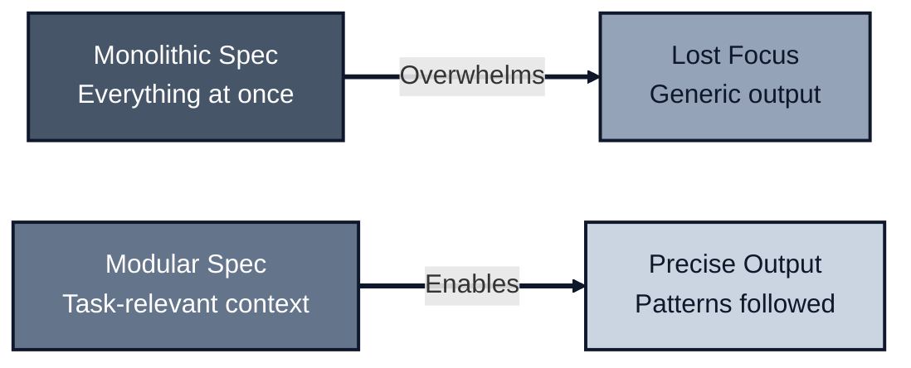
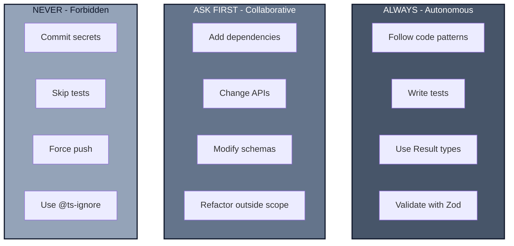
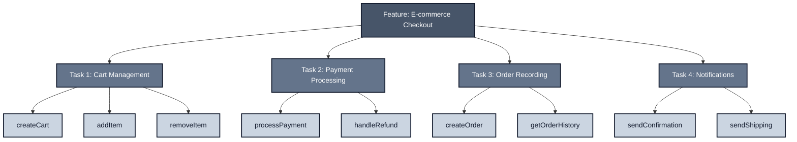
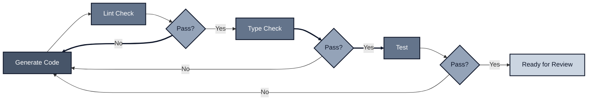

*Bonus topic. Return to: [What We've Built](..//conclusion) or explore [React Architecture](..//react).*

---

## The Setup

You paste your feature requirements into an AI coding agent. It generates 500 lines of code. Half doesn't compile. The other half uses patterns your team abandoned six months ago. You spend two hours fixing what should have taken twenty minutes.

The problem isn't the AI. It's the spec.

Most developers treat AI agents like magic boxes: dump in requirements, pray for good output. But these tools have fundamental constraints: finite context windows, no persistent memory between sessions, and a tendency to confidently generate plausible-looking nonsense when given vague instructions.

The solution isn't more sophisticated AI. It's better specs.

---

## The Core Tension

Two forces pull in opposite directions:

**Comprehensive Coverage** - You want the AI to know everything: your architecture, patterns, conventions, history, constraints, edge cases, team preferences...

**Context Limits** - AI agents have finite memory. Dump too much in, and the model loses focus. Key details drown in noise.

The instinct is to write a massive spec covering every possible scenario. This fails predictably:

```text
// The Overload Approach
10,000 lines of context
├── Full architecture documentation
├── Complete style guide
├── Every past decision
├── All possible edge cases
└── Kitchen sink

Result: Agent overwhelmed, key details lost, generic output
```

The solution: **structured, modular specs** that give the agent exactly what it needs for each task.



---

## Plan Mode: Vision First, Details Second

The most common mistake: diving straight into implementation details.

```typescript
// BAD: Implementation-first prompt
// "Create a UserService class with methods for CRUD operations,
// using Prisma for the database, with retry logic, logging,
// validation using Zod, error handling with Result types,
// dependency injection, and full test coverage..."
```

This overwhelms the agent with decisions before establishing direction. The AI makes arbitrary choices, and you spend time fixing them.

### The Two-Phase Approach

**Phase 1: Vision** - Describe what you're building and why. Let the AI draft a plan.

```typescript
// GOOD: Vision-first prompt
// "I need a user management feature that handles registration,
// profile updates, and account deletion. Users should receive
// email confirmations. Draft a plan for how you'd structure this."
```

**Phase 2: Execution** - Review the plan, correct course, then implement piece by piece.

```typescript
// After reviewing the plan:
// "The plan looks good. Start with createUser following our
// fn(args, deps) pattern. Here's an example from the codebase..."
```



```mermaid
graph LR
    A[High-level Vision<br/>What and Why] --> B[AI Drafts Plan<br/>Structure proposal]
    B --> C[Human Reviews<br/>Correct direction]
    C --> D[AI Implements<br/>Focused execution]
    D --> E[Human Validates<br/>Quality check]
    E -->|Iterate| D

    style A fill:#475569,stroke:#0f172a,stroke-width:2px,color:#fff
    style B fill:#64748b,stroke:#0f172a,stroke-width:2px,color:#fff
    style C fill:#94a3b8,stroke:#0f172a,stroke-width:2px,color:#0f172a
    style D fill:#cbd5e1,stroke:#0f172a,stroke-width:2px,color:#0f172a
    style E fill:#e2e8f0,stroke:#0f172a,stroke-width:2px,color:#0f172a

    linkStyle 0 stroke:#0f172a,stroke-width:3px
    linkStyle 1 stroke:#0f172a,stroke-width:3px
    linkStyle 2 stroke:#0f172a,stroke-width:3px
    linkStyle 3 stroke:#0f172a,stroke-width:3px
    linkStyle 4 stroke:#0f172a,stroke-width:3px
```

### Why This Works

AI agents excel at elaboration when given clear direction. They struggle when forced to make high-level decisions with incomplete context.

By establishing vision first:

- The AI understands the goal, not just the mechanics
- You catch misalignment before code is written
- The plan becomes a reference for subsequent tasks
- Iteration happens at the design level, not the implementation level

> **Practical tip:** Most AI coding tools have a "Plan Mode" or equivalent that restricts the agent to read-only operations. Use this for Phase 1. Let the agent explore your codebase and draft a plan before touching any files.

---

## The Six Core Areas

A good agent spec isn't a novel. It's a structured document covering specific areas. Analysis of thousands of effective agent configurations reveals a consistent pattern.

| Area | Purpose | Example |
|------|---------|---------|
| **Commands** | Available actions | `npm test`, `pnpm build`, `pnpm lint --fix` |
| **Testing** | How to verify code | "Use vitest, vitest-mock-extended for mocks" |
| **Project Structure** | Where things live | "Domain logic in `src/domain/`, handlers in `src/api/`" |
| **Code Style** | Patterns to follow | "Use `fn(args, deps)`, return `Result<T, E>`" |
| **Git Workflow** | Version control practices | "Conventional commits, feature branches" |
| **Boundaries** | What's allowed | "Never commit secrets, ask before adding deps" |

### Commands: Executable, Not Descriptive

Don't write "run the tests." Write the exact command:

```markdown
## Commands

- **Build**: `pnpm build` - Compiles TypeScript to dist/
- **Test**: `pnpm test` - Runs vitest, must pass before commits
- **Lint**: `pnpm lint --fix` - ESLint with auto-fix
- **Type check**: `pnpm tsc --noEmit` - Verify types without emitting
```

Agents need executable commands, not vague instructions.

### Testing: Framework and Patterns

Specify not just what tool, but how to use it:

```markdown
## Testing

- Framework: vitest
- Mocks: vitest-mock-extended (typed mocks, no vi.mock)
- Unit tests: `*.test.ts` alongside source files
- Integration tests: `*.test.int.ts` in test/ directory
- Coverage: Not required, but test error paths explicitly
```

### Project Structure: Navigation Map

```markdown
## Project Structure

src/
├── domain/      # Pure business logic, no I/O imports
├── infra/       # Database, external APIs, implementations
├── api/         # HTTP handlers, composition root
└── lib/         # Shared utilities (Result, validation)

tests/
├── unit/        # Fast tests, mocked dependencies
└── integration/ # Real database, real services
```

### Code Style: Show, Don't Just Tell

One code example beats three paragraphs of description:

```markdown
## Code Style

Functions follow `fn(args, deps)`:

\`\`\`typescript
async function createUser(
  args: { email: Email; name: string },
  deps: { db: Database; logger: Logger }
): Promise<Result<User, CreateUserError>> {
  // Business logic only - no framework imports
}
\`\`\`

- Args: Validated input (branded types preferred)
- Deps: Injected infrastructure
- Returns: Result<T, E>, never throws
```

### Git Workflow: Commit Conventions

```markdown
## Git Workflow

- Commits: Conventional format (feat:, fix:, refactor:, test:, docs:)
- Branches: feature/*, fix/*, refactor/*
- PRs: Include summary, test plan, breaking changes if any
- Never: Force push to main, commit without tests passing
```

### Boundaries: The Critical Section

This is where most specs fail. Covered in depth in the next section.

---

## Three-Tier Boundaries

The difference between a helpful AI agent and a chaotic one: **clear boundaries**.

Most specs either have no boundaries (agent does whatever it wants) or vague ones ("follow best practices"). Neither works.

The solution: **three-tier boundaries** that explicitly define autonomy levels.



### ALWAYS (Autonomous)

Actions the agent should take without asking. These are non-negotiable patterns:

```markdown
### ALWAYS

- Follow the `fn(args, deps)` pattern for all functions
- Write unit tests alongside implementation
- Use `Result<T, E>` for error handling, never throw
- Validate inputs with Zod at boundaries
- Use branded types for domain values (Email, UserId, etc.)
- Run `pnpm lint` and `pnpm test` before presenting code
- Add JSDoc comments for exported functions
```

### ASK FIRST (Collaborative)

Actions that require human approval. These have higher impact or ambiguity:

```markdown
### ASK FIRST

- Creating new database tables or migrations
- Adding npm dependencies
- Changing public API contracts
- Modifying authentication/authorization logic
- Refactoring code outside the current task scope
- Altering shared configuration files
- Making architectural decisions not covered by existing patterns
```

### NEVER (Forbidden)

Hard stops. These should never happen regardless of context:

```markdown
### NEVER

- Commit `.env` files or any secrets
- Use `vi.mock()` for application code
- Skip tests to "ship faster"
- Force push to protected branches
- Delete production data or migrations
- Use `@ts-ignore` or `@ts-expect-error`
- Suppress ESLint errors without explanation
- Use `any` type without explicit justification
```

### Why Three Tiers Work

| Tier | Speed | Risk | Human Involvement |
|------|-------|------|-------------------|
| Always | Fast | Low | None |
| Ask First | Medium | Medium | Approval only |
| Never | N/A | High | Blocked |

This structure gives the agent maximum autonomy on safe operations while preventing costly mistakes. The "Ask First" tier is key: it enables progress without requiring constant supervision.

---

## Modular Prompts and Context Management

AI agents have finite context windows. Every token you spend on irrelevant information is a token not available for the actual task.

### The Anti-Pattern

```text
"Build me a complete e-commerce checkout system with cart management,
payment processing, inventory tracking, email notifications, order
history, refund handling, and analytics integration."
```

This prompt asks for everything at once. The agent will:

- Make arbitrary decisions without guidance
- Forget earlier requirements by the time it reaches later ones
- Produce generic code that doesn't fit your architecture

### The Pattern: Task Decomposition

Break complex features into focused tasks, each with its own context:



Each task gets a focused prompt with only relevant context.

### Context Budget Strategy

Think of context like a budget. Allocate it deliberately:

| Category | Allocation | Contents |
|----------|------------|----------|
| **Current Task** | 40% | Specific requirements, acceptance criteria |
| **Relevant Patterns** | 30% | Examples of similar code in your codebase |
| **Boundaries** | 20% | Rules, constraints, style requirements |
| **History** | 10% | Previous decisions relevant to this task |

**For implementing `createOrder`:**

```markdown
## Current Task (40%)
Create the `createOrder` function that:
- Takes validated order items and customer ID
- Checks inventory availability
- Creates order record in database
- Returns Result<Order, CreateOrderError>

## Relevant Patterns (30%)
Here's how we implemented `createUser`:
[paste createUser.ts]

## Boundaries (20%)
- Use fn(args, deps) signature
- Return Result, never throw
- Add unit tests

## History (10%)
We decided against soft deletes for orders (see ADR-007).
```

### When to Start Fresh

Long conversations accumulate context that may no longer be relevant. Signs you need a fresh session:

- Switching to a different feature area
- Agent starts confusing current task with earlier ones
- Output quality degrades despite clear prompts
- You've significantly changed direction from the original plan

Don't be afraid to start new sessions. The spec file persists between sessions, so the agent can pick up context from there.

---

## Self-Verification and Validation

Don't trust AI output blindly. Build verification into your spec.

### The Verification Loop



### Spec the Self-Checks

```markdown
## Verification Requirements

Before presenting any code as complete:

1. **Compile**: `pnpm tsc --noEmit` must pass
2. **Lint**: `pnpm lint` must pass with no errors
3. **Test**: `pnpm test` must pass for affected files
4. **Pattern check**: Verify against code style:
   - Functions use `fn(args, deps)` signature
   - Errors return `Result<T, E>`
   - Input validation uses Zod at boundaries

If any check fails, fix the issue before presenting.
Do not present code with known issues "for review."
```

### Human Oversight Remains Essential

Self-verification catches mechanical errors. It doesn't catch:

- Incorrect business logic
- Security vulnerabilities
- Architectural violations
- Subtle bugs that pass tests

**Rule:** Never commit AI-generated code you couldn't explain to a colleague. If you can't trace the logic, don't ship it.

---

## Spec-Driven Development Phases

Working effectively with AI agents is a skill that develops over time. Here's a typical progression:

| Phase | Focus | Human Role | Agent Role |
|-------|-------|------------|------------|
| **Foundation** | Create the spec | Define patterns, boundaries | Suggest structure |
| **Iteration** | Refine from feedback | Review output, correct mistakes | Learn from corrections |
| **Automation** | Consistent execution | Spot-check, handle edge cases | Execute routine tasks |
| **Evolution** | Spec maintenance | Update when patterns change | Flag outdated guidance |

### Phase 1: Foundation

Create your initial spec. This takes time upfront but pays dividends:

- Define your code patterns with examples
- Establish boundaries (Always/Ask/Never)
- Document project structure
- Add relevant commands

### Phase 2: Iteration

Use the spec, observe failures, and refine:

- Agent keeps using wrong pattern? Add an explicit example
- Agent asks unnecessary questions? Move to "Always" tier
- Agent makes dangerous changes? Add to "Never" tier

### Phase 3: Automation

With a mature spec, routine tasks become predictable:

- Feature implementation follows established patterns
- Tests are written consistently
- Code style is maintained automatically

### Phase 4: Evolution

Specs aren't static. Update when:

- Team adopts new patterns
- Dependencies change
- Architecture evolves
- Lessons learned from incidents

Treat your spec like code: version control it, review changes, keep it current.

---

## Practical Example: Complete Spec Template

Here's a complete, copy-paste-ready spec file integrating all patterns from this documentation series.

```markdown
# Project: [Your Project Name]

## Tech Stack

- TypeScript 5.x with strict mode
- Node.js 24+
- Vitest for testing
- Zod for validation
- awaitly for Result types and workflows
- autotel for tracing

## Commands

- **Build**: `pnpm build`
- **Test**: `pnpm test`
- **Lint**: `pnpm lint --fix`
- **Type check**: `pnpm tsc --noEmit`
- **Dev**: `pnpm dev`

## Project Structure

src/
├── domain/      # Pure business logic (fn(args, deps) functions)
│   ├── user/
│   │   ├── createUser.ts
│   │   ├── createUser.test.ts
│   │   └── types.ts
│   └── order/
├── infra/       # External services, database implementations
│   ├── database.ts
│   ├── logger.ts
│   └── types.ts
├── api/         # HTTP handlers, composition root
│   └── routes/
└── lib/         # Shared utilities
    ├── result.ts
    └── validation.ts

## Code Patterns

### Functions

All functions follow `fn(args, deps)`:

\`\`\`typescript
async function createOrder(
  args: { customerId: CustomerId; items: OrderItem[] },
  deps: { db: Database; logger: Logger }
): Promise<Result<Order, CreateOrderError>> {
  // Business logic only
}
\`\`\`

### Error Handling

- Use `Result<T, E>` from awaitly
- Never throw for expected failures
- Discriminated unions for error types:

\`\`\`typescript
type CreateOrderError =
  | { type: 'CUSTOMER_NOT_FOUND'; customerId: string }
  | { type: 'ITEM_OUT_OF_STOCK'; itemId: string }
  | { type: 'DB_ERROR'; cause: unknown };
\`\`\`

### Validation

- Zod schemas at boundaries (HTTP handlers)
- Branded types for domain values:

\`\`\`typescript
const CustomerIdSchema = z.string().uuid().brand<'CustomerId'>();
type CustomerId = z.infer<typeof CustomerIdSchema>;
\`\`\`

- Parse, don't validate: functions receive branded types, not raw strings

### Testing

- Unit tests: `*.test.ts` alongside source
- Use vitest-mock-extended for typed mocks
- No `vi.mock()` for application code
- Test each error path explicitly

\`\`\`typescript
import { mock } from 'vitest-mock-extended';

const mockDb = mock<Database>();
mockDb.findCustomer.mockResolvedValue(null);

const result = await createOrder(args, { db: mockDb, logger: mockLogger });
expect(result).toEqual(err({ type: 'CUSTOMER_NOT_FOUND', customerId: args.customerId }));
\`\`\`

## Boundaries

### ALWAYS

- Follow `fn(args, deps)` for all new functions
- Write unit tests alongside implementation
- Use `Result<T, E>`, never throw for expected errors
- Validate inputs with Zod at boundaries
- Use branded types for domain identifiers
- Run `pnpm lint` and `pnpm test` before presenting code
- Add JSDoc for exported functions

### ASK FIRST

- Creating new database tables or migrations
- Adding npm dependencies
- Changing public API contracts or types
- Modifying authentication logic
- Refactoring outside current task scope
- Changing shared configuration

### NEVER

- Commit `.env` files or secrets
- Use `vi.mock()` for application code
- Skip tests
- Force push to protected branches
- Use `@ts-ignore` or `any` without justification
- Delete data without soft-delete pattern

## Git Workflow

- Commits: Conventional format (feat:, fix:, refactor:)
- Branches: feature/*, fix/*
- Always: Run tests before commit

## Verification

Before presenting code as complete:

1. `pnpm tsc --noEmit` - Types pass
2. `pnpm lint` - No lint errors
3. `pnpm test` - Tests pass
4. Pattern check - fn(args, deps), Result types, Zod validation

## Current Task

[Updated per task - describe specific requirements here]
```

---

## The Rules

1. **Vision first, details second.** Use Plan Mode. Let the AI draft structure before implementing. Catch misalignment at design time, not debug time.

2. **Modular beats monolithic.** Break features into focused tasks. One task, one context, one goal. Don't dump everything into one prompt.

3. **Define boundaries explicitly.** Always/Ask First/Never tiers prevent autonomous chaos while enabling efficient execution on safe operations.

4. **Build verification into the spec.** Self-checks (lint, test, types) catch mechanical errors before human review. But mechanical checks don't replace human oversight.

5. **Context is finite; spend it wisely.** 40% current task, 30% relevant patterns, 20% boundaries, 10% history. Cut what doesn't serve the immediate goal.

6. **Evolve the spec continuously.** Treat it like code: version control, review changes, update when patterns change. A stale spec produces stale output.

---

## Quick Reference

| Aspect | Anti-Pattern | Pattern |
|--------|-------------|---------|
| **Scope** | Everything in one prompt | Modular, focused tasks |
| **Detail** | Full implementation spec upfront | Vision first, details second |
| **Constraints** | None or vague | Three-tier boundaries |
| **Verification** | Trust agent output | Built-in self-checks |
| **Context** | Dump everything | Strategic 40/30/20/10 allocation |
| **Evolution** | Static spec | Continuous iteration |

---

## What Makes This Different

Traditional development specs describe what to build. AI agent specs also describe **how to build** - the patterns, constraints, and verification that keep output aligned with your architecture.

The patterns in this guide mirror the patterns throughout this documentation series:

- **fn(args, deps)** makes dependencies explicit for both humans and AI
- **Result types** force error handling to be visible in the spec
- **Zod validation** creates clear boundaries the AI can respect
- **Explicit testing patterns** enable self-verification

A good spec doesn't just tell the AI what to build. It teaches the AI how your team builds software.

---

*This is a bonus topic. Return to: [What We've Built](..//conclusion)*

*Or explore: [React Architecture](..//react) for framework-specific patterns.*
