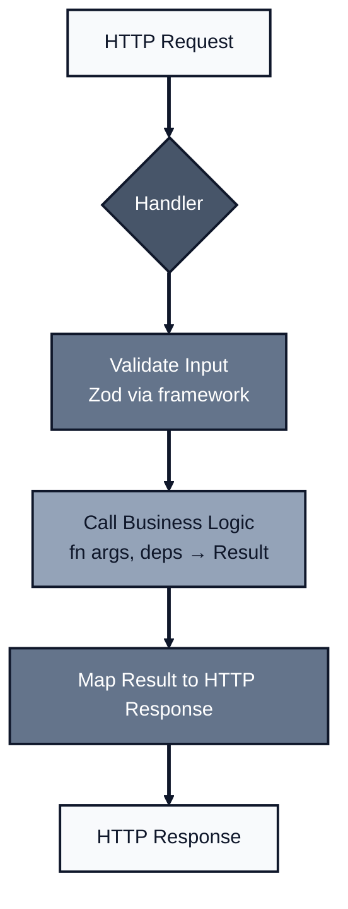
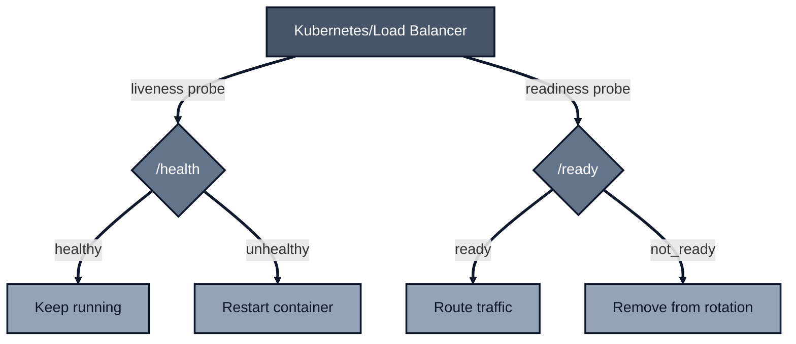

*Previously: [Configuration at the Boundary](/patterns/configuration). We learned to validate config at startup. Now let's build APIs that use all these patterns together.*

---

You've built functions with explicit deps. You've validated at the boundary. You've returned Results instead of throwing. You've made everything observable and resilient.

Now you need to expose it to the world via HTTP.

This is where everything comes together and where many teams stumble. They've got clean internal code, but their API layer is a mess of inconsistent error formats, missing health checks, and ad-hoc security.

Let's fix that.

---

## The Handler Layer: Where HTTP Meets Your Domain

Your HTTP handlers have exactly one job: **translate between HTTP and your domain**.



Handlers should be thin. They don't contain business logic. They:

1. Receive HTTP input (already validated by the framework)
2. Call business functions with validated args and injected deps
3. Map the Result to an HTTP response

That's it.

---

## Input Validation: The Framework's Job

Modern API frameworks (orpc, tRPC, Hono with Zod) handle validation at the boundary:

```typescript
import { os, ORPCError } from "@orpc/server";
import { z } from "zod";

const UserCreate = z.object({
  name: z.string()
    .min(1, "Name cannot be empty")
    .max(100, "Name must be less than 100 characters"),
  email: z.string()
    .email("Invalid email format"),
  age: z.number()
    .int("Age must be an integer")
    .min(0, "Age cannot be negative")
    .max(150, "Age must be realistic")
    .optional(),
});

export const createUser = os
  .input(UserCreate)  // Validated BEFORE handler runs
  .output(UserResponse)
  .handler(async ({ input }) => {
    // input is already validated and typed
    // If validation failed, handler never runs
    return createUserLogic(input, deps);
  });
```

This is [Validation at the Boundary](/patterns/validation) in action. The handler never sees invalid data.

### Sanitize After Validation

Validation ensures data is shaped correctly. Sanitization normalizes it:

```typescript
.handler(async ({ input }) => {
  const user = {
    id: crypto.randomUUID(),
    name: input.name.trim(),              // Remove whitespace
    email: input.email.toLowerCase(),      // Normalize to lowercase
    age: input.age,
  };
  return deps.db.saveUser(user);
});
```

---

## Response Schemas: Control Your Output

Define what goes out, not just what comes in:

```typescript
const UserResponse = z.object({
  id: z.string().uuid(),
  name: z.string(),
  email: z.string(),
  // Note: password_hash is NOT included
});

export const getUser = os
  .input(z.object({ userId: z.string().uuid() }))
  .output(UserResponse)  // Filters and validates output
  .handler(async ({ input }) => {
    const user = await deps.db.findUser(input.userId);
    // Even if db returns password_hash, it's stripped
    return user;
  });
```

Output schemas:
- Prevent accidental exposure of sensitive fields
- Document what clients can expect
- Enable OpenAPI generation
- Catch bugs where you return the wrong shape

---

## Error Handling: Two Approaches

### Approach 1: Framework Errors (Simple APIs)

For straightforward CRUD APIs, use your framework's error type directly:

```typescript
import { ORPCError } from "@orpc/server";

export const getUser = os
  .input(z.object({ userId: z.string().uuid() }))
  .output(UserResponse)
  .handler(async ({ input }) => {
    const user = await deps.db.findUser(input.userId);

    if (!user) {
      throw new ORPCError("NOT_FOUND", {
        status: 404,
        message: `User with id ${input.userId} not found`,
      });
    }

    return user;
  });
```

This works well when:
- Your business logic is simple
- Handlers call database directly
- You don't need to compose multiple operations

### Approach 2: Result Types (Complex APIs)

For complex business logic, use [Result types](/patterns/errors) internally and map at the boundary:

```typescript
import { trace } from "./observability";

// Business function returns Result - wrapped with trace() for observability
const getUser = trace(
  { name: "getUser" },
  async (
    args: { userId: string },
    deps: GetUserDeps
  ): AsyncResult<User, 'NOT_FOUND' | 'DB_ERROR'> => {
    try {
      const user = await deps.db.findUser(args.userId);
      return user ? ok(user) : err('NOT_FOUND');
    } catch {
      return err('DB_ERROR');
    }
  }
);

// Handler maps Result to HTTP
const errorToStatus: Record<string, number> = {
  NOT_FOUND: 404,
  UNAUTHORIZED: 401,
  FORBIDDEN: 403,
  VALIDATION_FAILED: 400,
  CONFLICT: 409,
  DB_ERROR: 500,
};

export const getUserEndpoint = os
  .input(z.object({ userId: z.string().uuid() }))
  .output(UserResponse)
  .handler(async ({ input, context }) => {
    const { logger, requestId } = context as AppContext;

    logger.info({ userId: input.userId }, "Fetching user");
    const result = await getUser({ userId: input.userId }, deps);

    if (!result.ok) {
      logger.warn({ userId: input.userId, error: result.error }, "User fetch failed");
      throw new ORPCError(result.error, {
        status: errorToStatus[result.error] ?? 500,
        data: createErrorResponse(result.error, `Error: ${result.error}`, requestId),
      });
    }

    return result.value;
  });
```

This works well when:
- Business logic is complex
- You're composing multiple operations
- You want exhaustive error handling

### Consistent Error Envelope

Regardless of which approach you use, clients benefit from a **stable JSON error shape**:

```typescript
// Define a canonical error response
const ErrorResponse = z.object({
  code: z.string(),           // Machine-readable: "NOT_FOUND", "VALIDATION_FAILED"
  message: z.string(),        // Human-readable explanation
  requestId: z.string(),      // For correlation in logs
  details: z.unknown().optional(),  // Field errors, retry info, etc.
});

// Create errors consistently
function createErrorResponse(
  code: string,
  message: string,
  requestId: string,
  details?: unknown
): z.infer<typeof ErrorResponse> {
  return { code, message, requestId, details };
}

// Usage in handler
throw new ORPCError(result.error, {
  status: errorToStatus[result.error] ?? 500,
  data: createErrorResponse(
    result.error,
    errorMessages[result.error],
    context.requestId,
    result.details
  ),
});
```

> **Rule: `ORPCError(code)` must match `ErrorResponse.code`**. Using the same string for both simplifies logs, metrics, and client error handling. For example, `throw new ORPCError("NOT_FOUND", { data: createErrorResponse("NOT_FOUND", ...) })` — never mix codes like `ORPCError("BAD_REQUEST")` with `createErrorResponse("MISSING_FIELD")`.

**Why this matters:**
- Clients write one error handler that works everywhere
- Observability tools can parse and aggregate errors consistently
- `requestId` enables support to correlate user reports with logs

> **Tip**: Also return `requestId` in the `X-Request-ID` response header. Clients can surface it even without parsing JSON, and it's visible in browser dev tools. Set this header centrally in middleware (not in each handler):
>
> ```typescript
> // In your top-level request middleware or response hook
> response.headers.set("X-Request-ID", context.requestId);
> ```

> **RFC 7807 "Problem Details"**: This envelope is a custom format. For APIs that must interoperate with external systems, consider [RFC 7807](https://www.rfc-editor.org/rfc/rfc7807) instead (`Content-Type: application/problem+json` with `type`, `title`, `status`, `detail` fields). Many HTTP client libraries understand RFC 7807 natively.

### Standard Error Mapping

Map all error types consistently:

```typescript
// Error codes and their HTTP status
const errorToStatus: Record<string, number> = {
  // Domain errors
  NOT_FOUND: 404,
  UNAUTHORIZED: 401,
  FORBIDDEN: 403,
  CONFLICT: 409,
  OUT_OF_STOCK: 422,
  INVALID_PRODUCT: 422,
  // Infrastructure errors
  DB_ERROR: 500,
  EXTERNAL_SERVICE_ERROR: 503,
  // Validation
  VALIDATION_FAILED: 400,
  MISSING_IDEMPOTENCY_KEY: 400,
};

// Human-readable messages (don't expose internal details!)
const errorMessages: Record<string, string> = {
  NOT_FOUND: "The requested resource was not found",
  UNAUTHORIZED: "Authentication required",
  FORBIDDEN: "You don't have permission to perform this action",
  CONFLICT: "This action conflicts with existing data",
  OUT_OF_STOCK: "Product is out of stock",
  INVALID_PRODUCT: "Product does not exist",
  DB_ERROR: "An unexpected error occurred",
  EXTERNAL_SERVICE_ERROR: "A downstream service is unavailable",
  VALIDATION_FAILED: "Request validation failed",
  MISSING_IDEMPOTENCY_KEY: "Idempotency-Key header is required",
};

// Framework validation errors → consistent envelope
function handleZodError(error: z.ZodError, requestId: string) {
  return createErrorResponse(
    "VALIDATION_FAILED",
    "Request validation failed",
    requestId,
    error.errors.map(e => ({ path: e.path.join('.'), message: e.message }))
  );
}

// Unknown errors → safe fallback (never leak stack traces!)
function handleUnknownError(error: unknown, requestId: string, logger: Logger) {
  logger.error({ error, requestId }, "Unhandled error");
  return createErrorResponse(
    "INTERNAL_ERROR",
    "An unexpected error occurred",
    requestId
    // Never include error.message or stack in production responses
  );
}
```

> **Important**: Install a global error handler (middleware) that converts framework validation errors (Zod) and unknown exceptions into your `ErrorResponse` envelope. Otherwise, validation failures will return the framework's default format.

### HTTP Status Code Guidelines

| Status | When to Use | Example |
|--------|-------------|---------|
| 200 | Success | User retrieved |
| 201 | Created | User created |
| 204 | Success, no content | User deleted |
| 400 | Bad request (schema/syntax invalid) | Missing required field, wrong type |
| 401 | Unauthorized | No/invalid token |
| 403 | Forbidden | Token valid, but no permission |
| 404 | Not found | User doesn't exist |
| 409 | Conflict | Email already registered |
| 422 | Unprocessable (valid syntax, business rule fails) | Age must be ≥18 for this action |
| 429 | Too many requests (include `Retry-After` header) | Rate limited |
| 500 | Internal error | Unexpected failure |
| 503 | Service unavailable | Downstream service down, shutting down |

**400 vs 422 Rule of Thumb:**
- **400**: The request is syntactically malformed or fails schema validation (Zod catches these)
- **422**: The request is valid JSON/syntax, but violates a business rule that can't be expressed in the schema

```typescript
// 429 with Retry-After header
throw new ORPCError("TOO_MANY_REQUESTS", {
  status: 429,
  message: "Rate limit exceeded",
  headers: { "Retry-After": "60" },  // Seconds until retry is allowed
});
```

---

## Health Checks: Liveness vs Readiness

Production systems need two types of health checks:

### Liveness: "Is the process alive?"

```typescript
export const health = os
  .input(z.void())
  .output(z.object({
    status: z.literal("healthy"),
    timestamp: z.string(),
  }))
  .handler(async () => {
    return {
      status: "healthy" as const,
      timestamp: new Date().toISOString(),
    };
  });
```

**Liveness probes:**
- Should always succeed if the process is running
- Don't check external dependencies here
- If this fails, orchestrator restarts the container

### Readiness: "Can the process handle traffic?"

```typescript
import { trace } from "./observability";

// Shared checks schema for both success and error responses
const HealthChecks = z.object({
  database: z.boolean(),
  cache: z.boolean(),
  acceptingRequests: z.boolean(),
});

// Success response (HTTP 200)
const ReadyResponse = z.object({
  status: z.literal("ready"),
  checks: HealthChecks,
});

// Error response schema (HTTP 503) - for documentation/client generation
const NotReadyResponse = z.object({
  status: z.literal("not_ready"),
  checks: HealthChecks,
});

export const ready = os
  .input(z.void())
  .output(ReadyResponse)  // Only success case in output schema
  .handler(async () => {
    // Check all critical dependencies
    const dbReady = await checkDatabase();
    const cacheReady = await checkCache();
    const acceptingRequests = !isShuttingDown;

    const checks = { database: dbReady, cache: cacheReady, acceptingRequests };
    const allReady = Object.values(checks).every(Boolean);

    // IMPORTANT: Return 503 when not ready so load balancers route correctly
    if (!allReady) {
      const notReadyResponse: z.infer<typeof NotReadyResponse> = {
        status: "not_ready",
        checks,
      };
      throw new ORPCError("SERVICE_UNAVAILABLE", {
        status: 503,
        data: notReadyResponse,
      });
    }

    return { status: "ready" as const, checks };
  });

// Health check functions should also be traced for visibility
const checkDatabase = trace(
  { name: "checkDatabase" },
  async (): Promise<boolean> => {
    try {
      await db.execute("SELECT 1");
      return true;
    } catch {
      return false;
    }
  }
);

const checkCache = trace(
  { name: "checkCache" },
  async (): Promise<boolean> => {
    try {
      await cache.ping();  // or cache.get("__healthcheck__")
      return true;
    } catch {
      return false;
    }
  }
);
```

> **Why 503?** Load balancers and orchestrators check HTTP status codes, not response bodies. Returning `200` with `status: "not_ready"` will keep routing traffic to unhealthy instances.

**Response contract** (for OpenAPI/client generation):
- **200**: `ReadyResponse` — `{ status: "ready", checks }`
- **503**: `NotReadyResponse` — `{ status: "not_ready", checks }`

Both responses include the same `checks` object so clients can see which dependencies failed. If your framework can't express multiple response schemas (e.g., union types in OpenAPI), document the 503 body in prose and keep the shape stable.

**Readiness probes:**
- Check all dependencies the service needs
- Return `not_ready` during shutdown
- If this fails, orchestrator stops routing traffic



---

## Graceful Shutdown

Don't just `process.exit()`. Finish in-flight requests first:

```typescript
let isShuttingDown = false;
const activeRequests = new Set<Promise<unknown>>();

function trackRequest<T>(promise: Promise<T>): Promise<T> {
  activeRequests.add(promise);
  void promise.finally(() => activeRequests.delete(promise));  // void silences floating-promise lint
  return promise;
}

async function gracefulShutdown(signal: string) {
  console.log(`Received ${signal}, starting graceful shutdown...`);

  // 1. Stop accepting new requests
  isShuttingDown = true;

  // 2. Wait for in-flight requests OR timeout (whichever comes first)
  const SHUTDOWN_TIMEOUT_MS = 10_000;

  const allRequestsComplete = Promise.allSettled(activeRequests);
  const timeout = new Promise<void>(resolve =>
    setTimeout(() => {
      if (activeRequests.size > 0) {
        console.warn(`Forced shutdown: ${activeRequests.size} requests still active`);
      }
      resolve();
    }, SHUTDOWN_TIMEOUT_MS)
  );

  await Promise.race([allRequestsComplete, timeout]);

  // 3. Close resources
  await db.close();
  console.log("Graceful shutdown complete");
  process.exit(0);
}

// Register handlers
process.on("SIGTERM", () => gracefulShutdown("SIGTERM"));
process.on("SIGINT", () => gracefulShutdown("SIGINT"));

// Handle unexpected errors too
process.on("uncaughtException", (error) => {
  console.error("Uncaught exception:", error);
  gracefulShutdown("uncaughtException");
});

process.on("unhandledRejection", (reason) => {
  console.error("Unhandled rejection:", reason);
  gracefulShutdown("unhandledRejection");
});
```

> **Bounded tracking**: The `activeRequests` Set only holds references to pending promises. Once they settle, `finally()` removes them. For very high-throughput services, consider capping tracked requests or using a counter instead of storing promise references.

### In Handlers: Reject During Shutdown

```typescript
.handler(async ({ input }) => {
  if (isShuttingDown) {
    throw new ORPCError("SERVICE_UNAVAILABLE", {
      status: 503,
      message: "Server is shutting down",
    });
  }

  return trackRequest(doWork(input));
});
```

---

## Request Context: Logging and Tracing

Every request should have context that flows through all operations:

```typescript
type AppContext = {
  requestId: string;
  logger: Logger;
  req: Request;              // Original request (for headers, etc.)
  user?: {                   // Set by authMiddleware
    id: string;
    email: string;
    role: string;
  };
  traceId?: string;
  spanId?: string;
};

function generateRequestId(): string {
  // Use crypto.randomUUID() for production - cryptographically random, no collisions
  return crypto.randomUUID();
}

// Middleware: Create context for each request
async function handleRequest(req: Request): Promise<Response> {
  // Propagate client's request ID if provided, otherwise generate new one
  const requestId = req.headers.get("x-request-id") ?? generateRequestId();
  const logger = baseLogger.child({ requestId });

  const context: AppContext = {
    req,  // Original request for headers access
    requestId,
    logger,
    traceId: req.headers.get('x-trace-id') ?? undefined,
    spanId: req.headers.get('x-span-id') ?? undefined,
  };

  // Pass context to handlers
  const result = await handler.handle(req, { context });

  return result.response;
}
```

### Logger Configuration: Redaction and Structure

Configure your logger to automatically redact sensitive data:

```typescript
import pino from 'pino';

const baseLogger = pino({
  level: process.env.LOG_LEVEL ?? 'info',

  // Automatically redact sensitive fields (they become "[Redacted]")
  redact: {
    paths: [
      'password',
      'password_hash',
      'token',
      'api_key',
      'secret',
      'authorization',
      '*.password',      // Nested in any object
      '*.token',
      'req.headers.authorization',
    ],
    remove: true,  // Remove entirely instead of showing "[Redacted]"
  },

  // Development: pretty print; Production: JSON
  transport: process.env.NODE_ENV !== 'production'
    ? { target: 'pino-pretty', options: { colorize: true } }
    : undefined,
});
```

### Structured Logging in Handlers

Use JSON fields, not string interpolation:

```typescript
.handler(async ({ input, context }) => {
  const { logger, requestId } = context as AppContext;

  // ✅ Structured - queryable, filterable
  logger.info({ userId: input.userId, action: 'getUser' }, "Fetching user");

  // ❌ Avoid: logger.info(`Fetching user ${input.userId}`)

  const result = await getUser({ userId: input.userId }, deps);

  if (!result.ok) {
    logger.warn({
      userId: input.userId,
      error: result.error,
    }, "User not found");
  }

  return result.value;
});
```

### Canonical Log Lines (Wide Events)

Instead of scattered log entries, emit **one comprehensive log per request** with all context:

```typescript
// Pseudocode: Emitted in top-level middleware after handler completes
// Variables: context, req, response, startTime, input, error come from middleware scope
logger.info({
  // Request context
  requestId,
  traceId: context.traceId,
  method: req.method,
  path: new URL(req.url).pathname,

  // Timing
  duration_ms: Date.now() - startTime,
  status_code: response.status,

  // Business context
  'user.id': context.user?.id,
  'order.item_count': input.items?.length,

  // Error info (if any)
  'error.code': error?.code,
}, 'Request completed');
```

**Why canonical log lines?**
- Single log entry contains everything for analysis
- Enables powerful queries: `SELECT * FROM logs WHERE user.id = 'x' AND error.code IS NOT NULL`
- Reduces log volume while increasing information density

### Semantic Conventions

Use [OpenTelemetry semantic conventions](https://opentelemetry.io/docs/specs/semconv/) for consistent attribute names:

| Standard Key | Instead Of | Why It Matters |
|-------------|-----------|----------------|
| `user.id` | `userId`, `user_id` | Backends correlate users across services |
| `http.method` | `method` | Automatic HTTP dashboards |
| `http.status_code` | `status`, `statusCode` | Standardized metrics |
| `db.system` | `database` | Database performance views |
| `error.type` | `errorCode` | Error aggregation and alerting |
| `service.name` | `serviceName` | Service topology maps |

### Log-to-Trace Correlation

Include trace context in logs to enable "one-click jump" from traces to logs:

```typescript
logger.info({
  userId: args.userId,
  traceId: context.traceId,
  spanId: context.spanId,
}, 'Processing user request');
```

---

## CORS Configuration

Cross-Origin Resource Sharing requires explicit configuration:

```typescript
const ALLOWED_ORIGINS = new Set([
  'https://app.example.com',
  'https://admin.example.com',
]);

const corsConfig = {
  // IMPORTANT: With credentials: true, you CANNOT use origin: '*'
  // You must echo the specific origin from an allowlist
  origin: (requestOrigin: string | undefined) => {
    // No Origin header = not a browser CORS request (curl, server-to-server)
    if (!requestOrigin) return true;  // Allow non-browser requests
    if (process.env.NODE_ENV !== 'production') return requestOrigin;  // Dev: echo any
    return ALLOWED_ORIGINS.has(requestOrigin) ? requestOrigin : false;
  },

  // Allowed methods
  methods: ['GET', 'POST', 'PUT', 'DELETE', 'OPTIONS'],

  // Allowed headers (include Idempotency-Key for mutations)
  allowedHeaders: ['Content-Type', 'Authorization', 'X-Request-ID', 'Idempotency-Key'],

  // Exposed headers (clients can read these)
  exposedHeaders: ['X-Request-ID', 'X-Rate-Limit-Remaining', 'Retry-After'],

  // Allow credentials (cookies, auth headers)
  credentials: true,

  // Required when origin varies per-request
  vary: ['Origin'],

  // Preflight cache duration
  maxAge: 86400,  // 24 hours
};
```

> **Critical**: Browsers reject `credentials: true` with `Access-Control-Allow-Origin: *`. Always echo the specific allowed origin and include `Vary: Origin` so caches don't mix up responses.

> **Non-browser requests**: When `Origin` is absent (curl, server-to-server), CORS doesn't apply—it's a browser-only policy. You don't need to set any CORS headers for these requests; just process them normally.

### Common CORS Mistakes

| Mistake | Problem | Fix |
|---------|---------|-----|
| `origin: '*'` with `credentials: true` | Browsers reject this combination | Echo specific origin from allowlist |
| Missing `Vary: Origin` | Cached responses leak across origins | Add `Vary: Origin` header |
| `origin: '*'` in production | Any site can make requests | Whitelist specific origins |
| Missing `credentials: true` | Cookies not sent | Enable if using auth cookies |
| Forgetting OPTIONS handler | Preflight fails | Framework usually handles this |
| Not exposing custom headers | Clients can't read them | Add to `exposedHeaders` |

### Framework CORS Plugins

Many frameworks provide CORS plugins that handle the boilerplate:

```typescript
import { CORSPlugin } from "@orpc/server/plugins";
import { RPCHandler } from "@orpc/server/fetch";

const handler = new RPCHandler(router, {
  plugins: [
    new CORSPlugin({
      origin: (origin) => {
        // No Origin = not a browser CORS request (curl, server-to-server)
        // Return null = "don't emit any CORS headers" (request proceeds normally)
        // This is NOT a rejection - CORS is browser-only enforcement
        if (!origin) return null;
        // Return origin string to allow, null to deny (browser blocks the request)
        return ALLOWED_ORIGINS.has(origin) ? origin : null;
      },
      allowMethods: ['GET', 'POST', 'PUT', 'DELETE', 'OPTIONS'],
      allowHeaders: ['Content-Type', 'Authorization', 'Idempotency-Key'],
      maxAge: 86400,
      credentials: true,
    }),
  ],
});
```

> **Tip**: Using a plugin ensures consistent CORS handling and proper preflight (OPTIONS) responses. Manual CORS headers are error-prone.

---

## Idempotency: Safe Retries for Mutations

For `POST`/`PUT` endpoints that create or mutate data, implement **idempotency keys** via the `Idempotency-Key` header to prevent duplicate operations when clients retry:

```typescript
import { trace } from "./observability";

// Domain input only - idempotency key comes from header, not body
const CreateOrderInput = z.object({
  productId: z.string().uuid(),
  quantity: z.number().int().positive(),
});

// Business logic wrapped with trace() for observability
const createOrderWorkflow = trace(
  { name: "createOrderWorkflow" },
  async (
    args: { productId: string; quantity: number; userId: string },
    deps: OrderDeps
  ): AsyncResult<Order, 'OUT_OF_STOCK' | 'INVALID_PRODUCT'> => {
    // ... business logic here
  }
);

export const createOrder = os
  .input(CreateOrderInput)
  .output(OrderResponse)
  .handler(async ({ input, context }) => {
    const { logger, requestId, user, req } = context as AppContext;

    // Read idempotency key from header (standard approach)
    const idempotencyKey = req.headers.get('idempotency-key');
    if (!idempotencyKey) {
      throw new ORPCError("MISSING_IDEMPOTENCY_KEY", {
        status: 400,
        data: createErrorResponse("MISSING_IDEMPOTENCY_KEY", "Idempotency-Key header required", requestId),
      });
    }

    // Check if we've already processed this request
    const existing = await deps.idempotencyStore.get(idempotencyKey);
    if (existing) {
      logger.info({ idempotencyKey }, "Returning cached response (idempotent retry)");
      return existing.response;
    }

    // Process the request
    logger.info({ idempotencyKey, productId: input.productId }, "Creating order");
    const result = await createOrderWorkflow({ ...input, userId: user.id }, deps);

    if (!result.ok) {
      logger.warn({ idempotencyKey, error: result.error }, "Order creation failed");
      throw new ORPCError(result.error, {
        status: errorToStatus[result.error] ?? 500,
        data: createErrorResponse(result.error, errorMessages[result.error], requestId),
      });
    }

    // Cache the response (with TTL, e.g., 24 hours)
    await deps.idempotencyStore.set(idempotencyKey, {
      response: result.value,
      createdAt: new Date(),
    }, { ttl: 86400 });

    logger.info({ idempotencyKey, orderId: result.value.id }, "Order created");
    return result.value;
  });
```

**Client usage:**
```bash
curl -X POST https://api.example.com/orders \
  -H "Idempotency-Key: 550e8400-e29b-41d4-a716-446655440000" \
  -H "Content-Type: application/json" \
  -d '{"productId": "...", "quantity": 1}'
```

**Why this matters:**
- Client times out → retries → without idempotency, you get duplicate orders
- Load balancer retries during deploy → duplicate database records
- User double-clicks submit button → double charges

**Implementation strategies:**
- **Database unique constraint**: Use idempotency key as part of unique index
- **Distributed cache**: Redis with TTL for stateless services
- **Client-side**: Generate UUID before first request attempt

> **Don't retry non-idempotent writes without idempotency keys.** This is a common cause of production incidents.

---

## OpenAPI Generation

Your API should document itself:

```typescript
import { OpenAPIHandler } from "@orpc/openapi";
import { OpenAPIGenerator } from "@orpc/openapi";

const generator = new OpenAPIGenerator({
  title: "My API",
  version: "1.0.0",
  description: "API documentation generated from code",
});

// Generate OpenAPI spec from router
const spec = generator.generate(router);

// Serve spec at /openapi.json
app.get("/openapi.json", () => Response.json(spec));

// Optionally serve Swagger UI
app.get("/docs", () => serveSwaggerUI("/openapi.json"));
```

Benefits:
- Documentation always matches implementation
- Generate client SDKs automatically
- Validate against spec in CI
- Third-party integrations get accurate docs

---

## Security Checklist

### Authentication

```typescript
// Middleware: Verify JWT and add user to context
async function authMiddleware(req: Request, context: AppContext) {
  const { requestId, logger } = context;
  const token = req.headers.get('authorization')?.replace('Bearer ', '');

  if (!token) {
    logger.warn({ requestId }, "Missing authorization token");
    throw new ORPCError("UNAUTHORIZED", {
      status: 401,
      data: createErrorResponse("UNAUTHORIZED", "Missing authorization token", requestId),
    });
  }

  try {
    const payload = jwt.verify(token, config.JWT_SECRET);
    // Map JWT payload to typed user (jwt.verify can return string or JwtPayload)
    if (typeof payload !== 'object' || payload === null) {
      throw new Error('Invalid payload');
    }
    context.user = {
      id: String((payload as any).sub ?? (payload as any).id),
      email: String((payload as any).email ?? ''),
      role: String((payload as any).role ?? 'user'),
    };
  } catch {
    logger.warn({ requestId }, "Invalid or expired token");
    throw new ORPCError("UNAUTHORIZED", {
      status: 401,
      data: createErrorResponse("UNAUTHORIZED", "Invalid or expired token", requestId),
    });
  }
}
```

### Authorization

```typescript
function requireRole(allowedRoles: string[]) {
  return (context: AppContext) => {
    const { requestId, logger, user } = context;
    // Guard: ensure user exists (authMiddleware should have set it)
    if (!user) {
      throw new ORPCError("UNAUTHORIZED", {
        status: 401,
        data: createErrorResponse("UNAUTHORIZED", "Authentication required", requestId),
      });
    }
    if (!allowedRoles.includes(user.role)) {
      logger.warn({ requestId, userId: user.id, requiredRoles: allowedRoles }, "Forbidden: insufficient permissions");
      throw new ORPCError("FORBIDDEN", {
        status: 403,
        data: createErrorResponse("FORBIDDEN", "Insufficient permissions", requestId),
      });
    }
  };
}

// Usage
export const deleteUser = os
  .use(requireRole(['admin']))
  .input(z.object({ userId: z.string().uuid() }))
  .handler(async ({ input, context }) => {
    // Only admins reach here
  });
```

### Rate Limiting

```typescript
import { rateLimit } from 'your-rate-limiter';

const loginLimiter = rateLimit({
  windowMs: 15 * 60 * 1000,  // 15 minutes
  max: 5,  // 5 attempts per window
  keyGenerator: (req) => req.ip,  // Rate limit by IP
  handler: (req, context) => {
    const { requestId } = context as AppContext;
    throw new ORPCError("TOO_MANY_REQUESTS", {
      status: 429,
      headers: { "Retry-After": "900" },  // 15 minutes in seconds
      data: createErrorResponse(
        "TOO_MANY_REQUESTS",
        "Too many login attempts. Try again later.",
        requestId,
        { retryAfter: 900 }
      ),
    });
  },
});
```

### Input Validation (Defense in Depth)

Even with Zod, add specific checks for sensitive operations:

```typescript
const TransferInput = z.object({
  fromAccount: z.string().uuid(),
  toAccount: z.string().uuid(),
  amount: z.number().positive().max(10000),  // Hard limit
}).refine(
  data => data.fromAccount !== data.toAccount,
  { message: "Cannot transfer to same account" }
);
```

### Security Headers

Add these headers to all responses (via middleware):

```typescript
const securityHeaders = {
  "X-Content-Type-Options": "nosniff",
  "X-Frame-Options": "DENY",
  "X-XSS-Protection": "0",  // Disabled; use CSP instead
  "Strict-Transport-Security": "max-age=31536000; includeSubDomains",
  "Content-Security-Policy": "default-src 'self'",
};
```

> **CSRF Note**: If using cookie-based authentication, implement CSRF protection (double-submit cookie, synchronizer tokens, or SameSite cookies).

### Health Endpoint Security

Health endpoints should be unauthenticated (so orchestrators can probe them) but not publicly exposed:

```typescript
// Option 1: Network-level protection (preferred)
// - Health endpoints on internal port (e.g., :9090)
// - Main API on public port (e.g., :8080)
// - Kubernetes/load balancer only accesses internal port

// Option 2: Path-based protection via ingress
// Nginx/ALB rules: only allow /health, /ready from internal IPs
```

---

## Pagination: Cursor vs Offset

For list endpoints, prefer **cursor-based pagination** for stable results:

```typescript
const ListUsersInput = z.object({
  cursor: z.string().optional(),  // Opaque cursor from previous response
  limit: z.number().int().min(1).max(100).default(20),
});

const ListUsersOutput = z.object({
  users: z.array(UserResponse),
  nextCursor: z.string().nullable(),  // null = no more results
  hasMore: z.boolean(),
});

// Cursor is typically: base64(JSON.stringify({ id: lastItem.id, createdAt: lastItem.createdAt }))
```

**Why cursor over offset?**
- Offset skips items if data changes between pages
- Cursor gives stable, reproducible results
- Better performance (no `OFFSET` scan in DB)

---

## Caching: ETags and Cache-Control

For read-heavy endpoints, implement HTTP caching:

```typescript
.handler(async ({ input, context }) => {
  const { req } = context as AppContext;
  const user = await deps.db.findUser(input.userId);

  // Generate ETag from content hash
  // Note: MD5 is fine here - ETags are for cache validation, not security.
  // Use SHA-256 if you prefer, but it's slower and overkill for this use case.
  // Warning: JSON.stringify isn't order-stable - use a stable stringify library
  // (e.g., fast-json-stable-stringify) or hash a canonical field like `updatedAt`.
  const etag = `"${crypto.createHash('md5').update(JSON.stringify(user)).digest('hex')}"`;

  // Check if client has current version
  const clientEtag = req.headers.get('if-none-match');
  if (clientEtag === etag) {
    return new Response(null, { status: 304 });  // Not Modified
  }

  return new Response(JSON.stringify(user), {
    headers: {
      'ETag': etag,
      'Cache-Control': 'private, max-age=60',  // Cache for 60s
    },
  });
});
```

> **Framework note**: This example returns raw `Response` objects, which works in fetch-style handlers. In RPC frameworks that expect data returns, use framework-specific response helpers to set headers instead.

| Header | Use Case |
|--------|----------|
| `Cache-Control: private` | User-specific data (cached by browser only) |
| `Cache-Control: public` | Shared data (CDN can cache) |
| `Cache-Control: no-store` | Sensitive data (never cache) |
| `ETag` | Content-based validation |
| `Last-Modified` | Time-based validation |

---

## API Versioning

**Recommended: Evolve without versions.** Add fields, don't remove or rename them. Use feature flags for breaking changes.

When you must version:

```typescript
// Option 1: URL path (most explicit)
// /v1/users, /v2/users
app.use("/v1", routerV1);
app.use("/v2", routerV2);

// Option 2: Header-based (cleaner URLs)
// Accept: application/vnd.myapi.v2+json
app.use((req, next) => {
  const version = req.headers.get('accept')?.match(/vnd\.myapi\.v(\d+)/)?.[1] ?? '1';
  req.apiVersion = parseInt(version);
  return next();
});
```

> **Avoid query parameter versioning** (`?version=2`). It's harder to cache and route.

---

## Route File Organization

As APIs grow, file organization becomes critical. The patterns from [Functions Over Classes](/patterns/functions) apply here: "Group only when functions genuinely travel together (often at boundaries: routers)."

### One File Per Route

Each route gets its own file with co-located tests:

```
routes/
├── posts/
│   ├── get-post.ts           # Single route
│   ├── get-post.test.ts      # Its tests
│   ├── list-posts.ts
│   ├── list-posts.test.ts
│   ├── create-post.ts
│   ├── create-post.test.ts
│   ├── index.ts              # Composes into postsRouter
│   └── schemas.ts            # Shared Zod schemas
├── users/
│   └── ...
└── index.ts                  # Composes into apiRouter
```

**Why one file per route?**

- Easy to find: action + resource = filename (`get-post.ts`)
- Easy to test: each route tested in isolation
- Easy to review: PRs touch specific files, not a monolith
- Easy to delete: remove file and its test

### Naming Conventions

| Level | Convention | Example |
|-------|------------|---------|
| URL paths | Plural nouns | `/api/v1/posts`, `/api/v1/users` |
| File names | kebab-case, action-resource | `get-post.ts`, `list-users.ts` |
| Factory functions | camelCase, create prefix | `createGetPost`, `createListUsers` |
| Router keys | camelCase, action + resource | `getPost`, `listUsers` |

### Route File Template

Each route follows the `fn(args, deps)` pattern for testability:

```typescript
// routes/posts/get-post.ts
import { os, ORPCError } from "@orpc/server";
import { z } from "zod";
import { PostResponse } from "./schemas";
import type { PostRepository } from "./types";

// Input schema
const GetPostInput = z.object({
  postId: z.string().uuid(),
});

// Dependencies: Declare exactly what this route needs
type GetPostDeps = {
  postRepo: PostRepository;
};

// Factory: Returns configured route with injected deps
export function createGetPost({ deps }: { deps: GetPostDeps }) {
  return os
    .input(GetPostInput)
    .output(PostResponse)
    .handler(async ({ input }) => {
      const post = await deps.postRepo.findById({ id: input.postId });
      if (!post) {
        throw new ORPCError("NOT_FOUND", {
          status: 404,
          message: `Post ${input.postId} not found`,
        });
      }
      return post;
    });
}

export type { GetPostDeps };
```

### Composition at Boundaries

Routes compose upward through `index.ts` files:

```typescript
// routes/posts/index.ts
import { createGetPost } from "./get-post";
import { createListPosts } from "./list-posts";
import { createCreatePost } from "./create-post";

type PostsRouterDeps = {
  postRepo: PostRepository;
};

export function createPostsRouter({ deps }: { deps: PostsRouterDeps }) {
  return {
    getPost: createGetPost({ deps }),
    listPosts: createListPosts({ deps }),
    createPost: createCreatePost({ deps }),
  };
}
```

```typescript
// routes/index.ts
import { createPostsRouter } from "./posts";
import { createUsersRouter } from "./users";

export function createApiRouter({ deps }: { deps: ApiRouterDeps }) {
  return {
    posts: createPostsRouter({ deps }),
    users: createUsersRouter({ deps }),
  };
}
```

### Co-Located Tests

Each route file has a test file next to it:

```typescript
// routes/posts/get-post.test.ts
import { describe, it, expect } from "vitest";
import { call, ORPCError } from "@orpc/server";
import { mock } from "vitest-mock-extended";
import { createGetPost, type GetPostDeps } from "./get-post";

describe("getPost", () => {
  const postId = "550e8400-e29b-41d4-a716-446655440000";  // Valid UUID

  it("returns post when found", async () => {
    const deps = mock<GetPostDeps>();
    deps.postRepo.findById.mockResolvedValue({ id: postId, title: "Test" });

    const getPost = createGetPost({ deps });
    const result = await call(getPost, { postId });

    expect(result.title).toBe("Test");
  });

  it("throws NOT_FOUND when post missing", async () => {
    const deps = mock<GetPostDeps>();
    deps.postRepo.findById.mockResolvedValue(null);

    const getPost = createGetPost({ deps });

    await expect(call(getPost, { postId }))
      .rejects.toThrow(ORPCError);
  });
});
```

**Benefits of co-location:**

- Find tests instantly (same directory)
- Delete route = delete tests (no orphans)
- PRs show implementation + tests together
- Minimal mock setup (only deps this route needs)

### When to Split vs Combine

**One file per route when:**

- Routes have different dependencies
- Routes are tested independently
- Team navigates by feature/action

**Combine routes when:**

- Trivial routes (health checks)
- Routes share all logic
- File count becomes overwhelming (rare)

> **Reference**: The [orpc-cookbook example 16](https://github.com/jagreehal/orpc-cookbook/tree/main/examples/16_route_naming_composition) demonstrates this pattern with a complete posts/users API.

---

## Testing API Handlers

With the `fn(args, deps)` pattern, testing becomes straightforward. Explicit dependencies mean you can inject mocks without `vi.mock` magic.

### Critical Rules

🚨 **Test names describe outcomes, not actions.** "returns user when ID exists" not "test getUser". The name IS the specification.

🚨 **Assert specific values, not types.** `expect(result).toEqual({ id: 1, name: "Alice" })` not `expect(result).toBeDefined()`.

🚨 **One concept per test.** Each test verifies one behavior. If you need "and" in your test name, split it.

🚨 **Bugs cluster together.** When you find one bug, test related scenarios.

### Test Naming Pattern

**Pattern:** `[outcome] when [condition]`

```typescript
// ✅ GOOD - Clear outcome and condition
it("returns user when ID exists", async () => { /* ... */ });
it("throws NOT_FOUND when user ID does not exist", async () => { /* ... */ });
it("throws CONFLICT when email already exists", async () => { /* ... */ });

// ❌ BAD - Vague, doesn't describe outcome
it("test getUser", async () => { /* ... */ });
it("should work", async () => { /* ... */ });
it("handles edge cases", async () => { /* ... */ });
```

### Unit Testing Routes with DI

Because routes use factory functions with explicit deps, mocking is simple:

```typescript
import { describe, it, expect, beforeEach } from "vitest";
import { call, ORPCError } from "@orpc/server";
import { mock } from "vitest-mock-extended";
import { createGetUser, type GetUserDeps } from "./get-user";

describe("getUser", () => {
  const userId = "550e8400-e29b-41d4-a716-446655440000";

  it("returns user when ID exists", async () => {
    // Arrange: Create mock deps
    const deps = mock<GetUserDeps>();
    deps.userRepo.findById.mockResolvedValue({
      id: userId,
      name: "Alice",
      email: "alice@example.com",
    });

    // Act: Create route with mock deps and call it
    const getUser = createGetUser({ deps });
    const result = await call(getUser, { userId });

    // Assert: Verify specific values
    expect(result).toEqual({
      id: userId,
      name: "Alice",
      email: "alice@example.com",
    });
  });

  it("throws NOT_FOUND when user does not exist", async () => {
    const deps = mock<GetUserDeps>();
    deps.userRepo.findById.mockResolvedValue(null);

    const getUser = createGetUser({ deps });

    try {
      await call(getUser, { userId });
      expect.fail("Should have thrown NOT_FOUND");
    } catch (error) {
      expect(error).toBeInstanceOf(ORPCError);
      // Assert code (always available on ORPCError)
      expect((error as ORPCError).code).toBe("NOT_FOUND");
      // Check status via the official accessor (varies by framework version)
      // Some versions use error.status, others error.data?.status
      expect((error as ORPCError).status).toBe(404);
    }
  });
});
```

**Why this works:**

- No `vi.mock` path coupling — refactor freely
- No hoisting magic — clear execution order
- No global state — tests are isolated
- Type-safe mocks — `mock<GetUserDeps>()` enforces the interface

### Integration Testing

Unit tests mock dependencies. Integration tests verify the full stack:

```typescript
describe("UserRepository (Integration)", () => {
  let repo: UserRepository;
  let client: DatabaseClient;

  beforeEach(async () => {
    // Use in-memory database for speed and isolation
    client = createClient({ url: ":memory:" });
    await client.execute(`CREATE TABLE users (...)`);
    repo = createUserRepository(client);
  });

  it("returns created user when found by ID", async () => {
    const created = await repo.create({
      name: "John",
      email: "john@example.com",
    });

    const found = await repo.findById({ id: created.id });

    expect(found).toEqual(created);
  });

  it("enforces unique email constraint", async () => {
    await repo.create({ name: "First", email: "test@example.com" });

    await expect(
      repo.create({ name: "Second", email: "test@example.com" })
    ).rejects.toThrow();
  });
});
```

### Edge Cases Checklist

When testing, systematically consider:

| Input Type | Edge Cases |
|------------|------------|
| Strings | Empty `""`, whitespace `"   "`, very long, Unicode/emojis |
| Numbers | Zero, negative, MAX_SAFE_INTEGER, decimals |
| IDs | Invalid format, non-existent, null |
| Collections | Empty `[]`, single item, duplicates |
| Domain | Email with `+`, duplicate emails, format violations |

### Database Guardrails

Prevent accidental production database access in tests:

```typescript
// vitest.setup.ts
if (
  process.env.DATABASE_URL &&
  !process.env.DATABASE_URL.includes("localhost") &&
  !process.env.DATABASE_URL.includes(":memory:")
) {
  throw new Error(
    `Tests must use localhost or in-memory database. Got: ${process.env.DATABASE_URL}`
  );
}
```

### The Testing Pyramid

| Test Type | Database | Speed | Use For |
|-----------|----------|-------|---------|
| Unit | Mock | Fast (ms) | Business logic, error paths, edge cases |
| Integration | Real (localhost) | Slower (s) | Database queries, constraints, full workflows |

> **Reference**: The [orpc-cookbook example 11](https://github.com/jagreehal/orpc-cookbook/tree/main/examples/11_testing) provides complete testing examples with vitest-mock-extended and comprehensive edge case coverage.

---

## The Complete Handler Pattern

Putting it all together—every pattern in one example:

```typescript
import { os, ORPCError } from "@orpc/server";
import { z } from "zod";
import { trace } from "./observability";
import { ok, err, type AsyncResult } from "./result";

// ─────────────────────────────────────────────────────────────
// Schemas: Define input/output at the boundary
// ─────────────────────────────────────────────────────────────

// Domain input only - idempotency key comes from Idempotency-Key header
const CreateOrderInput = z.object({
  productId: z.string().uuid(),
  quantity: z.number().int().positive().max(100),
});

const OrderResponse = z.object({
  id: z.string().uuid(),
  productId: z.string().uuid(),
  quantity: z.number(),
  total: z.number(),
  status: z.enum(["pending", "confirmed", "shipped"]),
});

// ─────────────────────────────────────────────────────────────
// Business Logic: fn(args, deps) → Result, wrapped with trace()
// ─────────────────────────────────────────────────────────────

type OrderError = 'OUT_OF_STOCK' | 'INVALID_PRODUCT' | 'DB_ERROR';

const createOrderWorkflow = trace(
  { name: "createOrderWorkflow" },
  async (
    args: { productId: string; quantity: number; userId: string },
    deps: OrderDeps
  ): AsyncResult<Order, OrderError> => {
    const product = await deps.db.findProduct(args.productId);
    if (!product) return err('INVALID_PRODUCT');
    if (product.stock < args.quantity) return err('OUT_OF_STOCK');

    const order = await deps.db.createOrder({
      id: crypto.randomUUID(),
      ...args,
      total: product.price * args.quantity,
      status: 'pending',
    });

    return ok(order);
  }
);

// ─────────────────────────────────────────────────────────────
// Handler: Thin translation layer (HTTP ↔ domain)
// ─────────────────────────────────────────────────────────────

export const createOrder = os
  .use(authMiddleware)              // 1. Authentication
  .use(rateLimiter)                 // 2. Rate limiting
  .input(CreateOrderInput)          // 3. Input validation (Zod)
  .output(OrderResponse)            // 4. Output validation (strips extra fields)
  .handler(async ({ input, context }) => {
    const { logger, requestId, user, req } = context as AppContext;

    // 5. Reject during shutdown (503)
    if (isShuttingDown) {
      throw new ORPCError("SERVICE_UNAVAILABLE", {
        status: 503,
        data: createErrorResponse("SERVICE_UNAVAILABLE", "Server is shutting down", requestId),
      });
    }

    // 6. Get idempotency key from header (not body)
    const idempotencyKey = req.headers.get('idempotency-key');
    if (!idempotencyKey) {
      throw new ORPCError("MISSING_IDEMPOTENCY_KEY", {
        status: 400,
        data: createErrorResponse("MISSING_IDEMPOTENCY_KEY", "Idempotency-Key header required", requestId),
      });
    }

    // 7. Check idempotency (prevent duplicate orders on retry)
    const cached = await deps.idempotencyStore.get(idempotencyKey);
    if (cached) {
      logger.info({ idempotencyKey }, "Returning cached response");
      return cached.response;
    }

    // 8. Call business logic (traced, returns Result)
    logger.info({ userId: user.id, productId: input.productId }, "Creating order");
    const result = await createOrderWorkflow(
      { ...input, userId: user.id },
      deps
    );

    // 9. Map Result to HTTP with consistent error envelope
    if (!result.ok) {
      logger.warn({ error: result.error, requestId }, "Order creation failed");
      throw new ORPCError(result.error, {
        status: errorToStatus[result.error] ?? 500,
        data: createErrorResponse(result.error, errorMessages[result.error], requestId),
      });
    }

    // 10. Cache successful response for idempotency
    await deps.idempotencyStore.set(idempotencyKey, {
      response: result.value,
      createdAt: new Date(),
    }, { ttl: 86400 });

    logger.info({ orderId: result.value.id, requestId }, "Order created");

    // 11. Return (output schema validates and strips extra fields)
    return result.value;
  });
```

---

## The Rules

1. **Handlers are translation layers.** HTTP in, call business logic, HTTP out. No business logic in handlers.

2. **Validate input at the boundary.** Let the framework do it with Zod schemas.

3. **Define output schemas.** Control what goes out, prevent data leaks.

4. **Consistent error envelopes.** Same JSON shape for all errors, with request ID for correlation.

5. **Two health endpoints.** Liveness (process alive) and readiness (can handle traffic, returns 503 when not).

6. **Graceful shutdown.** Finish in-flight requests before exiting.

7. **Idempotency for mutations.** Use idempotency keys for POST/PUT to prevent duplicates on retry.

8. **Context flows through.** Request ID, logger, user—available everywhere.

9. **Document automatically.** OpenAPI generated from code, not maintained separately.

---

## The Full Architecture

```text
┌─────────────────────────────────────────────────────────────┐
│  HTTP Layer                                                  │
│  - Middleware: auth, rate limiting, CORS                    │
│  - Input validation (Zod via framework)                     │
│  - Health endpoints: /health, /ready                        │
│  - Graceful shutdown handling                               │
└───────────────────────────┬─────────────────────────────────┘
                            │
┌───────────────────────────▼─────────────────────────────────┐
│  Handlers (thin)                                            │
│  - Receive validated input                                  │
│  - Call business functions with deps                        │
│  - Map Result to HTTP response                              │
│  - Output validation (strips sensitive fields)              │
└───────────────────────────┬─────────────────────────────────┘
                            │
┌───────────────────────────▼─────────────────────────────────┐
│  Business Logic                                             │
│  - fn(args, deps): Result                                   │
│  - Composed with createWorkflow()                           │
│  - Resilience: retry, timeout, circuit breaker             │
│  - Observability: trace() wrapper                           │
└───────────────────────────┬─────────────────────────────────┘
                            │
┌───────────────────────────▼─────────────────────────────────┐
│  Infrastructure                                             │
│  - Database clients                                         │
│  - HTTP clients                                             │
│  - Injected as dependencies                                 │
└─────────────────────────────────────────────────────────────┘
```

---

## What We've Built

Over these patterns, we've constructed a complete TypeScript application architecture:

1. **[Testing drives design](/patterns/testing)** — Testability revealed the need for explicit deps
2. **[Functions over classes](/patterns/functions)** — `fn(args, deps)` pattern
3. **[Validation at the boundary](/patterns/validation)** — Zod schemas, branded types
4. **[Typed errors](/patterns/errors)** — Result types, railway-oriented programming
5. **[Observability](/patterns/opentelemetry)** — `trace()` wrapper, structured logging
6. **[Resilience](/patterns/resilience)** — Retry, timeout, circuit breaker at workflow level
7. **[Configuration](/patterns/configuration)** — Validate at startup, secrets in memory
8. **[API design](/patterns/api)** — This pattern: handlers, health checks, security

Each pattern builds on the previous. They're not independent—they're a cohesive architecture.

---

## Quick Reference

| Concern | Pattern | Where |
|---------|---------|-------|
| Input validation | Zod schemas | Framework boundary |
| Output validation | Response schemas | Framework boundary |
| Error handling | Result → ORPCError | Handler |
| Error format | Consistent envelope + RFC 7807 | All error responses |
| Authentication | Middleware | Before handler |
| Authorization | Role checks | Middleware or handler |
| Rate limiting | Middleware + Retry-After | Before handler |
| Idempotency | Idempotency-Key header | Create/mutate endpoints |
| Pagination | Cursor-based | List endpoints |
| Caching | ETag, Cache-Control | GET endpoints |
| Logging | Request-scoped logger | Context |
| Tracing | OpenTelemetry | Context + trace() |
| Health | /health (200), /ready (200/503) | Dedicated endpoints |
| Shutdown | SIGTERM + Promise.race | Process level |
| Security headers | X-Content-Type-Options, CSP, etc. | Middleware |
| Documentation | OpenAPI | Generated from code |
| Versioning | Evolve without versions (preferred) | URL or header |
| Route organization | One file per route + co-located tests | routes/ directory |

---

## What's Next

We've built the complete application architecture. But patterns are only as good as their enforcement. How do you ensure these patterns are followed, especially with AI-generated code?

---

*Next: [Enforcing Patterns with TypeScript](/patterns/typescript-config). Compile-time enforcement.*
