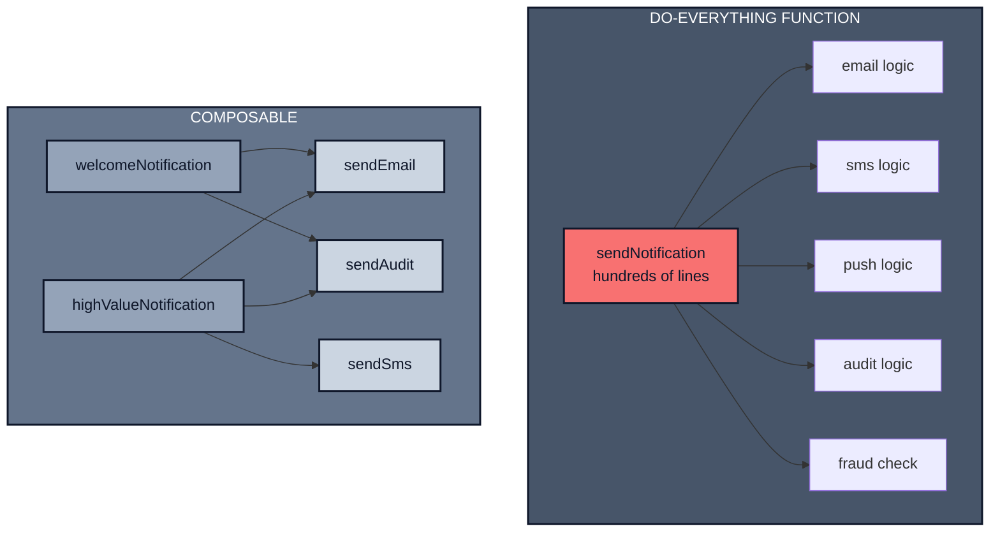

*Previously: [Composing Workflows](./workflows). We learned to orchestrate multi-step operations. Now let's zoom out to the philosophy that makes it work.*

---

## The Setup

You're building a user notification system. Requirements come in:

- Send welcome emails
- Send password reset emails
- Send order confirmation emails

Easy. You write `sendNotification(type, data)` with a switch statement. Ship it.

Three months later:

- Marketing wants SMS for high-value customers
- Legal needs audit logs for every notification
- The fraud team wants to block notifications to flagged accounts
- Mobile team wants push notifications

Your `sendNotification` function is now hundreds of lines with nested conditionals. Every new requirement touches every code path. Tests are brittle. Adding Slack notifications means understanding the entire function.

You built a do everything function. Not because you're a bad developer, but because you didn't have composition primitives.

---

## The Composition Mindset

Here's the mindset shift: **don't solve every problem upfront. Build pieces that combine.**

The monolithic approach tries to predict all requirements:

```typescript
async function sendNotification(
  args: { userId: string; message: string },
  deps: { db: Database },
  options: {
    channels?: ('email' | 'sms' | 'push')[];
    audit?: boolean;
    checkFraud?: boolean;
  }
) {
  if (options.checkFraud) {
    const user = await deps.db.getUser(args.userId);
    if (user.fraudFlagged) return;
  }

  if (options.audit) {
    await deps.db.auditLog.create({ userId: args.userId, message: args.message, timestamp: Date.now() });
  }

  for (const channel of options.channels ?? ['email']) {
    if (channel === 'email') { /* 50 lines */ }
    else if (channel === 'sms') { /* 50 lines */ }
    else if (channel === 'push') { /* 50 lines */ }
  }
}
```

Every new requirement adds another conditional. The function grows unbounded.

**The composable approach builds independent pieces that share a uniform interface:**

```typescript
type Notification = unknown; // defined later

// Each channel is a function with the same signature
type SendChannel = (args: { notification: Notification }) => Promise<void>;

// Each channel is independent and focused
const sendEmail: SendChannel = async (args) => { /* just email */ };
const sendSms: SendChannel = async (args) => { /* just SMS */ };
const sendAudit: SendChannel = async (args) => { /* just audit log */ };

// Compose at startup
const channels: SendChannel[] = [sendEmail, sendSms, sendAudit];

// Fan-out: send to all channels
const input = { notification };
await Promise.all(channels.map(ch => ch(input)));
```

New channel? Add it to the array. No existing code changes.



---

## Fan-Out: Many Destinations, One Call

Here's a common problem: you need to send the same notification to multiple destinations. Email, SMS, audit log all at once.

The configuration approach makes the sender know about every destination:

```typescript
async function sendNotification(
  args: { notification: Notification },
  deps: { emailClient: EmailClient; smsClient: SmsClient; auditDb: AuditDb },
  options: { email?: boolean; sms?: boolean; audit?: boolean }
) {
  if (options.email) await deps.emailClient.send(args.notification);
  if (options.sms) await deps.smsClient.send(args.notification);
  if (options.audit) await deps.auditDb.log(args.notification);
}
```

Adding Slack? Modify the function. Adding a data warehouse? Modify it again.

**The fan-out pattern inverts this.** Define a uniform interface, then compose an array:

```typescript
// types.ts
type Notification = {
  id: string;
  userId: string;
  email?: string;
  phone?: string;
  subject: string;
  body: string;
};

// Uniform interface: every channel is a function with this shape
type SendChannel = (args: { notification: Notification }) => Promise<void>;
```

Each channel follows [fn(args, deps)](./functions) deps are bound at creation, meaning the call signature stays stable even as dependencies vary. This keeps every channel callable the same way, so arrays and wrappers don't care which dependencies it needs:

```typescript
// channels/email.ts
type SendEmailDeps = { emailClient: EmailClient };

export function createSendEmail(deps: SendEmailDeps): SendChannel {
  return async (args) => {
    if (!args.notification.email) return;
    await deps.emailClient.send({
      to: args.notification.email,
      subject: args.notification.subject,
      body: args.notification.body,
    });
  };
}
```

```typescript
// channels/sms.ts
type SendSmsDeps = { smsClient: SmsClient };

export function createSendSms(deps: SendSmsDeps): SendChannel {
  return async (args) => {
    if (!args.notification.phone) return;
    await deps.smsClient.send({
      to: args.notification.phone,
      message: args.notification.body,
    });
  };
}
```

```typescript
// channels/audit.ts
type SendAuditDeps = { auditDb: AuditDb };

export function createSendAudit(deps: SendAuditDeps): SendChannel {
  return async (args) => {
    await deps.auditDb.log({
      notificationId: args.notification.id,
      userId: args.notification.userId,
      subject: args.notification.subject,
      timestamp: Date.now(),
    });
  };
}
```

Now compose them in one place your [composition root](./functions#where-does-this-live):

```typescript
// notification-service.ts (composition root)
import { createSendEmail } from './channels/email';
import { createSendSms } from './channels/sms';
import { createSendAudit } from './channels/audit';

type NotificationServiceDeps = {
  emailClient: EmailClient;
  smsClient: SmsClient;
  auditDb: AuditDb;
  slackClient?: SlackClient;
  pushService?: PushService;
};

export function createNotificationService(deps: NotificationServiceDeps) {
  const channels: SendChannel[] = [
    createSendEmail({ emailClient: deps.emailClient }),
    createSendSms({ smsClient: deps.smsClient }),
    createSendAudit({ auditDb: deps.auditDb }),
  ];

  return {
    notify: async (args: { notification: Notification }) => {
      await Promise.all(channels.map(ch => ch(args)));
    },
  };
}
```

**Adding Slack?** Write the channel factory, add one line:

```typescript
// channels/slack.ts
type SendSlackDeps = { slackClient: SlackClient };

export function createSendSlack(deps: SendSlackDeps, destination: string): SendChannel {
  return async (args) => {
    await deps.slackClient.postMessage(destination, `${args.notification.subject}: ${args.notification.body}`);
  };
}
```

```typescript
// notification-service.ts (inside createNotificationService, after channels array)
if (deps.slackClient) {
  channels.push(createSendSlack({ slackClient: deps.slackClient }, '#alerts'));
}
```

The `notify` function never changes. It doesn't know about Slack, email, or SMS. It just calls each channel.

| Approach | Adding New Destination |
|----------|------------------------|
| Configuration object | Modify sender, add option, add conditional |
| Fan-out with interface | Write channel factory, add to array |

---

## Wrapping: Add Behavior Without Modifying

You have an email channel that works. Now you need retry logic if sending fails, try again with exponential backoff.

The embedded approach modifies the channel:

```typescript
// ❌ Email logic mixed with retry logic
export function createSendEmailWithRetry(deps: SendEmailDeps): SendChannel {
  return async (args) => {
    for (let i = 0; i < 3; i++) {
      try {
        await deps.emailClient.send(args.notification);
        return;
      } catch (e) {
        if (i === 2) throw e;
        await sleep(1000 * Math.pow(2, i));
      }
    }
  };
}
```

Now the email logic is mixed with retry logic. What if SMS needs different retry behavior? Copy-paste. What if you want retry + logging? The function explodes.

**The wrapping pattern keeps them separate.** A wrapper takes a channel and returns a new channel with the same interface. Because the interface is preserved, wrappers stack:

```typescript
// wrappers/retry.ts
export function withRetry(channel: SendChannel, attempts = 3): SendChannel {
  return async (args) => {
    for (let i = 0; i < attempts; i++) {
      try {
        await channel(args);
        return;
      } catch (e) {
        if (i === attempts - 1) throw e;
        await sleep(1000 * Math.pow(2, i));
      }
    }
  };
}
```

The original channel stays clean. Retry is a wrapper:

```typescript
// Original channel—just sends email
const sendEmail = createSendEmail({ emailClient });

// Wrap with retry
const sendEmailWithRetry = withRetry(sendEmail, 3);
```

**Wrappers compose.** Want logging too?

```typescript
// wrappers/logging.ts
export function withLogging(channel: SendChannel, name: string): SendChannel {
  return async (args) => {
    console.log(`[${name}] Sending ${args.notification.id}`);
    try {
      await channel(args);
      console.log(`[${name}] Sent ${args.notification.id}`);
    } catch (e) {
      console.error(`[${name}] Failed ${args.notification.id}`, e);
      throw e;
    }
  };
}
```

```typescript
// Compose: logging wraps retry wraps email
const robustEmail = withLogging(withRetry(sendEmail, 3), 'email');
```

Each wrapper is independent. You can mix and match per channel:

```typescript
const channels: SendChannel[] = [
  withLogging(withRetry(sendEmail, 3), 'email'),
  withRetry(sendSms, 2),
  withLogging(sendAudit, 'audit'),
];
```

---

## Putting It Together

Let's rebuild the notification system from the opening. Small pieces, composed.

```typescript
// types.ts, channels/*.ts, wrappers/*.ts (from earlier)
```

```typescript
// notification-service.ts (composition root)
import { createSendEmail } from './channels/email';
import { createSendSms } from './channels/sms';
import { createSendAudit } from './channels/audit';
import { withRetry } from './wrappers/retry';
import { withLogging } from './wrappers/logging';

type NotificationServiceDeps = {
  emailClient: EmailClient;
  smsClient: SmsClient;
  auditDb: AuditDb;
  slackClient?: SlackClient;
  pushService?: PushService;
};

export function createNotificationService(deps: NotificationServiceDeps) {
  const sendEmail = createSendEmail({ emailClient: deps.emailClient });
  const sendSms = createSendSms({ smsClient: deps.smsClient });
  const sendAudit = createSendAudit({ auditDb: deps.auditDb });

  const channels: SendChannel[] = [
    withLogging(withRetry(sendEmail, 3), 'email'),
    withLogging(withRetry(sendSms, 2), 'sms'),
    withLogging(sendAudit, 'audit'),
  ];

  return {
    notify: async (args: { notification: Notification }) => {
      await Promise.all(channels.map(ch => ch(args)));
    },
  };
}
```

**Three months later, marketing wants push notifications:**

```typescript
// channels/push.ts
type SendPushDeps = { pushService: PushService };

export function createSendPush(deps: SendPushDeps): SendChannel {
  return async (args) => {
    await deps.pushService.send({
      userId: args.notification.userId,
      title: args.notification.subject,
      body: args.notification.body,
    });
  };
}
```

```typescript
// notification-service.ts (inside createNotificationService, after channels array)
if (deps.pushService) {
  const sendPush = createSendPush({ pushService: deps.pushService });
  channels.push(withLogging(withRetry(sendPush, 2), 'push'));
}
```

No existing code changed. The notification service doesn't know push exists. It just calls each channel.

---

## The Rules

1. **Build small, focused pieces.** Each function does one thing. `createSendEmail` creates an email sender. `withRetry` adds retry. Don't combine them.

2. **Use uniform interfaces.** When everything implements the same interface (`SendChannel`), you can compose them freely. Arrays, wrappers, conditionals—all work.

3. **Wrap, don't embed.** Need retry? Wrap it. Need logging? Wrap it. The original function stays clean.

4. **Compose at startup.** Wire pieces together in your composition root. Business logic doesn't know how pieces are composed.

Failure semantics (retries, escalation, partial failure) are layered on top—see [Resilience Patterns](./resilience).

---

## Why This Works (SOLID in Practice)

These patterns aren't arbitrary—they embody principles that make code maintainable:

**Open/Closed Principle.** Adding push notifications? Write `createSendPush`, add it to the array. The `notify` function never changes. Systems are *open* for extension (new channels) but *closed* for modification (existing code untouched).

**Single Responsibility.** Each piece does one thing. `createSendEmail` sends email. `withRetry` adds retry. `withLogging` adds logging. When retry logic needs to change, you change one function—not every channel.

**Dependency Inversion.** The composition root depends on `SendChannel`, not on `EmailClient` or `SmsClient` directly. High-level policy (fan-out to all channels) doesn't depend on low-level details (how email is sent). Both depend on the abstraction.

**Liskov Substitution.** Any `SendChannel` can replace another. Wrappers return `SendChannel`, so `withRetry(sendEmail)` is substitutable wherever `sendEmail` was used. This is why wrappers stack—each layer preserves the contract.

The patterns come first. The principles explain *why* they work.

### The Bigger Picture

This chapter is part of a consistent architecture:

- **[Validation](./validation)** guards the boundary—inputs are parsed before they reach functions
- **[Typed Errors](./errors)** make failure explicit—Results instead of exceptions
- **[Workflows](./workflows)** orchestrate multi-step operations with compensation
- **Composition** (this chapter) builds extensible pieces that combine
- **[Observability](./opentelemetry)** wraps functions without polluting them
- **[Resilience](./resilience)** adds retries at the workflow level, not inside functions

Each concern shifts outward to its proper layer, keeping core functions focused on business logic only.

---

## What's Next

We've seen how composition enables extensibility. Small pieces combine into complex behavior.

But there's something we've glossed over: when things go wrong inside these composed pieces, how do you see what happened? How do you trace a notification through email → retry → logging?

---

*Next: [Observability with OpenTelemetry](./opentelemetry). Making execution visible without cluttering business logic.*
