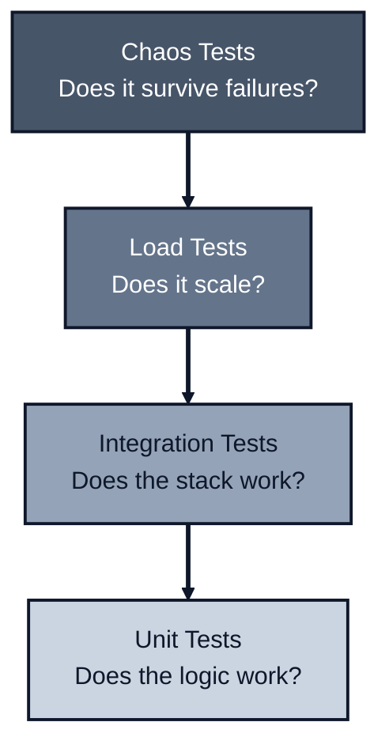

*Previously: [Performance Testing](/patterns/performance). The final piece: proving it works under pressure.*

---

Over this series, we've established a complete architecture for TypeScript applications:

0. **Testability drives design.** `vi.mock` is fragile (path coupling, hoisting, global state); explicit deps with `vitest-mock-extended` are simple and type-safe.
1. **Functions over classes.** `fn(args, deps)` for explicit dependencies. Use factories at the boundary to wire dependencies once.
2. **Validation at the boundary.** Zod guards the edges with branded types; functions trust their input. Parse, don't validate.
3. **Never throw.** Result types make failure explicit and composable. Use `createWorkflow` and `step()` for railway-oriented programming.
4. **Trace orthogonally.** Wrap functions with `trace()` from autotel. Observability without cluttering business logic. Use semantic conventions and correlate logs with traces.
5. **Resilience in workflows.** Use `step.retry()` and `step.withTimeout()` at the workflow level. Never retry non-idempotent operations. Use jitter to prevent thundering herd.
6. **Configuration at startup.** Validate and type config at the boundary with `node-env-resolver`. Secrets in memory only, never in `process.env`. Use secret managers and ephemeral credentials.
7. **API design.** Thin handlers translate HTTP to domain. Consistent error envelopes. Health checks, graceful shutdown, security headers. Everything comes together at the boundary.
8. **TypeScript enforces types.** Beyond `strict`: `noUncheckedIndexedAccess`, `erasableSyntaxOnly`, `verbatimModuleSyntax`. Use `ts-reset` to close `any` leaks.
9. **ESLint enforces patterns.** Lint-time checks catch architectural violations (boundaries, object params, server/client separation). Rules fail builds, not just warn.
10. **Performance testing proves it.** Load tests (smoke, load, stress, soak, spike) reveal bottlenecks; chaos tests prove resilience patterns actually work.

---

## The Result

Code that follows these patterns is:

| Quality | How It's Achieved |
| ------- | ----------------- |
| **Explicit** | Deps, errors, resilience policies, and configuration are visible in function signatures |
| **Testable** | Mock only what you need, inject dependencies, no `vi.mock` needed |
| **Observable** | Traces show what happened, including retries and timeouts |
| **Resilient** | Transient failures don't crash everything; workflows handle retries |
| **Type-safe** | Configuration is validated and typed at startup; `ts-reset` closes `any` leaks; `noUncheckedIndexedAccess` prevents undefined array access |
| **Secure** | Secrets loaded into memory only, never in `process.env`; secret scanning in CI (TruffleHog/Gitleaks); redaction for logs and span attributes |
| **Enforced** | TypeScript and ESLint catch violations before code ships |
| **Proven** | Load tests and chaos tests verify performance and resilience under pressure |
| **Maintainable** | Each concern lives in one place; no hidden coupling |

---

## The Pattern at a Glance

```typescript
// The complete pattern in one function

import type { Database, Logger } from '../infra/types';
import { z } from 'zod';
import { ok, err, type Result } from '../lib/result';
import { trace, type TraceContext } from 'autotel';
import { createWorkflow } from '@jagreehal/workflow';

// 1. Validation schema at the boundary
const CreateUserArgsSchema = z.object({
  email: z.string().email(),
  name: z.string().min(1),
});

type CreateUserArgs = z.infer<typeof CreateUserArgsSchema>;

// 2. Explicit error types (never throw)
type CreateUserError =
  | { type: 'EMAIL_EXISTS'; email: string }
  | { type: 'DB_ERROR'; cause: unknown };

// 3. Dependencies injected, not imported
type CreateUserDeps = {
  db: Database;
  logger: Logger;
  config: {
    apiKey: string;  // Loaded from secret manager, in memory only
  };
};

// 4. Core function: fn(args, deps) signature
async function createUserCore(
  args: CreateUserArgs,
  deps: CreateUserDeps
): Promise<Result<User, CreateUserError>> {
  const { db, logger } = deps;

  // Business logic trusts validated input
  const existing = await db.findUserByEmail(args.email);
  if (existing) {
    return err({ type: 'EMAIL_EXISTS', email: args.email });
  }

  const user = await db.createUser(args);
  logger.info('User created', { userId: user.id });

  return ok(user);
}

// 5. Tracing is orthogonal (wraps the function)
export const createUser = trace(
  (ctx: TraceContext) => async (
    args: CreateUserArgs,
    deps: CreateUserDeps
  ): Promise<Result<User, CreateUserError>> => {
    ctx.setAttribute('user.email', args.email);
    
    const result = await createUserCore(args, deps);
    
    ctx.setStatus({ code: result.ok ? 1 : 2 });
    return result;
  }
);

// 6. Workflow composition with resilience (if needed)
const createUserWithRetry = createWorkflow({ createUser });

export async function createUserWorkflow(
  args: CreateUserArgs,
  deps: CreateUserDeps
) {
  return createUserWithRetry(async (step) => {
    // Retry with exponential backoff for transient failures
    const user = await step.retry(
      () => createUser(args, deps),
      {
        attempts: 3,
        backoff: 'exponential',
        initialDelay: 100,
        retryOn: (error) => error.type === 'DB_ERROR',
      }
    );
    
    return user;
  });
}
```

---

## Quick Reference

### File Structure

```text
src/
├── domain/           # Pure business logic, no I/O
│   ├── user/
│   │   ├── createUser.ts
│   │   └── types.ts
│   └── order/
├── infra/            # External services, databases, APIs
│   ├── database.ts
│   ├── logger.ts
│   └── types.ts      # Interfaces that domain depends on
├── api/              # HTTP handlers, composition root
│   └── routes/
├── test-utils/       # Testing utilities
│   ├── prisma-mock.ts
│   ├── stubs.ts
│   └── chaos.ts
├── load-tests/       # k6 performance tests
│   ├── smoke.js
│   ├── load.js
│   └── stress.js
└── lib/              # Shared utilities
    ├── result.ts
    └── validation.ts
```

### Key Files

| File | Purpose |
| ---- | ------- |
| `tsconfig.json` | Type enforcement (`strict`, `noUncheckedIndexedAccess`, `erasableSyntaxOnly`, `verbatimModuleSyntax`) |
| `eslint.config.mjs` | Pattern enforcement (boundaries, object params, server/client separation) |
| `reset.d.ts` | Import `@total-typescript/ts-reset` to close `any` leaks |
| `src/lib/result.ts` | `Result<T, E>` type with `ok()` and `err()` helpers |
| `load-tests/*.js` | k6 scripts for smoke, load, stress, soak, spike tests |
| `vitest.config.ts` | Test configuration with database guardrails |

### The Rules

1. **Functions take `(args, deps)`.** Args are validated input. Deps are injected infrastructure. Use factories at the boundary to wire dependencies.
2. **Validate at the boundary.** Zod at HTTP/message handlers. Functions trust their input. Use branded types for stronger guarantees.
3. **Return `Result`, never throw.** Errors are values. Handle them explicitly. Use `createWorkflow` and `step()` for composition.
4. **Inject dependencies.** No `import { db }` in business logic. Use `import type` for interfaces. Pass infrastructure through `deps`.
5. **Trace orthogonally.** Wrap functions with `trace()` from autotel. Don't litter business logic with logging. Use semantic conventions.
6. **Resilience in workflows.** Use `step.retry()` and `step.withTimeout()` at the workflow level, not in business functions. Never retry non-idempotent operations.
7. **Configure at startup.** Validate config at the boundary with `node-env-resolver`. Secrets in memory only, never in `process.env`. Use secret managers in production.
8. **Thin handlers.** HTTP handlers translate between HTTP and domain. Consistent error envelopes. Health checks and graceful shutdown.
9. **Enforce with tooling.** TypeScript (`strict`, `noUncheckedIndexedAccess`, `ts-reset`) for types. ESLint (boundaries, object params) for patterns. Everything fails fast.
10. **Test progressively.** Unit → Integration → Load → Chaos. Use vitest-mock-extended for typed mocks. Use Faker for test stubs. Each layer catches different bugs.

---

## The Testing Pyramid



---

## Key Tools and Libraries

This architecture uses these tools:

| Tool | Purpose |
| ---- | ------- |
| `vitest-mock-extended` | Typed mocks for dependency injection |
| `@jagreehal/workflow` | Railway-oriented programming with `createWorkflow` and `step()` |
| `autotel` | Simple OpenTelemetry wrapper with `trace()` |
| `zod` | Schema validation at boundaries |
| `node-env-resolver` | Configuration validation and secret management |
| `@total-typescript/ts-reset` | Fixes standard library `any` leaks |
| `k6` | Load testing and performance validation |
| `eslint-plugin-prefer-object-params` | Enforces object parameters |
| `eslint-plugin-boundaries` | Enforces architectural boundaries |
| `eslint-plugin-no-server-imports` | Enforces server/client separation |

---

## Where to Go Next

This series covered the core patterns. There's more to explore:

- **Property-based testing:** Generate thousands of test cases automatically
- **Contract testing:** Verify API contracts between services
- **Distributed tracing:** Trace requests across multiple services
- **Continuous profiling:** Find bottlenecks in production, not just during load tests
- **Framework integration:** Applying these patterns in Next.js, Remix, TanStack Start

The foundation is set. Build on it.

---

*Start from the beginning: [Why This Pattern Exists](/patterns/testing)*

