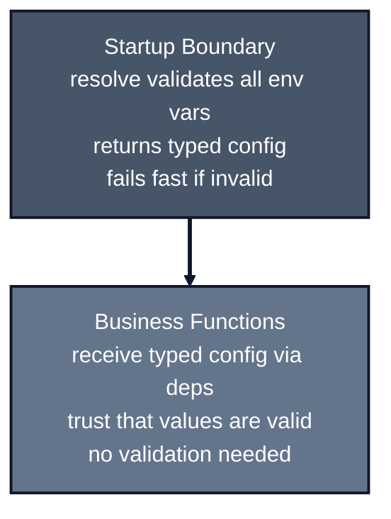

*Previously: [Resilience Patterns](/patterns/resilience). We've built a complete architecture. But there's one more boundary to handle: how your application starts.*

---

Your application needs configuration. Database URLs, API keys, feature flags, service endpoints.

Following the [12-Factor App](https://12factor.net/config) methodology, configuration should be stored in the environment, not in code. But there are important security considerations:

1. **Environment variables are untyped.** They're strings that might be missing or invalid.
2. **Secrets in `process.env` are a security risk.** They can leak through `/proc/self/environ` on Linux, appear in error messages, or be accessible to child processes.
3. **`.env` files should never be used in production.** They're plaintext files that can be accidentally committed or exposed.

```typescript
const dbUrl = process.env.DATABASE_URL;  // string | undefined
const port = process.env.PORT;          // string | undefined

// What if DATABASE_URL is empty? What if PORT is "not-a-number"?
await connect(dbUrl);  // Might crash
app.listen(Number(port));  // Might be NaN

// Security risk: secrets in process.env can leak
const apiKey = process.env.API_KEY;  // ⚠️ Accessible to child processes, logs, /proc/self/environ
```

It's Monday morning. Your weekend deploy is failing. The error: `Cannot read property 'findUser' of undefined`. You check the database—it's running. You check the connection code—it's fine. Two hours later, you find it: someone added `DB_URL` to the new deployment config instead of `DATABASE_URL`. TypeScript didn't complain. The app started. It crashed on the first database call.

You're trusting that `process.env` has the right values. But in production, a missing or invalid environment variable means your app crashes on startup. Or worse, secrets in `process.env` can be exposed, leading to security breaches.

**Solution:** Load non-sensitive config from `process.env`. Load secrets directly from secret managers into memory only.

Where do you validate and type this? And how do you handle secrets securely?

---

## 12-Factor App Alignment

The [12-Factor App](https://12factor.net/config) methodology states: "Store config in the environment." This means configuration should be external to your code, varying between deployments.

However, the original 12-factor guidance predates modern security practices. Today, we need to distinguish between:

- **Non-sensitive config** (PORT, NODE_ENV, feature flags): Safe in `process.env`
- **Secrets** (API keys, database passwords, tokens): Must be loaded directly into memory from secret managers, never in `process.env`

**Why secrets shouldn't be in `process.env`:**

- Child processes inherit all environment variables
- On Linux, `/proc/self/environ` exposes the entire environment to any process with read access—a common vector for secret exfiltration if an attacker gains even limited local access
- Error messages and stack traces may accidentally log environment variables
- Debugging tools and process monitors can read environment variables
- Container orchestration tools often expose environment variables in logs or dashboards

Your app has a bug that logs `process.env` during crashes for debugging. It goes to production. A user triggers the bug. Your logs now contain `DATABASE_PASSWORD=super-secret-123`, `STRIPE_API_KEY=sk_live_...`, visible to anyone with log access. The security team calls. It's going to be a long day.

**Why memory is safer:** Secrets loaded directly into your Node.js process's heap memory are isolated to that specific process's address space. They're invisible to standard environment scraping tools, child processes, and `/proc` inspection. The kernel enforces this isolation—it's not just hiding secrets, it's leveraging OS-level security boundaries.

**Best practice:** Load secrets from secret managers (AWS Secrets Manager, Vault, etc.) directly into your config object in memory. They never touch `process.env`.

---

## The Wrong Place

The instinct is to validate configuration inside your business functions:

```typescript
async function getUser(args: { userId: string }, deps: GetUserDeps) {
  const dbUrl = process.env.DATABASE_URL;
  if (!dbUrl) {
    throw new Error('DATABASE_URL is required');
  }
  if (!dbUrl.startsWith('postgres://')) {
    throw new Error('Invalid DATABASE_URL');
  }
  
  // Now use dbUrl...
}
```

Now every function that needs configuration has to validate it. You're checking the same environment variables in multiple places. And if validation fails, it fails at runtime, deep in your call stack.

Configuration validation belongs at the **boundary**—when your application starts, before any business logic runs.

---

## Configuration at Startup

Validate and type your configuration once, at startup:

```typescript
import { resolve } from 'node-env-resolver';
import { postgres, number, string } from 'node-env-resolver/validators';

const config = resolve({
  PORT: number({ default: 3000 }),
  NODE_ENV: ['development', 'production', 'test'] as const,
  DATABASE_URL: postgres(),
  API_KEY: string(),
});

// TypeScript knows the exact types:
// config.PORT: number
// config.NODE_ENV: 'development' | 'production' | 'test'
// config.DATABASE_URL: string (validated PostgreSQL URL)
// config.API_KEY: string
```

If any required variable is missing or invalid, the app fails fast at startup with a clear error message. Your business functions receive typed, validated configuration.



---

## Multiple Sources

In production, configuration comes from multiple places:

- `process.env` (non-sensitive config only: PORT, NODE_ENV, etc.)
- `.env` files (development only - never in production)
- AWS Secrets Manager (production secrets - loaded directly into memory)
- GCP Secret Manager (production secrets - loaded directly into memory)
- HashiCorp Vault (production secrets - loaded directly into memory)

**Node.js Native Support:** As of Node.js 20.6+, you can use the `--env-file` flag to load `.env` files natively without external dependencies like `dotenv`. While this reduces dependency bloat for local development, the same security rules apply: `.env` files are for non-sensitive local config only. Production secrets still belong in secret managers.

**Security Note:** Secrets should never be stored in `process.env`. Environment variables are accessible to child processes, can leak through `/proc/self/environ` on Linux, and may appear in error messages or logs. Load secrets directly from secret managers into memory only.

You need to load from multiple sources and merge them intelligently:

```typescript
import { resolveAsync } from 'node-env-resolver';
import { processEnv, dotenv } from 'node-env-resolver/resolvers';
import { postgres, string } from 'node-env-resolver/validators';
import { awsSecrets } from 'node-env-resolver-aws';

const config = await resolveAsync({
  resolvers: [
    // Non-sensitive config from process.env (safe)
    [processEnv(), {
      PORT: 3000,
      NODE_ENV: ['development', 'production'] as const,
    }],
    // .env only in development (never in production)
    [dotenv(), {
      DATABASE_URL: postgres(),
    }],
    // Secrets loaded directly into memory (never touch process.env)
    [awsSecrets({ secretId: 'prod/secrets' }), {
      API_KEY: string(),
      DATABASE_PASSWORD: string(),
    }],
  ],
  options: {
    priority: 'last',  // Later resolvers override earlier ones
  },
});
```

**Important:** The `awsSecrets` resolver loads secrets directly into the config object in memory. They never enter `process.env`, protecting them from leaks.

**Ephemeral Credentials:** Modern secret managers can generate time-limited, dynamic credentials instead of static secrets. For example, AWS Secrets Manager can provide short-lived database credentials that your app refreshes at the boundary. If a credential leaks, it expires automatically—significantly reducing blast radius compared to long-lived secrets.

```typescript
// Ephemeral credentials pattern
const config = await resolveAsync({
  resolvers: [
    [awsSecrets({
      secretId: 'prod/db-creds',
      refreshInterval: 3600000,  // Refresh every hour
    }), {
      DB_USERNAME: string(),
      DB_PASSWORD: string(),  // Short-lived, auto-rotated
    }],
  ],
});
```

**Priority modes:**

- `priority: 'last'` (default) - Production: cloud secrets override local env
- `priority: 'first'` - Development: local overrides override cloud (with early termination for performance)

---

## Dependency Injection for Testability

Remember our pattern? Configuration resolution should accept resolvers as parameters:

```typescript
// config.ts
import { resolveAsync, type Resolver } from 'node-env-resolver';
import { processEnv } from 'node-env-resolver/resolvers';
import { awsSecrets } from 'node-env-resolver-aws';
import { postgres, string, number } from 'node-env-resolver/validators';

const schema = {
  PORT: number({ default: 3000 }),
  DATABASE_URL: postgres(),
  API_KEY: string(),
};

export async function getConfig(
  resolvers: Resolver[] = [
    processEnv(),
    awsSecrets({ secretId: 'my-app' }),
  ]
) {
  return resolveAsync({
    resolvers: resolvers.map(r => [r, schema]),
  });
}
```

Now your tests can inject mock resolvers:

```typescript
// config.test.ts
import { getConfig } from './config';

it('should resolve configuration', async () => {
  const mockResolver = {
    name: 'test-env',
    load: async () => ({
      DATABASE_URL: 'postgres://test:5432/testdb',
      API_KEY: 'test-key',
    }),
    loadSync: () => ({
      DATABASE_URL: 'postgres://test:5432/testdb',
      API_KEY: 'test-key',
    }),
  };

  const config = await getConfig([mockResolver]);

  expect(config.DATABASE_URL).toBe('postgres://test:5432/testdb');
  expect(config.API_KEY).toBe('test-key');
  expect(config.PORT).toBe(3000); // default value
});
```

No `vi.mock()` needed. Just pass a resolver object. This is the same dependency injection pattern we've been using throughout.

---

## Type Safety

The configuration is fully typed. TypeScript knows exactly what you have:

```typescript
const config = resolve({
  PORT: 3000,
  NODE_ENV: ['development', 'production'] as const,
  DEBUG: false,
  API_KEY: string({ optional: true }),
});

// TypeScript infers:
// config.PORT: number
// config.NODE_ENV: 'development' | 'production'
// config.DEBUG: boolean
// config.API_KEY: string | undefined
```

No more `string | undefined` everywhere. No more casting. The types match reality.

---

## Validation at the Boundary

Just like input validation, configuration validation happens at the boundary:

```typescript
// ✅ Good: Validate at startup
const config = resolve({
  DATABASE_URL: postgres(),  // Validates PostgreSQL URL format
  PORT: number({ min: 1, max: 65535 }),  // Validates port range
  API_KEY: string({ minLength: 32 }),  // Validates minimum length
});

// ❌ Bad: Validate in business functions
async function getUser(args, deps) {
  if (!deps.config.DATABASE_URL.startsWith('postgres://')) {
    throw new Error('Invalid database URL');
  }
  // ...
}
```

If configuration is invalid, the app fails to start. You know immediately, not when a user tries to use a feature.

---

## Security Policies

In production, you want to enforce where secrets come from and prevent them from entering `process.env`:

```typescript
const config = await resolveAsync({
  resolvers: [
    // Only non-sensitive config from process.env
    [processEnv(), { 
      PORT: 3000,
      NODE_ENV: ['production'] as const,
    }],
    // Secrets loaded directly into memory, never in process.env
    [awsSecrets(), {
      DATABASE_PASSWORD: string(),
      API_KEY: string(),
    }],
  ],
  options: {
    policies: {
      // Force secrets to come from AWS, never from .env or process.env
      enforceAllowedSources: {
        DATABASE_PASSWORD: ['aws-secrets'],
        API_KEY: ['aws-secrets'],
      },
      // Block .env files in production (default behavior)
      allowDotenvInProduction: false,
      // Prevent secrets from being written to process.env
      preventProcessEnvWrite: true,
    },
  },
});
```

If someone accidentally tries to load secrets from `.env` or `process.env` in production, it fails with a clear error. Secrets stay in memory only, never exposed to the process environment. Security is enforced at the boundary.

**Why this matters:**

- `process.env` is accessible to child processes
- On Linux, `/proc/self/environ` exposes all environment variables
- Error messages and logs may accidentally include environment variables
- Secrets in memory are isolated to your application process

---

## Secret Scanning in CI

Runtime policies protect production, but what about the `.env` file that should never exist? Secret leakage—accidentally committing credentials—is classified as a "Severe" technical impact in modern security standards.

**Pre-check rule:** Run secret scanning in CI to catch leaked credentials before they reach production:

```yaml
# .github/workflows/security.yml
name: Security Checks

on: [push, pull_request]

jobs:
  secret-scan:
    runs-on: ubuntu-latest
    steps:
      - uses: actions/checkout@v4
        with:
          fetch-depth: 0  # Full history for thorough scanning

      - name: TruffleHog Secret Scan
        uses: trufflesecurity/trufflehog@main
        with:
          extra_args: --only-verified
```

**Why this matters:** Your boundary validation ensures secrets are loaded correctly in production. Secret scanning ensures they never get committed in the first place. These are complementary defenses.

Tools like **TruffleHog** and **Gitleaks** scan commit history, not just current files, catching secrets that were committed and then "deleted" (but still exist in git history).

---

## The Composition Root

Configuration resolution happens in your **Composition Root**, where you wire everything together:

```typescript
// main.ts (Composition Root)
import { resolveAsync } from 'node-env-resolver';
import { processEnv } from 'node-env-resolver/resolvers';
import { awsSecrets } from 'node-env-resolver-aws';
import { postgres, string, number } from 'node-env-resolver/validators';
import { createUserService } from './services/user';
import { createDb } from './infra/db';

// 1. Resolve configuration (fails fast if invalid)
//    Secrets loaded into memory, never in process.env
const config = await resolveAsync({
  resolvers: [
    // Non-sensitive config from process.env
    [processEnv(), {
      PORT: number({ default: 3000 }),
      NODE_ENV: ['development', 'production'] as const,
    }],
    // Secrets loaded directly into memory from AWS
    [awsSecrets({ secretId: 'my-app' }), {
      DATABASE_URL: postgres(),
      API_KEY: string(),
    }],
  ],
  options: {
    preventProcessEnvWrite: true,  // Secrets never touch process.env
  },
});

// 2. Create infrastructure with validated config
//    config.DATABASE_URL and config.API_KEY are in memory only
const db = createDb(config.DATABASE_URL);
const logger = createLogger({ level: config.NODE_ENV === 'production' ? 'info' : 'debug' });

// 3. Wire services
//    Secrets passed via dependency injection, never exposed
const deps = { db, logger, apiKey: config.API_KEY };
const userService = createUserService({ deps });

// 4. Start server
const app = createApp({ userService });
app.listen(config.PORT);
```

Configuration is validated once, at startup. Your business functions receive typed, validated values via dependency injection.

---

## The "Pit of Success" Configuration Checklist

These rules ensure your configuration is secure and production-ready:

### Fail-Fast Startup

The application must exit with code 1 if a required variable fails validation at startup. Don't let invalid configuration propagate to runtime errors.

```typescript
// ✅ Application exits immediately if DATABASE_URL is missing or invalid
const config = resolve({
  DATABASE_URL: postgres(),  // Validates format at startup
});
```

### Strict Source Separation

| Source | Use For | Never Use For |
|--------|---------|---------------|
| `process.env` | Port, Node Env, Feature Flags | API Keys, DB Passwords |
| Secret Managers | API Keys, DB Passwords, Tokens | Static config |
| `.env` files | Local development only | Production |

### No Side-Effects

Use `preventProcessEnvWrite` to ensure secrets pulled from cloud managers stay in memory and don't "pollute" the global environment:

```typescript
options: {
  preventProcessEnvWrite: true,  // Secrets never touch process.env
}
```

### Injected Resolvers

Never hardcode `process.env` in business logic. Always pass configuration via dependency injection so it can be mocked in unit tests:

```typescript
// ✅ Testable: resolver is a parameter
export async function getConfig(resolvers = defaultResolvers) { ... }

// ❌ Untestable: hardcoded dependency
const config = resolve(process.env);  // Can't mock in tests
```

### Ephemeral Over Static

Prefer short-lived, auto-rotating credentials over long-lived secrets. If a credential leaks, automatic expiration limits the blast radius.

### Pre-Commit Scanning

Run TruffleHog or Gitleaks to catch accidentally committed secrets before they reach production. Your boundary validation is the last line of defense, not the only line.

---

## Quick Reference

| Principle | Implementation |
|-----------|----------------|
| Fail fast | `resolve()` validates at startup |
| Type safety | Schema inference provides exact types |
| Testability | Resolvers as parameters |
| Memory isolation | `preventProcessEnvWrite: true` |
| Source control | `enforceAllowedSources` policy |
| Ephemeral secrets | `refreshInterval` on cloud resolvers |
| Pre-commit scanning | TruffleHog/Gitleaks in CI |

---

## What's Next

We've established patterns. Functions take object parameters. Dependencies are injected. Infrastructure stays separate. Configuration is validated at startup.

But patterns are only as good as their enforcement. How do you ensure these patterns are followed, especially with AI-generated code?

---

*Next: [Enforcing Patterns with TypeScript](/patterns/typescript-config). Compile-time enforcement.*

