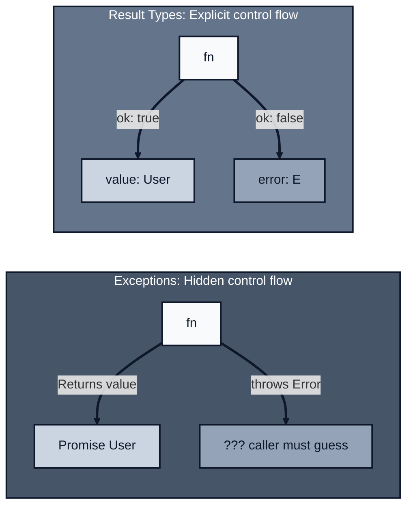
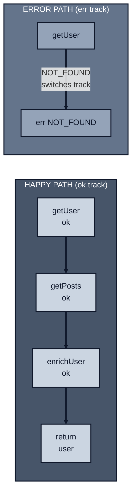
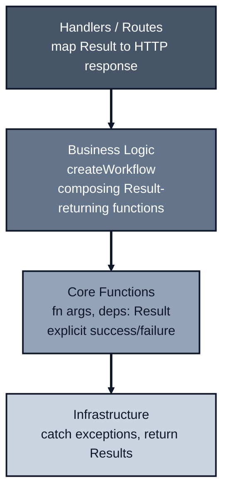

*Previously: [Validation at the Boundary](./validation). We learned to guard against bad input. But what about operations that fail?*

---

Look at this function:

```typescript
async function getUser(
  args: { userId: string },
  deps: GetUserDeps
): Promise<User> {
  const user = await deps.db.findUser(args.userId);
  if (!user) throw new Error('User not found');
  return user;
}
```

What can fail here?

If you look at the signature (`Promise<User>`) you'd think it always returns a user. But it doesn't. It might throw "User not found". It might throw a database error. The signature lies.

You only discover the truth by reading the implementation. Or worse, by deploying to production and watching it crash.

---

## The Problem With Throw

Exceptions have three problems in a `fn(args, deps)` architecture:

### 1. Throws Are Invisible

```typescript
async function processOrder(args, deps): Promise<Order> {
  const user = await deps.userService.getUser({ userId: args.userId });
  const inventory = await deps.inventory.check({ productId: args.productId });
  const payment = await deps.payments.charge({ amount: args.total });
  // ... more steps
}
```

Which of these might fail? All of them? Some of them? What errors can they produce?

You can't tell from the code. The only way to know is to chase down every function and read its implementation. And hope they don't call other functions that throw.

It's Friday afternoon. Production is failing. The error log says `Error: User not found`. You search the codebase: 47 places throw that exact message. Which one is it? The stack trace points to `processOrder` line 3, but that's the `getUser` call. You need to find which *internal* path threw. You spend 20 minutes reading code before finding the culprit.

### 2. Throws Bypass Composition

We've worked hard to make our functions composable. Clean deps, validated args. But exceptions break that.

```typescript
// You want a linear flow
getUser → validateUser → enrichUser → saveUser

// Reality: either errors bubble up until a big handler catches everything
// (losing granularity), or you scatter try/catch to translate exceptions
async function processUser(args, deps) {
  try {
    const user = await getUser(args, deps);
    const validated = await validateUser(user, deps);
    const enriched = await enrichUser(validated, deps);
    return await saveUser(enriched, deps);
  } catch (error) {
    // Which step failed? Was it recoverable? Who knows.
    logger.error('processUser failed', { error });
    throw error;
  }
}
```

You're not composing functions anymore. You're composing error handling.

### 3. Throws Conflate Different Failures

When `getUser` throws, what happened?

- User doesn't exist? (Expected, recoverable)
- Database connection failed? (Infrastructure, maybe retry)
- SQL syntax error? (Bug, should crash)

They're all just `Error`. You have to inspect the message string or check `instanceof`, and hope the implementation is consistent.

Your handler catches all exceptions and returns HTTP 500. But "user not found" isn't a server error -it's a 404. So you add string matching:

```typescript
catch (error) {
  if (error.message.includes('not found')) return res.status(404);
  if (error.message.includes('unauthorized')) return res.status(401);
  return res.status(500);
}
```

Months later, someone changes "not found" to "does not exist". Your 404s become 500s. String matching on error messages is fragile. But with exceptions, it's all you have.

**This is why we never match on message strings.** Typed errors solve this.

---

## Return Values Instead

What if functions communicated failure through their return type?

```typescript
async function getUser(
  args: { userId: string },
  deps: GetUserDeps
): Promise<Result<User, 'NOT_FOUND' | 'DB_ERROR'>> {
  //...
}
```

Now the signature tells the truth:

- Success: you get a `User`
- Failure: either `'NOT_FOUND'` or `'DB_ERROR'`

No surprises. No hidden control flow. The type system documents what can go wrong.

Months later, someone adds a new error case: `'RATE_LIMITED'`. The type changes to `'NOT_FOUND' | 'DB_ERROR' | 'RATE_LIMITED'`. Every `switch` statement that handles these errors gets a TypeScript error: "Property 'RATE_LIMITED' is not handled." You can't forget to handle the new case. The compiler finds every call site.



---

## The Result Type

[awaitly](https://github.com/jagreehal/awaitly) provides a `Result<T, E>` type and utilities:

```typescript
import { ok, err, type Result, type AsyncResult } from 'awaitly';

// Result<T, E> is either success or failure
type Result<T, E> =
  | { ok: true; value: T }
  | { ok: false; error: E };

// AsyncResult<T, E> is just Promise<Result<T, E>>
type AsyncResult<T, E> = Promise<Result<T, E>>;

// UnexpectedError: run() and createWorkflow() wrap uncaught exceptions
// so the pipeline stays typed even when something throws unexpectedly
type UnexpectedError = { type: 'UNEXPECTED'; cause: unknown };
```

Now your functions look like this:

```typescript
async function getUser(
  args: { userId: string },
  deps: GetUserDeps
): Promise<Result<User, 'NOT_FOUND' | 'DB_ERROR'>> {
  try {
    const user = await deps.db.findUser(args.userId);
    if (!user) return err('NOT_FOUND');
    return ok(user);
  } catch {
    return err('DB_ERROR');
  }
}
```

And using them:

```typescript
const result = await getUser({ userId: '123' }, deps);

if (!result.ok) {
  // TypeScript knows result.error is 'NOT_FOUND' | 'DB_ERROR'
  console.log('Failed:', result.error);
  return;
}

// TypeScript knows result.value is User
console.log('Got user:', result.value.name);
```

No hidden throws. The type system enforces that you handle both cases.

---

## "But That's So Verbose!"

I hear you. Look at this:

```typescript
const userResult = await getUser({ userId }, deps);
if (!userResult.ok) return userResult;

const postsResult = await getPosts({ userId: userResult.value.id }, deps);
if (!postsResult.ok) return postsResult;

const enrichedResult = await enrichUser({ user: userResult.value, posts: postsResult.value }, deps);
if (!enrichedResult.ok) return enrichedResult;

return ok({ user: enrichedResult.value });
```

Every step requires checking `.ok` and early returning on error. This is the "if err != nil" problem from Go.

Can we do better?

---

## Composing Results

Here's where [awaitly](https://github.com/jagreehal/awaitly) comes in. It gives you workflow-style composition that looks almost like regular async code.

### `run()` — the default for multi-step flows

Use `run()` for most multi-step flows. It keeps code flat, readable, and exits early on the first error:

```typescript
import { run } from 'awaitly';

const result = await run(async (step) => {
  const user = await step(() => getUser({ userId }, deps));
  const posts = await step(() => getPosts({ userId: user.id }, deps));
  const enriched = await step(() => enrichUser({ user, posts }, deps));
  return { user: enriched };
});
```

No manual `if (!result.ok)` checks. The `step()` function:

- Unwraps the Result if it's `ok`, giving you the value
- Short-circuits the whole workflow if it's an error
- No manual `if (!result.ok) return` checks needed

This is called "railway-oriented programming". Your data travels along the happy track, and errors automatically switch to the error track.



### `createWorkflow()` — reusable flows with automatic error inference

When a flow becomes a reusable unit, name it with `createWorkflow()`. You get automatic error union inference from declared dependencies:

```typescript
import { createWorkflow } from 'awaitly/workflow';

// Declare dependencies → error union computed automatically
const loadUserData = createWorkflow({ getUser, getPosts, enrichUser });

const result = await loadUserData(async (step) => {
  const user = await step(() => getUser({ userId }, deps));
  const posts = await step(() => getPosts({ userId: user.id }, deps));
  const enriched = await step(() => enrichUser({ user, posts }, deps));
  return { user: enriched };
});

// result: Result<{ user: EnrichedUser }, 'NOT_FOUND' | 'DB_ERROR' | 'FETCH_ERROR' | 'ENRICHMENT_FAILED' | UnexpectedError>
```

**When to use which:**

| Situation | Use |
| --- | --- |
| One-off multi-step flow | `run()` |
| Reusable workflow | `createWorkflow()` |
| Need step caching or resume | `createWorkflow()` |
| Want automatic error inference | `createWorkflow()` |

---

## Handling Throwing Code

What about code that throws? Like `JSON.parse` or third-party libraries?

This is the real world. You've built a clean system of Results, but you still have to interact with code that throws: built-in functions, npm packages, legacy code. You need a **bridge** between the messy world of exceptions and your clean world of Results.

That's what `step.try()` is for:

```typescript
import { createWorkflow } from 'awaitly/workflow';

const workflow = createWorkflow({ getUser });

const result = await workflow(async (step) => {
  // Result-returning function: use step()
  const user = await step(() => getUser({ userId }, deps));

  // Throwing function: use step.try() with error mapping
  const config = await step.try(
    () => JSON.parse(user.configJson),
    { error: 'INVALID_CONFIG' as const }
  );

  return { user, config };
});
```

The key difference:

- `step()` is for functions that already return `Result<T, E>` (your code)
- `step.try()` is for functions that throw (their code)

`step.try()` catches exceptions, maps them to your error type, and converts them to Results. It's the entry point where messy throwing code enters your clean Result pipeline. The required `error` parameter makes you think about how to categorize the failure—though you'll want to be specific enough to preserve meaningful information.

**Connection to TypeScript Config:** Note that `JSON.parse` returns `any` by default, which bypasses your type checking. With [@total-typescript/ts-reset](./typescript-config), it returns `unknown` instead—forcing you to validate the result (typically with Zod). This pairs well with `step.try()`: the wrapper handles exceptions, and `ts-reset` + Zod handle type safety.

**For Result-returning functions:** Use `step.fromResult()` to preserve typed errors:

```typescript
// callProvider returns Result<Response, ProviderError>
const callProvider = async (input: string): AsyncResult<Response, ProviderError> => { ... };

const response = await step.fromResult(
  () => callProvider(input),
  {
    onError: (e) => ({
      type: 'PROVIDER_FAILED' as const,
      provider: e.provider,  // TypeScript knows e is ProviderError
      code: e.code,
    })
  }
);
```

### Outside Workflows: from, fromPromise, tryAsync

Inside workflows, use `step.try()`. Outside workflows, use these standalone utilities:

```typescript
import { from, fromPromise, tryAsync } from 'awaitly';

// Wrap sync throwing code
const parsed = from(() => JSON.parse(jsonString));
// Result<unknown, Error>

// Wrap async throwing code
const response = await fromPromise(fetch('/api/data'));
// Result<Response, Error>

// Wrap with custom error mapping
const data = await tryAsync(
  () => fetch('/api').then(r => r.json()),
  (thrown) => ({ type: 'FETCH_FAILED' as const, cause: thrown })
);
// Result<unknown, { type: 'FETCH_FAILED'; cause: unknown }>
```

---

## The Day-to-Day Toolkit

You've got `run()` for composition and `step.try()` for bridging throws. Here are the remaining helpers teams actually use:

### 1. `match()` — handle at boundaries

Pattern match on ok/err without manual if-checks:

```typescript
import { match } from 'awaitly';

const message = match(result, {
  ok: (user) => `Hello, ${user.name}!`,
  err: (error) => `Failed: ${error}`,
});
```

For TaggedErrors, use `TaggedError.match()` for exhaustive handling (covered in [TaggedError Classes](#taggederror-classes-recommended)).

### 2. `mapError()` — translate errors at seams

When crossing module boundaries, translate internal errors to domain errors. The most common seams are infra → domain and domain → HTTP:

```typescript
import { mapError } from 'awaitly';

// Infra → Domain: DB errors become DependencyFailed
const domainResult = mapError(dbResult, (dbError) =>
  new DependencyFailed({ service: 'database', retryable: true, cause: dbError })
);
```

### 3. `allAsync()` — parallel fan-out

Run operations in parallel inside workflows:

```typescript
import { allAsync } from 'awaitly';

const result = await run(async (step) => {
  const [user, posts, settings] = await step(() => allAsync([
    getUser({ userId }, deps),
    getPosts({ userId }, deps),
    getSettings({ userId }, deps),
  ]));
  return { user, posts, settings };
});
```

### 4. Type helpers

Extract error types for handler signatures:

```typescript
import type { ErrorOf, Errors } from 'awaitly';

type UserError = ErrorOf<typeof getUser>;  // 'NOT_FOUND' | 'DB_ERROR'
type AllErrors = Errors<[typeof getUser, typeof getPosts]>;
```

**That's the toolkit.** awaitly also provides `andThen`, `map`, and other utilities, but default to `run()` for anything multi-step.

---

## Error Types That Make Sense

Here are patterns for defining errors, from simplest to most powerful:

> **Default: TaggedError.** Use it for most production code—you get stack traces, pattern matching, and context. Use string literals for small apps or quick prototypes where you don't need rich error information.

### String Literals (Simple)

```typescript
type AppError = 'NOT_FOUND' | 'UNAUTHORIZED' | 'DB_ERROR';

async function getUser(args, deps): Promise<Result<User, 'NOT_FOUND' | 'DB_ERROR'>> {
  // ...
}
```

Simple, readable, works great for exhaustive switches.

### Discriminated Unions (Rich)

```typescript
type AppError =
  | { type: 'NOT_FOUND'; resource: string }
  | { type: 'VALIDATION'; field: string; message: string }
  | { type: 'DB_ERROR'; query: string };
```

When you need to carry extra information with the error.

### Const Objects (Runtime + Type)

```typescript
const Errors = {
  NOT_FOUND: 'NOT_FOUND',
  DB_ERROR: 'DB_ERROR',
} as const;

type AppError = (typeof Errors)[keyof typeof Errors];

// Now you can use Errors.NOT_FOUND at runtime
return err(Errors.NOT_FOUND);
```

### TaggedError Classes (Recommended)

For richer errors with proper stack traces and pattern matching, [awaitly](https://github.com/jagreehal/awaitly) provides `TaggedError`:

```typescript
import { TaggedError, ok, err, type AsyncResult } from 'awaitly';

// Define error classes with typed props
class UserNotFound extends TaggedError("UserNotFound")<{
  userId: string;
}> {}

class InsufficientFunds extends TaggedError("InsufficientFunds", {
  message: (p: { required: number; available: number }) =>
    `Need ${p.required}, have ${p.available}`,
})<{ required: number; available: number }> {}

class DependencyFailed extends TaggedError("DependencyFailed")<{
  service: string;
  retryable: boolean;
  cause?: unknown;
}> {}

// Create instances with type-safe props
const error = new UserNotFound({ userId: "123" });
error._tag;    // "UserNotFound"
error.userId;  // "123"
error.message; // "UserNotFound"

// They're real Error instances
error instanceof Error; // true
```

**Why TaggedError over plain objects:**

- **Real stack traces**: Unlike `{ type: 'NOT_FOUND' }`, you get proper debugging
- **Automatic discrimination**: The `_tag` property enables exhaustive matching
- **Custom messages**: Define message templates from props
- **Error chaining**: Pass `cause` to preserve the original error
- **instanceof works**: Use familiar error handling patterns

**Pattern matching** replaces verbose switch statements:

```typescript
type TransferError = UserNotFound | InsufficientFunds | DependencyFailed;

// Exhaustive matching - TypeScript ensures all cases handled
const message = TaggedError.match(error, {
  UserNotFound: (e) => `User ${e.userId} not found`,
  InsufficientFunds: (e) => `Need ${e.required}, have ${e.available}`,
  DependencyFailed: (e) => `${e.service} unavailable`,
});

// Partial matching with fallback
const userMessage = TaggedError.matchPartial(
  error,
  { InsufficientFunds: (e) => `Add ${e.required - e.available} more` },
  (e) => `Operation failed: ${e.message}`
);
```

**In workflows**, TaggedErrors compose naturally:

```typescript
async function fetchUser(userId: string): AsyncResult<User, UserNotFound | DependencyFailed> {
  if (userId === "404") {
    return err(new UserNotFound({ userId }));
  }
  return ok({ id: userId, name: "Test User" });
}

const result = await workflow(async (step) => {
  const user = await step(() => fetchUser(args.userId));

  if (balance.available < args.amount) {
    return err(new InsufficientFunds({
      required: args.amount,
      available: balance.available,
    }));
  }

  return ok({ user, balance });
});
```

**API handlers** become clean with pattern matching:

```typescript
if (!result.ok) {
  return TaggedError.match(result.error, {
    UserNotFound: (e) => json(404, { error: "User not found", userId: e.userId }),
    InsufficientFunds: (e) => json(400, { error: "Insufficient funds", ...e }),
    DependencyFailed: (e) => e.retryable
      ? json(503, { error: "Service unavailable", retryAfter: 30 })
      : json(500, { error: "Internal error" }),
  });
}
```

---

## Combining Errors Automatically

When composing functions, error types accumulate automatically:

```typescript
// getUser returns Result<User, 'NOT_FOUND' | 'DB_ERROR'>
// getPosts returns Result<Post[], 'FETCH_ERROR'>
// enrichUser returns Result<EnrichedUser, 'ENRICHMENT_FAILED'>

const loadUserData = createWorkflow({ getUser, getPosts, enrichUser });

const result = await loadUserData(async (step) => {
  const user = await step(() => getUser({ userId }, deps));
  const posts = await step(() => getPosts({ userId: user.id }, deps));
  const enriched = await step(() => enrichUser({ user, posts }, deps));

  return enriched;
});

// result: Result<EnrichedUser, 'NOT_FOUND' | 'DB_ERROR' | 'FETCH_ERROR' | 'ENRICHMENT_FAILED' | UnexpectedError>
```

TypeScript collects all possible errors in the common case. The compiler helps ensure call sites handle each error type.

---

## Error Grouping at Scale

As applications grow, error unions become unwieldy:

```typescript
// This becomes a "Type Wall"
type AllErrors =
  | 'NOT_FOUND'
  | 'DB_ERROR'
  | 'DB_CONNECTION_FAILED'
  | 'DB_TIMEOUT'
  | 'FETCH_ERROR'
  | 'HTTP_TIMEOUT'
  | 'RATE_LIMITED'
  | 'CIRCUIT_OPEN'
  | 'VALIDATION_FAILED'
  // ... 20 more errors
```

Your HTTP handler's `switch` statement becomes massive. But you don't actually need that granularity at every layer.

**Solution: Namespace errors at boundaries.** Keep detailed errors in your core logic (for tracing), but collapse them to categories at the HTTP layer:

```typescript
// Detailed errors for tracing (internal)
type InfrastructureError =
  | { type: 'INFRA_ERROR'; cause: 'DB_CONNECTION' | 'DB_TIMEOUT' | 'HTTP_TIMEOUT' | 'RATE_LIMITED' }
  | { type: 'CIRCUIT_OPEN'; service: string };

// At the boundary, collapse to categories
function collapseToHttpError(error: DetailedError): HttpError {
  switch (error.type) {
    case 'NOT_FOUND':
      return { status: 404, message: 'Resource not found' };
    case 'VALIDATION_FAILED':
      return { status: 400, message: error.message };
    case 'INFRA_ERROR':
    case 'CIRCUIT_OPEN':
      // All infrastructure errors → 503
      // But the original error is still in your traces (Post 5)
      return { status: 503, message: 'Service temporarily unavailable' };
  }
}
```

**The principle:** Preserve detail for observability ([OpenTelemetry](./opentelemetry) records the specific `DB_TIMEOUT`), but simplify for API consumers. Your traces show exactly what failed; your API returns clean categories.

---

**What about transient failures?** Database connections dropping, HTTP timeouts, service hiccups? Those deserve their own treatment. We'll cover retry and timeout patterns in [Resilience Patterns](./resilience).

---

## When Throwing Is Still Right

"Never throw" is too strong. Throw when:

- **Invariant violation.** Programmer error, impossible state.
- **Corrupted process state.** Can't recover meaningfully.
- **Truly unrecoverable.** The only option is to crash.

```typescript
// Good: throw for impossible states
if (!user) throw new Error('Unreachable: user should exist after insert');

// Good: throw for corrupted state
if (balance < 0) throw new Error('Invariant violated: negative balance');
```

**Better: Use `asserts` for invariant violations.** TypeScript's `asserts` keyword provides type narrowing after the check:

```typescript
function assertUser(user: User | null): asserts user is User {
  if (!user) {
    throw new Error('Invariant violated: user must exist');
  }
}

async function updateUser(args: { userId: string }, deps: Deps) {
  const user = await deps.db.findUser(args.userId);

  // After this line, TypeScript knows user is User (not null)
  assertUser(user);

  // No null check needed - TypeScript narrowed the type
  return deps.db.update({ id: user.id, name: args.name });
}
```

**Why `asserts` over plain `throw`:**

- Type narrowing: TypeScript understands the state after the assertion
- Self-documenting: The function signature declares the invariant
- Reusable: Define assertions once, use everywhere
- IDE support: Better autocomplete and error messages

```typescript
// Common assertion patterns
function assertNonNegative(n: number): asserts n is number {
  if (n < 0) throw new Error(`Expected non-negative, got ${n}`);
}

function assertNonEmpty<T>(arr: T[]): asserts arr is [T, ...T[]] {
  if (arr.length === 0) throw new Error('Expected non-empty array');
}
```

**Rule of thumb:**

| Situation | Use |
| --------- | --- |
| Domain failure (not found, validation) | Result |
| Infrastructure failure you can recover from | Result |
| Programmer error | throw |
| Corrupted state | throw |

---

## The Layering

Your architecture now looks like this:



Exceptions bubble up from infrastructure, get caught and converted to Results, and flow through your business logic explicitly.

---

## Mapping Results to HTTP

With TaggedError, use `TaggedError.match()` for clean, exhaustive handling:

```typescript
app.get('/users/:id', async (req, res) => {
  const result = await getUserWithPosts(async (step) => {
    const user = await step(() => getUser({ userId: req.params.id }, deps));
    const posts = await step(() => getPosts({ userId: user.id }, deps));
    return { user, posts };
  });

  if (!result.ok) {
    return TaggedError.match(result.error, {
      UserNotFound: (e) => res.status(404).json({
        error: 'User not found',
        userId: e.userId
      }),
      DbError: (e) => res.status(500).json({
        error: 'Database error',
        operation: e.operation
      }),
      FetchError: (e) => res.status(500).json({
        error: 'Fetch failed',
        resource: e.resource
      }),
    });
  }

  return res.json(result.value);
});
```

**For simple string errors**, a lookup table works:

```typescript
const errorToStatus: Record<string, number> = {
  NOT_FOUND: 404,
  UNAUTHORIZED: 401,
  VALIDATION_FAILED: 400,
};

app.get('/users/:id', async (req, res) => {
  const result = await getUser({ userId: req.params.id }, deps);

  if (!result.ok) {
    const status = errorToStatus[result.error] ?? 500;
    return res.status(status).json({ error: result.error });
  }

  return res.json(result.value);
});
```

The key: **your domain errors stay clean, and the boundary layer owns the translation.**

---

## Full Example

*Already got it? Skip to [The Rules](#the-rules).*

Using TaggedError for the cleanest DX:

```typescript
import { TaggedError, ok, err, type AsyncResult } from 'awaitly';
import { createWorkflow } from 'awaitly/workflow';

// Define errors with context
class UserNotFound extends TaggedError('UserNotFound')<{ userId: string }> {}
class DbError extends TaggedError('DbError')<{ operation: string }> {}
class FetchError extends TaggedError('FetchError')<{ resource: string }> {}

type User = { id: string; name: string; email: string };
type Post = { id: string; title: string };

// Core functions return Results with TaggedErrors
async function getUser(
  args: { userId: string },
  deps: { db: Database }
): AsyncResult<User, UserNotFound | DbError> {
  try {
    const user = await deps.db.findUser(args.userId);
    return user ? ok(user) : err(new UserNotFound({ userId: args.userId }));
  } catch {
    return err(new DbError({ operation: 'findUser' }));
  }
}

async function getPosts(
  args: { userId: string },
  deps: { db: Database }
): AsyncResult<Post[], FetchError> {
  try {
    const posts = await deps.db.findPostsByUser(args.userId);
    return ok(posts);
  } catch {
    return err(new FetchError({ resource: 'posts' }));
  }
}

// Compose with createWorkflow
const getUserWithPosts = createWorkflow({ getUser, getPosts });

// Handler: clean error handling with pattern matching
app.get('/users/:id', async (req, res) => {
  const result = await getUserWithPosts(async (step) => {
    const user = await step(() => getUser({ userId: req.params.id }, deps));
    const posts = await step(() => getPosts({ userId: user.id }, deps));
    return { user, posts };
  });

  if (!result.ok) {
    return TaggedError.match(result.error, {
      UserNotFound: (e) => res.status(404).json({ error: 'User not found', userId: e.userId }),
      DbError: (e) => res.status(500).json({ error: 'Database error', operation: e.operation }),
      FetchError: (e) => res.status(500).json({ error: 'Fetch failed', resource: e.resource }),
    });
  }

  return res.json(result.value);
});
```

**What makes this clean:**
- Errors carry context (userId, operation, resource)
- `TaggedError.match()` is exhaustive - add a new error type and TypeScript errors until you handle it
- No verbose switch statements
- Stack traces work properly for debugging

---

## The Rules

1. **Business functions return Results.** Make failure explicit in the type.
2. **Use `run()` for multi-step operations.** Use `createWorkflow()` when the flow becomes reusable. Avoid `andThen` in application code.
3. **Use TaggedError for rich errors.** Get stack traces, pattern matching, and context.
4. **Use `step.try()` for throwing code.** Bridge exceptions into your Result pipeline.
5. **Use `TaggedError.match()` at boundaries.** Exhaustive, clean error-to-response mapping.
6. **Throw only for impossible states.** Programmer errors, corrupted state.

---

## What's Next

In this chapter we focused on typed failure and composition ergonomics—making your code honest about what can go wrong.

Next, we'll focus on business workflows: retries, timeouts, parallelism, compensation, and rollback. What happens when step 2 of 5 fails? How do you undo what already succeeded?

---

*Next: [Composing Workflows](./workflows). Orchestrating multi-step operations with reliability patterns and automatic rollback.*
