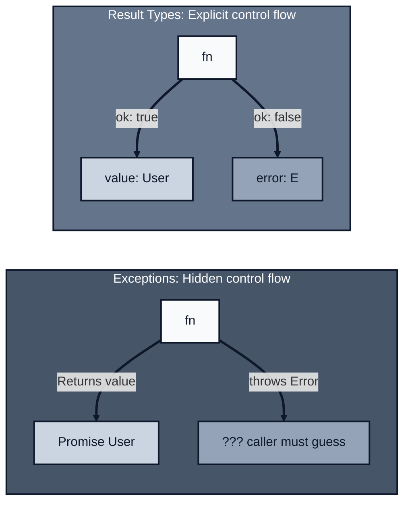
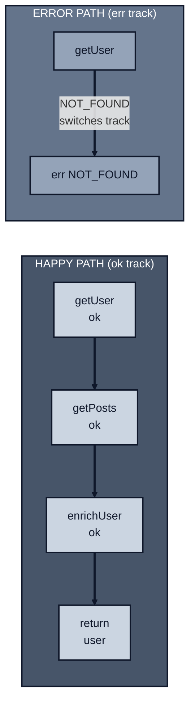
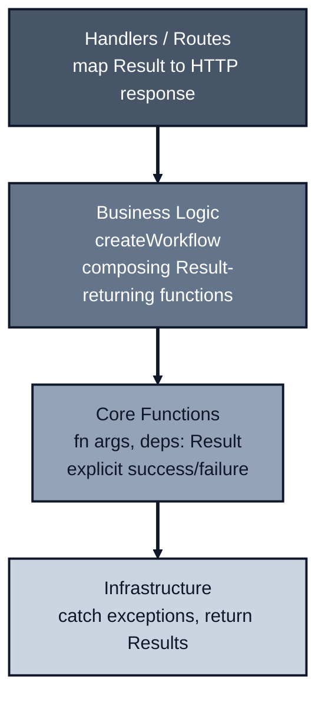

*Previously: [Validation at the Boundary](/patterns/validation). We learned to guard against bad input. But what about operations that fail?*

---

Look at this function:

```typescript
async function getUser(
  args: { userId: string },
  deps: GetUserDeps
): Promise<User> {
  const user = await deps.db.findUser(args.userId);
  if (!user) throw new Error('User not found');
  return user;
}
```

What can fail here?

If you look at the signature (`Promise<User>`) you'd think it always returns a user. But it doesn't. It might throw "User not found". It might throw a database error. The signature lies.

You only discover the lies by reading the implementation. Or worse, by deploying to production and watching it crash.

---

## The Problem With Throw

Exceptions have three problems in a `fn(args, deps)` architecture:

### 1. Throws Are Invisible

```typescript
async function processOrder(args, deps): Promise<Order> {
  const user = await deps.userService.getUser({ userId: args.userId });
  const inventory = await deps.inventory.check({ productId: args.productId });
  const payment = await deps.payments.charge({ amount: args.total });
  // ... more steps
}
```

Which of these might fail? All of them? Some of them? What errors can they produce?

You can't tell from the code. The only way to know is to chase down every function and read its implementation. And hope they don't call other functions that throw.

It's Friday afternoon. Production is failing. The error log says `Error: User not found`. You search the codebase: 47 places throw that exact message. Which one is it? The stack trace points to `processOrder` line 3, but that's the `getUser` call—you need to find which *internal* path threw. You spend 20 minutes reading code before finding the culprit.

### 2. Throws Bypass Composition

We've worked hard to make our functions composable. Clean deps, validated args. But exceptions break that.

```typescript
// You want a linear flow
getUser → validateUser → enrichUser → saveUser

// But with exceptions, you need try/catch everywhere
try {
  const user = await getUser(args, deps);
  try {
    const validated = await validateUser(user, deps);
    try {
      const enriched = await enrichUser(validated, deps);
      // ...
```

You're not composing functions anymore. You're composing error handling.

### 3. Throws Conflate Different Failures

When `getUser` throws, what happened?

- User doesn't exist? (Expected, recoverable)
- Database connection failed? (Infrastructure, maybe retry)
- SQL syntax error? (Bug, should crash)

They're all just `Error`. You have to inspect the message string or check `instanceof`, and hope the implementation is consistent.

Your handler catches all exceptions and returns HTTP 500. But "user not found" isn't a server error—it's a 404. So you add string matching:

```typescript
catch (error) {
  if (error.message.includes('not found')) return res.status(404);
  if (error.message.includes('unauthorized')) return res.status(401);
  return res.status(500);
}
```

Months later, someone changes "not found" to "does not exist". Your 404s become 500s. String matching on error messages is fragile. But with exceptions, it's all you have.

---

## Return Values Instead

What if functions communicated failure through their return type?

```typescript
async function getUser(
  args: { userId: string },
  deps: GetUserDeps
): Promise<Result<User, 'NOT_FOUND' | 'DB_ERROR'>> {
  //...
}
```

Now the signature tells the truth:
- Success: you get a `User`
- Failure: either `'NOT_FOUND'` or `'DB_ERROR'`

No surprises. No hidden control flow. The type system documents what can go wrong.

Months later, someone adds a new error case: `'RATE_LIMITED'`. The type changes to `'NOT_FOUND' | 'DB_ERROR' | 'RATE_LIMITED'`. Every `switch` statement that handles these errors gets a TypeScript error: "Property 'RATE_LIMITED' is not handled." You can't forget to handle the new case. The compiler finds every call site.



---

## A Minimal Result Type

You don't need a library. The type is simple:

```typescript
type Result<T, E> =
  | { ok: true; value: T }
  | { ok: false; error: E };

// For async functions, just wrap in Promise
type AsyncResult<T, E> = Promise<Result<T, E>>;

const ok = <T>(value: T): Result<T, never> => ({ ok: true, value });
const err = <E>(error: E): Result<never, E> => ({ ok: false, error });
```

That's it. `Result<T, E>` for sync, `AsyncResult<T, E>` for async. Now your functions look like this:

```typescript
async function getUser(
  args: { userId: string },
  deps: GetUserDeps
): Promise<Result<User, 'NOT_FOUND' | 'DB_ERROR'>> {
  try {
    const user = await deps.db.findUser(args.userId);
    if (!user) return err('NOT_FOUND');
    return ok(user);
  } catch {
    return err('DB_ERROR');
  }
}
```

And using them:

```typescript
const result = await getUser({ userId: '123' }, deps);

if (!result.ok) {
  // TypeScript knows result.error is 'NOT_FOUND' | 'DB_ERROR'
  console.log('Failed:', result.error);
  return;
}

// TypeScript knows result.value is User
console.log('Got user:', result.value.name);
```

No hidden throws. The type system enforces that you handle both cases.

---

## "But That's So Verbose!"

I hear you. Look at this:

```typescript
const userResult = await getUser({ userId }, deps);
if (!userResult.ok) return userResult;

const postsResult = await getPosts({ userId: userResult.value.id }, deps);
if (!postsResult.ok) return postsResult;

const enrichedResult = await enrichUser({ user: userResult.value, posts: postsResult.value }, deps);
if (!enrichedResult.ok) return enrichedResult;

return ok({ user: enrichedResult.value });
```

Every step requires checking `.ok` and early returning on error. This is the "if err != nil" problem from Go.

Can we do better?

---

## The Workflow Pattern

Here's where [@jagreehal/workflow](https://github.com/jagreehal/workflow) comes in. It gives you a way to compose Results that looks almost like regular async code:

```typescript
import { createWorkflow, ok, err } from '@jagreehal/workflow';

// Declare dependencies → error union computed automatically
const loadUserData = createWorkflow({ getUser, getPosts, enrichUser });

const result = await loadUserData(async (step) => {
  const user = await step(() => getUser({ userId }, deps));
  const posts = await step(() => getPosts({ userId: user.id }, deps));
  const enriched = await step(() => enrichUser({ user, posts }, deps));

  return { user: enriched };
});
```

Look at that. No manual `if (!result.ok)` checks. The `step()` function:
- Unwraps the Result if it's `ok`, giving you the value
- Short-circuits the whole workflow if it's an error

The return type is automatically inferred as the union of all possible errors:

```typescript
// result: Result<{ user: EnrichedUser }, 'NOT_FOUND' | 'DB_ERROR' | 'FETCH_ERROR' | 'ENRICHMENT_FAILED' | UnexpectedError>
```

This is called "railway-oriented programming". Your data travels along the happy track, and errors automatically switch to the error track.



The `step()` function:
- Unwraps `ok` results and continues on the happy path
- On `err`, immediately switches to the error track and skips remaining steps
- No manual `if (!result.ok) return` checks needed

**Alternative:** For dynamic dependencies or one-off workflows, use `run()`:

```typescript
import { run } from '@jagreehal/workflow';

const result = await run<Output, 'NOT_FOUND' | 'DB_ERROR'>(async (step) => {
  const user = await step(() => getUser({ userId }, deps));
  return user;
});
```

---

## Handling Throwing Code

What about code that throws? Like `JSON.parse` or third-party libraries?

This is the real world. You've built a clean system of Results, but you still have to interact with code that throws: built-in functions, npm packages, legacy code. You need a **bridge** between the messy world of exceptions and your clean world of Results.

That's what `step.try()` is for:

```typescript
const workflow = createWorkflow({ getUser });

const result = await workflow(async (step) => {
  // Result-returning function: use step()
  const user = await step(() => getUser({ userId }, deps));

  // Throwing function: use step.try() with error mapping
  const config = await step.try(
    () => JSON.parse(user.configJson),
    { error: 'INVALID_CONFIG' as const }
  );

  return { user, config };
});
```

The key difference:
- `step()` is for functions that already return `Result<T, E>` (your code)
- `step.try()` is for functions that throw (their code)

`step.try()` catches exceptions, maps them to your error type, and converts them to Results. It's the entry point where messy throwing code enters your clean Result pipeline. You're *forced* to provide `error`, so you can't accidentally ignore failures.

**Connection to TypeScript Config:** Even with `step.try()`, there's a subtle problem: `JSON.parse` returns `any`. That `any` bypasses all your careful type checking.

```typescript
// Without ts-reset: parsed is `any` - no validation enforced
const config = await step.try(
  () => JSON.parse(user.configJson),  // Returns any!
  { error: 'INVALID_CONFIG' as const }
);
config.whatever.you.want;  // No error, but will crash at runtime
```

When you install [@total-typescript/ts-reset](/patterns/typescript-config), `JSON.parse` returns `unknown` instead. Now TypeScript *forces* you to validate:

```typescript
// With ts-reset: parsed is `unknown` - validation required
const config = await step.try(
  () => {
    const parsed = JSON.parse(user.configJson);  // Returns unknown
    return ConfigSchema.parse(parsed);            // Zod validates
  },
  { error: 'INVALID_CONFIG' as const }
);
// config is now fully typed via Zod schema
```

This creates a complete safety chain: `step.try()` handles the exception, `ts-reset` forces validation, and Zod provides the types. See [TypeScript Config](/patterns/typescript-config) for setup.

**For Result-returning functions:** Use `step.fromResult()` to preserve typed errors:

```typescript
// callProvider returns Result<Response, ProviderError>
const callProvider = async (input: string): AsyncResult<Response, ProviderError> => { ... };

const response = await step.fromResult(
  () => callProvider(input),
  {
    onError: (e) => ({
      type: 'PROVIDER_FAILED' as const,
      provider: e.provider,  // TypeScript knows e is ProviderError
      code: e.code,
    })
  }
);
```

---

## Error Types That Make Sense

Here are a few patterns for defining errors:

### String Literals (Simple)

```typescript
type AppError = 'NOT_FOUND' | 'UNAUTHORIZED' | 'DB_ERROR';

async function getUser(args, deps): Promise<Result<User, 'NOT_FOUND' | 'DB_ERROR'>> {
  // ...
}
```

Simple, readable, works great for exhaustive switches.

### Discriminated Unions (Rich)

```typescript
type AppError =
  | { type: 'NOT_FOUND'; resource: string }
  | { type: 'VALIDATION'; field: string; message: string }
  | { type: 'DB_ERROR'; query: string };
```

When you need to carry extra information with the error.

### Const Objects (Runtime + Type)

```typescript
const Errors = {
  NOT_FOUND: 'NOT_FOUND',
  DB_ERROR: 'DB_ERROR',
} as const;

type AppError = (typeof Errors)[keyof typeof Errors];

// Now you can use Errors.NOT_FOUND at runtime
return err(Errors.NOT_FOUND);
```

---

## Combining Errors Automatically

When composing functions, error types accumulate automatically:

```typescript
// getUser returns Result<User, 'NOT_FOUND' | 'DB_ERROR'>
// getPosts returns Result<Post[], 'FETCH_ERROR'>
// enrichUser returns Result<EnrichedUser, 'ENRICHMENT_FAILED'>

const loadUserData = createWorkflow({ getUser, getPosts, enrichUser });

const result = await loadUserData(async (step) => {
  const user = await step(() => getUser({ userId }, deps));
  const posts = await step(() => getPosts({ userId: user.id }, deps));
  const enriched = await step(() => enrichUser({ user, posts }, deps));

  return enriched;
});

// result: Result<EnrichedUser, 'NOT_FOUND' | 'DB_ERROR' | 'FETCH_ERROR' | 'ENRICHMENT_FAILED' | UnexpectedError>
```

TypeScript collects all possible errors automatically. You get exhaustive error handling for free.

---

## Error Grouping at Scale

As applications grow, error unions become unwieldy:

```typescript
// This becomes a "Type Wall"
type AllErrors =
  | 'NOT_FOUND'
  | 'DB_ERROR'
  | 'DB_CONNECTION_FAILED'
  | 'DB_TIMEOUT'
  | 'FETCH_ERROR'
  | 'HTTP_TIMEOUT'
  | 'RATE_LIMITED'
  | 'CIRCUIT_OPEN'
  | 'VALIDATION_FAILED'
  // ... 20 more errors
```

Your HTTP handler's `switch` statement becomes massive. But you don't actually need that granularity at every layer.

**Solution: Namespace errors at boundaries.** Keep detailed errors in your core logic (for tracing), but collapse them to categories at the HTTP layer:

```typescript
// Detailed errors for tracing (internal)
type InfrastructureError =
  | { type: 'INFRA_ERROR'; cause: 'DB_CONNECTION' | 'DB_TIMEOUT' | 'HTTP_TIMEOUT' | 'RATE_LIMITED' }
  | { type: 'CIRCUIT_OPEN'; service: string };

// At the boundary, collapse to categories
function collapseToHttpError(error: DetailedError): HttpError {
  switch (error.type) {
    case 'NOT_FOUND':
      return { status: 404, message: 'Resource not found' };
    case 'VALIDATION_FAILED':
      return { status: 400, message: error.message };
    case 'INFRA_ERROR':
    case 'CIRCUIT_OPEN':
      // All infrastructure errors → 503
      // But the original error is still in your traces (Post 5)
      return { status: 503, message: 'Service temporarily unavailable' };
  }
}
```

**The principle:** Preserve detail for observability ([OpenTelemetry](/patterns/opentelemetry) records the specific `DB_TIMEOUT`), but simplify for API consumers. Your traces show exactly what failed; your API returns clean categories.

---

**What about transient failures?** Database connections dropping, HTTP timeouts, service hiccups? Those deserve their own treatment. We'll cover retry and timeout patterns in [Resilience Patterns](/patterns/resilience).

---

## When Throwing Is Still Right

"Never throw" is too strong. Throw when:

- **Invariant violation.** Programmer error, impossible state.
- **Corrupted process state.** Can't recover meaningfully.
- **Truly unrecoverable.** The only option is to crash.

```typescript
// Good: throw for impossible states
if (!user) throw new Error('Unreachable: user should exist after insert');

// Good: throw for corrupted state
if (balance < 0) throw new Error('Invariant violated: negative balance');
```

**Better: Use `asserts` for invariant violations.** TypeScript's `asserts` keyword provides type narrowing after the check:

```typescript
function assertUser(user: User | null): asserts user is User {
  if (!user) {
    throw new Error('Invariant violated: user must exist');
  }
}

async function updateUser(args: { userId: string }, deps: Deps) {
  const user = await deps.db.findUser(args.userId);

  // After this line, TypeScript knows user is User (not null)
  assertUser(user);

  // No null check needed - TypeScript narrowed the type
  return deps.db.update({ id: user.id, name: args.name });
}
```

**Why `asserts` over plain `throw`:**

- Type narrowing: TypeScript understands the state after the assertion
- Self-documenting: The function signature declares the invariant
- Reusable: Define assertions once, use everywhere
- IDE support: Better autocomplete and error messages

```typescript
// Common assertion patterns
function assertNonNegative(n: number): asserts n is number {
  if (n < 0) throw new Error(`Expected non-negative, got ${n}`);
}

function assertNonEmpty<T>(arr: T[]): asserts arr is [T, ...T[]] {
  if (arr.length === 0) throw new Error('Expected non-empty array');
}
```

**Rule of thumb:**

| Situation | Use |
|-----------|-----|
| Domain failure (not found, validation) | Result |
| Infrastructure failure you can recover from | Result |
| Programmer error | throw |
| Corrupted state | throw |

---

## The Layering

Your architecture now looks like this:



Exceptions bubble up from infrastructure, get caught and converted to Results, and flow through your business logic explicitly.

---

## Mapping Results to HTTP

The handler layer translates Results to HTTP responses. Here's a reusable pattern:

```typescript
// A standard error response shape
type ErrorResponse = { error: string; code: string; details?: unknown };

// Map domain errors to HTTP status codes
const errorToStatus: Record<string, number> = {
  NOT_FOUND: 404,
  UNAUTHORIZED: 401,
  FORBIDDEN: 403,
  VALIDATION_FAILED: 400,
  CONFLICT: 409,
  // Default to 500 for unknown errors
};

function resultToResponse<T, E extends string>(
  result: Result<T, E>,
  res: Response
): Response {
  if (result.ok) {
    return res.status(200).json(result.value);
  }

  const status = errorToStatus[result.error] ?? 500;
  const response: ErrorResponse = {
    error: result.error,
    code: result.error,
  };

  return res.status(status).json(response);
}
```

Now handlers become simple:

```typescript
app.get('/users/:id', async (req, res) => {
  const result = await getUser({ userId: req.params.id }, deps);
  return resultToResponse(result, res);
});
```

For richer errors (discriminated unions), extend the pattern:

```typescript
type RichError =
  | { type: 'NOT_FOUND'; resource: string }
  | { type: 'VALIDATION'; field: string; message: string };

function richErrorToResponse(error: RichError, res: Response): Response {
  switch (error.type) {
    case 'NOT_FOUND':
      return res.status(404).json({ error: `${error.resource} not found` });
    case 'VALIDATION':
      return res.status(400).json({ error: error.message, field: error.field });
  }
}
```

The key: **your domain errors stay clean, and the boundary layer owns the translation.**

---

## Full Example

```typescript
import { createWorkflow, ok, err, type AsyncResult } from '@jagreehal/workflow';

// Types
type User = { id: string; name: string; email: string };
type Post = { id: string; title: string };

// Core functions return Results
async function getUser(
  args: { userId: string },
  deps: { db: Database }
): AsyncResult<User, 'NOT_FOUND' | 'DB_ERROR'> {
  try {
    const user = await deps.db.findUser(args.userId);
    return user ? ok(user) : err('NOT_FOUND');
  } catch {
    return err('DB_ERROR');
  }
}

async function getPosts(
  args: { userId: string },
  deps: { db: Database }
): AsyncResult<Post[], 'FETCH_ERROR'> {
  try {
    const posts = await deps.db.findPostsByUser(args.userId);
    return ok(posts);
  } catch {
    return err('FETCH_ERROR');
  }
}

// Compose with createWorkflow
const getUserWithPosts = createWorkflow({ getUser, getPosts, enrichUser });

// Handler: map Result to HTTP
app.get('/users/:id', async (req, res) => {
  const result = await getUserWithPosts(async (step) => {
    const user = await step(() => getUser({ userId: req.params.id }, deps));
    const posts = await step(() => getPosts({ userId: user.id }, deps));
    const enriched = await step(() => enrichUser({ user, posts }, deps));

    return { user: enriched, posts };
  });

  if (!result.ok) {
    switch (result.error) {
      case 'NOT_FOUND':
        return res.status(404).json({ error: 'User not found' });
      case 'DB_ERROR':
      case 'FETCH_ERROR':
      case 'ENRICHMENT_FAILED':
        return res.status(500).json({ error: 'Internal error' });
      default:
        // UnexpectedError case
        return res.status(500).json({ error: 'Unexpected error' });
    }
  }

  return res.json(result.value);
});
```

The error handling is exhaustive. TypeScript won't let you miss a case.

---

## The Rules

1. **Business functions return Results.** Make failure explicit in the type.
2. **Use createWorkflow() for composition.** Avoid manual if-checks everywhere.
3. **Use step.try() for throwing code.** Catch and map exceptions.
4. **Throw only for impossible states.** Programmer errors, corrupted state.
5. **Map Results to HTTP at the boundary.** The handler decides what errors mean.

---

## What's Next

We've got clean functions, validated input, and explicit error handling. Our code is honest about what can go wrong.

But here's a question: when something *does* go wrong in production, how do you know? When a user reports "it didn't work," how do you trace what happened?

Our functions are clean, but they're opaque. We can't see inside them when they run.

---

*Next: [Functions + OpenTelemetry](/patterns/opentelemetry). Making our functions observable.*

