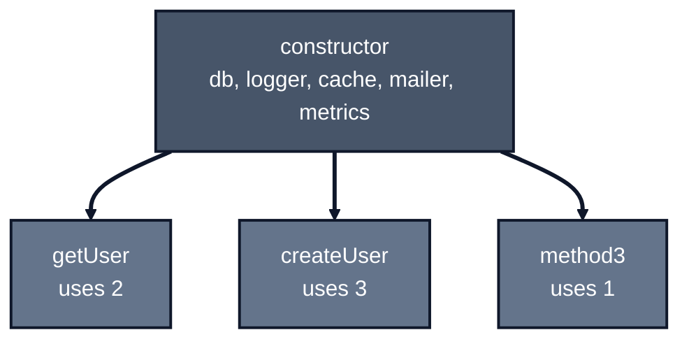
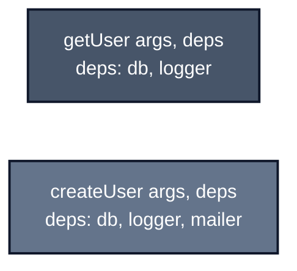
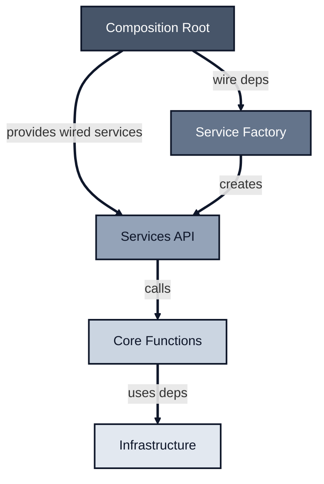
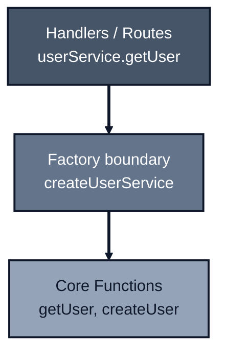

_Previously: [Testing External Infrastructure](../testing-external-services). We covered testing infrastructure you control and infrastructure you don't. Now let's see the pattern that makes everything testable._

I want to talk about dependency injection.

Wait, don't leave. I know "dependency injection" sounds like something from a Java enterprise architecture book from 2005. It sounds complicated.

But here's the thing: you're already doing it. Every time you pass something to a function instead of reaching for a global, that's dependency injection. The question isn't whether to do it. It's _how_.

---

## The Problem With Classes

Let's say you're building a user service. The OOP-trained part of your brain might reach for this:

```typescript
class UserService {
  constructor(
    private db: Database,
    private logger: Logger,
    private cache: Cache,
    private mailer: Mailer,
    private metrics: Metrics,
  ) {}

  async getUser(userId: string): Promise<User | null> {
    this.logger.info(`Getting user ${userId}`);
    return this.db.findUser(userId);
  }

  async createUser(name: string, email: string): Promise<User> {
    const user = { id: crypto.randomUUID(), name, email };
    await this.db.saveUser(user);
    await this.mailer.sendWelcome(user);
    return user;
  }
}
```

This looks fine at first. But something subtle is happening here.

Look at `getUser`. It only needs `db` and `logger`. But to test it, you have to satisfy the _entire_ constructor, including `cache`, `mailer`, and `metrics` that it doesn't use.

A new developer joins. They ask: "What does `getUser` need?" You point to the constructor: five dependencies. They mock all five. The test passes. Two months later, someone adds `this.metrics.increment('user_fetched')` inside `getUser`. The test still passes -but now it's lying. It doesn't verify that metric increment ever happened, because the mock was set up blindly.

As the class grows, the constructor accumulates more and more dependencies. Every method inherits access to everything, whether it needs it or not. You end up with a "god object" where any method might touch any dependency via `this`.

What does `getUser` actually need? You can't tell from its signature. You have to read the implementation.



---

## A Different Shape

What if we wrote functions instead?

```typescript
// Define Args and Deps explicitly (contract-first)
type GetUserArgs = { userId: string };
type GetUserDeps = { db: Database; logger: Logger };

async function getUser(
  args: GetUserArgs,
  deps: GetUserDeps,
): Promise<User | null> {
  deps.logger.info(`Getting user ${args.userId}`);
  return deps.db.findUser(args.userId);
}
```

Now look at that signature. You can see _exactly_ what `getUser` needs:

- `args`: the data for this specific call (`GetUserArgs`)
- `deps`: the infrastructure it relies on (`GetUserDeps`)

A new developer joins. They ask: "What does `getUser` need?" You point to the types: `GetUserArgs` and `GetUserDeps`. If someone adds a new dependency or argument, the type changes. Tests that don't mock it fail to compile. You can't accidentally ignore new dependencies.

No hidden state. No constructor that accumulates junk. The function declares its contract explicitly.

Yes, this is just functions + closures, and that's a feature, not a workaround.

This is the core pattern:

```typescript
fn(args, deps);
```

- **args**: what varies per call (userId, input data)
- **deps**: injected collaborators (database, logger, other functions)



---

## Why This Matters

### 1. Each Function Declares Exactly What It Needs

With classes, the constructor accumulates everything:

```typescript
class UserService {
  constructor(
    private db: Database,
    private logger: Logger,
    private mailer: Mailer, // only createUser needs this
    private cache: Cache, // only someOtherMethod needs this
  ) {}
}
```

With functions, each one declares its own deps:

```typescript
type GetUserDeps = { db: Database; logger: Logger };
type CreateUserDeps = { db: Database; logger: Logger; mailer: Mailer };
```

Look at that. `getUser` doesn't pretend to need `mailer`. The type system documents the truth.

### 2. Testing Gets Simpler

```typescript
import { describe, it, expect } from 'vitest';
import { mock } from 'vitest-mock-extended';
import { getUser, type GetUserDeps } from './get-user';

// Function: pass only what the function needs
it('returns user when found', async () => {
  const mockUser = { id: '123', name: 'Alice', email: 'alice@test.com' };

  const deps = mock<GetUserDeps>();
  deps.db.findUser.mockResolvedValue(mockUser);

  const result = await getUser({ userId: '123' }, deps);
  expect(result).toEqual(mockUser);
});
```

Compare to the class version where you'd have to mock `mailer`, `cache`, and everything else the constructor demands, even though `getUser` doesn't touch them.

### 3. Test Files Stay Focused

I prefer tests next to source files. `notify.ts` gets `notify.test.ts` for unit tests and `notify.int.test.ts` for integration tests. (See [Testing Strategy](../testing) for the full approach.)

With functions, this works naturally:

```
user/
├── get-user.ts
├── get-user.test.ts
├── create-user.ts
├── create-user.test.ts
└── create-user.int.test.ts
```

Each file is small. Each test file covers one function. Easy to navigate, easy to maintain.

With classes, this pattern breaks down:

```
user/
├── user-service.ts        # 10+ methods, growing
└── user-service.test.ts   # One describe per method, massive file
```

That test file becomes a problem:

- **Large files hurt readability.** Scrolling through 500+ lines of tests to find what you need.
- **Maintenance burden grows.** Adding a method means finding the right spot in a sprawling file.
- **Developer experience suffers.** Harder to reason about, harder to review PRs.
- **AI context bloats.** LLMs have to load the entire test file to understand any part of it.

And here's the key insight: **with classes, this is unbounded**. What seems manageable at 3 methods becomes painful at 10 and unworkable at 20. There's no natural stopping point. The class accumulates methods, the test file accumulates describe blocks, and both grow without limit.

With functions, you hit the natural boundary: one function, one file, one test file. Growth means adding new files, not bloating existing ones.

### 4. No Hidden Coupling

In a class, any method can call any other method via `this`:

```typescript
class UserService {
  async createUser(name: string, email: string) {
    const user = await this.db.save({ name, email });
    await this.sendWelcomeEmail(user); // hidden dependency
    await this.updateMetrics('user_created'); // hidden dependency
    return user;
  }

  private sendWelcomeEmail(user: User) {
    /* ... */
  }
  private updateMetrics(event: string) {
    /* ... */
  }
}
```

You're reviewing a PR that changes `sendWelcomeEmail` to require an API key. The PR looks simple: add `apiKey` to the constructor, use it in `sendWelcomeEmail`. But wait -what calls `sendWelcomeEmail`? You grep for it: called from `createUser`, `reactivateUser`, and `inviteUser`. Do all those callers have the context needed for this new API call? You can't tell from the PR. You have to trace through every method that touches `this`.

With functions, collaborators must be explicit:

```typescript
// Args and Deps defined explicitly (contract-first)
type CreateUserArgs = { name: string; email: string };
type CreateUserDeps = {
  db: Database;
  sendWelcomeEmail: SendWelcomeEmail;
  updateMetrics: UpdateMetrics;
};

async function createUser(args: CreateUserArgs, deps: CreateUserDeps) {
  const user = await deps.db.save(args);
  await deps.sendWelcomeEmail({ user });
  await deps.updateMetrics({ event: 'user_created' });
  return user;
}
```

Want to know what `createUser` depends on? Look at its deps type. It's right there.

---

## Wiring It Up

I hear you. Having to pass deps everywhere sounds tedious. Won't your call sites become cluttered with infrastructure?

Here's the trick: you wire deps _once_ at the boundary.

```typescript
// user-service/index.ts
import { getUser, type GetUserDeps } from './functions/get-user';
import { createUser, type CreateUserDeps } from './functions/create-user';

type UserServiceDeps = GetUserDeps & CreateUserDeps;

export function createUserService({ deps }: { deps: UserServiceDeps }) {
  return {
    getUser: ({ userId }: { userId: string }) => getUser({ userId }, deps),
    createUser: ({ name, email }: { name: string; email: string }) =>
      createUser({ name, email }, deps),
  };
}

export type UserService = ReturnType<typeof createUserService>;
```

Now your handlers stay clean:

```typescript
const userService = createUserService({ deps });

await userService.getUser({ userId: '123' });
await userService.createUser({ name: 'Alice', email: 'alice@example.com' });
```

No deps passing at the call site. The factory bound them once.

You get both worlds:

- Functions stay independent (per-function deps)
- Call sites stay clean (factory binds deps)

### Where Does This Live?

The factory gets called in your **Composition Root**, the entry point where you wire everything together. This is typically `main.ts`, `server.ts`, or wherever your app boots:

```typescript
// main.ts (Composition Root)
import { createUserService } from './services/user';
import { createDb } from './infra/db';
import { createLogger } from './infra/logger';

// Create infrastructure once
const db = createDb(process.env.DATABASE_URL);
const logger = createLogger({ level: 'info' });

// Wire deps into services
const deps = { db, logger };
const userService = createUserService({ deps });

// Start your server with wired services
const app = createApp({ userService });
app.listen(3000);
```

The Composition Root is the _only_ place that knows about all dependencies. Your handlers, routes, and business functions don't know how deps were created. They just receive them.



---

## Partial Application

No, you don't have to _thread_ deps through every call site. You only need to _declare_ dependencies explicitly in the implementation.

The core pattern stays:

```typescript
fn(args, deps);
```

But you can always produce a "wired" version:

```typescript
fnWithDeps(deps) -> (args) => fn(args, deps)
```

In other words:

```typescript
fn(deps) -> fn(args) = fn(args, deps)
```

This is commonly known as **partial application**. We keep the core function in the explicit form `fn(args, deps)` and partially apply `deps` at the boundary to produce a cleaner call signature.

### Example: one implementation, many "wired" variants

```typescript
type NotifyArgs = { name: string };
type NotifyDeps = { notify: (name: string) => Promise<void> };

// ✅ Core implementation is explicit and testable
export async function notify(args: NotifyArgs, deps: NotifyDeps) {
  await deps.notify(args.name);
}

// ✅ Boundary wiring: pre-bind deps once, get a clean call signature
export const notifyViaSlack = (deps: NotifyDeps) => (args: NotifyArgs) =>
  notify(args, deps);

export const notifyViaWebhook = (deps: NotifyDeps) => (args: NotifyArgs) =>
  notify(args, deps);
```

Now your application code calls:

```typescript
const notifySlack = notifyViaSlack(slackDeps);
await notifySlack({ name: 'Alice' });
```

But your tests still hit the core function directly:

```typescript
await notify({ name: 'Alice' }, { notify: mockNotify });
```

### Still testable, still injectable

Binding dependencies with partial application doesn't reduce testability or flexibility. It just moves dependency passing from _every call_ to the _composition boundary_.

- **Tests** call the core function directly: `fn(args, deps)`
- **App code** uses a wired function: `fnWithDeps(deps)(args)`
- **Injection** still happens via `deps`: you're simply injecting once instead of repeatedly.

```typescript
// core stays pure-ish and easy to test
await notify({ name: 'Alice' }, { notify: mockNotify });

// app wiring stays ergonomic
const notifySlack = notifyViaSlack(slackDeps);
await notifySlack({ name: 'Alice' });
```

### Why keep the core uncurried?

You can write everything curried, but keeping the implementation in the explicit form (`fn(args, deps)`) tends to produce:

- **clearer stack traces**
- **fewer accidental closures in hot paths**
- **a consistent signature for wrappers** (retry/log/trace/etc.)

So: implement in the explicit form, then use partial application at the boundary to derive ergonomic call shapes. This is a language-level technique, not a framework pattern.

### Optional: a tiny helper (keeps examples tight)

> Use sparingly, mainly at composition boundaries.

```typescript
export const bindDeps =
  <Args, Deps, Out>(fn: (args: Args, deps: Deps) => Out) =>
  (deps: Deps) =>
  (args: Args) =>
    fn(args, deps);

// usage
const notifyViaSlack = bindDeps(notify)(slackDeps);
```

This helper is just a partial application utility. It reinforces that the underlying pattern stays `fn(args, deps)`: we're just binding `deps` once at the boundary.

---

## Design Decisions

### Why `fn(args, deps)` (Not `fn({ args, deps })`)

You might wonder why this pattern uses two parameters instead of a single object like `{ args, deps }`.

This is intentional: **`args` and `deps` have different lifetimes**.

- `args` are per-call data.
- `deps` are long-lived collaborators.

Keeping them separate makes dependency bloat harder to hide, keeps call sites focused on intent, and makes composition easier: bind `deps` once and pass `args` freely.

Different lifetimes deserve different parameters.

> Note: We intentionally avoid currying here. While it works, explicit parameters keep stack traces simpler and avoid unnecessary closures in hot paths.

### Why Not `fn(args, deps, opts)`?

You'll sometimes see people add a third parameter like `fn(args, deps, opts)`. Don't.

"Options" aren't a third category. They always belong to one of the two you already have:

- **Per-call behavior** (e.g. `dryRun`, `sendEmail: false`, `includeDeleted`) → part of the request, belongs in `args`
- **Configuration chosen at wiring time** (feature flags, defaults, limits, environment-specific behavior) → belongs in `deps` as injected config

A third `opts` bag usually becomes a dumping ground that hides domain meaning and makes call sites harder to read.

The rule is simple: **per-call = `args`**, **per-app/per-module = `deps`**. No third bucket.

### What About Context?

You might ask: 'What about request-scoped context like trace IDs, user info, or cancellation signals?'

For **observability context** (trace/span IDs, correlation IDs, baggage, span attributes), you don't need a third parameter. Keep domain functions pure and layer telemetry on top with a wrapper.

```ts
// domain/create-user.ts -pure business logic
// Args and Deps defined explicitly (contract-first)
export type CreateUserArgs = { name: string; email: string };
export type CreateUserDeps = { db: Database };

export async function createUser(args: CreateUserArgs, deps: CreateUserDeps) {
  const user = await deps.db.users.insert(args);
  return user;
}

// app/create-user.traced.ts -observability layer
import { trace } from 'autotel';
import {
  createUser,
  type CreateUserArgs,
  type CreateUserDeps,
} from '../domain/create-user';

export const createUserTraced = trace(
  'user.create',
  async (args: CreateUserArgs, deps: CreateUserDeps) => {
    return createUser(args, deps);
  },
);
```

If you need direct access to trace context (attributes, baggage, etc.), use the factory form:

```ts
import { trace } from 'autotel';
import { createUser } from '../domain/create-user';

export const createUserTraced = trace(
  (ctx) => async (args: CreateUserArgs, deps: CreateUserDeps) => {
    ctx.setAttribute(
      'user.email_domain',
      args.email.split('@')[1] ?? 'unknown',
    );
    return createUser(args, deps);
  },
);
```

This keeps the core message clean:

- **Dependency injection** (`fn(args, deps)`) is for correctness and testability
- **Observability** is layered on, not baked in

→ See [OpenTelemetry patterns](../opentelemetry) for the complete tracing approach.

If context changes business behavior (e.g. tenant isolation or authorization), model it explicitly in `args` or as request-scoped `deps` -not as "extra data."

---

## When Classes Are Still Fine

I'm not saying "never use classes." Classes work well when:

- **Framework requires them** (NestJS, Angular)
- **Thin infrastructure wrapper** (Redis client, HTTP client) for encapsulating connection state, pooling, or lifecycle

Even then, keep them thin. The moment you're writing business logic inside a class, you're trading away the testing and organization benefits described above.

Classes become problematic when:

- **Business logic lives inside them.** Now you need `describe` blocks per method in one test file.
- **Private helpers** create implicit coupling via `this`.
- **Constructor grows** to satisfy every method's needs.
- **Methods accumulate** with no natural stopping point.

For business logic? Prefer functions.

---

## The Rules

1. **Per-function deps.** Avoid god objects. Each function declares exactly what it needs. Group related functions only when they're cohesive and always used together.

2. **Contract-first for inputs, intentional for outputs.** Define `Args` and `Deps` types explicitly before the function (they are the contract). For return types, derive for internal helpers using `Awaited<ReturnType<typeof fn>>`, but define explicitly for boundary/public APIs to prevent accidental contract changes. Never use `Parameters<typeof fn>` for Args/Deps.

3. **Inject what you want to mock.** infrastructure (db, logger) and collaborators. Import pure utilities you'll never mock (think `lodash`, `slugify`, math helpers -only inject things that hit network, disk, or the clock).

   Don't inject pure functions:

   ```typescript
   // ❌ Over-injecting
   function createUser(args, deps: { db; logger; slugify; randomUUID }) {}

   // ✅ Only inject what you'll mock
   import { slugify } from 'slugify';
   import { randomUUID } from 'crypto';
   function createUser(args, deps: { db; logger }) {}
   ```

4. **Trust validated input.** Core functions don't re-validate args. That's the boundary's job. See [Validation at the Boundary](../validation).

5. **Factory at the boundary.** Wire deps once, expose clean API.

The pattern: `fn(args, deps)`



> **Frameworks**
>
> This works anywhere: keep framework code as **thin wiring** and delegate real logic to `fn(args, deps)` functions.

---

## Going Deeper

The sections below cover advanced topics: detailed type export patterns, grouping strategies, migration guides, and enforcement. Start here once you're comfortable with the core pattern.

---

## Type Exports: Contract-First Inputs, Intentional Outputs

**Args and Deps are always part of the contract. Define them explicitly. Return types are also part of the contract, so choose whether they should be derived or fixed.**

### The Principle

- **Args and Deps** = the contract that callers depend on → **define explicitly first**
- **Return types** = also part of the contract, but the **stability boundary** matters

The function conforms to Args/Deps, not the other way around. For return types, the choice depends on context:

- **For internal helpers**, deriving the return type keeps it in sync and avoids drift. Use `XReturn` naming.
- **For boundary functions** (module/public APIs), define the return type explicitly to prevent accidental contract changes and data leakage. Use `XResult` naming.

> Throughout this guide, we use `XReturn` for derived internal return types and `XResult` for explicit boundary contracts.

### ✅ Internal helper (derive the return type)

```ts
export type GetUserArgs = { userId: string };
export type GetUserDeps = { db: Database; logger: Logger };

export async function getUser(args: GetUserArgs, deps: GetUserDeps) {
  deps.logger.info(args.userId);
  return deps.db.findUser(args.userId);
}

// Internal convenience - derived from implementation (XReturn naming)
export type GetUserReturn = Awaited<ReturnType<typeof getUser>>;
```

### ❌ The leak problem (why explicit return types matter at boundaries)

```ts
// If you always derive, it's easy to accidentally leak persistence/infra shapes
export async function getUserLeaky(args: GetUserArgs, deps: GetUserDeps) {
  return deps.db.users.findById(args.userId); // returns DbUserRow, not User
}

// Accidental widening of the public contract: DbUserRow leaked!
export type GetUserLeakyReturn = Awaited<ReturnType<typeof getUserLeaky>>;
```

### ✅ The fix: map infra → domain

```ts
// Explicit boundary contract (XResult naming)
export type GetUserResult = User | null;

// Map infra row to domain type (keeps DB shape out of contract)
const toUser = (row: DbUserRow): User => ({
  id: row.id,
  name: row.name,
  email: row.email,
});

export async function getUser(
  args: GetUserArgs,
  deps: GetUserDeps,
): Promise<GetUserResult> {
  const row = await deps.db.users.findById(args.userId);
  return row ? toUser(row) : null;
}
```

### ✅ Boundary/public function (explicit return type)

```ts
export type SendWelcomeEmailArgs = { recipient: User; sender: User };
export type SendWelcomeEmailDeps = { mailer: Mailer };

// Stable contract exposed to callers (XResult naming)
export type SendWelcomeEmailResult = { messageId: string; sentAt: string };

export async function sendWelcomeEmail(
  args: SendWelcomeEmailArgs,
  deps: SendWelcomeEmailDeps,
): Promise<SendWelcomeEmailResult> {
  const { recipient, sender } = args;
  const { mailer } = deps;

  const result = await mailer.send({
    to: recipient.email,
    from: sender.email,
    template: 'welcome',
  });

  // Map to contract type, not the full mailer response
  return { messageId: result.id, sentAt: new Date().toISOString() };
}
```

### When to define return types explicitly vs derive them

> **Rule of thumb:** If other modules depend on this function as an API, define the return type explicitly. If it's an internal helper, derive it.

Explicit return types are valuable when:

- The output is a **domain contract** (e.g., public service output)
- You need a **stability boundary** (callers depend on it heavily)
- You want to **prevent accidental leakage** (e.g., returning DB row shape by accident)

If you always derive, a refactor can silently change the return type and cascade across your codebase, or worse, callers accept the widened type and you lose guarantees.

### ❌ Disallowed: Deriving Args/Deps from Function

```ts
// ❌ BAD: Args derived from function - inverts the contract
export async function getUser(
  args: { userId: string },
  deps: { db: Database; logger: Logger },
) {
  // ...
}

export type GetUserArgs = Parameters<typeof getUser>[0]; // ❌ Wrong direction
export type GetUserDeps = Parameters<typeof getUser>[1]; // ❌ Wrong direction
```

Why this is bad:

- Args and Deps are your API contract - they should be stable and explicit
- Callers depend on these types - changing function parameters silently changes the contract
- Contract-first makes the interface intentional, not accidental

### For Functions Returning `Result<T, E>` (awaitly)

```ts
import { type AsyncResult, type ErrorOf } from 'awaitly';

// ✅ Args and Deps: Define explicitly (contract-first)
export type GetUserArgs = { userId: string };
export type GetUserDeps = { db: Database; logger: Logger };

export async function getUser(
  args: GetUserArgs,
  deps: GetUserDeps,
): AsyncResult<User, UserNotFound | DbError> {
  // implementation
}

// ✅ Return types: Derive from function (for internal helpers, XReturn naming)
export type GetUserReturn = Awaited<ReturnType<typeof getUser>>;
// Result<User, UserNotFound | DbError>

// ✅ Extract success type when needed
export type GetUserValue = GetUserReturn extends { ok: true; value: infer V }
  ? V
  : never;
// User

// ✅ Extract error type using awaitly utilities
export type GetUserError = ErrorOf<typeof getUser>;
// UserNotFound | DbError
```

### Pattern Summary

For every function following `fn(args, deps)`:

```ts
// 1. Define Args and Deps explicitly (contract-first)
export type GetUserArgs = { userId: string };
export type GetUserDeps = { db: Database; logger: Logger };

// 2. Define the function conforming to the contract
export async function getUser(
  args: GetUserArgs,
  deps: GetUserDeps,
): AsyncResult<User, UserNotFound | DbError> {
  // implementation
}

// 3. Return types: derive for internal (XReturn), explicit for boundaries (XResult)
// For internal helpers:
export type GetUserReturn = Awaited<ReturnType<typeof getUser>>;
// For Result types, extract success/error:
export type GetUserError = ErrorOf<typeof getUser>;
export type GetUserValue = GetUserReturn extends { ok: true; value: infer V }
  ? V
  : never;
```

**Rules:**

- **Args and Deps**: Always define explicitly before the function (contract-first)
- **Return types**: Derive for internal helpers, define explicitly for boundary/public APIs

🚫 **Never** derive `Args` or `Deps` using `Parameters<typeof fn>` - define them explicitly as the contract.

---

## Grouping Related Functions: The Trade-off

When you end up with many related functions (5+), you have two valid ways to inject them:

- **Inject individually** (optimizes for precision: minimal deps per consumer)
- **Inject as a grouped object** (optimizes for wiring: one thing to pass around)

This choice is not about type safety -you can export explicit input/output types either way. It's about how your codebase uses these functions.

> Pick one approach per module. If grouping starts to feel like a "god object", split it.

### Approach 1: Inject Individually (default)

Use this when most consumers only need a subset (1–2 functions), or when you want dependency lists to stay honest and minimal.

```ts
// user-functions.ts
// Args and Deps defined explicitly (contract-first)
export type GetUserArgs = { userId: string };
export type GetUserDeps = { db: Database; logger: Logger };

export type CreateUserArgs = { name: string; email: string };
export type CreateUserDeps = { db: Database; logger: Logger; mailer: Mailer };

export async function getUser(args: GetUserArgs, deps: GetUserDeps) {
  // ...
}

export async function createUser(args: CreateUserArgs, deps: CreateUserDeps) {
  // ...
}

// Args and Deps defined explicitly (contract-first) - see Type Exports section
// export type GetUserArgs = { userId: string };
// export type CreateUserArgs = { name: string; email: string };

// Function types (for injection)
export type GetUserFn = typeof getUser;
export type CreateUserFn = typeof createUser;

// Return types - usually derived for internal helpers (XReturn naming)
export type GetUserReturn = Awaited<ReturnType<GetUserFn>>;
export type CreateUserReturn = Awaited<ReturnType<CreateUserFn>>;

// notification-handler.ts -only needs sendWelcomeEmail
export type NotificationHandlerDeps = {
  sendWelcomeEmail: SendWelcomeEmailFn;
  // doesn't need getUser or createUser
};
```

**Use this when:**

✅ Most consumers only need 1–2 functions

✅ You want the smallest possible dependency surface area per consumer

✅ You want "no magic strings" and direct `typeof fn` types

**Trade-off:** More verbose wiring (but very explicit)

### Approach 2: Inject as a Grouped Object (when they travel together)

Use this when the functions form a cohesive module and most consumers inject the same set. This reduces DI boilerplate in routers/service factories.

```ts
// user-functions.ts
export const userFns = {
  getUser,
  createUser,
  updateUser,
  deleteUser,
  sendWelcomeEmail,
  sendPasswordReset,
} as const;

export type UserFns = typeof userFns;

// user-router.ts -needs most user functions
export type UserRouterDeps = {
  userFns: UserFns; // simplest
  // If you really want to narrow the surface area, you can use Pick<UserFns, ...>
};
```

**Use this when:**

✅ The functions are usually injected together

✅ You want simpler wiring and fewer constructor-like objects

✅ The group is truly cohesive (not a dumping ground)

**Trade-off:** Some consumers may receive more than they use (which is fine for cohesive modules)

### Rule of thumb

**Default to injecting individually.**

Group only when the functions are a cohesive unit and genuinely travel together (often at boundaries: routers, service factories, composition root). If grouping starts to feel like a "god object", split it.

---

## Migration Guide

### Goals

- Maximize testability
- Follow SOLID principles
- Eliminate hidden dependencies
- Avoid module-level imports as runtime dependencies
- Prefer functions over classes

### ❌ Disallowed Pattern

Do not import concrete dependencies directly into business logic.

```typescript
import { cache as defaultCache, KeyvCache } from '../cache'; // ❌ BAD
```

**Why:**

- Hard to test
- Hard to mock
- Creates hidden coupling
- Violates Dependency Inversion

### ✅ Required Pattern: `fn(args, deps)`

All business logic functions must follow this signature:

```typescript
fn(args, deps);
```

- **args** → varies per call (input data)
- **deps** → injected collaborators (db, cache, logger, other functions)

No classes.
No `this`.
No hidden state.

### Three-Phase Migration Strategy

Use this when refactoring existing code.

#### Tests Enable a Strangler Fig Migration

If tests already cover the current behavior, don't rewrite everything at once. Migrate **behind a seam**:

1. **Lock the contract.** Add a small set of tests at the service boundary (inputs → outputs + side effects). These should stay valid no matter how internals change.
2. **Introduce a seam.** Keep the existing class/module, but route calls through a factory/wrapper so you can switch implementations per method. Your service factory is usually the seam.
3. **Migrate one function at a time.** Implement the new `fn(args, deps)` version alongside the old one, then swap the wrapper to call the new function for that single path.
4. **Prove equivalence.** Re-run the same contract tests. If behavior changes, it's a bug (unless you intended to change the contract).
5. **Delete dead code.** Once every path routes to the new functions, remove the old class/module and the migration glue.

The three-phase migration below shows how to refactor a single function. Use this strangler fig approach to migrate entire services incrementally.

#### BEFORE

```typescript
import { mailer } from '../infra/mailer'; // ❌ Concrete implementation that will require vi.mock to work.

export async function sendWelcomeEmail(recipient: User, sender: User) {
  return mailer.send({
    to: recipient.email,
    from: sender.email,
    template: 'welcome',
  });
}
```

#### PHASE 1: Introduce Dependency Injection (defaulted deps) 100% backwards compatible

- Rename imports to `_mailer`
- Add a `deps` parameter (last positional argument)
- Provide defaults so existing callers keep working

```typescript
import { mailer as _mailer, type Mailer } from '../infra/mailer';

export type SendWelcomeEmailDeps = { mailer: Mailer };

const defaultDeps: SendWelcomeEmailDeps = { mailer: _mailer };

export async function sendWelcomeEmail(
  recipient: User,
  sender: User,
  deps: SendWelcomeEmailDeps = defaultDeps,
) {
  const { mailer } = deps;

  return mailer.send({
    to: recipient.email,
    from: sender.email,
    template: 'welcome',
  });
}
```

✅ Safe, incremental
✅ Existing callers continue to work
✅ Now testable

Phase 1 is transitional. Once all call sites are updated, move to Phase 2 to enforce explicit dependency injection.

#### PHASE 2: Remove Defaults

- No default deps
- All dependencies must be injected
- Import types using import type (no runtime coupling)

```typescript
import type { Mailer } from '../infra/mailer'; // ✅ Type-only import

export type SendWelcomeEmailDeps = { mailer: Mailer };

export async function sendWelcomeEmail(
  recipient: User,
  sender: User,
  deps: SendWelcomeEmailDeps,
) {
  const { mailer } = deps;

  return mailer.send({
    to: recipient.email,
    from: sender.email,
    template: 'welcome',
  });
}
```

✅ Fully testable
✅ Explicit dependencies
✅ No runtime imports from infrastructure

**When to stop here:** If you have many call sites and want to minimize changes, Phase 2 is sufficient.

#### PHASE 3 (Optional but Recommended): Use Object Parameters

- Switch positional args to an `Args` object for readability
- Keeps the public API consistent with the rest of the post (`fn(args, deps)`)
- Still zero defaults, so dependencies remain explicit

```typescript
import type { Mailer } from '../infra/mailer';

export type SendWelcomeEmailArgs = { recipient: User; sender: User };
export type SendWelcomeEmailDeps = { mailer: Mailer };

export async function sendWelcomeEmail(
  args: SendWelcomeEmailArgs,
  deps: SendWelcomeEmailDeps,
) {
  const { recipient, sender } = args;
  const { mailer } = deps;

  return mailer.send({
    to: recipient.email,
    from: sender.email,
    template: 'welcome',
  });
}
```

✅ Named args, easier call sites
✅ Matches the `fn(args, deps)` pattern everywhere
✅ Recommended for new code and when refactoring call sites is feasible

#### Enforcement: tsconfig.json

Enable `verbatimModuleSyntax` in `tsconfig.json` to prevent accidental runtime imports from infrastructure.

```json
{
  "compilerOptions": {
    "verbatimModuleSyntax": true
  }
}
```

#### Enforcement: ESLint

Add a rule to ESLint to prevent imports from infrastructure.

**ESM (eslint.config.mjs):**

```javascript
export default {
  rules: {
    'no-restricted-imports': [
      'error',
      {
        patterns: [
          {
            group: ['**/infra/**'],
            message:
              'Domain code must not import from infra. Inject dependencies instead.',
          },
        ],
      },
    ],
  },
};
```

---

## Enforcing the Pattern

You can enforce object parameters with ESLint using [eslint-plugin-prefer-object-params](https://github.com/jagreehal/eslint-plugin-prefer-object-params):

```bash
npm install -D eslint-plugin-prefer-object-params
```

```javascript
// eslint.config.js
import preferObjectParams from 'eslint-plugin-prefer-object-params';

export default [
  {
    plugins: { 'prefer-object-params': preferObjectParams },
    rules: {
      'prefer-object-params/prefer-object-params': 'error',
    },
  },
];
```

Now this gets flagged:

```typescript
// ESLint error: prefer object params
function createUser(name: string, email: string, age: number) {}
```

And this passes:

```typescript
// Object params
function createUser(args: { name: string; email: string; age: number }) {}
```

The rule is pragmatic. It ignores single-parameter functions, constructors, and test files by default. It catches the cases where positional params hurt readability: when there are multiple arguments and order starts to matter.

---

## Performance Considerations

Critics sometimes worry that creating many small objects (`args` objects, `deps` bags, factory functions) increases garbage collection pressure.

**The reality:** Modern JS engines use generational garbage collection. Short-lived objects (like the temporary objects created during request handling) are collected in the young generation, which is optimized for exactly this pattern.

For I/O-bound web applications, object allocation is orders of magnitude faster than any database query or HTTP request. The architectural clarity and type safety of the `fn(args, deps)` pattern far outweigh any micro-overhead.

**When to worry about allocation:**

- Tight loops processing millions of items
- Real-time systems with hard latency requirements
- Memory-constrained embedded environments

For typical web services, **don't optimize for GC**. Optimize for correctness, testability, and maintainability.

> Once you see `fn(args, deps)` as "logic + environment", everything else (testing, composition, wiring, frameworks) falls out naturally.

---

## What's Next

Alright, so we have clean functions with explicit deps. But there's something we've glossed over.

When someone calls `getUser({ userId: '123' }, deps)`... how do we know `userId` is actually valid? What if it's an empty string? What if `createUser` receives an email that's not actually an email?

Our functions have clean signatures, but right now they're _trusting_ that the data they receive is correct. And in a web application, data comes from the outside world. It comes from HTTP requests, queue messages, CLI arguments. It comes from users who might type anything.

Where does validation fit into `fn(args, deps)`?

That's what we'll figure out next.

---

_Next: [Validation at the Boundary](../validation). Where Zod and schema validation fit into this world._
