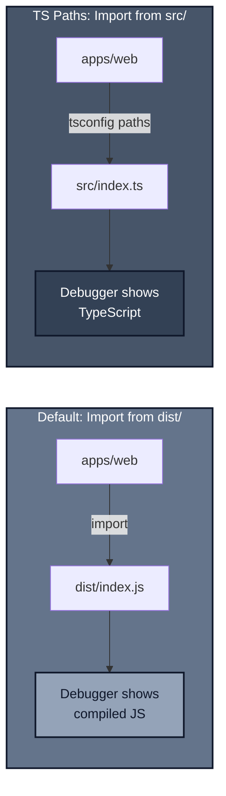
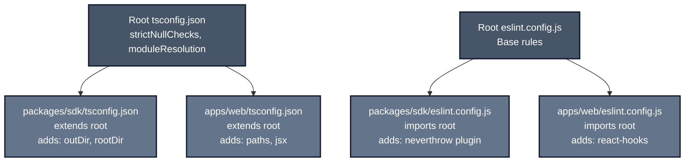

*Previously: [Enforcing Patterns with ESLint](./eslint). ESLint enforces patterns within a package. But how do you enforce them across multiple packages?*

---

Let's talk about monorepos.

Everyone loves the idea: shared code, one repo, fast iteration. But most monorepo setups quietly fail at the thing that matters most: being able to debug your own code.

## The Problem

It's Tuesday afternoon. You're debugging a failure in your web app. You step into the SDK code... and land in minified JavaScript. No sourcemaps. No line numbers. Just `t.e(r).then(n=>n.o)`.

You check the import: it points to `dist/index.js`. You wanted to debug the actual TypeScript. Now you're grepping through `node_modules` trying to find the original source.

Or worse: your SDK has a bug, you fix it, but you forgot to rebuild. The app still reads stale output. You spend an hour debugging code that doesn't match what you're reading.

Monorepos promise shared code and fast iteration. But most setups fail in two predictable ways:

- **You can't debug source**: you step into compiled or minified output
- **You can't trust iteration**: the app runs stale build artifacts you forgot to rebuild

The patterns below solve those two failures first, then layer on consistency and scale.

### Recommended Layout

Before diving in, here's the structure we're targeting:

```
monorepo/
├── apps/
│   └── web/                  # Next.js, Vite, etc.
├── packages/
│   ├── sdk/                  # Core business logic
│   ├── config/        # (optional) Shared ESLint, TS configs etc
├── turbo.json
├── pnpm-workspace.yaml
├── tsconfig.json             # Base config
└── eslint.config.js          # Base rules
```

### Anti-Patterns to Avoid

| Anti-Pattern | Why It Hurts |
|--------------|--------------|
| Apps importing from `dist/` | Can't debug source; stale builds go unnoticed |
| Self-imports via package name (inside the package) | Couples build to path-alias tooling |
| Barrel files (`export * from`) | Bloated bundles, circular deps, refactor friction |
| Premature shared packages | Coordination overhead kills velocity |
| "One config to rule them all" | Runtime-specific rules don't belong in root |

---

## TS Paths: Debug Source, Not Dist

For internal monorepo development, we prefer importing source directly for the fastest iteration. If you publish packages externally, sourcemaps are the non-negotiable fallback (see "When TS Paths Aren't Enough" below).

> **Assumption**: This assumes your app consumes the SDK via workspace linking (pnpm/yarn/npm workspaces), not via an installed npm tarball.
> TS paths won't help consumers debug your published output. That's what sourcemaps are for.

The fix is simple: configure TypeScript paths to point to source files, not compiled output.



In your consuming app's `tsconfig.json`:

```json
// apps/web/tsconfig.json
{
  "extends": "../../tsconfig.json",
  "compilerOptions": {
    "paths": {
      "@myorg/sdk/*": ["../../packages/sdk/src/*"],
      "@/*": ["./src/*"]
    }
  }
}
```

Now when you import from `@myorg/sdk/queries`, TypeScript resolves it to the source file. Your debugger steps through actual TypeScript. Hot reload catches changes instantly.

> **Bundler configuration required.** TS paths are a type-checker feature; your bundler (or Node) still needs its own resolver to load the same files. They must agree. Your bundler needs to know about workspace packages too:
> - **Next.js**: Add `transpilePackages: ['@myorg/sdk']` in `next.config.js`
> - **Vite**: Use `vite-tsconfig-paths` plugin or configure `resolve.alias`
> - **Webpack**: Use `tsconfig-paths-webpack-plugin`

### The Tradeoff

Avoid **self-imports** inside a package (e.g. `@myorg/sdk/logger` from within `packages/sdk`). They couple your build to path-alias tooling and often fail outside TypeScript.

- Inside the SDK, prefer relative imports (`../logger`)
- In consuming apps, path aliases are fine (as long as the bundler mirrors them per the note above)

### When TS Paths Aren't Enough

TS paths solve the staleness problem (always importing fresh source) but don't fully solve debuggability if you're consuming *published* packages. For that, you need sourcemaps. If your SDK is published to npm rather than consumed via workspace links:

- Set `sourcemap: true` in your build config (tsup, tsc, esbuild, etc.)
- Publish `.map` files alongside your JS output
- Include `sourcesContent: true` (default in most tools) or ship your `src/` folder
- Ensure consumers' bundlers preserve sourcemaps (not stripped in production builds)

> Some production builds strip or hide sourcemaps by default. Verify the deployed artifact still serves them if you rely on runtime debugging.

### Choose Your Debugging Mode

| Context | Strategy | Key Config |
|---------|----------|------------|
| **Workspace dev** | TS paths → import source directly | `paths` + `transpilePackages` |
| **CI / build** | Build packages first, consume `dist/` | `tsconfig.prod.json` without workspace paths |
| **Published packages** | Sourcemaps in npm tarball | `sourcemap: true` + ship `.map` files |

Start with workspace dev. Add the others when your setup demands it.

For CI/production builds, create a separate tsconfig that removes workspace paths:

```json
// apps/web/tsconfig.prod.json
{
  "extends": "./tsconfig.json",
  "compilerOptions": {
    "paths": {
      "@/*": ["./src/*"]
      // @myorg/sdk/* paths removed - forces build to use dist/
    }
  }
}
```

> **Enforce in CI**: Use `pnpm --filter @myorg/web build --project tsconfig.prod.json` (or set `TSCONFIG=tsconfig.prod.json` in your CI environment) to ensure production builds always consume `dist/`.

### VS Code Debugging

If you use VS Code, here's a working launch config. The principle applies to any editor: run the package with a package-scoped `cwd`, and ensure sourcemaps resolve to workspace files.

```json
// .vscode/launch.json
{
  "version": "0.2.0",
  "resolveSourceMapLocations": ["${workspaceFolder}/**", "!**/node_modules/**"],
  "configurations": [
    {
      "name": "web",
      "type": "node",
      "request": "launch",
      "runtimeExecutable": "pnpm",
      "runtimeArgs": ["--filter", "@myorg/web", "run", "dev"],
      "cwd": "${workspaceFolder}/apps/web/",
      "skipFiles": ["<node_internals>/**"]
    },
    {
      "name": "api",
      "type": "node",
      "request": "launch",
      "runtimeExecutable": "pnpm",
      "runtimeArgs": ["--filter", "@myorg/api", "run", "dev"],
      "cwd": "${workspaceFolder}/apps/api/",
      "skipFiles": ["<node_internals>/**"],
      "envFile": "${workspaceFolder}/apps/api/.env"
    }
  ]
}
```

The key settings:

- **`resolveSourceMapLocations`**: Tell VS Code to resolve sourcemaps from workspace packages, not node_modules
- **`runtimeExecutable: "pnpm"`**: Use pnpm's `--filter` to run specific packages
- **`cwd`**: Set working directory to the package root
- **`skipFiles`**: Skip Node internals for cleaner stack traces

Now F5 launches the app and breakpoints in SDK source files work directly.

### "Won't This Slow Down Type-Checking?"

I hear you. If TypeScript is resolving into raw source files across packages, won't builds crawl?

In practice, often no. TypeScript's incremental compilation (`tsBuildInfoFile`) and project references handle this well. The bottleneck in most monorepos is I/O and dependency resolution, not type-checking source files.

If you *do* hit slowdowns with 10+ packages, consider:

- **Project references**: Let each package emit `.d.ts` files and reference those instead of raw source
- **Turborepo caching**: Avoid re-checking unchanged packages entirely

But start with the simple approach. Optimize when profiling shows a real problem.

---

## Shared Config: Extend and Override

Every package needs TypeScript and ESLint config. Don't copy-paste. Create base configs at the root that packages extend. For Prettier, keep a single root config and use `eslint-config-prettier` to avoid rule conflicts.



**Share defaults, not every rule.** Each package should add the minimum extra rules needed for its runtime (Node vs browser vs React). Avoid the "one config to rule them all" trap.

### TypeScript: Extend with `extends`

```json
// Root tsconfig.json (base config - type-checking only)
{
  "compilerOptions": {
    "strict": true,
    "strictNullChecks": true,
    "forceConsistentCasingInFileNames": true,
    "module": "node16",
    "moduleResolution": "node16",
    "esModuleInterop": true,
    "resolveJsonModule": true,
    "skipLibCheck": true,
    "noEmit": true
  },
  "exclude": ["node_modules", "dist", "**/node_modules"]
}
```

The root config sets `noEmit: true` for type-checking only, not building. Each package overrides this when it needs to emit.

> **ESM-first?** If you're all-in on ESM with `"type": "module"` in your packages, consider `module`/`moduleResolution: "NodeNext"` instead of `node16` for closer runtime parity with Node.js behavior.

```json
// packages/sdk/tsconfig.json
{
  "extends": "../../tsconfig.json",
  "compilerOptions": {
    "noEmit": false,
    "outDir": "./dist",
    "rootDir": "./src",
    "declaration": true
  },
  "include": ["src/**/*"]
}
```

The SDK inherits all base settings, enables emitting, and adds build-specific options.

### ESLint v9: Import and Spread

ESLint v9 flat config makes extension explicit. Define base rules at the root:

```javascript
// Root eslint.config.js
import tsPlugin from '@typescript-eslint/eslint-plugin';
import unicornPlugin from 'eslint-plugin-unicorn';

export default [
  { ignores: ['**/dist/**'] },
  {
    files: ['**/*.ts', '**/*.tsx'],
    plugins: { '@typescript-eslint': tsPlugin, unicorn: unicornPlugin },
    rules: {
      ...unicornPlugin.configs.recommended.rules,
      ...tsPlugin.configs.recommended.rules,
    },
  },
];
```

Packages import and spread, then add their own rules:

```javascript
// packages/sdk/eslint.config.js
import baseConfig from '../../eslint.config.js';

export default [
  ...baseConfig,
  {
    files: ['src/**/*.ts'],
    rules: {
      // Package-specific: ban barrel exports
      'no-restricted-syntax': ['error', {
        selector: 'ExportAllDeclaration',
        message: 'Barrel exports (export * from) are not allowed.',
      }],
    },
  },
];
```

The pattern: **import → spread → extend**. See [Enforcing Patterns with ESLint](./eslint) for complete configs.

---

## Package Extraction: When to Share

The same principle from [Composition Patterns](./composition) applies to packages: **don't extract until you have three proven uses and a stable interface.**

Premature shared packages create coordination overhead versioning, ownership ambiguity, and deprecation debt. Duplication is the price of agility.

---

## Granular Exports: Avoid Barrel Files

Here's a pattern that seems helpful but causes real pain at scale.

> This matters whether you publish to npm or just consume via workspace links. For internal packages, it's about API discipline and bundle hygiene. For published packages, it's also about stable import paths.

A **barrel file** is an `index.ts` that re-exports everything from other modules using `export * from`. It looks convenient:

```typescript
// packages/sdk/src/index.ts - DON'T DO THIS
export * from './db';
export * from './logger';
export * from './queries';
export * from './orders';
// ... 30 more exports
```

The web app imports one function: `import { formatOrder } from '@myorg/sdk'`. In theory, tree-shaking should remove the rest. In practice, barrels cause problems beyond just bundle size:

- **API hygiene**: Barrels blur module boundaries and encourage importing from a single huge surface
- **Accidental side-effects**: Re-exporting modules that execute code on import defeats tree-shaking
- **CJS interop**: Tree-shaking often fails when CommonJS enters the dependency graph
- **Circular dependencies**: Barrels make it easy to create import cycles that cause runtime errors or undefined values
- **Refactoring friction**: Moving code means updating the barrel, which breaks every consumer's imports

A tiny import can balloon into a much larger bundle, but worse, your codebase becomes hard to refactor and debug.

### Explicit Entry Points with tsup

Instead of one barrel file, create explicit entry points for each module:

```typescript
// packages/sdk/tsup.config.ts
import { defineConfig } from 'tsup';

export default defineConfig({
  entry: {
    // Each module gets its own entry point
    db: 'src/db/index.ts',
    customers: 'src/customers/index.ts',
    queries: 'src/queries/index.ts',
    logger: 'src/logger/index.ts',
  },
  format: ['esm'],
  dts: true,
  clean: true,
  sourcemap: true,
  target: 'es2022',
});
```

### Package.json Exports Field

Map each entry point in package.json:

```json
// packages/sdk/package.json
{
  "name": "@myorg/sdk",
  "type": "module",
  "sideEffects": false,
  "exports": {
    "./db": {
      "import": "./dist/db.js",
      "types": "./dist/db.d.ts"
    },
    "./customers": {
      "import": "./dist/customers.js",
      "types": "./dist/customers.d.ts"
    },
    "./queries": {
      "import": "./dist/queries.js",
      "types": "./dist/queries.d.ts"
    },
    "./logger": {
      "import": "./dist/logger.js",
      "types": "./dist/logger.d.ts"
    }
  }
}
```

Notice there's no root `"."` export. This is intentional: consumers *must* import from `@myorg/sdk/logger`, not `@myorg/sdk`. If you prefer discoverability, you can add a `"."` export as a type-only or thin entry point, but avoid `export * from` barrels.

The `sideEffects: false` tells bundlers they can safely tree-shake unused exports. Only set this if your modules are actually side-effect free on import (no top-level code that runs just by importing).

### Consumer Usage

Now imports are explicit:

```typescript
// apps/web/src/orders.ts

// Specific imports - only bundles what you use
import { getOrder } from '@myorg/sdk/queries';
import { createLogger } from '@myorg/sdk/logger';

// NOT this - would bundle everything (if it even existed)
// import { getOrder, createLogger } from '@myorg/sdk';
```

### When Barrel Files Are Fine

I'm not saying "never use index.ts". Barrel files work when:

- **Small, cohesive modules**: A `utils/` folder with 3-4 pure functions that always travel together
- **Type-only exports**: Re-exporting types has no runtime cost
- **Internal boundaries**: A barrel inside a package (not at the package root) to organize submodules

Barrel files become problematic when they sit at package boundaries and re-export *everything*. A single `index.ts` that exports 40 functions from 15 modules is the anti-pattern. A focused re-export of related utilities is fine.

> **Enforcement**: The ESLint config shown earlier bans `export *` with `no-restricted-syntax`. See [Enforcing Patterns with ESLint](./eslint) for variations.

---

## Build Orchestration

Use pnpm workspaces for package linking and Turborepo for build orchestration.

### pnpm Workspaces

```yaml
# pnpm-workspace.yaml
packages:
  - 'packages/*'
  - 'apps/*'
```

### Turborepo Task Dependencies

```json
// turbo.json
{
  "$schema": "https://turbo.build/schema.json",
  "tasks": {
    "build": {
      "dependsOn": ["^build"],
      "outputs": ["dist/**", ".next/**", "!.next/cache/**"]
    },
    "test": {
      "dependsOn": ["build"]
    },
    "lint": {},
    "dev": {
      "cache": false,
      "persistent": true
    }
  }
}
```

`dependsOn: ["^build"]` means "build my dependencies first." When you run `turbo build` in the web app, Turborepo automatically builds the SDK first. No manual coordination.

> **Note**: Each package must define matching scripts (`build`, `lint`, `test`) in its `package.json` for Turborepo to orchestrate them. Each package's build script defines its own outputs; Turborepo caches per-package. The `outputs` array lists all possible outputs across packages: `dist/**` for SDK packages, `.next/**` for Next.js apps, etc.

---

## The Rules

1. **Use TS paths for source debugging.** Point consuming apps to `src/`, not `dist/`. Avoid TS paths inside packages prefer relative imports (`../logger`) within a package.

2. **Extend, don't copy.** Root configs for tsconfig, ESLint, Prettier. Packages extend and add specifics.

3. **Duplicate first, extract later.** Wait for three uses and a stable interface before creating shared packages.

4. **Explicit exports only.** Use tsup entry points. Ban `export *` with ESLint. Your bundle size will thank you.

5. **Orchestrate with Turborepo.** Let dependency ordering happen automatically with `dependsOn: ["^build"]`.

---

## Quick Reference

| Pattern | Tool | Purpose |
|---------|------|---------|
| Source debugging | TS paths in tsconfig | Step through SDK source, not compiled JS |
| Shared config | extends/imports | Consistent settings, package-specific overrides |
| Granular exports | tsup entry points | Tree-shaking, explicit dependencies |
| No barrel exports | ESLint no-restricted-syntax | Prevent `export *` from bloating bundles |
| Build orchestration | Turborepo | Automatic dependency ordering |
| Workspace management | pnpm workspaces | Linked packages, fast installs |

---

## What's Next

We've established patterns for structuring code across packages: debugging, configuration, and exports. But how do we know our code performs under load?

---

*Next: [Performance Testing](./performance). Prove it works under pressure.*
