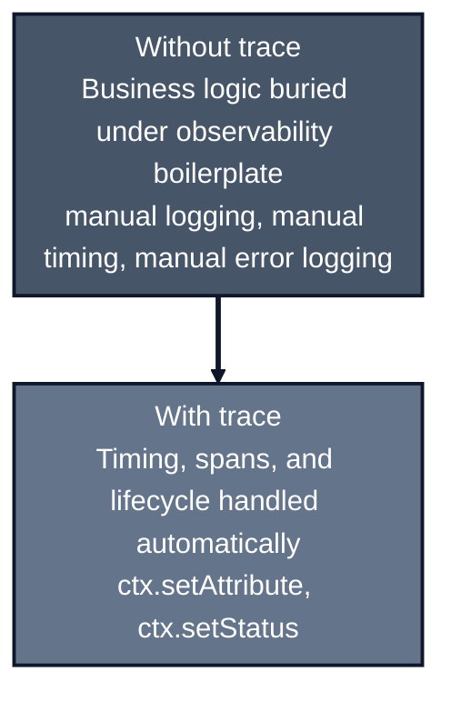
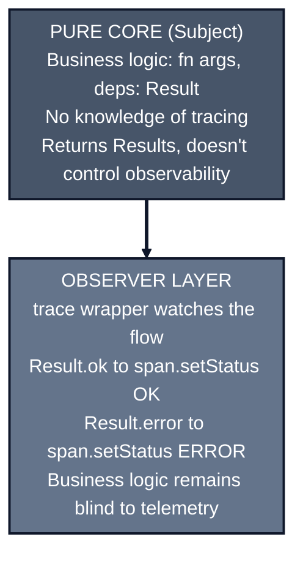

*Previously: [Never Throw](/patterns/errors). We made failure explicit with Result types. But when things fail in production, how do we know what happened?*

---

Your functions are clean. They have explicit deps, validated args, and honest error types. The code is a joy to read.

Then you deploy to production.

A user reports "it didn't work." Your support team asks what happened. You check the logs and find... nothing useful. Maybe a generic error. Maybe a stack trace that points somewhere unhelpful.

You can't see inside your functions when they run. They're opaque boxes.

---

## The Instinct: Add Logging

The obvious solution is to sprinkle logs everywhere:

```typescript
async function getUser(args: { userId: string }, deps: GetUserDeps) {
  deps.logger.info(`getUser called with userId=${args.userId}`);
  const startTime = Date.now();

  try {
    const user = await deps.db.findUser(args.userId);

    if (!user) {
      deps.logger.warn(`User not found: ${args.userId}`);
      return err('NOT_FOUND');
    }

    deps.logger.info(`getUser succeeded in ${Date.now() - startTime}ms`);
    return ok(user);
  } catch (error) {
    deps.logger.error(`getUser failed: ${error}`);
    return err('DB_ERROR');
  }
}
```

Now you have visibility. But look what happened to your function.

Half of it is logging. The actual business logic (find user, return it) is buried under observability concerns. And you have to do this for *every* function.

### The String Interpolation Problem

There's another issue. Look at the logging again:

```typescript
deps.logger.info(`getUser called with userId=${args.userId}`);
```

This is **unstructured logging**. The userId is buried in a string. You can't query it, filter by it, or aggregate on it without parsing text.

**Structured logging** emits JSON with typed fields:

```typescript
deps.logger.info({ userId: args.userId, action: 'getUser' }, 'getUser called');
```

Which produces:

```json
{"level":"info","userId":"123","action":"getUser","msg":"getUser called","time":1703...}
```

Now you can filter logs by `userId`, count actions, and build dashboards.

**Why Pino?** Use [Pino](https://github.com/pinojs/pino) for structured logging. It's the fastest Node.js logger (benchmarks show 5x+ faster than Winston) and outputs JSON by default. For a complete setup guide, see [Structured Logging with Pino](https://arrangeactassert.com/posts/structured-logging-with-pino/)—it covers:

- Child loggers for request context
- Log levels and when to use each
- Integration with Express/Fastify
- Pretty-printing for development vs. JSON for production

### Security: Redact Sensitive Data

Structured logging creates a new risk: accidentally logging secrets.

**The problem:** You log a user object for debugging, and suddenly your log aggregator contains passwords:

```typescript
// Innocent-looking code
logger.info({ event: 'login', user: req.body });
```

```json
// 😱 What ends up in your logs (visible to anyone with log access):
{
  "level": "info",
  "event": "login",
  "user": {
    "email": "alice@example.com",
    "password": "super-secret-123",
    "apiKey": "sk-live-abc123..."
  }
}
```

**The fix:** Pino's redaction strips sensitive fields automatically. For an in-depth guide, see [Pino Redaction: A Simple Solution to Secure Logging](https://arrangeactassert.com/posts/pino-redaction-a-simple-solution-to-secure-logging-in-node-js-applications/).

```typescript
import pino from 'pino';

const logger = pino({
  redact: ['password', 'apiKey', 'token', '*.secret', 'user.email'],
});

logger.info({ event: 'login', user: req.body });
```

```json
// ✅ What actually gets logged:
{
  "level": "info",
  "event": "login",
  "user": {
    "email": "[Redacted]",
    "password": "[Redacted]",
    "apiKey": "[Redacted]"
  }
}
```

Define redaction paths once, and sensitive fields are stripped from *all* logs automatically. You can't forget.

### Redaction in Span Attributes

Pino redaction protects logs, but sensitive data can also leak into span attributes sent to Jaeger or Honeycomb.

**The problem:** You set span attributes for debugging:

```typescript
ctx.setAttribute('user.email', user.email);
ctx.setAttribute('auth.token', req.headers.authorization);  // 😱 Token in traces!
```

```json
// What appears in your tracing backend:
{
  "span": "processRequest",
  "attributes": {
    "user.email": "alice@example.com",
    "auth.token": "Bearer eyJhbGciOiJIUzI1NiIs..."  // 😱 Visible to anyone!
  }
}
```

**The fix:** Implement a global attribute filter:

```typescript
const SENSITIVE_KEYS = ['password', 'token', 'apiKey', 'secret', 'authorization'];

function sanitizeAttributes(attrs: Record<string, unknown>): Record<string, unknown> {
  return Object.fromEntries(
    Object.entries(attrs).map(([key, value]) => {
      const isSensitive = SENSITIVE_KEYS.some(k =>
        key.toLowerCase().includes(k.toLowerCase())
      );
      return [key, isSensitive ? '[REDACTED]' : value];
    })
  );
}

init({
  service: 'my-service',
  attributeFilter: sanitizeAttributes,
});
```

```json
// ✅ What actually gets sent to your tracing backend:
{
  "span": "processRequest",
  "attributes": {
    "user.email": "alice@example.com",
    "auth.token": "[REDACTED]"
  }
}
```

SOC2 and GDPR compliance often require filtering at both layers. Defense in depth.

### From Logging to Tracing

But even structured logging has limits. Logs are isolated events. When a request flows through multiple services, you can't easily connect the logs. You end up grepping timestamps and hoping.

**Distributed tracing** solves this. Instead of isolated logs, you get spans that connect into traces. A single request becomes a tree of operations you can visualize and query.

The problem? Setting up OpenTelemetry manually is painful:

```typescript
// The nightmare: manual OpenTelemetry setup
import { NodeSDK } from '@opentelemetry/sdk-node';
import { getNodeAutoInstrumentations } from '@opentelemetry/auto-instrumentations-node';
import { OTLPTraceExporter } from '@opentelemetry/exporter-trace-otlp-http';
import { Resource } from '@opentelemetry/resources';
import { SemanticResourceAttributes } from '@opentelemetry/semantic-conventions';

const sdk = new NodeSDK({
  resource: new Resource({
    [SemanticResourceAttributes.SERVICE_NAME]: 'my-service',
  }),
  traceExporter: new OTLPTraceExporter({ url: process.env.OTEL_ENDPOINT }),
  instrumentations: [getNodeAutoInstrumentations()],
});

sdk.start();
// ... and you still need to manually create spans in your code
```

Tons of boilerplate before you've traced a single function. And auto-instrumentation only traces HTTP/database calls—not your business logic.

What if there was a way to get tracing without the setup pain?

---

## The trace() Wrapper

[autotel](https://github.com/jagreehal/autotel) eliminates the OpenTelemetry boilerplate. Instead of configuring SDKs, exporters, and instrumentations, you get a simple `trace()` function that wraps your functions with automatic spans:

```typescript
import { trace, type TraceContext } from 'autotel';

const getUser = trace(
  (ctx: TraceContext) => async (
    args: { userId: string },
    deps: GetUserDeps
  ) => {
    ctx.setAttribute('user.id', args.userId);

    const user = await deps.db.findUser(args.userId);
    if (!user) {
      ctx.setStatus({ code: 2, message: 'User not found' });
      return err('NOT_FOUND');
    }

    ctx.setStatus({ code: 1 }); // OK
    return ok(user);
  }
);
```

The function signature is unchanged: `(args, deps) => Promise<Result<User, E>>`. But now every call creates a span in your distributed tracing system.

You set attributes on the span, mark success or failure, and the wrapper handles the rest: timing, error recording, span lifecycle.



---

## Why This Shape Works

Notice the pattern:

```typescript
const myFunction = trace(
  (ctx) => async (args, deps) => {
    // ctx: TraceContext - for span attributes and status
    // args: your input
    // deps: your dependencies

    ctx.setAttribute('key', value);
    // ... your logic ...
    ctx.setStatus({ code: 1 });
    return result;
  }
);
```

The `trace()` wrapper gives you a `ctx` for span manipulation, but it doesn't pollute your deps. The span context is separate from your business dependencies.

And critically: **the wrapper is orthogonal to `fn(args, deps)`**. They compose without conflict.

### What trace() Actually Does

If you can't add a new library, you can build a minimal version yourself. At its core, `trace()` is just a higher-order function:

```typescript
function trace<Args, Deps, R>(
  fn: (ctx: TraceContext) => (args: Args, deps: Deps) => Promise<R>
) {
  return async (args: Args, deps: Deps): Promise<R> => {
    const span = tracer.startSpan(fn.name);
    const ctx = {
      setAttribute: (k: string, v: unknown) => span.setAttribute(k, v),
      setStatus: (s: { code: number; message?: string }) => span.setStatus(s),
    };

    try {
      const result = await fn(ctx)(args, deps);
      span.end();
      return result;
    } catch (error) {
      span.recordException(error);
      span.end();
      throw error;
    }
  };
}
```

That's the conceptual model: wrap a function, create a span, provide context, and clean up. The real library adds more (naming, nested spans, batching), but the pattern is the same.

---

## Testing Traced Functions

Here's the beautiful part: tests don't change.

```typescript
describe('getUser', () => {
  it('returns user when found', async () => {
    const mockUser = { id: '123', name: 'Alice' };
    const deps = {
      db: { findUser: vi.fn().mockResolvedValue(mockUser) },
    };

    const result = await getUser({ userId: '123' }, deps);

    expect(result.ok).toBe(true);
    if (result.ok) {
      expect(result.value).toEqual(mockUser);
    }
  });
});
```

No mocking the tracer. No special setup. When tracing is disabled (no OpenTelemetry endpoint), `trace()` is essentially a no-op wrapper. Your tests run against the same function signature they always did.

---

## Nested Traces Work Automatically

When traced functions call other traced functions, spans nest automatically:

```typescript
const createOrder = trace(
  (ctx) => async (args: CreateOrderArgs, deps: CreateOrderDeps) => {
    ctx.setAttribute('order.userId', args.userId);

    // These create child spans automatically
    const user = await getUser({ userId: args.userId }, deps);
    const inventory = await checkInventory({ productId: args.productId }, deps);
    const payment = await processPayment({ amount: args.total }, deps);

    // ...
    return ok(order);
  }
);
```

The resulting trace looks like:

```text
createOrder (span)
├── getUser (child span)
├── checkInventory (child span)
└── processPayment (child span)
```

No manual context propagation. The wrapper handles it.

---

## Integrating With Results

Here's where everything we've built comes together. Your Result types map naturally to span status:

```typescript
const getUser = trace(
  (ctx) => async (args: { userId: string }, deps: GetUserDeps) => {
    ctx.setAttribute('user.id', args.userId);

    const result = await getUserCore(args, deps);

    // Map Result to span status
    if (!result.ok) {
      ctx.setStatus({ code: 2, message: result.error });
    } else {
      ctx.setStatus({ code: 1 });
    }

    return result;
  }
);
```

### The Observer Pattern for Observability

This is the key architectural insight: **tracing implements the Observer pattern**.



The business function is the **subject**—it produces Results and doesn't know who's watching. The `trace()` wrapper is the **observer**—it watches without interfering.

This preserves the **Pure Core** of your application:

- Business logic knows nothing about OpenTelemetry, Jaeger, or Honeycomb
- You can run the same function with or without tracing
- Tests don't need to mock telemetry
- The function signature remains `(args, deps) => Result<T, E>`

**The right direction of dependency:**

- Tracing should NOT decide if the operation succeeded
- The Result decides, tracing just records it
- Observability is a side effect, not a control flow mechanism

This separation is what makes the pattern work at scale. Your core logic stays pure and testable.

---

## Real Example

```typescript
import { init, trace, track, type TraceContext } from 'autotel';

// Initialize once at startup
init({
  service: 'order-service',
  endpoint: process.env.OTEL_ENDPOINT,
});

// Types
type CreateOrderDeps = {
  db: Database;
  logger: Logger;
  processPayment: typeof processPayment;
  sendNotification: typeof sendNotification;
};

type CreateOrderArgs = {
  userId: string;
  items: Array<{ productId: string; quantity: number }>;
};

// Traced function
const createOrder = trace(
  (ctx: TraceContext) => async (
    args: CreateOrderArgs,
    deps: CreateOrderDeps
  ) => {
    const { userId, items } = args;
    const { db, logger, processPayment, sendNotification } = deps;

    // Set span attributes
    ctx.setAttribute('order.userId', userId);
    ctx.setAttribute('order.itemCount', items.length);

    return run(async (step) => {
      // Each step is traced as part of this span
      const total = await step(() => calculateTotal({ items }, { db }));
      const payment = await step(() => processPayment({ userId, amount: total }, { db, logger }));

      const order = await step.try(
        () => db.saveOrder({ userId, items, total, paymentId: payment.id }),
        { mapError: () => 'DB_ERROR' as const }
      );

      // Track business event
      track('order.completed', {
        orderId: order.id,
        userId,
        total,
        itemCount: items.length,
      });

      ctx.setStatus({ code: 1 }); // OK
      return order;
    });
  }
);
```

Every `createOrder` call generates a span with:

- Attributes: userId, itemCount
- Timing: how long it took
- Status: success or failure
- Nested spans: calculateTotal, processPayment, etc.
- Business events: order.completed

---

## Factory Stays Clean

Your service factory doesn't change:

```typescript
export function createOrderService({ deps }: { deps: OrderServiceDeps }) {
  return {
    createOrder: (args: CreateOrderArgs) => createOrder(args, deps),
    getOrder: (args: { orderId: string }) => getOrder(args, deps),
  };
}
```

Handlers call the service normally:

```typescript
app.post('/orders', async (req, res) => {
  const result = await orderService.createOrder({
    userId: req.user.id,
    items: req.body.items,
  });

  if (!result.ok) {
    return res.status(500).json({ error: result.error });
  }

  return res.status(201).json(result.value);
});
```

Every call is traced. No manual span management in handlers.

---

## The Pattern

```typescript
// 1. Define deps type (unchanged)
type MyFunctionDeps = {
  db: Database;
  logger: Logger;
};

// 2. Wrap with trace(), keep deps explicit
const myFunction = trace(
  (ctx: TraceContext) => async (
    args: { /* args */ },
    deps: MyFunctionDeps
  ) => {
    // Set attributes
    ctx.setAttribute('key', value);

    // Do work with explicit deps
    const result = await doWork(args, deps);

    // Set status based on result
    ctx.setStatus({ code: result.ok ? 1 : 2 });
    return result;
  }
);

// 3. Test without caring about tracing
const result = await myFunction(args, mockDeps);
```

---

## Semantic Conventions

OpenTelemetry defines [standard attribute names](https://opentelemetry.io/docs/specs/semconv/) that backends understand automatically. Use these instead of inventing your own:

| Standard Key | Instead Of | Why It Matters |
| ------------ | ---------- | -------------- |
| `user.id` | `userId`, `user_id` | Backends can correlate users across services |
| `enduser.id` | `customerId` | Standard for end-user identification |
| `http.method` | `method`, `httpMethod` | Automatic HTTP dashboards |
| `db.system` | `database`, `dbType` | Database performance views |
| `error.type` | `errorCode` | Error aggregation and alerting |

```typescript
// ❌ Custom keys - backends don't understand these
ctx.setAttribute('userId', args.userId);
ctx.setAttribute('orderTotal', total);

// ✅ Semantic conventions - backends auto-correlate
ctx.setAttribute('user.id', args.userId);
ctx.setAttribute('order.value', total);  // Custom, but follows convention style
```

**Why this matters:** Using standardized keys allows Grafana, Honeycomb, and Jaeger to automatically build dashboards, correlate data across services, and trigger alerts without custom configuration. It's interoperability for free.

For custom business attributes, follow the naming convention: `{domain}.{attribute}` (e.g., `order.item_count`, `payment.method`).

---

## Quick Setup

Compare the manual OpenTelemetry setup (15+ lines of imports and configuration) with autotel:

```bash
npm install autotel
```

```typescript
import { init, trace, track } from 'autotel';

// Initialize once - that's it
init({
  service: 'my-service',
  endpoint: process.env.OTEL_ENDPOINT,
  debug: true, // Console output during development
});

// Wrap functions
const myFunction = trace((ctx) => async (args, deps) => {
  // Your code here
});
```

### Sending Traces to Backends

Set the `OTEL_ENDPOINT` environment variable to send traces to your backend:

| Backend | Endpoint |
| ------- | -------- |
| Honeycomb | `https://api.honeycomb.io:443` (set `HONEYCOMB_API_KEY`) |
| Grafana Tempo | `http://tempo:4318/v1/traces` |
| Jaeger | `http://jaeger:4318/v1/traces` |
| Local dev | Use `debug: true` for console output |

For Honeycomb, also set the team header:

```typescript
init({
  service: 'my-service',
  endpoint: 'https://api.honeycomb.io:443',
  headers: { 'x-honeycomb-team': process.env.HONEYCOMB_API_KEY },
});
```

**[Full autotel documentation](https://github.com/jagreehal/autotel)**

---

## Log-to-Trace Correlation

A common pitfall: you find a slow trace in Jaeger, but you can't find the corresponding detailed logs in your log aggregator. Traces and logs don't "talk" to each other.

**The Correlation Pattern:** Ensure your logger automatically includes the current `traceId` and `spanId` in every log message:

```typescript
import { context, trace } from '@opentelemetry/api';
import pino from 'pino';

function createCorrelatedLogger() {
  const baseLogger = pino({ /* your config */ });

  return {
    info: (obj: object, msg?: string) => {
      const span = trace.getSpan(context.active());
      const spanContext = span?.spanContext();

      baseLogger.info({
        ...obj,
        traceId: spanContext?.traceId,
        spanId: spanContext?.spanId,
      }, msg);
    },
    // ... other log levels
  };
}
```

Now every log line includes tracing context:

```json
{
  "level": "info",
  "msg": "Processing order",
  "orderId": "order-123",
  "traceId": "abc123def456...",
  "spanId": "789xyz..."
}
```

**Why this matters:** You can now "one-click jump" from a trace span to the detailed logs of that specific operation. In Grafana, you can link Loki logs to Tempo traces. In Honeycomb, you can query logs and traces together.

This turns your observability from "two separate tools" into a unified debugging experience.

---

## Canonical Log Lines (Wide Events)

There's a fundamental problem with traditional logging that even structured logging doesn't solve: **logs are optimized for writing, not querying**.

When a user reports "checkout failed," you need to find that specific request across potentially millions of log lines. With traditional logging, you get multiple scattered entries per request:

```text
[INFO] Checkout started userId=user-123
[INFO] Cart loaded cartId=cart-1 itemCount=2
[INFO] Payment processing started
[ERROR] Payment failed: card_declined
```

Each line has partial context. To reconstruct what happened, you need to:

1. Search for the userId
2. Find the cartId from a different log line
3. Correlate by timestamp
4. Hope you don't mix up concurrent requests

**Canonical log lines** (also called "wide events") solve this by emitting **one comprehensive log per request** with ALL context:

```json
{
  "level": "info",
  "msg": "[processCheckout] Request completed",
  "traceId": "4bf92f3577b34da6a3ce929d0e0e4736",
  "spanId": "00f067aa0ba902b7",
  "duration_ms": 124.7,
  "status_code": 500,
  "user.id": "user-123",
  "user.subscription": "premium",
  "user.lifetime_value_cents": 284700,
  "cart.id": "cart-1",
  "cart.item_count": 2,
  "cart.total_cents": 7998,
  "cart.coupon_applied": "SAVE20",
  "payment.method": "card",
  "payment.provider": "stripe",
  "payment.latency_ms": 150,
  "error.type": "PaymentError",
  "error.code": "card_declined"
}
```

Now you can run queries that were previously impossible:

```sql
-- Find all checkout failures for premium users
SELECT * FROM logs
WHERE user.subscription = 'premium'
  AND error.code IS NOT NULL;

-- Group errors by code
SELECT error.code, COUNT(*)
FROM logs
WHERE error.code IS NOT NULL
GROUP BY error.code;

-- Find slow checkouts with coupons
SELECT * FROM logs
WHERE duration_ms > 200
  AND cart.coupon_applied IS NOT NULL;
```

### Enabling Canonical Log Lines in autotel

autotel supports canonical log lines with a single configuration option:

```typescript
import { init, trace, setUser, httpServer } from 'autotel';
import pino from 'pino';

const logger = pino({ level: 'info' });

init({
  service: 'checkout-api',
  logger,
  canonicalLogLines: {
    enabled: true,
    rootSpansOnly: true, // One log per request, not per span
    logger, // Emit via Pino
  },
});
```

Then accumulate context throughout your request:

```typescript
const processCheckout = trace((ctx) => async (req: CheckoutRequest) => {
  // User context (setUser adds standard user.id attribute)
  setUser(ctx, { id: req.userId, email: user.email });

  // Custom user attributes
  ctx.setAttributes({
    'user.subscription': user.subscription,
    'user.lifetime_value_cents': user.lifetimeValueCents,
  });

  // HTTP context
  httpServer(ctx, {
    method: 'POST',
    route: '/api/checkout',
    statusCode: 200,
  });

  // Business context accumulates as you process
  ctx.setAttributes({
    'cart.id': req.cartId,
    'cart.item_count': items.length,
    'cart.total_cents': total,
    'payment.method': req.paymentMethod,
    'payment.provider': 'stripe',
  });

  // If error occurs, add error context
  if (paymentFailed) {
    ctx.setAttributes({
      'error.type': 'PaymentError',
      'error.code': 'card_declined',
      'error.retriable': true,
    });
  }

  // When span ends, autotel emits ONE canonical log with ALL attributes
  return result;
});
```

### Why This Works

The pattern follows **tail sampling**: you decide what to log *after* the span completes, when you know the full picture (duration, status, all accumulated context). This is more useful than head sampling (logging at the start when you don't know what will happen).

Key characteristics of canonical log lines:

- **High cardinality**: Include user IDs, order IDs, trace IDs—fields with many unique values that enable precise queries
- **Flat structure**: Use dot-notation (`user.id`, `cart.total_cents`) instead of nested objects for easier querying
- **Emitted at span end**: All context is available, including duration and final status
- **One per request**: Set `rootSpansOnly: true` to emit only for root spans

For a complete working example, see the [autotel canonical logs example](https://github.com/jagreehal/autotel/tree/main/apps/example-canonical-logs).

**Further reading:** The "logs are optimized for writing, not querying" insight comes from Boris Tane's excellent article [Logging Sucks](https://arrangeactassert.com/posts/logging-sucks/), which introduces the wide events pattern and the "Wide Event Builder Simulator" concept.

---

## The Rules

1. **Use structured logging.** JSON fields, not string interpolation. Use Pino with redaction for both logs and span attributes.
2. **Wrap with trace().** Observability is orthogonal to business logic (Observer pattern).
3. **Use semantic conventions.** Standard attribute names (`user.id`, `http.method`) enable automatic backend correlation.
4. **Correlate logs and traces.** Include `traceId` and `spanId` in every log message.
5. **Emit canonical log lines.** One wide event per request with all context—optimize for querying, not writing.
6. **Map Result to span status.** ok = success, err = failure.
7. **Nested traces work automatically.** No manual context passing.
8. **Tests don't change.** trace() is transparent when tracing is disabled.

---

## What's Next

We've got observable functions. When something fails, we can trace exactly what happened.

But here's a problem we haven't addressed: what happens when our infrastructure fails *transiently*?

A database connection drops for a second. An HTTP request times out once, then succeeds. A service is briefly unavailable during deployment.

Our functions fail on the first error. But some failures are temporary. Should we retry? How many times? What about cascading failures?

How do we make our functions resilient without cluttering them with retry logic?

That's what we'll figure out next.

---

*Next: [Resilience Patterns](/patterns/resilience). Retries, circuit breakers, and timeouts.*
