*Previously: [Monorepo Patterns](./monorepos). We structured our packages. Now how do we prove they perform under load?*

---

Your code works. Tests pass. The traces look clean. You ship to production.

Then Black Friday hits. Traffic spikes 10x. Response times climb from 200ms to 8 seconds. The database connection pool is exhausted. Users see timeouts. Revenue drops by the minute.

You open your traces. They show the same thing they always showed: single requests completing successfully. But under load, everything's different. Where's the bottleneck?

You don't know because you never tested under load.

---

## Why Load Testing Matters

Unit tests verify correctness. Integration tests verify the stack works together. But neither answers:

- How many concurrent users can we handle?
- What breaks first under load?
- Where do we spend the most time when the system is stressed?

Your OpenTelemetry traces from [post 5](./opentelemetry) are essential here. But traces from single requests show "happy path" performance. Under load, different problems emerge:


Load testing reveals:
- **Connection pool exhaustion**: 10 connections serving 1000 requests
- **N+1 queries that explode**: 1 query becomes 1000 queries
- **External API rate limits**: Fine at 10 RPS, blocked at 100 RPS
- **Memory leaks**: Invisible in short tests, catastrophic over hours
- **Race conditions**: Never trigger with single requests

---

## Load Testing with k6

[k6](https://k6.io/) is a modern load testing tool. It's JavaScript-based, outputs metrics, and integrates with CI/CD. Install it:

```bash
# macOS
brew install k6

# Or download from https://k6.io/docs/get-started/installation/
```

### Your First Load Test

```javascript
// load-tests/orders-api.js
import http from 'k6/http';
import { check, sleep } from 'k6';
import { randomUUID } from 'https://jslib.k6.io/k6-utils/1.4.0/index.js';

// Test configuration
export const options = {
  vus: 10,              // 10 virtual users
  duration: '30s',      // Run for 30 seconds
  thresholds: {
    http_req_duration: ['p(95)<500'],  // 95% of requests under 500ms
    http_req_failed: ['rate<0.01'],    // Less than 1% failure rate
  },
};

const BASE_URL = __ENV.BASE_URL || 'http://localhost:3000';
const API_KEY = __ENV.API_KEY || 'test-key';

export default function () {
  // Create an order
  const payload = JSON.stringify({
    customerId: 'cust-123',
    items: [
      { productId: 'prod-1', quantity: 2, unitPrice: 1500 },
      { productId: 'prod-2', quantity: 1, unitPrice: 3000 },
    ],
  });

  const response = http.post(`${BASE_URL}/api/orders`, payload, {
    headers: {
      'Content-Type': 'application/json',
      'x-api-key': API_KEY,
      'x-request-id': randomUUID(),  // For trace correlation
    },
  });

  // Verify the response
  check(response, {
    'status is 201': (r) => r.status === 201,
    'has order id': (r) => JSON.parse(r.body).id !== undefined,
  });

  // Simulate user think time
  sleep(1);
}
```

> **Why `sleep()`?** In k6, a Virtual User (VU) executes the script in a loop. Without `sleep`, a single VU could generate hundreds of requests per second, accidentally DDoS-ing your local machine. `sleep` simulates realistic human behavior ("think time") between actions, like a user reading a page before clicking. Without it, you're not testing "10 users". You're testing "10 infinite loops hammering your API."

Run it:

```bash
k6 run load-tests/orders-api.js
```

Output:

```text
     scenarios: (100.00%) 1 scenario, 10 max VUs, 1m0s max duration
                exec: default

     ✓ status is 201
     ✓ has order id

     checks.........................: 100.00% ✓ 284  ✗ 0
     http_req_duration..............: avg=127ms  min=45ms  max=892ms  p(95)=312ms
     http_req_failed................: 0.00%   ✓ 0    ✗ 142
     http_reqs......................: 142     4.7/s
     vus............................: 10      min=10 max=10

     ✓ http_req_duration: p(95)<500ms
     ✓ http_req_failed: rate<0.01
```

Your thresholds passed. But this is just 10 users. What happens at 100? 1000?

---

## Progressive Load Profiles

Don't jump straight to stress testing. Use progressive profiles to understand your system:

### 1. Smoke Test: Does It Work?

```javascript
// load-tests/smoke.js
export const options = {
  vus: 1,
  duration: '1m',
  thresholds: {
    http_req_failed: ['rate<0.01'],
  },
};
```

One user, one minute. If this fails, you have a functional bug, not a performance problem.

### 2. Load Test: Expected Traffic

```javascript
// load-tests/load.js
export const options = {
  stages: [
    { duration: '2m', target: 50 },   // Ramp up to 50 users
    { duration: '5m', target: 50 },   // Stay at 50 users
    { duration: '2m', target: 0 },    // Ramp down
  ],
  thresholds: {
    http_req_duration: ['p(95)<500', 'p(99)<1000'],
    http_req_failed: ['rate<0.01'],
  },
};
```

This simulates your expected production traffic. If this fails, you can't handle normal load.

### 3. Stress Test: Find the Breaking Point

```javascript
// load-tests/stress.js
export const options = {
  stages: [
    { duration: '2m', target: 100 },   // Ramp to 100
    { duration: '5m', target: 100 },   // Hold
    { duration: '2m', target: 200 },   // Push to 200
    { duration: '5m', target: 200 },   // Hold
    { duration: '2m', target: 300 },   // Push to 300
    { duration: '5m', target: 300 },   // Hold - where does it break?
    { duration: '2m', target: 0 },     // Ramp down
  ],
  thresholds: {
    http_req_duration: ['p(95)<2000'],  // Relaxed threshold
  },
};
```

Keep pushing until something breaks. Note what failed first: database? memory? external API?

### 4. Soak Test: Memory Leaks and Degradation

```javascript
// load-tests/soak.js
export const options = {
  stages: [
    { duration: '5m', target: 50 },    // Ramp up
    { duration: '4h', target: 50 },    // Hold for 4 hours
    { duration: '5m', target: 0 },     // Ramp down
  ],
  thresholds: {
    http_req_duration: ['p(95)<500'],
  },
};
```

Run for hours at moderate load. Watch for:

- Memory usage creeping up
- Response times gradually increasing
- Connection leaks
- File handle exhaustion

Some bugs only appear after hours of operation.

### 5. Spike Test: Sudden Bursts

What if 500 users arrive in 10 seconds? A flash sale, a viral tweet, a marketing email blast.

```javascript
// load-tests/spike.js
export const options = {
  stages: [
    { duration: '10s', target: 10 },   // Warm up
    { duration: '1m', target: 10 },    // Baseline
    { duration: '10s', target: 500 },  // SPIKE!
    { duration: '3m', target: 500 },   // Hold the spike
    { duration: '10s', target: 10 },   // Scale back down
    { duration: '3m', target: 10 },    // Recovery period
    { duration: '5s', target: 0 },     // Ramp down
  ],
  thresholds: {
    http_req_duration: ['p(95)<3000'],  // Allow slower responses during spike
    http_req_failed: ['rate<0.05'],     // Allow up to 5% errors during spike
  },
};
```

Spike tests reveal:

- Does your autoscaler react fast enough?
- Does your load balancer drop connections during the surge?
- Do database connection pools handle the sudden demand?
- Does the system recover after the spike ends?

### Load Profiles at a Glance

| Profile | Goal | VU Pattern | Success Metric |
| ------- | ---- | ---------- | -------------- |
| **Smoke** | Correctness | Constant (1 VU) | 0% errors |
| **Load** | Normal capacity | Ramp to target | `http_req_duration` p95 < 500ms |
| **Stress** | Find breaking point | Continuous ramp | Identify first failures |
| **Soak** | Endurance | Steady for hours | Constant memory, no degradation |
| **Spike** | Burst handling | Sudden jump | Recovery within SLO |

---

## Connecting Load Tests to Traces

Here's where [OpenTelemetry](./opentelemetry) becomes invaluable. Your traces show *where* time is spent under load.

### Pass Trace Context from k6

```javascript
// load-tests/orders-with-tracing.js
import http from 'k6/http';
import { randomUUID } from 'https://jslib.k6.io/k6-utils/1.4.0/index.js';

export default function () {
  const traceId = randomUUID().replace(/-/g, '');
  const spanId = randomUUID().replace(/-/g, '').slice(0, 16);

  const response = http.post(`${BASE_URL}/api/orders`, payload, {
    headers: {
      'Content-Type': 'application/json',
      'x-api-key': API_KEY,
      // W3C Trace Context header
      'traceparent': `00-${traceId}-${spanId}-01`,
      // Custom header for correlation
      'x-load-test-id': __ENV.TEST_RUN_ID || 'local',
    },
  });
}
```

Now you can find your load test requests in Jaeger/Honeycomb/your tracing backend.

### Analyzing Traces Under Load

Run your load test, then query your tracing backend for slow requests:

```text
service.name = "orders-api"
duration > 1s
attributes.x-load-test-id = "stress-test-2024-01-15"
```

You'll see traces like:

```mermaid
graph TD
    A[createOrder<br/>2.3s total] --> B[validateInput<br/>45ms]
    B --> C[db.customer.findUnique<br/>1,800ms 🔥 BOTTLENECK<br/>Waiting for connection pool 1,750ms]
    C --> D[db.order.create<br/>350ms]
    D --> E[paymentProvider.charge<br/>100ms]
    E --> F[Root cause: Connection pool size 10 < concurrent requests 100]
    
    style A fill:#475569,stroke:#0f172a,stroke-width:2px,color:#fff
    style B fill:#64748b,stroke:#0f172a,stroke-width:2px,color:#fff
    style C fill:#1e293b,stroke:#0f172a,stroke-width:2px,color:#fff
    style D fill:#64748b,stroke:#0f172a,stroke-width:2px,color:#fff
    style E fill:#64748b,stroke:#0f172a,stroke-width:2px,color:#fff
    style F fill:#94a3b8,stroke:#0f172a,stroke-width:2px,color:#0f172a
    
    linkStyle 0 stroke:#0f172a,stroke-width:3px
    linkStyle 1 stroke:#0f172a,stroke-width:3px
    linkStyle 2 stroke:#0f172a,stroke-width:3px
    linkStyle 3 stroke:#0f172a,stroke-width:3px
    linkStyle 4 stroke:#0f172a,stroke-width:3px
```



Without load testing, you'd never see that 1,750ms connection pool wait. The trace looked fine under single requests.

### Common Bottlenecks Revealed by Load + Traces

| Symptom in Traces | Root Cause | Fix |
|-------------------|------------|-----|
| Long waits before DB query starts | Connection pool exhausted | Increase pool size or reduce query time |
| External API calls taking 10x longer | Rate limiting kicked in | Add caching, request batching |
| Same DB query repeated N times | N+1 query pattern | Use eager loading / joins |
| Memory spans getting longer over time | Memory leak / GC pressure | Profile memory, fix leaks |
| Timeouts only under load | Resource contention | Add connection limits, queuing |

---

## Setting SLOs and Thresholds

Don't just measure. Set expectations. k6 thresholds fail your test if SLOs aren't met:

```javascript
export const options = {
  thresholds: {
    // Response time SLOs
    http_req_duration: [
      'p(50)<200',   // Median under 200ms
      'p(95)<500',   // 95th percentile under 500ms
      'p(99)<1000',  // 99th percentile under 1s
    ],

    // Availability SLO
    http_req_failed: ['rate<0.001'],  // 99.9% success rate

    // Custom metrics
    'order_created': ['count>100'],   // At least 100 orders created

    // Per-endpoint thresholds
    'http_req_duration{endpoint:create_order}': ['p(95)<800'],
    'http_req_duration{endpoint:get_order}': ['p(95)<200'],
  },
};
```

Now your CI pipeline can fail if performance regresses:

```yaml
# .github/workflows/performance.yml
name: Performance Tests

on:
  push:
    branches: [main]
  schedule:
    - cron: '0 2 * * *'  # Nightly

jobs:
  load-test:
    runs-on: ubuntu-latest
    steps:
      - uses: actions/checkout@v4

      - name: Start services
        run: docker-compose up -d

      - name: Run load tests
        uses: grafana/k6-action@v0.3.1
        with:
          filename: load-tests/load.js
          flags: --out json=results.json
        env:
          BASE_URL: http://localhost:3000

      - name: Upload results
        uses: actions/upload-artifact@v4
        with:
          name: k6-results
          path: results.json
```

---

## From Load Testing to Chaos Engineering

Once you can measure performance, you can break things intentionally. This is **chaos engineering**: testing resilience by injecting failures.

### The Idea

Your [resilience patterns](./resilience) (retries, timeouts, circuit breakers) are only valuable if they work. Chaos engineering proves they do.


### Simple Chaos: Latency Injection

Start simple. Add latency to dependencies and see what happens:

```typescript
// src/test-utils/chaos.ts
export function withLatency<T>(
  fn: () => Promise<T>,
  options: { minMs: number; maxMs: number }
): () => Promise<T> {
  return async () => {
    const delay = Math.random() * (options.maxMs - options.minMs) + options.minMs;
    await new Promise((resolve) => setTimeout(resolve, delay));
    return fn();
  };
}

export function withFailureRate<T>(
  fn: () => Promise<T>,
  failureRate: number,  // 0.0 to 1.0
  error: Error = new Error('Injected failure')
): () => Promise<T> {
  return async () => {
    if (Math.random() < failureRate) {
      throw error;
    }
    return fn();
  };
}
```

Use in integration tests:

```typescript
// src/orders/create-order.chaos.test.ts
import { describe, it, expect } from 'vitest';
import { withLatency, withFailureRate } from '../test-utils/chaos';
import { createOrder } from './create-order';

describe('createOrder under chaos', () => {
  it('completes within SLO when payment provider is slow', async () => {
    const slowPaymentProvider = {
      charge: withLatency(
        () => Promise.resolve({ transactionId: 'tx-123' }),
        { minMs: 1500, maxMs: 2000 }  // 1.5-2s latency
      ),
    };

    const start = Date.now();
    const result = await createOrder(
      { customerId: 'cust-1', items: [{ productId: 'p1', quantity: 1, unitPrice: 1000 }] },
      { db: mockDb, paymentProvider: slowPaymentProvider }
    );
    const duration = Date.now() - start;

    expect(result.ok).toBe(true);
    expect(duration).toBeLessThan(5000);  // Still under 5s SLO
  });

  it('handles payment provider failures gracefully', async () => {
    const flakyPaymentProvider = {
      charge: withFailureRate(
        () => Promise.resolve({ transactionId: 'tx-123' }),
        0.5  // 50% failure rate
      ),
    };

    // With retry logic, this should eventually succeed
    const result = await createOrder(
      { customerId: 'cust-1', items: [{ productId: 'p1', quantity: 1, unitPrice: 1000 }] },
      { db: mockDb, paymentProvider: flakyPaymentProvider }
    );

    // The retry logic from our workflow should handle this
    expect(result.ok).toBe(true);
  });
});
```

### Network-Level Chaos with Toxiproxy

For more realistic chaos, use [Toxiproxy](https://github.com/Shopify/toxiproxy) to inject network-level failures:

```yaml
# docker-compose.chaos.yml
services:
  toxiproxy:
    image: ghcr.io/shopify/toxiproxy
    ports:
      - "8474:8474"   # API
      - "5433:5433"   # Proxied postgres

  postgres:
    image: postgres:16
    # Toxiproxy sits between app and postgres
```

```typescript
// Configure toxic before load test
import Toxiproxy from 'toxiproxy-node-client';

const toxiproxy = new Toxiproxy('http://localhost:8474');

// Add 500ms latency to database
await toxiproxy.createToxic('postgres', {
  name: 'latency',
  type: 'latency',
  attributes: { latency: 500, jitter: 100 },
});

// Run load test
// Then check: Did connection pool handle the latency?
// Did timeouts fire correctly?
// Did the circuit breaker trip?
```

### Chaos Scenarios to Test

| Scenario | What You're Testing | Inject |
|----------|--------------------| ------|
| Slow database | Connection pool, timeouts | 500ms+ latency |
| Database down | Circuit breaker, error handling | 100% failure rate |
| Slow external API | Timeout configuration | 2-5s latency |
| External API rate limiting | Retry with backoff | 429 responses |
| Network partition | Graceful degradation | Drop packets |
| High memory pressure | GC behavior, OOM handling | Memory limits |

---

## The Testing Pyramid Complete

With load testing and chaos, your testing pyramid is complete:


---

## Quick Reference

### k6 Commands

```bash
# Run load test
k6 run load-tests/load.js

# Run with custom config
k6 run --vus 50 --duration 5m load-tests/orders-api.js

# Run with environment variables
k6 run -e BASE_URL=https://staging.example.com load-tests/orders-api.js

# Output to JSON for analysis
k6 run --out json=results.json load-tests/load.js

# Output to InfluxDB for dashboards
k6 run --out influxdb=http://localhost:8086/k6 load-tests/load.js
```

### Test Types at a Glance

| Test Type | VUs | Duration | Purpose |
|-----------|-----|----------|---------|
| Smoke | 1 | 1m | Verify functionality |
| Load | 50-100 | 10m | Expected traffic |
| Stress | 100-500+ | 20m | Find breaking point |
| Soak | 50 | 4h+ | Memory leaks, degradation |
| Spike | 10→500→10 | 10m | Sudden traffic bursts |

### The Rules

1. **Test progressively.** Smoke → Load → Stress → Soak.
2. **Set thresholds.** Tests should fail if SLOs aren't met.
3. **Connect to traces.** Load + OpenTelemetry = finding real bottlenecks.
4. **Run in CI.** Catch performance regressions before production.
5. **Inject chaos.** Prove your resilience patterns actually work.

---

## What's Next

We've built a complete architecture:
- Functions with explicit dependencies (testable)
- Validation at the boundary (safe)
- Result types (explicit errors)
- OpenTelemetry (observable)
- Resilience patterns (reliable)
- Configuration at startup (fail-fast)
- TypeScript + ESLint (enforced)
- Load testing + chaos (proven under fire)

---

*Next: [What We've Built](/conclusion). The complete architecture.*

