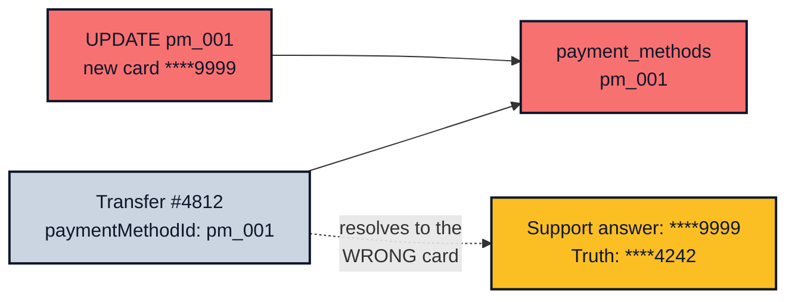

*Previously: [Functions + OpenTelemetry](../opentelemetry). We made our functions observable. But traces expire, and some questions arrive a year after the trace is gone.*

---

A support ticket lands twelve months after the payment:

> "Why did the customer receive €117? And which card did we charge?"

Retention deleted your traces from last year. Your logs sit in cold storage. The rates API will tell you today's rate, a different number answering a different question.

If your database can't answer this question, nothing can.

## The Mutable Trap

Most payment systems start with a schema like this:

```typescript
type PaymentMethod = {
  id: string;
  userId: string;
  type: 'card' | 'bank_account';
  last4: string;
};

type Transfer = {
  id: string;
  amount: number;
  fromCurrency: string;
  toCurrency: string;
  paymentMethodId: string; // resolve it when you need it
};
```

Normalise it this way and you lose history:

- The user replaces their card. The `payment_methods` row gets `UPDATE`d. Now every historic transfer resolves to the new card. Nothing errors, so no one catches the change.
- The transfer stored no rate, because "we can fetch it". At support time someone fetches it and gets today's answer to last year's question.
- A cleanup job hard-deletes stale payment methods. Old transfers now point at nothing, and a chargeback investigation dead-ends.



A transaction record is a claim about the past. Change the data underneath it and the claim is false.

## The Two Rules

**Rule 1: never overwrite reference data.** A changed payment method is a new row. A removed payment method is a soft delete. No `UPDATE` and no hard `DELETE` on reference tables that transactions point into.

```typescript
type PaymentMethod = {
  id: string;
  userId: string;
  type: 'card' | 'bank_account';
  last4: string;
  deletedAt: string | null; // soft delete only
};
```

**Rule 2: snapshot the decision inputs on every transaction.** At the moment the transfer executes, write everything the decision depended on into the record, as values the record owns.

How you capture depends on where the data lives:

| Data | Lives where | Capture as |
| --- | --- | --- |
| Payment method | Your database | Pointer **and** snapshot |
| Exchange rate | Third-party API | Captured value (a pointer is impossible) |
| Fee schedule | Your config | Computed values |

For internal data you keep both: the pointer stays resolvable forever (Rule 1 guarantees it), and the snapshot answers everyday questions without a join. For external data, you can't foreign-key into someone else's API history, so the value you captured is the only record you will ever have.

## The Record

```typescript
type TransferRecord = {
  transferId: string; // our id, and the provider idempotency key
  createdAt: string;
  status: 'pending' | 'completed' | 'failed';

  // What was asked for. Money is decimal strings, never `number` -
  // 100 * 1.17 is 117.00000000000001 in a float. See Validation for the arithmetic.
  requestedAmount: string;
  fromCurrency: string;
  toCurrency: string;

  // External data: captured value - there is no pointer into the provider's history
  rate: string;
  rateCapturedAt: string;
  convertedAmount: string;

  // Internal reference data: pointer + snapshot
  paymentMethodId: string;
  paymentMethod: { type: string; last4: string };

  // What the provider did - null until it answers
  providerTransferId: string | null;
};
```

And the workflow that writes it, in the `fn(args, deps)` style:

```typescript
type TransferDeps = {
  clock: { now: () => string };
  ids: { next: () => string };
  rates: { fetch: (from: string, to: string) => Promise<Result<string, RateError>> };
  paymentMethods: { getPreferred: (userId: string) => Promise<PaymentMethod> };
  provider: { execute: (transfer: ProviderTransfer) => Promise<Result<{ id: string }, ProviderError>> };
  records: { save: (record: TransferRecord) => Promise<void> };
};

async function sendTransfer(
  args: { userId: string; requestedAmount: string; from: string; to: string },
  deps: TransferDeps
): Promise<Result<TransferRecord, RateError | ProviderError>> {
  const paymentMethod = await deps.paymentMethods.getPreferred(args.userId);

  const rateResult = await deps.rates.fetch(args.from, args.to);
  if (!rateResult.ok) return rateResult;

  // Capture the moment, not just the value
  const rate = rateResult.value;
  const rateCapturedAt = deps.clock.now();
  const convertedAmount = multiplyMoney(args.requestedAmount, rate); // '117.00', see Validation

  // Write the decision down BEFORE the irreversible call. If the process dies
  // between here and the provider's reply, the pending record still explains the intent.
  const record: TransferRecord = {
    transferId: deps.ids.next(),
    createdAt: deps.clock.now(),
    status: 'pending',
    requestedAmount: args.requestedAmount,
    fromCurrency: args.from,
    toCurrency: args.to,
    rate,
    rateCapturedAt,
    convertedAmount,
    paymentMethodId: paymentMethod.id,
    paymentMethod: { type: paymentMethod.type, last4: paymentMethod.last4 },
    providerTransferId: null,
  };
  await deps.records.save(record);

  // The transfer id doubles as the idempotency key, so a retry can't double-send.
  const executed = await deps.provider.execute({
    amount: convertedAmount,
    currency: args.to,
    paymentMethodId: paymentMethod.id,
    idempotencyKey: record.transferId,
  });

  const settled: TransferRecord = executed.ok
    ? { ...record, status: 'completed', providerTransferId: executed.value.id }
    : { ...record, status: 'failed' };
  await deps.records.save(settled);

  if (!executed.ok) return executed;
  return ok(settled);
}
```

The function builds the record from values already in hand, so capture costs nothing at write time. You can't recover those values later.

A provider that accepts the transfer but never replies (a timeout, a killed deploy) leaves a `pending` record you can reconcile against the idempotency key later. That reconciliation, and the retry rules around it, belong to the [next chapter](../resilience).

## Testing the Capture

Because deps are injected, proving the snapshot works takes one fake:

```typescript
test('the snapshot survives the source data changing underneath it', async () => {
  const saved: TransferRecord[] = [];
  const card = {
    id: 'pm_001', userId: 'user-1', type: 'card' as const, last4: '4242', deletedAt: null,
  };

  const result = await sendTransfer(
    { userId: 'user-1', requestedAmount: '100.00', from: 'GBP', to: 'EUR' },
    {
      clock: { now: () => '2026-01-01T00:00:00.000Z' },
      ids: { next: () => 'TXN-001' },
      rates: { fetch: async () => ok('1.17') },
      paymentMethods: { getPreferred: async () => card },
      provider: { execute: async () => ok({ id: 'PROV-001' }) },
      records: { save: async (record) => { saved.push({ ...record }); } },
    }
  );

  expect(result.ok).toBe(true);
  const final = saved.at(-1)!;
  expect(final.rate).toBe('1.17');
  expect(final.paymentMethod).toEqual({ type: 'card', last4: '4242' });

  // The customer swaps their card. The historic record must not move.
  card.last4 = '9999';
  expect(final.paymentMethod.last4).toBe('4242');
});
```

The test pins the contract: the saved record carries the values themselves, and mutating the live card afterwards leaves the transfer untouched. Save-assert alone proves the write; the mutation is what proves history holds.

## Enforcing Rule 1

Rules that rely on discipline fail. Enforce never-overwrite structurally:

- **Don't export mutation functions.** If the `paymentMethods` module only exposes `create`, `softDelete`, and readers, there is no code path that overwrites.
- **Revoke at the database.** A soft delete is itself an `UPDATE`, so revoking everything would block it too. Revoke the historic columns and grant back only the delete marker: `REVOKE UPDATE, DELETE ON payment_methods FROM app_user;` then `GRANT UPDATE (deleted_at) ON payment_methods TO app_user;`. Now `softDelete` works and nothing else can touch a past row.
- **Lint the boundary.** The same [ESLint boundary rules](../eslint) that keep server imports out of the client can keep `db.update` calls out of reference-data modules.

## Telemetry Gets the Same Snapshot

The [previous chapter](../opentelemetry) built wide events, one canonical event per request carrying all its context. Point-in-time capture is the same idea with a different lifespan, so put the snapshot in both places:

```typescript
ctx.setAttributes({
  'transfer.id': record.transferId,
  'transfer.rate': record.rate,
  'transfer.rate.captured_at': record.rateCapturedAt,
  'payment_method.id': record.paymentMethodId,
  'payment_method.last4': record.paymentMethod.last4,
});
```

Telemetry retention runs out in days or weeks, so the wide event serves this week's incident. The transfer record outlives it and serves next year's dispute.

## The Payoff

The whole pattern cashes out as one boring endpoint:

```typescript
app.get('/api/transfer/:id', async (c) => {
  const record = await deps.records.get(c.req.param('id'));
  return record ? c.json(record) : c.json({ error: 'NotFound' }, 404);
});
```

In production, put this behind auth and scope the lookup to the record's owner (store an `ownerUserId` on the record and return 404 on mismatch). An audit record answers support's questions; anyone guessing an ID gets a 404.

Supportability comes down to what you wrote down at each decision point: what you decided, and what you decided it on. Write both, and any question a month or a year later takes one query.

---

Our functions now answer for their decisions forever. But they still fail on the first transient hiccup: a dropped connection, a timed-out API. Should we retry, and how many times? What happens when failures cascade?

That's what we'll figure out next.

---

*Next: [Resilience Patterns](../resilience). Retries, circuit breakers, and timeouts.*
