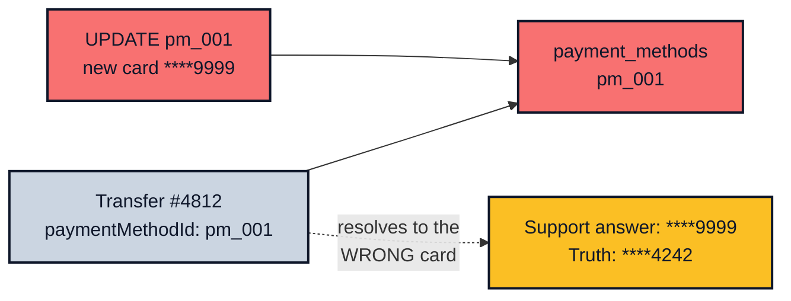

*Previously: [Functions + OpenTelemetry](../opentelemetry). We made our functions observable. But traces expire, and some questions arrive a year after the trace is gone.*

---

A support ticket lands twelve months after the payment:

> "Why did the customer receive €117? And which card did we charge?"

Retention deleted your traces from last year. Your logs sit in cold storage. The rates API will tell you today's rate, a different number answering a different question.

Your database is the only place left that could answer it.

## The Mutable Trap

Most payment systems start with a schema like this:

```typescript
type PaymentMethod = {
  id: string;
  userId: string;
  type: 'card' | 'bank_account';
  last4: string;
};

type Transfer = {
  id: string;
  amount: number;
  fromCurrency: string;
  toCurrency: string;
  paymentMethodId: string; // resolve it when you need it
};
```

Normalise it this way and you lose history:

- The user replaces their card. The `payment_methods` row gets `UPDATE`d. Now every historic transfer resolves to the new card. Nothing errors, so no one catches the change.
- The transfer stored no rate, because "we can fetch it". At support time someone fetches it and gets today's answer to last year's question.
- A cleanup job hard-deletes stale payment methods. Old transfers now point at nothing, and a chargeback investigation dead-ends.
- A model call in the flow logged only its final sentence. You cannot tell whether the number in it came from a tool or from the model, and re-running the prompt gives you a different sentence.


```mermaid
graph LR
    A[Transfer #4812<br/>paymentMethodId: pm_001] --> B[payment_methods<br/>pm_001]
    C[UPDATE pm_001<br/>new card ****9999] --> B
    A -.->|"resolves to the<br/>WRONG card"| D[Support answer: ****9999<br/>Truth: ****4242]

    style A fill:#cbd5e1,stroke:#0f172a,stroke-width:2px,color:#0f172a
    style B fill:#f87171,stroke:#0f172a,stroke-width:2px,color:#0f172a
    style C fill:#f87171,stroke:#0f172a,stroke-width:2px,color:#0f172a
    style D fill:#fbbf24,stroke:#0f172a,stroke-width:2px,color:#0f172a
```

A transaction record is a claim about the past. Change the data underneath it and the claim is false.

## The Two Rules

**Rule 1: never overwrite reference data.** A changed payment method is a new row. A removed payment method is a soft delete. No `UPDATE` and no hard `DELETE` on reference tables that transactions point into.

```typescript
type PaymentMethod = {
  id: string;
  userId: string;
  type: 'card' | 'bank_account';
  last4: string;
  deletedAt: string | null; // soft delete only
};
```

**Rule 2: snapshot the decision inputs on every transaction.** At the moment the transfer executes, write everything the decision depended on into the record, as values the record owns.

How you capture depends on where the data lives:

| Data | Lives where | Capture as |
| --- | --- | --- |
| Payment method | Your database | Pointer **and** snapshot |
| Exchange rate | Third-party API | Captured value (a pointer is impossible) |
| Fee schedule | Your config | Computed values |
| Model call | Someone else's weights | Captured step (not even repeatable) |

For internal data you keep both: the pointer stays resolvable forever (Rule 1 guarantees it), and the snapshot answers everyday questions without a join. For external data, you can't foreign-key into someone else's API history, so the value you captured is the only record you will ever have.

## The Record

```typescript
type TransferRecord = {
  transferId: string; // our id, and the provider idempotency key
  createdAt: string;
  status: 'pending' | 'completed' | 'failed';

  // What was asked for. Money is decimal strings, never `number` -
  // 100 * 1.17 is 117.00000000000001 in a float. See Validation for the arithmetic.
  requestedAmount: string;
  fromCurrency: string;
  toCurrency: string;

  // External data: captured value - there is no pointer into the provider's history
  rate: string;
  rateCapturedAt: string;
  convertedAmount: string;

  // Internal reference data: pointer + snapshot
  paymentMethodId: string;
  paymentMethod: { type: string; last4: string };

  // What the provider did - null until it answers
  providerTransferId: string | null;
};
```

And the workflow that writes it, in the `fn(args, deps)` style:

```typescript
type TransferDeps = {
  clock: { now: () => string };
  ids: { next: () => string };
  rates: { fetch: (from: string, to: string) => Promise<Result<string, RateError>> };
  paymentMethods: { getPreferred: (userId: string) => Promise<PaymentMethod> };
  provider: { execute: (transfer: ProviderTransfer) => Promise<Result<{ id: string }, ProviderError>> };
  records: { save: (record: TransferRecord) => Promise<void> };
};

async function sendTransfer(
  args: { userId: string; requestedAmount: string; from: string; to: string },
  deps: TransferDeps
): Promise<Result<TransferRecord, RateError | ProviderError>> {
  const paymentMethod = await deps.paymentMethods.getPreferred(args.userId);

  const rateResult = await deps.rates.fetch(args.from, args.to);
  if (!rateResult.ok) return rateResult;

  // Capture the moment, not just the value
  const rate = rateResult.value;
  const rateCapturedAt = deps.clock.now();
  const convertedAmount = multiplyMoney(args.requestedAmount, rate); // '117.00', see Validation

  // Write the decision down BEFORE the irreversible call. If the process dies
  // between here and the provider's reply, the pending record still explains the intent.
  const record: TransferRecord = {
    transferId: deps.ids.next(),
    createdAt: deps.clock.now(),
    status: 'pending',
    requestedAmount: args.requestedAmount,
    fromCurrency: args.from,
    toCurrency: args.to,
    rate,
    rateCapturedAt,
    convertedAmount,
    paymentMethodId: paymentMethod.id,
    paymentMethod: { type: paymentMethod.type, last4: paymentMethod.last4 },
    providerTransferId: null,
  };
  await deps.records.save(record);

  // The transfer id doubles as the idempotency key, so a retry can't double-send.
  const executed = await deps.provider.execute({
    amount: convertedAmount,
    currency: args.to,
    paymentMethodId: paymentMethod.id,
    idempotencyKey: record.transferId,
  });

  const settled: TransferRecord = executed.ok
    ? { ...record, status: 'completed', providerTransferId: executed.value.id }
    : { ...record, status: 'failed' };
  await deps.records.save(settled);

  if (!executed.ok) return executed;
  return ok(settled);
}
```

The function builds the record from values already in hand, so capture costs nothing at write time. You can't recover those values later.

A provider that accepts the transfer but never replies (a timeout, a killed deploy) leaves a `pending` record you can reconcile against the idempotency key later. That reconciliation, and the retry rules around it, belong to the [next chapter](../resilience).

## Testing the Capture

Because deps are injected, proving the snapshot works takes one fake:

```typescript
test('the snapshot survives the source data changing underneath it', async () => {
  const saved: TransferRecord[] = [];
  const card = {
    id: 'pm_001', userId: 'user-1', type: 'card' as const, last4: '4242', deletedAt: null,
  };

  const result = await sendTransfer(
    { userId: 'user-1', requestedAmount: '100.00', from: 'GBP', to: 'EUR' },
    {
      clock: { now: () => '2026-01-01T00:00:00.000Z' },
      ids: { next: () => 'TXN-001' },
      rates: { fetch: async () => ok('1.17') },
      paymentMethods: { getPreferred: async () => card },
      provider: { execute: async () => ok({ id: 'PROV-001' }) },
      records: { save: async (record) => { saved.push({ ...record }); } },
    }
  );

  expect(result.ok).toBe(true);
  const final = saved.at(-1)!;
  expect(final.rate).toBe('1.17');
  expect(final.paymentMethod).toEqual({ type: 'card', last4: '4242' });

  // The customer swaps their card. The historic record must not move.
  card.last4 = '9999';
  expect(final.paymentMethod.last4).toBe('4242');
});
```

The test pins the contract: the saved record carries the values themselves, and mutating the live card afterwards leaves the transfer untouched. Asserting the save proves the write; mutating the card afterwards proves history holds.

## Enforcing Rule 1

Don't rely on discipline. Enforce never-overwrite structurally:

- **Don't export mutation functions.** If the `paymentMethods` module only exposes `create`, `softDelete`, and readers, there is no code path that overwrites.
- **Revoke at the database.** A soft delete is itself an `UPDATE`, so revoking everything would block it too. Revoke the historic columns and grant back only the delete marker: `REVOKE UPDATE, DELETE ON payment_methods FROM app_user;` then `GRANT UPDATE (deleted_at) ON payment_methods TO app_user;`. Now `softDelete` works and nothing else can touch a past row.
- **Lint the boundary.** The same [Oxlint boundary rules](../lint) that keep server imports out of the client can keep `db.update` calls out of reference-data modules.

## Model Calls Are the Extreme Case

An exchange rate has a provider you can argue with. A model call has no one behind it. Send the same prompt to the same model and you get a different answer, with no history to fetch. Re-run it a year later and you get a new answer, which settles nothing. If you did not write the step down, you cannot show it happened.

Rule 2 applies unchanged, but "the decision inputs" now means the whole step: the model and its pinned version, the request, every tool the model asked for, the arguments it sent, what each tool returned, and the final text.

```typescript
type ToolCallRecord = {
  toolName: string;
  input: unknown; // exactly as the model sent it, before validation
  output?: unknown; // absent when the tool never ran
  error?: string; // why it didn't
};

type ModelStep = {
  stepId: string;
  transferId: string; // the record this step informed
  model: string; // pinned version, not a floating alias
  request: string; // stands in for the full request: messages, system prompt, tool schemas
  toolCalls: ToolCallRecord[];
  text: string;
  finishReason: string; // 'stop', 'tool_calls', 'length', or 'error' when the call itself failed
  error?: string; // present only on an error step
  usage: { inputTokens: number; outputTokens: number };
  capturedAt: string;
};
```

`request` is a string here to keep the example short. Save the real thing, the message array and the tool schemas, because the schema explains the arguments the model produced.

The most useful field is the one that's missing. Give a model a calculator tool whose arguments are typed as numbers and it will hand you strings:

```json
{
  "toolName": "calculator",
  "input": { "a": "23", "b": "7", "op": "add" },
  "error": "InvalidToolInput: expected number, received string at path a"
}
```

Validation rejected the arguments, so the tool never executed. There is no `output`. The model then answered:

> Using the calculator tool, I get: 23 + 7 = 30

It did not use the calculator tool. It guessed, and this time it guessed right. The finish reason was a normal stop. Nothing threw and the dashboards stayed green.

The final text is the model's account of its own behaviour, and you cannot rely on the model to narrate itself. The tool call record is the evidence: the arguments the model produced, and an absent `output` showing the tool never ran. If you log only `text`, you cannot answer "was that number computed or invented?"

Record the absences: a tool offered and never called, a step that stopped early, a validation failure the model papered over. Whether you get to see this row depends on your SDK. Most throw on invalid tool input and end the call, so catch the validation error and hand it back to the model as the tool's result. We produced the row above that way.

Capturing it has the same shape as `sendTransfer`. Inside a `classifyTransfer` function, the model sits behind a dep and you save the step whatever happened, including when the call itself fails. A provider timeout or a 500 is a step too, and the one you will be asked about:

```typescript
const stepId = deps.ids.next();
const result = await fromPromise(deps.model.generate(request), (cause) => new ModelCallFailed({ cause }));

// Write the step down on both branches. A rejected tool call is the most
// informative row in the table, and a call that never answered is the second.
const step: ModelStep = result.ok
  ? {
      stepId,
      transferId: record.transferId,
      model: result.value.model,
      request,
      toolCalls: result.value.toolCalls.map(({ toolName, input, output, error }) => ({ toolName, input, output, error })),
      text: result.value.text,
      finishReason: result.value.finishReason,
      usage: result.value.usage,
      capturedAt: deps.clock.now(),
    }
  : {
      stepId,
      transferId: record.transferId,
      model: PINNED_MODEL, // the version you asked for; a reply carries its own
      request,
      toolCalls: [],
      text: '',
      finishReason: 'error',
      error: result.error.message,
      usage: { inputTokens: 0, outputTokens: 0 },
      capturedAt: deps.clock.now(),
    };
await deps.steps.save(step);
if (!result.ok) return result;
```

`fromPromise` is awaitly's bridge from a throwing promise to a `Result`, covered in [Typed Errors](../errors#handling-throwing-code). `ModelStep` gains an optional `error?: string` and `finishReason` gains `'error'`, so a query for steps with no `text` finds the calls that never came back.

The transfer record carries `modelStepId: step.stepId` alongside `paymentMethodId`, so support can walk from the €117 in the opening ticket to the step that classified it. The test pins the contract:

```typescript
test('a rejected tool call is still recorded, with no output', async () => {
  const saved: ModelStep[] = [];
  const model = {
    generate: async () => ({
      model: 'model-x@2026-01',
      toolCalls: [{ toolName: 'calculator', input: { a: '23', b: '7', op: 'add' }, error: 'InvalidToolInput' }],
      text: 'Using the calculator tool, I get: 23 + 7 = 30',
      finishReason: 'stop',
      usage: { inputTokens: 42, outputTokens: 11 },
    }),
  };

  await classifyTransfer({ transferId: 'TXN-001', request: 'What is 23 plus 7?' }, { ...testDeps, model, steps: { save: async (s) => { saved.push(s); } } });

  const step = saved.at(-1)!;
  expect(step.toolCalls[0].output).toBeUndefined(); // the tool never ran
  expect(step.text).toContain('30'); // but the model claimed it did
});

test('a call that rejects is still recorded, as an error step', async () => {
  const saved: ModelStep[] = [];
  const model = { generate: async () => { throw new Error('upstream timeout'); } };

  const result = await classifyTransfer({ transferId: 'TXN-001', request: 'What is 23 plus 7?' }, { ...testDeps, model, steps: { save: async (s) => { saved.push(s); } } });

  expect(result.ok).toBe(false);
  expect(saved.at(-1)).toMatchObject({ transferId: 'TXN-001', finishReason: 'error', error: 'upstream timeout' });
});
```

When the model's text and the record disagree, believe the record.

## Telemetry Gets the Same Snapshot

The [previous chapter](../opentelemetry) built wide events, one canonical event per request carrying all its context. Point-in-time capture is the same idea with a different lifespan, so put the snapshot in both places:

```typescript
ctx.setAttributes({
  'transfer.id': record.transferId,
  'transfer.rate': record.rate,
  'transfer.rate.captured_at': record.rateCapturedAt,
  'payment_method.id': record.paymentMethodId,
  'payment_method.last4': record.paymentMethod.last4,
});
```

Model steps use the OpenTelemetry [`gen_ai` conventions](https://opentelemetry.io/docs/specs/semconv/gen-ai/), so your tooling groups them without bespoke dashboards. The convention gives each tool call its own `execute_tool` span rather than a summary on the parent, which lets a backend count failures across steps without knowing your schema:

```typescript
// On the `chat` span for the step
ctx.setAttributes({
  'gen_ai.provider.name': 'anthropic',
  'gen_ai.request.model': step.model,
  'gen_ai.response.finish_reasons': [step.finishReason], // an array, by convention
  'gen_ai.usage.input_tokens': step.usage.inputTokens,
  'gen_ai.usage.output_tokens': step.usage.outputTokens,
  'transfer.model_step.id': step.stepId, // your namespace, not gen_ai.*
});

// One child span per tool call; a rejected call is a failed span
for (const call of step.toolCalls) {
  await trace.run(`execute_tool ${call.toolName}`, (ctx) => {
    ctx.setAttribute('gen_ai.tool.name', call.toolName);
    if (call.error) ctx.setStatus({ code: 2, message: call.error }); // ERROR
  });
}
```

Two cautions. Do not invent keys under `gen_ai.*`: `gen_ai.tool.failed_count` is not a convention, and whoever built the dashboard on the conventions will see an empty panel and conclude it never happened. Put app-specific attributes in your own namespace. And keep prompt and response content off the span by default. [autotel](https://github.com/jagreehal/autotel)'s `autotel-genai` records `gen_ai.input.messages` and `gen_ai.output.messages` only when you opt in, redacted and capped, because many people can read a span and few can read the saved step.

Telemetry retention runs out in days or weeks, so the wide event serves this week's incident. The transfer record outlives it and serves next year's dispute. The split matters most for model steps: the span shows you today's spike in failed tool calls, and only the saved step can answer next year's "did the tool run?"

## The Payoff

The whole pattern pays off in one boring endpoint:

```typescript
app.get('/api/transfer/:id', async (c) => {
  const record = await deps.records.get(c.req.param('id'));
  return record ? c.json(record) : c.json({ error: 'NotFound' }, 404);
});
```

In production, put this behind auth and scope the lookup to the record's owner (store an `ownerUserId` on the record and return 404 on mismatch). An audit record answers support's questions; anyone guessing an ID gets a 404.

Supportability comes down to what you wrote down at each decision point: what you decided, and what you decided it on. Write both, and any question a month or a year later takes one query.

---

Our functions now answer for their decisions forever. But they still fail on the first transient hiccup: a dropped connection, a timed-out API. Should we retry, and how many times? What happens when failures cascade?

---

*Next: [Resilience Patterns](../resilience). Retries, circuit breakers, and timeouts.*
