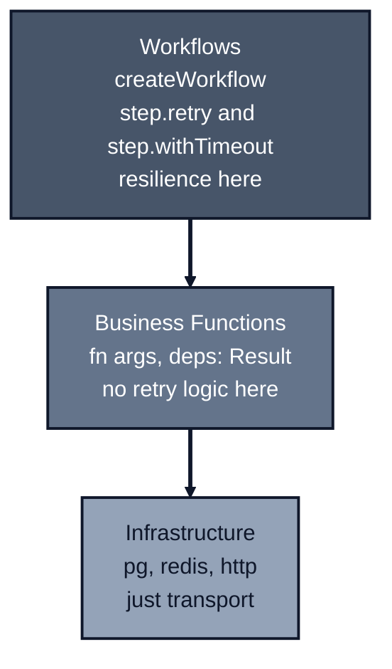
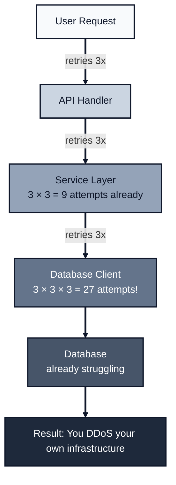
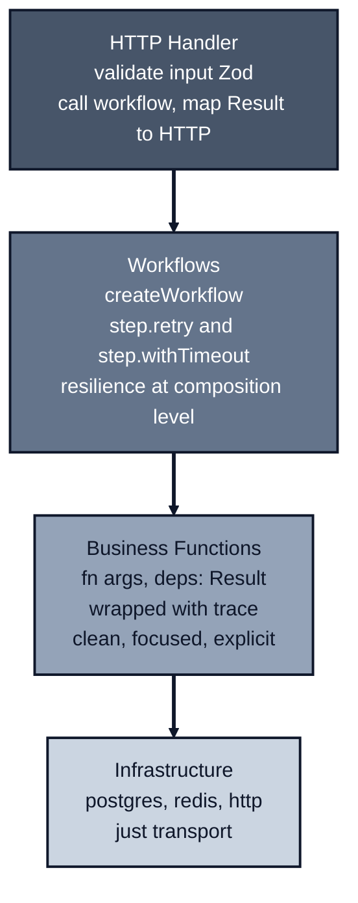

*Previously: [Functions + OpenTelemetry](..//opentelemetry). We made our functions observable. Now we can see what fails. But some failures are temporary.*

---

Your database connection drops for a second. Your HTTP client times out. An external service hiccups during deployment.

These failures are transient. If you wait a moment and try again, they'll probably work. But right now, your functions fail on the first error. The user sees an error page. The operation fails. Everyone's unhappy.

It's 3pm on Tuesday. Your payment provider has a 2-second outage -happens once a month, lasts seconds. Every checkout in that window fails. Users see "Payment failed." Your support queue fills up. Your Slack channel lights up. By the time you check, the provider is already back. The incident lasted 2 seconds but generated 50 support tickets.

Should you add retry logic?

---

## The Wrong Place (Again)

The instinct is to add retries inside the business function:

```typescript
async function getUser(args: { userId: string }, deps: GetUserDeps) {
  let attempts = 0;
  const maxAttempts = 3;

  while (attempts < maxAttempts) {
    try {
      const user = await deps.db.findUser(args.userId);
      return user ? ok(user) : err('NOT_FOUND');
    } catch (error) {
      attempts++;
      if (attempts >= maxAttempts) {
        return err('DB_ERROR');
      }
      await sleep(100 * Math.pow(2, attempts)); // Exponential backoff
    }
  }
}
```

Look what happened to your clean function. Half of it is now retry logic. The business logic (find user, return it) is buried.

And you'd have to do this for *every* function that touches infrastructure. What about timeouts? Circuit breakers? The functions become unreadable.

Where does resilience belong?

---

## Resilience at the Workflow Level

Remember our architecture? Validation at the boundary. Error handling explicit. Tracing orthogonal.

Resilience follows the same principle: **it's a composition concern, not a business logic concern**.



You add resilience at the *workflow* level, not in business functions. Your business functions stay clean. They return Results, and the workflow handles retries and timeouts.

---

## Resilience in Workflows

Retry and timeout are built into `awaitly`. Use them at the workflow level:

```typescript
import { createWorkflow } from 'awaitly/workflow';

const loadUserData = createWorkflow({ getUser, getPosts });

const result = await loadUserData(async (step) => {
  // Retry with exponential backoff
  const user = await step.retry(
    () => getUser({ userId }, deps),
    {
      attempts: 3,
      backoff: 'exponential',
      initialDelay: 100,
      maxDelay: 5000,
      jitter: true,
    }
  );

  // Timeout protection
  const posts = await step.withTimeout(
    () => getPosts({ userId: user.id }, deps),
    { ms: 2000 }
  );

  return { user, posts };
});
```

Now your business functions stay clean:

```typescript
async function getUser(args: { userId: string }, deps: { db: Database }) {
  const user = await deps.db.findUser(args.userId);
  return user ? ok(user) : err('NOT_FOUND');
}
```

They don't know about retries or timeouts. The workflow handles resilience.

---

## Why Workflow-Level Retry?

### 1. Business Functions Stay Clean

They do one thing: business logic. Resilience is handled at the workflow level.

### 2. Consistent Policy

Every call in a workflow can use the same retry policy. No "some code paths retry, some don't" drift.

### 3. No Double Retry

If you retry at both workflow and function levels, you get multiplicative attempts:

```typescript
// BAD: 3 × 3 = 9 attempts!
const user = await step.retry(
  () => getUserWithRetry(args, deps),  // Already retries internally
  { attempts: 3 }
);
```

By keeping retry at the workflow level, you avoid this explosion.

**The Blast Radius Problem:** Without centralized retry policy, a minor blip in a downstream service can become a self-inflicted DDoS. If every layer retries 3×, and you have 3 layers, a single failure becomes 27 requests. Multiply by 100 concurrent users and you've created a retry storm that prevents the failing service from recovering.

You add retries to make things more reliable. The database has a brief hiccup. Your retries kick in, all of them, at every layer, for every user. The database, already struggling, now receives 27× the normal load. It doesn't recover. It crashes harder. Your retries made the outage worse.



**Solution:** Retry at ONE level only: the workflow level. Business functions and infrastructure clients should not retry internally.

> **Note:** This includes composition-level `withRetry` wrappers (see [Wrapping](..//composition#wrapping-add-behavior-without-modifying)). If you use `step.retry()` in workflows, don't also wrap channels with `withRetry`. Pick one layer for retry policy.

---

## What About Non-Idempotent Operations?

Good question. You noticed the example didn't retry writes:

```typescript
saveUser: (user) => rawDb.saveUser(user),  // No retry
```

**Never blindly retry non-idempotent operations.** A retry might:
- Double-charge a credit card
- Create duplicate records
- Send multiple emails

A customer complains: "I was charged twice for the same order." You check the logs. The payment succeeded on the first attempt, but the database write timed out before the response reached your server. Your retry logic thought it failed. It charged the card again. The customer paid $200 instead of $100, and you have two orders in the system for the same thing.

For writes, either:

1. Don't retry (accept the failure)
2. Use idempotency keys (so retries are safe)
3. Use an outbox pattern (guaranteed delivery)

---

## Which Errors Should You Retry?

Not all errors are retryable. Some are permanent failures -retrying won't help.

| Error Type | Retry? | Why |
| ---------- | ------ | --- |
| `TIMEOUT` | ✓ Yes | Transient, might succeed next time |
| `CONNECTION_ERROR` | ✓ Yes | Network hiccup, likely temporary |
| `RATE_LIMITED` | ✓ Yes | Wait and try again (respect backoff) |
| `NOT_FOUND` | ✗ No | Resource doesn't exist, won't appear |
| `UNAUTHORIZED` | ✗ No | Credentials are wrong, retrying is pointless |
| `VALIDATION_FAILED` | ✗ No | Input is invalid, fix the input |
| `FATAL` | ✗ No | Unrecoverable, stop trying |

Use the `retryOn` predicate to control this:

```typescript
const data = await step.retry(
  () => fetchFromApi(),
  {
    attempts: 3,
    backoff: 'exponential',
    retryOn: (error) => {
      // Only retry transient errors
      const retryable = ['TIMEOUT', 'CONNECTION_ERROR', 'RATE_LIMITED'];
      return retryable.includes(error);
    },
  }
);
```

Now permanent failures fail immediately instead of wasting time on doomed retries.

**Rule of thumb:** Retry infrastructure failures (network, timeout). Don't retry logic failures (not found, validation, auth).

---

## Timeouts

Every external call should have a timeout. Don't let one slow dependency hang your entire request:

```typescript
const result = await workflow(async (step) => {
  // Timeout after 2 seconds
  const data = await step.withTimeout(
    () => slowOperation(),
    { ms: 2000, name: 'slow-op' }
  );

  return data;
});
```

If the call takes longer than 2 seconds, it's aborted.

With AbortSignal for cancellable operations:

```typescript
const data = await step.withTimeout(
  (signal) => fetch('/api/data', { signal }),
  { ms: 5000, signal: true }  // pass signal to operation
);
```

---

## Combining Retry and Timeout

Combine retry and timeout - each attempt gets its own timeout:

```typescript
const result = await workflow(async (step) => {
  // Retry up to 3 times, with 2s timeout per attempt
  const data = await step.retry(
    () => fetchData(),
    {
      attempts: 3,
      timeout: { ms: 2000 },  // 2s timeout per attempt
    }
  );

  return data;
});
```

This ensures that:

- Each retry attempt has a 2-second deadline
- If all 3 attempts timeout, the workflow fails
- The total time is bounded (3 attempts × 2s = 6s max)

**Important:** The timeout is *per attempt*, not for the entire retry block. If you need a global timeout for the whole operation, wrap everything in `step.withTimeout()`:

```typescript
// Global timeout: entire operation must complete in 10s
const data = await step.withTimeout(
  async () => {
    return step.retry(() => fetchData(), { attempts: 3 });
  },
  { ms: 10000 }
);
```

---

## Connecting to Tracing

Resilience events are automatically tracked in your traces when using OpenTelemetry. The workflow library emits events for:

- `step_retry` - When a step is retried
- `step_timeout` - When a step times out
- `step_retries_exhausted` - When all retry attempts are exhausted

Your traces show not just "this call failed" but "this call failed, retried 3 times, then succeeded."

### Recommended Defaults

Use these as starting points and tune based on your SLOs:

| Operation Type | Attempts | Backoff | Initial Delay | Timeout |
| -------------- | -------- | ------- | ------------- | ------- |
| Database read | 3 | exponential | 50ms | 5s |
| Database write | 1 | -| -| 10s |
| HTTP API call | 3 | exponential | 100ms | 30s |
| Cache lookup | 2 | fixed | 10ms | 500ms |
| File I/O | 2 | linear | 100ms | 5s |

**Notes:**

- Writes default to 1 attempt (no retry) unless you have idempotency keys
- Always set timeouts -never let operations hang indefinitely
- Always use jitter for distributed systems (see below)

### Why Jitter Matters

Without jitter, all your service instances retry at the exact same moment. This creates a **thundering herd** that can overwhelm a recovering system:

```text
Without jitter:
  Instance A: retry at 100ms, 200ms, 400ms
  Instance B: retry at 100ms, 200ms, 400ms  ← Same times!
  Instance C: retry at 100ms, 200ms, 400ms  ← Thundering herd

With jitter:
  Instance A: retry at 87ms, 215ms, 380ms
  Instance B: retry at 112ms, 189ms, 420ms  ← Spread out
  Instance C: retry at 95ms, 208ms, 395ms   ← Infrastructure can recover
```

Always enable jitter in production:

```typescript
step.retry(() => fetchData(), {
  attempts: 3,
  backoff: 'exponential',
  jitter: true,  // Randomizes wait times
});
```

### When Retries Aren't Enough: Circuit Breakers

If a dependency fails repeatedly, retries can make things worse. While the service is down, you're still sending requests (wasting resources) and delaying responses to users.

**Circuit breakers** stop the bleeding. After N consecutive failures, the circuit "opens" and immediately rejects requests for a cooldown period. This:

- Gives the failing service time to recover
- Returns fast errors instead of slow timeouts
- Prevents retry storms from cascading

`awaitly` includes `createCircuitBreaker` for protecting dependencies:

```typescript
import { createCircuitBreaker, isCircuitOpenError } from 'awaitly/circuit-breaker';

// Create a circuit breaker
const apiBreaker = createCircuitBreaker('external-api', {
  failureThreshold: 5,      // Open after 5 failures
  resetTimeout: 30000,       // Try again after 30 seconds
  halfOpenMax: 3,           // Allow 3 test requests in half-open state
  windowSize: 60000,        // Count failures within this window
});

const result = await workflow(async (step) => {
  // Wrap the step call with the circuit breaker
  // If circuit is open, execute() throws CircuitOpenError which step.try() catches
  const data = await step.try(
    () => apiBreaker.execute(() => fetchFromExternalApi()),
    { error: 'SERVICE_UNAVAILABLE' as const }
  );

  return data;
});
```

The circuit breaker tracks failures and automatically opens when the threshold is exceeded, preventing cascading failures. When the circuit is open, calls fail fast instead of waiting for timeouts. The circuit automatically transitions to HALF_OPEN after the reset timeout to test if the service has recovered.

You can also access timeout metadata:

```typescript
import { isStepTimeoutError, getStepTimeoutMeta } from 'awaitly/workflow';

if (!result.ok && isStepTimeoutError(result.error)) {
  const meta = getStepTimeoutMeta(result.error);
  console.log(`Timed out after ${meta?.timeoutMs}ms on attempt ${meta?.attempt}`);
}
```

---

## Retrying Multi-Step Operations

Sometimes you need to retry a multi-step operation. Use `step.retry()` to wrap the entire sequence:

```typescript
const syncUserToProvider = createWorkflow({ findUser, syncUser, markSynced });

const result = await syncUserToProvider(async (step) => {
  // Retry the whole operation
  const user = await step.retry(
    async () => {
      const user = await step(() => findUser({ userId }, deps));
      await step(() => syncUser({ user }, deps));  // Must be idempotent!
      await step(() => markSynced({ userId }, deps));
      return user;
    },
    {
      attempts: 2,
      backoff: 'exponential',
    }
  );

  return user;
});
```

**Only do this when:**
- The operation is idempotent
- Or protected by an idempotency key / outbox
- You've explicitly designed the retry budget

---

## The Rules

| Failure Type | Where to Retry |
|--------------|----------------|
| Transport/network (transient) | Workflow level with `step.retry()` |
| Idempotent reads | Workflow level with `step.retry()` |
| Non-idempotent writes | Never (or with idempotency key) |
| Multi-step operation | Workflow level (if idempotent) |

**Default:** Retry at the workflow level using `step.retry()`.

**Exception:** Retry operations only when idempotent and explicitly designed.

**Never:** Double-retry at multiple layers without explicit budget.

---

## Full Example

```typescript
import { createWorkflow } from 'awaitly/workflow';

// Core function stays clean
async function getUser(
  args: { userId: string },
  deps: { db: Database }
): AsyncResult<User, 'NOT_FOUND' | 'DB_ERROR'> {
  try {
    const user = await deps.db.findUser(args.userId);
    return user ? ok(user) : err('NOT_FOUND');
  } catch {
    return err('DB_ERROR');
  }
}

// Workflow adds resilience
const loadUser = createWorkflow({ getUser });

const result = await loadUser(async (step) => {
  // Retry with exponential backoff and timeout
  const user = await step.retry(
    () => getUser({ userId }, deps),
    {
      attempts: 3,
      backoff: 'exponential',
      initialDelay: 100,
      maxDelay: 2000,
      timeout: { ms: 5000 },  // 5s timeout per attempt
    }
  );

  return user;
});
```

The business function `getUser` knows nothing about retries or timeouts. It just returns a Result. The workflow handles resilience at the composition level.

---

## The Big Picture

We've built a complete architecture:



Each layer has a single responsibility:
- **Handlers:** validation and HTTP mapping
- **Workflows:** composition with resilience (retry, timeout)
- **Business functions:** business logic with explicit deps and error types
- **Infrastructure:** transport only

---

## What's Next

We've handled runtime concerns: functions, validation, errors, observability, resilience. But there's one more boundary: how your application starts.

Environment variables are strings. They might be missing. They might be invalid. Where do you validate and type them?

---

*Next: [Configuration at the Boundary](..//configuration). Validate environment variables at startup.*

