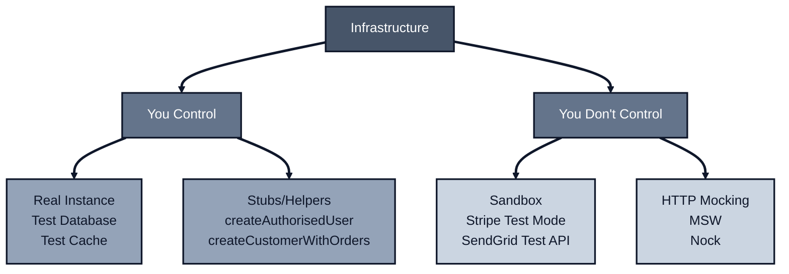
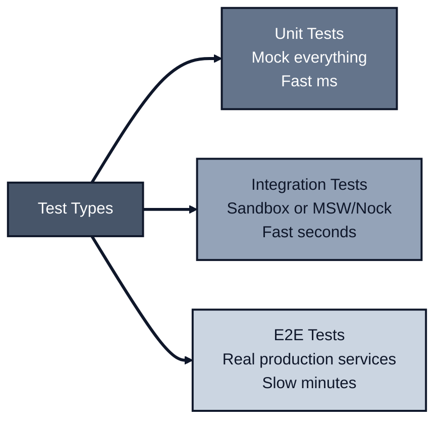

_Previously: [Why This Pattern Exists](../testing). We covered unit tests with mocks and integration tests with real databases. Now let's handle external services._

So far we've talked about testing your own code. You control the database, you control the cache, you control the business logic.

But what about the payment provider? The email service? The third-party API your app depends on?

You don't control those. And that changes everything.

---

## The Two Kinds of Infrastructure

There's a fundamental split in how you test infrastructure:

1. **Infrastructure you control** - Your database, your cache, your message queue
2. **Infrastructure you don't control** - Stripe, SendGrid, external APIs

For infrastructure you control, you can use real instances with test data. For infrastructure you don't control, you need different strategies.



---

## Testing Infrastructure You Control

For infrastructure your app owns (your database, your cache, your internal services), use **real instances with test data**.

### Stubs for Test Data

Create helper functions that set up realistic test data. These aren't mocks: they're real database records, real cache entries, created with [Faker](https://fakerjs.dev/) for variety.

> **Note:** These are sometimes called "fixtures" or "factories" in other testing frameworks. The key point is they create real data, not fake behavior. We use "stubs" here to mean "test data helpers."

```typescript
// src/test-utils/stubs.ts
import { faker } from '@faker-js/faker';
import prisma from '../db';

/**
 * Creates an authorised user for integration testing.
 * Returns the user and a valid API key for authentication.
 */
export async function createAuthorisedUser(overrides: {
  email?: string;
  role?: 'user' | 'admin';
} = {}) {
  const user = await prisma.user.create({
    data: {
      email: overrides.email ?? faker.internet.email(),
      name: faker.person.fullName(),
      role: overrides.role ?? 'user',
      passwordHash: await hashPassword('test-password-123'),
    },
  });

  const apiKey = await prisma.apiKey.create({
    data: {
      userId: user.id,
      key: `test_${faker.string.alphanumeric(32)}`,
      name: 'Test API Key',
      enabled: true,
    },
  });

  return {
    user,
    apiKey: apiKey.key, // Use this in Authorization header
  };
}

/**
 * Creates a customer with orders for testing order workflows.
 */
export async function createCustomerWithOrders(overrides: {
  orderCount?: number;
  orderStatus?: 'pending' | 'paid' | 'shipped';
} = {}) {
  const customer = await prisma.customer.create({
    data: {
      email: faker.internet.email(),
      name: faker.person.fullName(),
    },
  });

  const orders = await Promise.all(
    Array.from({ length: overrides.orderCount ?? 1 }).map(() =>
      prisma.order.create({
        data: {
          customerId: customer.id,
          status: overrides.orderStatus ?? 'pending',
          total: faker.number.int({ min: 1000, max: 100000 }),
        },
      })
    )
  );

  return { customer, orders };
}
```

Now your integration tests read clearly:

```typescript
// src/orders/create-order.test.int.ts
import { describe, it, expect } from 'vitest';
import { createAuthorisedUser, createCustomerWithOrders } from '../test-utils/stubs';
import { createOrder } from './create-order';
import prisma from '../db';

describe('createOrder (integration)', () => {
  it('creates order and charges customer', async () => {
    // Arrange: Real database, real test data
    const { user, apiKey } = await createAuthorisedUser({ role: 'user' });
    const { customer } = await createCustomerWithOrders({ orderCount: 0 });

    // Act: Call business logic with real deps
    const result = await createOrder(
      {
        customerId: customer.id,
        items: [{ productId: 'prod-1', quantity: 2 }],
      },
      { db: prisma, paymentProvider: paymentProvider }
    );

    // Assert: Verify it's actually in the database
    expect(result.ok).toBe(true);
    if (result.ok) {
      const dbOrder = await prisma.order.findUnique({
        where: { id: result.value.id },
      });
      expect(dbOrder).not.toBeNull();
    }
  });
});
```

**Why this works:**
- Real infrastructure catches real bugs (constraints, transactions, query issues)
- Faker generates unique data, so tests don't interfere
- No cleanup needed: each test creates its own data (as long as your test database is reset between runs or uses ephemeral containers)
- Tests can run in parallel

**When to use stubs:**
- Database operations
- Cache interactions
- Internal service calls
- Any infrastructure you deploy and control

---

## Testing Infrastructure You Don't Control

For external services (payment providers, email services, third-party APIs), you have three options, in order of preference:

### Option 1: Sandboxes (Best When Available)

Many services provide test sandboxes. Stripe, SendGrid, and Twilio all have test environments where you can send real HTTP requests and get predetermined responses.

**Worldpay Example (Magic Values):**

Some sandboxes use "magic values" in specific request fields to trigger deterministic responses. Worldpay's sandbox allows you to use special strings in the `cardHolderName` field to force specific outcomes. These "magic values" are specific to Worldpay's sandbox and only apply in test environments.

```typescript
// src/payments/worldpay-payment.test.int.ts
import { describe, it, expect } from 'vitest';
import { processWorldpayPayment } from './worldpay-payment';

describe('processWorldpayPayment (integration)', () => {
  it('handles card expired error', async () => {
    // Magic value in cardHolderName triggers specific error response
    const result = await processWorldpayPayment(
      {
        amount: 1000,
        currency: 'GBP',
        cardNumber: '4444333322221111',
        expiryMonth: '12',
        expiryYear: '2030',
        cardHolderName: 'REFUSED33', // Magic value → "CARD EXPIRED"
      },
      {
        worldpay: new WorldpayClient(process.env.WORLDPAY_TEST_KEY!),
      }
    );

    expect(result.ok).toBe(false);
    if (!result.ok) {
      expect(result.error).toBe('CARD_EXPIRED');
    }
  });

  it('handles hold card error', async () => {
    const result = await processWorldpayPayment(
      {
        amount: 1000,
        cardHolderName: 'REFUSED4', // Magic value → "HOLD CARD"
        // ... other fields
      },
      { worldpay: new WorldpayClient(process.env.WORLDPAY_TEST_KEY!) }
    );

    expect(result.ok).toBe(false);
    if (!result.ok) {
      expect(result.error).toBe('HOLD_CARD');
    }
  });

  it('succeeds with authorised magic value', async () => {
    const result = await processWorldpayPayment(
      {
        amount: 1000,
        cardHolderName: 'AUTHORISED', // Magic value → successful payment
        // ... other fields
      },
      { worldpay: new WorldpayClient(process.env.WORLDPAY_TEST_KEY!) }
    );

    expect(result.ok).toBe(true);
  });
});
```

**Common Sandbox Patterns:**

Different providers use different mechanisms, but the pattern is the same: use documented test inputs to get predictable outcomes.

| Provider | Deterministic test input | Example |
|----------|-------------------------|---------|
| Stripe | Payment method ID | `pm_card_chargeDeclined` |
| Worldpay | Cardholder name value | `REFUSED33` (in `cardHolderName` field) |
| PayPal | Amount or field value | Specific amount triggers error |
| Adyen | Test card number | `4111111111111111` (declined) |
| GoCardless | Test bank account | Fixed test account number |

**Why sandboxes are best:**
- Real HTTP calls catch integration issues (headers, auth, request format)
- Predetermined responses let you test error paths reliably
- No mocking code to maintain
- Tests run against the actual API contract
- In CI, keep sandbox tests small (smoke-level) and push most error path testing to MSW/nock to avoid rate limits and slow builds

**When to use sandboxes:**
- Service provides a test environment
- You need to verify request format and authentication
- Error scenarios are well-documented

**Limitations:**
- Not all services have sandboxes
- Some sandboxes have rate limits
- Network calls are slower than mocks

---

### Option 2: MSW (Mock Service Worker)

When sandboxes aren't available, use [MSW](https://mswjs.io/) to intercept HTTP requests at the boundary of your app. MSW works in both Node.js and browser environments.

**Setup:**

```typescript
// src/test-utils/msw-handlers.ts
import { http, HttpResponse } from 'msw';
import { setupServer } from 'msw/node';

export const handlers = [
  // Single handler for Stripe charges with branching logic
  // MSW matches handlers in order, so put more specific cases first
  // Note: Example uses /charges for brevity; use the endpoints your app actually uses (e.g., PaymentIntents)
  http.post('https://api.stripe.com/v1/charges', async ({ request }) => {
    const body = await request.formData();
    const paymentMethod = body.get('payment_method');
    const amount = body.get('amount');

    // Optional: Assert request details (headers, auth, etc.) to verify integration
    // Adjust this check to match your actual auth format
    const authHeader = request.headers.get('authorization');
    if (!authHeader?.startsWith('Bearer sk_test_')) {
      return HttpResponse.json(
        { error: { message: 'Invalid API key' } },
        { status: 401 }
      );
    }

    // Simulate decline for specific test card
    if (paymentMethod === 'pm_card_declined') {
      return HttpResponse.json(
        {
          error: {
            type: 'card_error',
            code: 'card_declined',
            message: 'Your card was declined.',
          },
        },
        { status: 402 }
      );
    }

    // Default to success
    return HttpResponse.json({
      id: 'ch_test_123',
      object: 'charge',
      amount: Number(amount),
      status: 'succeeded',
      currency: 'usd',
    });
  }),

  // Mock email service
  http.post('https://api.sendgrid.com/v3/mail/send', () => {
    return HttpResponse.json(
      { message: 'success' },
      { status: 202 }
    );
  }),
];

export const server = setupServer(...handlers);
```

**In your test file:**

```typescript
// src/payments/charge-customer.test.int.ts
import { describe, it, expect, beforeAll, afterEach, afterAll } from 'vitest';
import { server } from '../test-utils/msw-handlers';
import { createCharge } from './charge-customer';

describe('createCharge (integration)', () => {
  beforeAll(() => {
    server.listen({ onUnhandledRequest: 'error' });
  });

  afterEach(() => {
    server.resetHandlers();
  });

  afterAll(() => {
    server.close();
  });

  it('succeeds when payment method is valid', async () => {
    // Note: Even though we pass a real-looking Stripe client,
    // MSW intercepts the HTTP request before it reaches the network
    const result = await createCharge(
      {
        amount: 1000,
        currency: 'usd',
        paymentMethodId: 'pm_card_visa',
      },
      { stripe: new Stripe('sk_test_...') }
    );

    expect(result.ok).toBe(true);
    if (result.ok) {
      expect(result.value.status).toBe('succeeded');
    }
  });

  it('handles declined card', async () => {
    const result = await createCharge(
      {
        amount: 1000,
        paymentMethodId: 'pm_card_declined', // Triggers decline handler
      },
      { stripe: new Stripe('sk_test_...') }
    );

    expect(result.ok).toBe(false);
    if (!result.ok) {
      expect(result.error).toBe('PAYMENT_DECLINED');
    }
  });
});
```

**Why MSW:**
- Intercepts at the boundary of your app: your code makes real HTTP requests
- Works in Node.js and browser (same handlers for both)
- Type-safe with TypeScript
- Can override handlers per test
- You can also assert request payloads/headers inside handlers (e.g., check auth header) to lock down the integration

**When to use MSW:**
- Service doesn't have a sandbox
- You need to test error scenarios that are hard to trigger in sandboxes
- You want fast, reliable tests without network calls

**Reference:** See [nodejs-api-testing-examples-vitest](https://github.com/jagreehal/nodejs-api-testing-examples-vitest) for complete MSW examples.

---

### Option 3: Nock

[Nock](https://github.com/nock/nock) is a Node.js-specific HTTP mocking library. It intercepts requests at a lower level than MSW.

**Example:**

```typescript
// src/payments/charge-customer.test.int.ts
import { describe, it, expect, afterEach } from 'vitest';
import nock from 'nock';
import { createCharge } from './charge-customer';

describe('createCharge (integration)', () => {
  afterEach(() => {
    nock.cleanAll();
  });

  it('succeeds when payment method is valid', async () => {
    nock('https://api.stripe.com')
      .post('/v1/charges')
      .reply(200, {
        id: 'ch_test_123',
        status: 'succeeded',
        amount: 1000,
      });

    const result = await createCharge(
      {
        amount: 1000,
        paymentMethodId: 'pm_card_visa',
      },
      { stripe: new Stripe('sk_test_...') }
    );

    expect(result.ok).toBe(true);
  });

  it('handles declined card', async () => {
    nock('https://api.stripe.com')
      .post('/v1/charges')
      .reply(402, {
        error: {
          type: 'card_error',
          code: 'card_declined',
        },
      });

    const result = await createCharge(
      {
        amount: 1000,
        paymentMethodId: 'pm_card_declined',
      },
      { stripe: new Stripe('sk_test_...') }
    );

    expect(result.ok).toBe(false);
  });
});
```

**Nock vs MSW:**

| Feature | Nock | MSW |
|---------|------|-----|
| Environment | Node.js only | Node.js + Browser |
| Interception level | Lower (http/https modules) | Higher (fetch/XHR) |
| Setup complexity | Simple | Slightly more setup |
| Type safety | Manual | Better with TypeScript |

**When to use Nock:**
- Node.js-only codebase
- You prefer the simpler API
- You're already using it in your codebase

**When to prefer MSW:**
- You need browser testing too
- You want better TypeScript support
- You're starting fresh

**Reference:** See [nodejs-api-testing-examples-vitest](https://github.com/jagreehal/nodejs-api-testing-examples-vitest) for complete nock examples.

---

## Testing Error Scenarios: Rate Limits, Retries, and Timeouts

Integration tests with MSW or Nock let you test error scenarios that are difficult to trigger with real services. This is especially valuable for testing resilience patterns like retries, backoffs, and timeout handling.

### Testing Rate Limits (429 Errors)

You can simulate rate limiting to verify your retry logic and user experience:

```typescript
// src/payments/charge-customer.test.int.ts
import { describe, it, expect, vi } from 'vitest';
import { server } from '../test-utils/msw-handlers';
import { createCharge } from './charge-customer';

describe('createCharge handles rate limits', () => {
  it('retries after 429 with Retry-After header', async () => {
    let attemptCount = 0;

    server.use(
      http.post('https://api.stripe.com/v1/charges', async ({ request }) => {
        attemptCount++;
        if (attemptCount === 1) {
          // First attempt: rate limited
          return HttpResponse.json(
            { error: { message: 'Rate limit exceeded' } },
            {
              status: 429,
              headers: { 'Retry-After': '1' },
            }
          );
        }
        // Second attempt: succeeds
        return HttpResponse.json({
          id: 'ch_test_123',
          status: 'succeeded',
        });
      })
    );

    const result = await createCharge(
      { amount: 1000, paymentMethodId: 'pm_card_visa' },
      { stripe: new Stripe('sk_test_...') }
    );

    expect(result.ok).toBe(true);
    expect(attemptCount).toBe(2); // Verify retry happened
  });
});
```

### Testing Timeouts

Simulate slow or unresponsive services to verify timeout handling:

```typescript
it('handles timeout gracefully', async () => {
  server.use(
    http.post('https://api.stripe.com/v1/charges', async () => {
      // Simulate slow response that exceeds timeout
      await new Promise((resolve) => setTimeout(resolve, 5000));
      return HttpResponse.json({ id: 'ch_test_123' });
    })
  );

  const result = await createCharge(
    { amount: 1000, paymentMethodId: 'pm_card_visa' },
    {
      stripe: new Stripe('sk_test_...'),
      timeout: 1000, // 1 second timeout
    }
  );

  expect(result.ok).toBe(false);
  if (!result.ok) {
    expect(result.error).toBe('TIMEOUT');
  }
});
```

### Testing Retry and Backoff Logic

Verify that your retry logic with exponential backoff works correctly:

```typescript
it('implements exponential backoff on retries', async () => {
  const attemptTimes: number[] = [];
  let attemptCount = 0;

  server.use(
    http.post('https://api.stripe.com/v1/charges', async () => {
      attemptCount++;
      attemptTimes.push(Date.now());

      if (attemptCount < 3) {
        return HttpResponse.json(
          { error: { message: 'Temporary failure' } },
          { status: 503 }
        );
      }

      return HttpResponse.json({ id: 'ch_test_123', status: 'succeeded' });
    })
  );

  const result = await createCharge(
    { amount: 1000, paymentMethodId: 'pm_card_visa' },
    { stripe: new Stripe('sk_test_...') }
  );

  expect(result.ok).toBe(true);
  expect(attemptCount).toBe(3);

  // Verify backoff: time between attempts should increase
  const delay1 = attemptTimes[1] - attemptTimes[0];
  const delay2 = attemptTimes[2] - attemptTimes[1];
  expect(delay2).toBeGreaterThan(delay1);
});
```

### Testing UX Impact in Frontend

For frontend applications, you can test how errors affect the user experience:

```typescript
// src/components/PaymentForm.test.tsx
import { describe, it, expect } from 'vitest';
import { render, screen, waitFor } from '@testing-library/react';
import { server } from '../test-utils/msw-handlers';
import { PaymentForm } from './PaymentForm';

describe('PaymentForm error handling', () => {
  it('shows user-friendly message on rate limit', async () => {
    server.use(
      http.post('https://api.stripe.com/v1/charges', () => {
        return HttpResponse.json(
          { error: { message: 'Rate limit exceeded' } },
          { status: 429 }
        );
      })
    );

    render(<PaymentForm />);
    // ... trigger payment

    await waitFor(() => {
      expect(screen.getByText(/please try again in a moment/i)).toBeInTheDocument();
    });
  });

  it('shows loading state during retry', async () => {
    let attemptCount = 0;

    server.use(
      http.post('https://api.stripe.com/v1/charges', async () => {
        attemptCount++;
        if (attemptCount === 1) {
          await new Promise((resolve) => setTimeout(resolve, 100));
          return HttpResponse.json({ error: { message: 'Temporary failure' } }, { status: 503 });
        }
        return HttpResponse.json({ id: 'ch_test_123', status: 'succeeded' });
      })
    );

    render(<PaymentForm />);
    // ... trigger payment

    // Verify loading indicator appears during retry
    expect(screen.getByText(/processing/i)).toBeInTheDocument();
  });
});
```

### Testing Cascading Failures

Verify how errors in one service affect dependent services:

```typescript
it('handles payment service failure gracefully', async () => {
  server.use(
    http.post('https://api.stripe.com/v1/charges', () => {
      return HttpResponse.json(
        { error: { message: 'Service unavailable' } },
        { status: 503 }
      );
    })
  );

  const result = await processOrder(
    {
      customerId: 'cust_123',
      items: [{ productId: 'prod_1', quantity: 1 }],
    },
    { db: prisma, stripe: new Stripe('sk_test_...') }
  );

  expect(result.ok).toBe(false);
  if (!result.ok) {
    expect(result.error).toBe('PAYMENT_SERVICE_UNAVAILABLE');
  }

  // Verify order was not created in database
  const order = await prisma.order.findUnique({
    where: { customerId: 'cust_123' },
  });
  expect(order).toBeNull();
});
```

**Why this matters:**

- **Reliability**: Verify your retry and backoff logic works before production
- **User experience**: Test error messages and loading states in frontend
- **Resilience**: Ensure cascading failures are handled gracefully
- **Performance**: Test timeout handling without waiting for real network delays

These scenarios are nearly impossible to test reliably with real services, but integration tests with MSW or Nock make them straightforward.

---

## Why Integration Tests, Not E2E

These are **integration tests**, not end-to-end (E2E) tests. Here's the distinction:

**Integration tests:**
- Test integration with external services
- Use sandboxes or mocks (MSW/nock)
- Fast, reliable, no rate limits
- Cover many scenarios (success, errors, edge cases)

**E2E tests:**
- Test the entire system in production-like environment
- Make real calls to production services
- Slow, flaky, subject to rate limits
- Cover happy paths only



**Why integration tests win:**
- **Coverage**: You can test error scenarios that are hard to trigger in production
- **Speed**: No network latency, no rate limits
- **Reliability**: Tests don't fail because a third-party service is down
- **Cost**: No charges for test API calls

**When you still need E2E:**
- Verify production configuration works
- Test against actual service behavior (not documented)
- Final smoke test before deployment

But for day-to-day development? Integration tests with sandboxes or MSW/nock give you 90% of the value with 10% of the pain.

---

## Decision Matrix

| Scenario | Solution | Why |
|----------|----------|-----|
| Service has sandbox (Stripe, SendGrid) | Use sandbox | Real HTTP, predetermined responses, no mocking code |
| Service has no sandbox | MSW or Nock | Fast, reliable, covers error scenarios |
| Need browser + Node.js testing | MSW | Works in both environments |
| Node.js only | Nock or MSW | Either works, MSW has better TypeScript |
| Testing your own database/cache | Real instance + stubs | Catches real bugs, uses Faker for data |

**Rule of thumb:**
1. **Sandbox first** - If the service provides one, use it
2. **MSW second** - If no sandbox, MSW is more versatile
3. **Nock third** - Only if you're already using it or need Node-only

---

## The Complete Pattern

Putting it all together:

```typescript
// src/payments/process-payment.test.int.ts
import { describe, it, expect, beforeAll, afterEach, afterAll } from 'vitest';
import { createAuthorisedUser } from '../test-utils/stubs';
import { server } from '../test-utils/msw-handlers';
import { processPayment } from './process-payment';
import prisma from '../db';

describe('processPayment (integration)', () => {
  beforeAll(() => {
    server.listen({ onUnhandledRequest: 'error' });
  });

  afterEach(() => {
    server.resetHandlers();
  });

  afterAll(() => {
    server.close();
  });

  it('charges customer and creates order', async () => {
    // Arrange: Real database with test data
    const { user } = await createAuthorisedUser();
    const customer = await prisma.customer.create({
      data: {
        userId: user.id,
        email: user.email,
        stripeCustomerId: 'cus_test_123',
      },
    });

    // Act: Business logic with real DB; Stripe client wired, HTTP intercepted by MSW
    const result = await processPayment(
      {
        customerId: customer.id,
        amount: 1000,
        paymentMethodId: 'pm_card_visa',
      },
      {
        db: prisma,
        stripe: new Stripe(process.env.STRIPE_TEST_SECRET_KEY!),
      }
    );

    // Assert: Verify database state
    expect(result.ok).toBe(true);
    if (result.ok) {
      const order = await prisma.order.findUnique({
        where: { id: result.value.orderId },
      });
      expect(order).not.toBeNull();
      expect(order?.status).toBe('paid');
    }
  });
});
```

**What's happening:**
- **Real database** - Uses `createAuthorisedUser()` stub to set up test data
- **Stripe client wired, HTTP intercepted by MSW** - Real Stripe client instance, but MSW intercepts HTTP requests before they reach the network
- **Integration test** - Tests the full flow: database → business logic → external API

This gives you confidence that your code works end-to-end, without the flakiness and cost of real external services.

---

## The Rules

1. **Use stubs for infrastructure you control** - Real instances with test data helpers
2. **Prefer sandboxes when available** - Real HTTP calls, predetermined responses
3. **Use MSW or Nock when no sandbox** - Fast, reliable, covers error scenarios
4. **These are integration tests** - Not E2E, but they cover most scenarios
5. **Test error paths** - Sandboxes and mocks let you test failures reliably

---

## What's Next

We've covered testing your own code and testing external services. But there's one more piece: how do you structure your code so it's easy to test in the first place?

That's where the `fn(args, deps)` pattern comes in.

---

_Next: [Functions Over Classes](../functions). Learn how explicit dependency injection makes everything testable._
