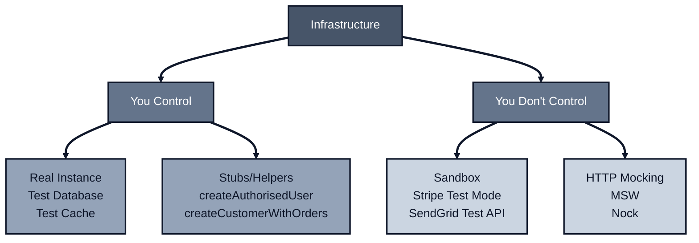
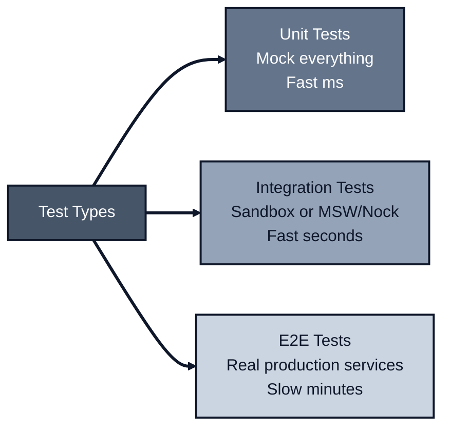

_Previously: [Testing Levels](../testing-levels). We assigned one owner to each behaviour. This page chooses the boundary strategy for services outside the application._

*Use this page when you are deciding how a test should reach a database, queue, or third-party API: real, sandbox, or simulated.*

You control your database, your cache and your business logic. You don't control the payment provider, the email service, or the third-party API your app depends on, and those need different test strategies.

---

## The Two Kinds of Infrastructure

Infrastructure divides into two kinds:

1. **Infrastructure you control** - Your database, your cache, your message queue
2. **Infrastructure you don't control** - Stripe, SendGrid, external APIs

For infrastructure you control, you can use real instances with test data. For infrastructure you don't control, you need different strategies.


```mermaid
graph TD
    A[Infrastructure] --> B[You Control]
    A --> C[You Don't Control]
    
    B --> D[Real Instance<br/>Test Database<br/>Test Cache]
    B --> E[Stubs/Helpers<br/>createAuthorisedUser<br/>createCustomerWithOrders]
    
    C --> F[Sandbox<br/>Stripe Test Mode<br/>SendGrid Test API]
    C --> G[HTTP Mocking<br/>MSW<br/>Nock]
    
    style A fill:#475569,stroke:#0f172a,stroke-width:2px,color:#fff
    style B fill:#64748b,stroke:#0f172a,stroke-width:2px,color:#fff
    style C fill:#64748b,stroke:#0f172a,stroke-width:2px,color:#fff
    style D fill:#94a3b8,stroke:#0f172a,stroke-width:2px,color:#0f172a
    style E fill:#94a3b8,stroke:#0f172a,stroke-width:2px,color:#0f172a
    style F fill:#cbd5e1,stroke:#0f172a,stroke-width:2px,color:#0f172a
    style G fill:#cbd5e1,stroke:#0f172a,stroke-width:2px,color:#0f172a
    
    linkStyle 0 stroke:#0f172a,stroke-width:3px
    linkStyle 1 stroke:#0f172a,stroke-width:3px
    linkStyle 2 stroke:#0f172a,stroke-width:3px
    linkStyle 3 stroke:#0f172a,stroke-width:3px
    linkStyle 4 stroke:#0f172a,stroke-width:3px
    linkStyle 5 stroke:#0f172a,stroke-width:3px
```

---

## Testing Infrastructure You Control

For infrastructure your app owns (your database, your cache, your internal services), use **real instances with test data**.

### Stubs for Test Data

Create helper functions that build realistic test data. They produce real database records and real cache entries, with [Faker](https://fakerjs.dev/) for variety.

> **Note:** Other testing frameworks call these "fixtures" or "factories." They create real data, not fake behavior. Here "stubs" means "test data helpers."

```typescript
// src/test-utils/stubs.ts
import { faker } from '@faker-js/faker';
import prisma from '../db';

/**
 * Creates an authorised user for integration testing.
 * Returns the user and a valid API key for authentication.
 */
export async function createAuthorisedUser(overrides: {
  email?: string;
  role?: 'user' | 'admin';
} = {}) {
  const user = await prisma.user.create({
    data: {
      email: overrides.email ?? faker.internet.email(),
      name: faker.person.fullName(),
      role: overrides.role ?? 'user',
      passwordHash: await hashPassword('test-password-123'),
    },
  });

  const apiKey = await prisma.apiKey.create({
    data: {
      userId: user.id,
      key: `test_${faker.string.alphanumeric(32)}`,
      name: 'Test API Key',
      enabled: true,
    },
  });

  return {
    user,
    apiKey: apiKey.key, // Use this in Authorization header
  };
}

/**
 * Creates a customer with orders for testing order workflows.
 */
export async function createCustomerWithOrders(overrides: {
  orderCount?: number;
  orderStatus?: 'pending' | 'paid' | 'shipped';
} = {}) {
  const customer = await prisma.customer.create({
    data: {
      email: faker.internet.email(),
      name: faker.person.fullName(),
    },
  });

  const orders = await Promise.all(
    Array.from({ length: overrides.orderCount ?? 1 }).map(() =>
      prisma.order.create({
        data: {
          customerId: customer.id,
          status: overrides.orderStatus ?? 'pending',
          total: faker.number.int({ min: 1000, max: 100000 }),
        },
      })
    )
  );

  return { customer, orders };
}
```

Now your integration tests read clearly:

```typescript
// src/orders/create-order.test.int.ts
import { describe, it, expect } from 'vitest';
import { createAuthorisedUser, createCustomerWithOrders } from '../test-utils/stubs';
import { createOrder } from './create-order';
import prisma from '../db';

describe('createOrder (integration)', () => {
  it('creates order and charges customer', async () => {
    // Arrange: Real database, real test data
    const { user, apiKey } = await createAuthorisedUser({ role: 'user' });
    const { customer } = await createCustomerWithOrders({ orderCount: 0 });

    // Act: Call business logic with real deps
    const result = await createOrder(
      {
        customerId: customer.id,
        items: [{ productId: 'prod-1', quantity: 2 }],
      },
      { db: prisma, paymentProvider: paymentProvider }
    );

    // Assert: Verify it's actually in the database
    expect(result.ok).toBe(true);
    if (result.ok) {
      const dbOrder = await prisma.order.findUnique({
        where: { id: result.value.id },
      });
      expect(dbOrder).not.toBeNull();
    }
  });
});
```

**Why this works:**
- Real infrastructure catches real bugs (constraints, transactions, query issues)
- Faker generates unique data, so tests don't interfere
- No cleanup needed: each test creates its own data (as long as your test database is reset between runs or uses ephemeral containers)
- Tests can run in parallel

**When to use stubs:**
- Database operations
- Cache interactions
- Internal service calls
- Any infrastructure you deploy and control

---

## Testing Infrastructure You Don't Control

Payment providers, email services, third-party APIs: you cannot seed them and you cannot make them fail on demand. The three options, in order of preference, are a provider sandbox, MSW, and nock. [Simulating Third-Party Services](../third-party-doubles) walks through each with code, and [Testing Failure Scenarios](../testing-failure-scenarios) uses them to force the 429s, timeouts and cascades a live service will not give you on cue.

---

## Why Integration Tests, Not E2E

These are **integration tests**, not end-to-end (E2E) tests:

**Integration tests:**
- Test integration with external services
- Use sandboxes or mocks (MSW/nock)
- Fast, reliable, no rate limits
- Cover many scenarios (success, errors, edge cases)

**E2E tests:**
- Test the entire system in production-like environment
- Make real calls to production services
- Slow, flaky, subject to rate limits
- Cover happy paths only


```mermaid
graph LR
    A[Test Types] --> B[Unit Tests<br/>Mock everything<br/>Fast ms]
    A --> C[Integration Tests<br/>Sandbox or MSW/Nock<br/>Fast seconds]
    A --> D[E2E Tests<br/>Real production services<br/>Slow minutes]
    
    style A fill:#475569,stroke:#0f172a,stroke-width:2px,color:#fff
    style B fill:#64748b,stroke:#0f172a,stroke-width:2px,color:#fff
    style C fill:#94a3b8,stroke:#0f172a,stroke-width:2px,color:#0f172a
    style D fill:#cbd5e1,stroke:#0f172a,stroke-width:2px,color:#0f172a
    
    linkStyle 0 stroke:#0f172a,stroke-width:3px
    linkStyle 1 stroke:#0f172a,stroke-width:3px
    linkStyle 2 stroke:#0f172a,stroke-width:3px
```

**Why integration tests win:**
- **Coverage**: You can test error scenarios that are hard to trigger in production
- **Speed**: No network latency, no rate limits
- **Reliability**: Tests don't fail because a third-party service is down
- **Cost**: No charges for test API calls

**When you still need E2E:**
- Verify production configuration works
- Test against actual service behavior (not documented)
- Final smoke test before deployment

For day-to-day development, integration tests with sandboxes or MSW/nock give you most of the value of E2E at a fraction of the cost.

---

## Decision Matrix

| Scenario | Solution | Why |
|----------|----------|-----|
| Service has sandbox (Stripe, SendGrid) | Use sandbox | Real HTTP, predetermined responses, no mocking code |
| Service has no sandbox | MSW or Nock | Fast, reliable, covers error scenarios |
| Need browser + Node.js testing | MSW | Works in both environments |
| Node.js only | Nock or MSW | Either works, MSW has better TypeScript |
| Testing your own database/cache | Real instance + stubs | Catches real bugs, uses Faker for data |

**Rule of thumb:**
1. **Sandbox first** - If the service provides one, use it
2. **MSW second** - If no sandbox, MSW is more versatile
3. **Nock third** - Only if you're already using it or need Node-only

---

## The Rules

1. **Use stubs for infrastructure you control** - Real instances with test data helpers
2. **Prefer sandboxes when available** - Real HTTP calls, predetermined responses
3. **Use MSW or Nock when no sandbox** - Fast, reliable, covers error scenarios
4. **These are integration tests** - Not E2E, but they cover most scenarios
5. **Test error paths** - Sandboxes and mocks let you test failures reliably

---

## What's Next

The remaining piece is structuring your code so it's easy to test in the first place, which is what the `fn(args, deps)` pattern does.

---

_Next: [Functions Over Classes](../functions). Learn how explicit dependency injection makes your code testable._
