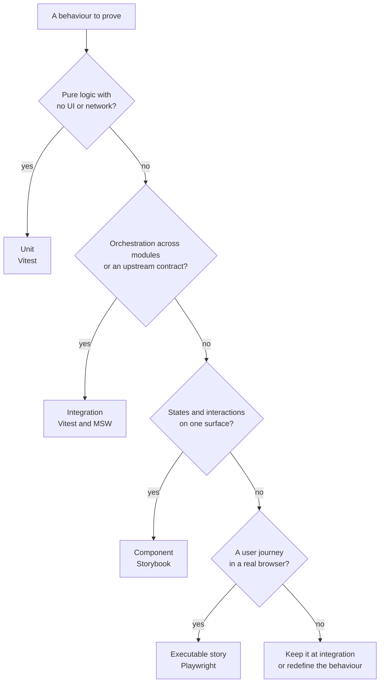

_Previously: [Testing & Testability](../testing/). That pattern makes dependencies explicit. This pattern decides which test should exercise each dependency._

Teams lose time when test levels overlap. A browser test checks a loading state that a component test covers. An integration test repeats a parsing rule from a unit test. Three test files keep separate copies of the same API response.

Assign each behaviour to the shallowest level that can prove it.

## Four Levels, Four Owners

| Level | Tooling | Owns | Keep out |
| --- | --- | --- | --- |
| **Unit** | Vitest | Pure logic | Network, DOM, orchestration |
| **Integration** | Vitest and MSW | Orchestration and upstream contracts | Visual states, navigation |
| **Component** | Storybook and play functions | The state matrix of one surface | Routing, full user journeys |
| **Executable story** | Playwright | One user journey in a browser | Helper truth tables, full state matrices |

A **surface** is one user-facing area that can render several states without navigation. A chat panel may show empty, loading, streaming, result, and error states.

A **journey** follows a user over time. It starts with intent, crosses one or more system seams, and ends with an outcome the user can observe.

## Pick the Shallowest Owner



An HTTP contract with no user journey stays at the integration level. The final branch asks you to refine the test boundary rather than send leftover behaviour to Playwright.

If two levels claim the same behaviour, move the test down. Keep the higher-level test when risk crosses levels, such as an authentication redirect through its callback or a streamed API response reaching the rendered component.

## Level 1: Unit Tests Own Pure Logic

Unit tests cover functions with no network or UI. Give the function inputs and check its output.

```typescript
import { describe, expect, it } from 'vitest';
import { quoteTrip } from './booking-tool';

describe('quoteTrip', () => {
  it('flags a route that exceeds the budget', () => {
    const quote = quoteTrip('New York', 'San Francisco', 250);

    expect(quote).toMatchObject({
      estimatedCost: 320,
      fitsBudget: false,
    });
  });
});
```

Use unit tests for parsing, arithmetic, validation rules, and state-free helpers. Move a test to the integration level when it needs several modules or an adapter.

## Level 2: Integration Tests Own Orchestration

Integration tests run production code across a seam. Replace the service beyond that seam with a controlled adapter.

This example runs the real `getWeather` function, including `fetch` and response parsing. MSW controls the external provider:

```typescript
import { http, HttpResponse } from 'msw';
import { setupServer } from 'msw/node';
import { afterAll, afterEach, beforeAll, expect, it } from 'vitest';
import { getWeather, WeatherApiResponse } from './weather-tool';

const providerResponse = {
  nearest_area: [{ areaName: [{ value: 'Lisbon' }] }],
  current_condition: [{ temp_F: '72', weatherDesc: [{ value: 'Sunny' }] }],
};

const server = setupServer();

beforeAll(() => server.listen({ onUnhandledRequest: 'error' }));
afterEach(() => server.resetHandlers());
afterAll(() => server.close());

it('maps the provider response to the application type', async () => {
  server.use(
    http.get('https://wttr.in/:location', () =>
      HttpResponse.json(providerResponse),
    ),
  );

  await expect(getWeather('Lisbon')).resolves.toEqual({
    location: 'Lisbon',
    temperature: 72,
    condition: 'Sunny',
  });
});

it('keeps the fixture aligned with the provider contract', () => {
  expect(() => WeatherApiResponse.parse(providerResponse)).not.toThrow();
});
```

The contract assertion catches fixture drift. Add a failure case for status mapping, timeouts, or malformed responses when your adapter handles them.

## Level 3: Component Tests Own a Surface

Treat each Storybook story as one state in a component's variation matrix. Keep the router and application journey outside the story.

```tsx
import type { Meta, StoryObj } from '@storybook/react-vite';
import { expect, within } from 'storybook/test';
import { WeatherToolPart } from './WeatherToolPart';

const meta = {
  component: WeatherToolPart,
} satisfies Meta<typeof WeatherToolPart>;

export default meta;
type Story = StoryObj<typeof meta>;

export const Result: Story = {
  args: {
    state: 'output-available',
    location: 'Lisbon',
    temperature: 72,
    condition: 'Sunny',
  },
  play: async ({ canvasElement }) => {
    const canvas = within(canvasElement);

    await expect(canvas.getByText(/72°F/)).toBeInTheDocument();
    await expect(canvas.getByText(/Sunny/)).toBeInTheDocument();
  },
};
```

Add stories for meaningful states such as loading, result, and error. Test interactions that stay inside the component. Let Playwright own navigation between surfaces.

## Level 4: Executable Stories Own Journeys

An executable story is an end-to-end journey test. The name describes its purpose; the conventional `e2e/` directory describes its scope.

Playwright proves browser wiring and user-visible outcomes. Run the real application and the real APIs your team owns wherever the test environment permits it. Use a real database with isolated test data. Control a third-party service at its boundary when live calls would add cost, rate limits, or unstable results.

```typescript
import { expect, test } from '@playwright/test';

test('a traveller asks about weather and receives packing advice', async ({
  page,
}) => {
  await page.goto('/');

  await page.getByLabel('Message').fill(
    'What should I pack for Lisbon this weekend?',
  );
  await page.getByRole('button', { name: 'Send' }).click();

  await expect(
    page.getByRole('button', { name: /weather.*completed/i }),
  ).toBeVisible();
  await expect(page.getByText(/Lisbon/i)).toBeVisible();
});
```

This test calls the application's real chat API. The component suite covers each weather-card state. The browser test checks that the browser, API, orchestration, and rendered result work together.

Assert exact fields when a sandbox or test adapter provides a known payload. With an uncontrolled live provider, assert stable contract properties and the user-visible outcome instead of volatile values such as the current temperature.

## Mock at the Seam You Do Not Own

Choose the mock boundary from the responsibility of the test:

| Test | Run for real | Control |
| --- | --- | --- |
| Unit | Pure function | Function inputs |
| Integration | Orchestration and adapters | Model or upstream service |
| Component | Component rendering and local interaction | Props or the component API boundary |
| Executable story | Browser, first-party APIs, and application journey | Third-party service when a live call adds cost or instability |

Keep shared fixtures in one place when two test levels need the same payload. Storybook and Playwright can share a chat-stream builder. Integration tests can share an HTTP response fixture and validate it against the boundary schema.

## Choose an Executable Story API Mode

Executable stories must use real first-party APIs wherever the test environment can support them: browser to application API, through orchestration, to a test database. Seed the records that the journey needs and remove them after the test.

Control third-party providers through a sandbox or a test adapter inside the running server. The browser still calls the real application API, so the journey covers the first-party path.

Use a Playwright route mock as a fallback when CI cannot run the application API or when the test must force a browser-facing transport failure:

```typescript
await page.route('**/api/chat', async (route) => {
  await route.fulfill({
    status: 200,
    contentType: 'text/event-stream',
    body: weatherReply({ location: 'Lisbon', temperature: 72 }),
  });
});
```

This route replaces the first-party API and gives less integration confidence than the real path. Keep it for narrow browser cases.

Use HAR replay for a captured production failure or a conversation whose exact request and response matter. A HAR preserves an HTTP exchange. [Point-in-Time Capture](../point-in-time-capture/) preserves the business inputs behind a decision. Both give you evidence from the time of the event, but they answer different questions.

Keep core journeys on real first-party APIs. Use authored route mocks and HAR files for narrow cases where control adds more confidence than a live remote call.

## Place Tests by Owner

This guide follows the co-location pattern from [Functions Over Classes](../functions/). Unit and integration tests sit beside their source. Storybook stories sit beside their components. Browser journeys stay in `e2e/`.

```text
src/
  tools/
    booking-tool.ts
    booking-tool.test.ts          level 1: unit
    weather-tool.ts
    weather-tool.int.test.ts      level 2: integration
  client/
    WeatherToolPart.tsx
    WeatherToolPart.stories.tsx   level 3: component
e2e/
  chat.story.spec.ts              level 4: executable story
  record-replay/
    chat.story.spec.ts            level 4: captured journey
```

Some repositories centralise unit and integration tests under `tests/unit/` and `tests/integration/`. That layout works when the team applies it with consistency. File suffixes and CI commands should still expose each test's owner.

## Review New Tests

Ask these questions during review:

- Does one lower level prove the same behaviour?
- Does the test cross the seam its level owns?
- Does a shared fixture already cover this payload?
- Would a refactor that preserves user behaviour break the test?

Move the test down when a lower level can answer the same question with less setup.

## Related Patterns

- [Testing & Testability](../testing/) covers explicit dependency injection and local test doubles.
- [Testing External Infrastructure](../testing-external-services/) covers real test infrastructure, provider sandboxes, MSW, and HTTP mocks.

_Next: [Testing External Infrastructure](../testing-external-services/). Choose real instances, sandboxes, or controlled responses for each external boundary._
