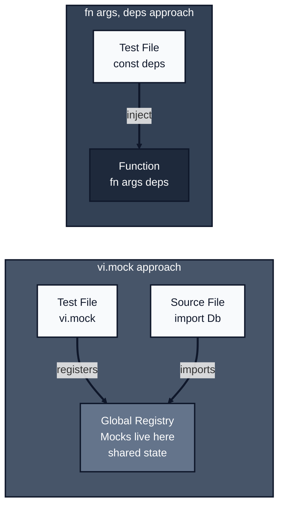

*Use this page when you are deciding how a function receives its collaborators, or replacing `vi.mock` with injected deps.*

Start with tests, before functions, dependency injection, or architecture. Tests are where the pain shows up first.

---

## The Class Testing Problem

It's 2am. Your test suite failed in CI. You stare at the error:

```text
TypeError: Cannot read property 'mockResolvedValue' of undefined
    at Object.<anonymous> (/tests/UserService.test.ts:42:18)
```

You didn't change the test or `UserService`. You *renamed a folder*.

Now you're debugging test infrastructure instead of shipping features.

---

You've written a service class:

```typescript
class UserService {
  constructor(
    private db: Database,
    private mailer: Mailer
  ) {}

  async createUser(name: string, email: string): Promise<User> {
    const user = await this.db.save({ name, email });
    await this.mailer.sendWelcome(user);
    return user;
  }
}
```

Now you want to test it. The instinct is to reach for `vi.mock`:

```typescript
import { vi, describe, it, expect } from 'vitest';
import { UserService } from './UserService';
import { Database } from './Database';
import { Mailer } from './Mailer';

vi.mock('./Database');
vi.mock('./Mailer');

describe('UserService', () => {
  it('creates a user and sends welcome email', async () => {
    const mockUser = { id: '1', name: 'Alice', email: 'alice@test.com' };

    const mockDb = new Database() as jest.Mocked<Database>;
    mockDb.save.mockResolvedValue(mockUser);

    const mockMailer = new Mailer() as jest.Mocked<Mailer>;
    mockMailer.sendWelcome.mockResolvedValue(undefined);

    const service = new UserService(mockDb, mockMailer);
    const result = await service.createUser('Alice', 'alice@test.com');

    expect(result).toEqual(mockUser);
    expect(mockMailer.sendWelcome).toHaveBeenCalledWith(mockUser);
  });
});
```

This looks reasonable, but it hides problems.

---

## Why vi.mock Is Fragile

### 1. Module Path Coupling

```typescript
vi.mock('./Database');
```

That string `'./Database'` must match the import path in your source file. Refactor the folder structure and the tests break. Move a file and they break again. The mock is coupled to the module's path, not its behavior.

### 2. Hoisting Magic

`vi.mock` calls are hoisted to the top of the file. This code:

```typescript
const mockFn = vi.fn();
vi.mock('./Database', () => ({
  Database: vi.fn(() => ({ save: mockFn }))
}));
```

...doesn't work how it looks. The `vi.mock` runs *before* `const mockFn = vi.fn()`. You end up fighting JavaScript execution order with Vitest-specific hoisting rules.

You read the docs, try `vi.hoisted()`, and add workarounds. Then a coworker asks "why is our test setup so complicated?" and you don't have a good answer.

### 3. Global State

Mocks are global by default. One test's mock can leak into another. You need `vi.clearAllMocks()` or `vi.resetAllMocks()` in `beforeEach`, and you have to remember which one clears what.

Your test passes locally but fails in CI. You add `--runInBand` to run tests sequentially. The test takes 3x longer but at least it's consistent. You've traded correctness for performance because of invisible shared state.

### 4. Type Erosion

```typescript
import type { Mock } from 'vitest';

const mockDb = {
  save: vi.fn() as Mock<(user: User) => Promise<User>>,
};
```

That cast (`as Mock<...>`) is a type escape hatch. You're telling TypeScript "trust me." If `Database` changes its interface, the cast still passes. You won't get type errors in tests until runtime.

### Prefer Args for Time and Randomness

Before reaching for `vi.mock`, ask: can I pass this as an argument instead?

For dates, the `fn(args, deps)` pattern often works better than mocking:

```typescript
// Instead of mocking Date or date-fns, pass time as an argument
function createOrder(
  args: {
    customerId: string;
    items: OrderItem[];
    timestamp?: Date;  // defaults to now
  },
  deps: CreateOrderDeps
) {
  const createdAt = args.timestamp ?? new Date();
  return deps.db.orders.create({
    data: { ...args, createdAt },
  });
}
```

Now tests have total control without any mocking:

```typescript
it('sets createdAt to provided timestamp', async () => {
  const fixedDate = new Date('2024-01-15T10:00:00Z');

  const result = await createOrder(
    { customerId: '123', items: [], timestamp: fixedDate },
    deps
  );

  expect(result.createdAt).toEqual(fixedDate);
});
```

The same pattern works for UUIDs and other "environmental" values:

```typescript
function createUser(
  args: {
    email: string;
    id?: string;  // defaults to generated UUID
  },
  deps: CreateUserDeps
) {
  const id = args.id ?? crypto.randomUUID();
  // ...
}

// Test can now assert on exact ID
const result = await createUser(
  { email: 'test@example.com', id: 'test-uuid-1234' },
  deps
);
expect(result.id).toBe('test-uuid-1234');
```

**Why this is better than mocking:**
- No hoisting magic or module path coupling
- The dependency is visible in the function signature
- Tests are simpler: pass the value you want
- Production code works unchanged (defaults kick in)

### When vi.mock Is Still Appropriate

`vi.mock` still has legitimate uses for things you can't inject:

```typescript
// Third-party library that calls Date internally
vi.mock('date-fns', () => ({
  formatDistance: () => '2 days ago',
}));

// Platform APIs in code you don't control
vi.mock('fs/promises');
```

Use `vi.mock` when:
- A third-party library calls `Date` or `crypto` internally
- You can't modify the function signature (legacy code)
- The value is environmental (logging timestamps, metrics)

The problem is using `vi.mock` for *application logic*: your services, repositories, and business functions. That's where explicit args and deps win.

Lint that line rather than remembering it. [anti-slop](https://github.com/dmmulroy/anti-slop)'s `no-module-mocking` bans `vi.mock` and `jest.mock`; scope it to your application code and leave the exceptions above in an override. The [Oxlint chapter](../lint) covers the rest of that ruleset.

All of these issues stem from the same root cause: dependencies are implicit and global instead of explicit and local.

---

## A Different Approach

Pass dependencies as arguments.


```mermaid
graph LR
    subgraph Mock["vi.mock approach"]
        T1[Test File<br/>vi.mock] -->|registers| G[Global Registry<br/>Mocks live here<br/>shared state]
        S1[Source File<br/>import Db] -->|imports| G
    end
    
    subgraph Explicit["fn args, deps approach"]
        T2[Test File<br/>const deps] -->|inject| F[Function<br/>fn args deps]
    end
    
    style Mock fill:#475569,stroke:#0f172a,stroke-width:2px,color:#fff
    style Explicit fill:#334155,stroke:#0f172a,stroke-width:2px,color:#fff
    style G fill:#64748b,stroke:#0f172a,stroke-width:2px,color:#fff
    style F fill:#1e293b,stroke:#0f172a,stroke-width:2px,color:#fff
    style T1 fill:#f8fafc,stroke:#0f172a,stroke-width:2px,color:#0f172a
    style S1 fill:#f8fafc,stroke:#0f172a,stroke-width:2px,color:#0f172a
    style T2 fill:#f8fafc,stroke:#0f172a,stroke-width:2px,color:#0f172a
    
    linkStyle 0 stroke:#0f172a,stroke-width:3px
    linkStyle 1 stroke:#0f172a,stroke-width:3px
    linkStyle 2 stroke:#0f172a,stroke-width:3px
```

**Key difference:** `vi.mock` uses global shared state. `fn(args, deps)` uses direct injection with no global state. Each test owns its deps.

### Comparison at a Glance

| Aspect | `vi.mock` (Module Mocking) | `fn(args, deps)` (Explicit Injection) |
| ------ | -------------------------- | ------------------------------------- |
| **State** | Global & shared | Local & isolated |
| **Refactoring** | High risk (path coupling) | Low risk (type-safe) |
| **Execution** | Hoisting "magic" | Standard JS flow |
| **Type Safety** | Requires manual casting | Naturally enforced |
| **Test Isolation** | Needs `clearAllMocks()` | Each test owns its deps |

```typescript
type CreateUserDeps = {
  db: { save: (user: Omit<User, 'id'>) => Promise<User> };
  mailer: { sendWelcome: (user: User) => Promise<void> };
};

async function createUser(
  args: { name: string; email: string },
  deps: CreateUserDeps
): Promise<User> {
  const user = await deps.db.save(args);
  await deps.mailer.sendWelcome(user);
  return user;
}
```

Now test it:

```typescript
import { describe, it, expect, vi } from 'vitest';
import { createUser } from './createUser';

describe('createUser', () => {
  it('creates a user and sends welcome email', async () => {
    const mockUser = { id: '1', name: 'Alice', email: 'alice@test.com' };

    const deps = {
      db: { save: vi.fn().mockResolvedValue(mockUser) },
      mailer: { sendWelcome: vi.fn().mockResolvedValue(undefined) },
    };

    const result = await createUser({ name: 'Alice', email: 'alice@test.com' }, deps);

    expect(result).toEqual(mockUser);
    expect(deps.mailer.sendWelcome).toHaveBeenCalledWith(mockUser);
  });
});
```

The test has no `vi.mock`, hoisting, path coupling, or global state.

The mock is an object you pass in. If the function needs different deps, you pass different deps. Each test is independent.

---

## Structure Tests with Arrange-Act-Assert

Every test follows three phases:

1. **Arrange** – Set up test data and dependencies
2. **Act** – Execute the function under test
3. **Assert** – Verify the outcome

Adding explicit comments makes this structure visible:

```typescript
it('creates a user and sends welcome email', async () => {
  // Arrange
  const mockUser = { id: '1', name: 'Alice', email: 'alice@test.com' };
  const deps = {
    db: { save: vi.fn().mockResolvedValue(mockUser) },
    mailer: { sendWelcome: vi.fn().mockResolvedValue(undefined) },
  };

  // Act
  const result = await createUser({ name: 'Alice', email: 'alice@test.com' }, deps);

  // Assert
  expect(result).toEqual(mockUser);
  expect(deps.mailer.sendWelcome).toHaveBeenCalledWith(mockUser);
});
```

Section size tells you when a test has a problem. A bloated Arrange section suggests the test is too complex or testing too many things. Multiple unrelated assertions indicate you're verifying more than one behavior.

The `fn(args, deps)` pattern keeps Arrange simple. You create an object with mock functions instead of orchestrating module mocking magic.

---

## Even Better: vitest-mock-extended

Creating mock objects by hand works, but you lose type safety. If you forget a method or the interface changes, nothing warns you.

[vitest-mock-extended](https://github.com/eratio08/vitest-mock-extended) gives you typed mocks:

```typescript
import { describe, it, expect } from 'vitest';
import { mock } from 'vitest-mock-extended';
import { createUser, CreateUserDeps } from './createUser';

describe('createUser', () => {
  it('creates a user and sends welcome email', async () => {
    const mockUser = { id: '1', name: 'Alice', email: 'alice@test.com' };

    const deps = mock<CreateUserDeps>();
    deps.db.save.mockResolvedValue(mockUser);

    const result = await createUser({ name: 'Alice', email: 'alice@test.com' }, deps);

    expect(result).toEqual(mockUser);
    expect(deps.mailer.sendWelcome).toHaveBeenCalledWith(mockUser);
  });
});
```

`mock<CreateUserDeps>()` creates an object that:

- Has all the methods from `CreateUserDeps`
- Each method is a `vi.fn()` mock
- TypeScript enforces the shape

If you rename `sendWelcome` to `sendWelcomeEmail` in your deps type, the test fails to compile, with no runtime surprises.

---

## The Pattern Emerges

Notice what happened:

1. **Dependencies became explicit.** They're in the function signature, not hidden in a constructor.
2. **Mocks became simple.** Plain objects, no framework magic.
3. **Tests became isolated.** No global state, no module mocking.
4. **Types stayed accurate.** vitest-mock-extended maintains type safety.

The rest of this series builds on this pattern. When you structure code as `fn(args, deps)`:

- **Testing is trivial.** Pass mock deps, call function, check result.
- **Dependencies are visible.** You can see what a function needs.
- **Composition is natural.** Functions are plain functions.

If you like this pattern, you can enforce it. A short `prefer-object-params` rule flags functions with three or more positional parameters (so `fn(args, deps)` passes); the [Oxlint chapter](../lint#enforcing-function-signatures) has the source.

### Classes Aren't Evil, Hidden State Is

Classes can still work if they're:

- **Thin.** Wiring only, no business logic.
- **IO-free.** They don't reach out to databases or APIs directly.
- **Delegating.** They call pure functions that do the work.

The problem comes when classes accumulate hidden state, implicit dependencies, and methods that share state through `this`. The `fn(args, deps)` pattern makes it *harder* to do that by accident. More on this in [Functions Over Classes](..//functions).

---

## What's Next

If your code is hard to test, the structure is wrong, so treat testability as a design signal.

The rest of the testing group is split by job, so you can hand an agent the one page it needs:

- [Testing Levels](../testing-levels): which level owns which behaviour.
- [Browser Journeys](../browser-journeys): Playwright specifics, from locators to premature-pass races.
- [Test Data and Fakes](../test-data): unit versus integration files, database guardrails, Prisma fakes, Faker stubs.
- [Testing External Infrastructure](../testing-external-services): sandboxes, MSW, nock.
- [Test Quality](../test-quality): from bug report to test, and why coverage is not proof.
- [CI Gates and Triage](../ci-gates): what blocks a merge, and how to read a red run.

Next: [Testing Levels](../testing-levels)
