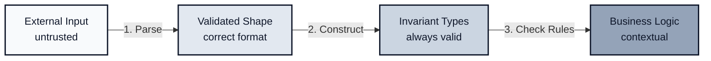

*Previously: [Functions Over Classes](./functions). We established `fn(args, deps)` as our core pattern.*

---

## The Core Tension

Two forces pull in opposite directions:

**Correctness & Safety** - Functions should behave correctly no matter who calls them. Validate everything, trust nothing.

**Clarity & Maintainability** - Validation logic should not be duplicated or drift over time. Code should be readable.

If you only validate at boundaries, bugs appear when someone forgets. If you validate inside every function, logic scatters and diverges:

```typescript
// createUser
if (!args.email.includes('@')) throw new Error('Invalid email');

// updateUser (different developer, different day)
if (!args.email.match(/^[^@]+@[^@]+$/)) throw new Error('Email must be valid');

// inviteUser (yet another developer)
// Forgot to validate. Oops.
```

The solution is not dogma, but **layered responsibility**.

---

## Three Kinds of Validation

Most confusion comes from treating all "validation" as one thing. It isn't.

| Kind                       | Question                             | Where                            | How                         |
| -------------------------- | ------------------------------------ | -------------------------------- | --------------------------- |
| **Boundary Parsing**       | Is this data shaped correctly?       | HTTP handlers, queue consumers   | Zod schemas                 |
| **Invariant Construction** | Can this value exist at all?         | Factory functions, branded types | `.brand<>()`, value objects |
| **Domain Rules**           | Is this operation allowed right now? | Business functions               | Database lookups, context   |



---

## 1. Boundary Parsing (Shape & Format)

**Question:** Is this untrusted data shaped correctly?

- Required fields present
- Types correct
- Format valid (email, uuid, url)
- Ranges respected
- Data normalized (trim, lowercase)

**Where:** HTTP handlers, queue consumers, CLI entrypoints, file imports.

### Parse, Don't Validate

**Validation** answers "yes/no". **Parsing** gives you a valid value or fails.

```typescript
// Validation mindset - still have a string
function isValidEmail(s: string): boolean { ... }

// Parsing mindset - get an Email type or fail
function parseEmail(s: string): Email { ... }
```

Once parsed, the value cannot be invalid by construction.

### Zod at the Entry Point

```typescript
import { z } from 'zod';

const CreateUserSchema = z.object({
  name: z.string().min(2).max(100),
  email: z.string().email(),
});

type CreateUserInput = z.infer<typeof CreateUserSchema>;
```

In your HTTP handler:

```typescript
app.post('/users', async (req, res) => {
  const parsed = CreateUserSchema.safeParse(req.body);

  if (!parsed.success) {
    return res.status(400).json(formatZodError(parsed.error));
  }

  const user = await createUser(parsed.data, deps);
  return res.status(201).json(user);
});
```

The business function never sees invalid data. `parsed.data` is typed as `CreateUserInput`.

Reuse schemas across entry points (HTTP, CLI, queue) within a single service, but don't share them across service boundaries. Each service owns its own contract.

### Coercion & Transforms

HTTP query params are strings. Zod can coerce them:

```typescript
const PaginationSchema = z.object({
  page: z.coerce.number().int().positive().default(1),
  limit: z.coerce.number().int().min(1).max(100).default(20),
});

// "?page=2&limit=50" → { page: 2, limit: 50 }
```

Clean data as you validate:

```typescript
const CreatePostSchema = z.object({
  title: z.string().transform(s => s.trim()),
  slug: z.string().transform(s => s.toLowerCase().replace(/\s+/g, '-')),
});
```

### Standardized Error Responses

```typescript
type ValidationErrorResponse = {
  error: 'VALIDATION_FAILED';
  message: string;
  issues: Array<{ path: string; message: string; code: string }>;
};

function formatZodError(error: z.ZodError): ValidationErrorResponse {
  return {
    error: 'VALIDATION_FAILED',
    message: 'Request validation failed',
    issues: error.issues.map(issue => ({
      path: issue.path.join('.'),
      message: issue.message,
      code: issue.code,
    })),
  };
}
```

---

## 2. Invariant Construction (Always-True Rules)

**Question:** Can this value exist at all inside the system?

- Email must be a real email
- Money must be non-negative
- IDs must be valid UUIDs
- NonEmptyArray must have at least one element

**Where:** Constructors, factory functions, branded type parsers.

These rules are enforced **once, at construction**, not re-checked everywhere.

### The Problem with Plain Types

```typescript
async function sendEmail(to: string, subject: string) { ... }
```

That `string` doesn't mean "valid email". It means "any sequence of characters". The type lies.

### Branded Types with Zod

```typescript
const EmailSchema = z.string().email().brand<'Email'>();
type Email = z.infer<typeof EmailSchema>;  // string & { __brand: 'Email' }

const UserIdSchema = z.string().uuid().brand<'UserId'>();
type UserId = z.infer<typeof UserIdSchema>;

const PositiveAmountSchema = z.number().positive().brand<'PositiveAmount'>();
type PositiveAmount = z.infer<typeof PositiveAmountSchema>;
```

Now you can't accidentally pass a raw string:

```typescript
function sendEmail(to: Email, subject: string) { ... }

// ❌ TypeScript error: string is not assignable to Email
sendEmail("alice@example.com", "Hello");

// ✅ Must parse first
const email = EmailSchema.parse("alice@example.com");
sendEmail(email, "Hello");
```

The burden of proof is at the boundary. Deep domain functions receive branded types and never check validity again.

### Value Objects (When You Need Behavior)

For complex invariants with behavior, use value objects:

```typescript
class Money {
  private constructor(
    readonly amount: number,
    readonly currency: string
  ) {}

  static create(
    amount: number,
    currency: string
  ): Result<Money, 'INVALID_AMOUNT' | 'INVALID_CURRENCY'> {
    if (amount < 0) return err('INVALID_AMOUNT');
    if (!VALID_CURRENCIES.has(currency)) return err('INVALID_CURRENCY');
    return ok(new Money(amount, currency));
  }

  add(other: Money): Result<Money, 'CURRENCY_MISMATCH'> {
    if (this.currency !== other.currency) return err('CURRENCY_MISMATCH');
    return ok(new Money(this.amount + other.amount, this.currency));
  }
}
```

The private constructor ensures you can only create `Money` through `create()`, which enforces invariants.

### Common Invariant Types

```typescript
// Email
const EmailSchema = z.string().email().brand<'Email'>();

// Positive number
const PositiveSchema = z.number().positive().brand<'Positive'>();

// Non-empty string
const NonEmptyStringSchema = z.string().min(1).brand<'NonEmptyString'>();

// UUID
const UuidSchema = z.string().uuid().brand<'Uuid'>();

// Non-empty array
const nonEmptyArray = <T extends z.ZodTypeAny>(schema: T) =>
  z.array(schema).min(1).brand<'NonEmptyArray'>();
```

> **Insight:** Invariants shift validation left. Once you have an `Email`, you never check if it's valid again. The type proves it was validated.

---

## 3. Domain Rules (Contextual Business Logic)

**Question:** Is this operation allowed right now?

- Insufficient balance
- Account frozen
- Email already registered
- Permission denied
- Invalid state transition

**Where:** Inside business functions - domain validation requires context.

### When Shape Isn't Enough

An email can be perfectly formatted but already taken. An amount can be positive but exceed the account balance. These checks need database access or business context.

```typescript
async function validateNewUser(
  args: { email: Email },  // Branded type - format already valid
  deps: { db: Database }
): Promise<Result<void, 'EMAIL_EXISTS'>> {
  const existing = await deps.db.findUserByEmail(args.email);
  if (existing) return err('EMAIL_EXISTS');
  return ok(undefined);
}
```

### Domain Validation in Business Functions

```typescript
type TransferError = 'INSUFFICIENT_FUNDS' | 'ACCOUNT_FROZEN' | 'SAME_ACCOUNT';

async function validateTransfer(
  args: { from: AccountId; to: AccountId; amount: PositiveAmount },
  deps: { db: Database }
): Promise<Result<ValidatedTransfer, TransferError>> {
  if (args.from === args.to) {
    return err('SAME_ACCOUNT');
  }

  const account = await deps.db.getAccount(args.from);

  if (account.frozen) {
    return err('ACCOUNT_FROZEN');
  }

  if (account.balance < args.amount) {
    return err('INSUFFICIENT_FUNDS');
  }

  return ok({ ...args, sourceAccount: account });
}
```

### Returning Results, Not Throwing

Domain validation returns `Result` types, not exceptions. This makes failure explicit in the type signature.

```typescript
// Type tells you what can go wrong
async function validateTransfer(...): Promise<Result<ValidatedTransfer, TransferError>>

// vs throwing (caller has no idea what might fail)
async function validateTransfer(...): Promise<ValidatedTransfer>
```

See [Typed Errors](./errors) for the full Result pattern.

---

## Internal Functions: Context Matters

Not all functions need the same level of defense.

### Option A: Trust Invariant Types (Default)

If you have branded types, trust them:

```typescript
async function sendWelcomeEmail(
  args: { to: Email; userName: string },
  deps: { mailer: Mailer }
): Promise<Result<void, 'SEND_FAILED'>> {
  // No validation - Email type is proof of validity
  return deps.mailer.send({
    to: args.to,
    subject: `Welcome, ${args.userName}!`,
    template: 'welcome',
  });
}
```

This is the 80% case. Types carry proof of validation.

### Option B: Shallow Assertions (Defense in Depth)

For critical paths - financial operations, security checks, safety-critical code:

```typescript
import { assert } from './utils/assert';

async function processPayment(
  args: { amount: PositiveAmount; accountId: AccountId },
  deps: PaymentDeps
): Promise<Result<Receipt, PaymentError>> {
  // Defense in depth for critical path
  assert(args.amount > 0, 'Amount must be positive');

  // ... payment logic
}
```

These assertions are:

- **Cheap** - simple boolean checks
- **Local** - check specific invariants, not full schema
- **Defensive** - catch bugs during development

**When to use Option B:**

- Financial operations
- Security-critical code
- Operations that are difficult to reverse
- Debugging production issues

---

## Decision Framework

### The Defaults (80% Case)

1. Always parse at external boundaries
2. Use invariant-safe types (branded) internally
3. Enforce domain rules in business functions
4. Do not re-parse shape inside core logic

### When to Add Extra Validation

- Building public libraries or frameworks
- Crossing team or service boundaries
- Critical domains (money, auth, safety)
- Integrating with legacy or untrusted systems

### When to Trust More

- Functions are private to a module
- Types are branded and schema-generated
- Performance is critical and measured
- Correctness is already enforced by construction

### Quick Decision

| Data Source       | Approach                                        |
| ----------------- | ----------------------------------------------- |
| HTTP request      | Zod at boundary                                 |
| Queue message     | Zod at consumer                                 |
| CLI arguments     | Zod at entrypoint                               |
| Database result   | Trust if you control writes and have migrations |
| Internal function | Trust invariant types                           |
| Third-party API   | Parse with Zod                                  |
| Config values     | Validate at startup                             |

---

## HTTP Status Codes

Be precise about what went wrong:

| Layer            | HTTP Status | Meaning                        | Example                                    |
| ---------------- | ----------- | ------------------------------ | ------------------------------------------ |
| Boundary parsing | 400         | Client sent bad data           | Missing field, wrong type, invalid format  |
| Domain rules     | 422         | Valid request, invalid operation | Email taken, insufficient funds          |
| Unexpected       | 500         | Server error                   | Database crash, bug                        |

```typescript
app.post('/transfers', async (req, res) => {
  // 1. Boundary parsing
  const parsed = TransferSchema.safeParse(req.body);
  if (!parsed.success) {
    return res.status(400).json(formatZodError(parsed.error));
  }

  // 2. Domain validation
  const validated = await validateTransfer(parsed.data, deps);
  if (!validated.ok) {
    return res.status(422).json({ error: validated.error });
  }

  // 3. Execute
  const result = await executeTransfer(validated.value, deps);
  if (!result.ok) {
    return res.status(500).json({ error: 'INTERNAL_ERROR' });
  }

  return res.status(200).json(result.value);
});
```

This separation keeps error handling honest and helps clients respond appropriately. Some teams prefer 409 for unique conflicts ("email already exists"); the key is consistency and separating shape errors from domain rule failures.

---

## Composition Pattern

Validation and execution compose cleanly when each function has a single responsibility.

```typescript
// Schema defines boundary validation
const CreateOrderSchema = z.object({
  items: z.array(OrderItemSchema).min(1),
  customerId: CustomerIdSchema,
});

type CreateOrderInput = z.infer<typeof CreateOrderSchema>;

// Domain validation - requires context
async function validateOrder(
  args: CreateOrderInput,
  deps: ValidateDeps
): Promise<Result<ValidatedOrder, 'CUSTOMER_NOT_FOUND' | 'ITEM_OUT_OF_STOCK'>> {
  const customer = await deps.db.getCustomer(args.customerId);
  if (!customer) return err('CUSTOMER_NOT_FOUND');

  for (const item of args.items) {
    const stock = await deps.inventory.check(item.productId);
    if (stock < item.quantity) return err('ITEM_OUT_OF_STOCK');
  }

  return ok({ ...args, customer });
}

// Execution - assumes valid input
async function createOrder(
  args: ValidatedOrder,
  deps: CreateDeps
): Promise<Result<Order, 'DB_ERROR'>> {
  // Business logic only - no validation
  return deps.db.insertOrder(args);
}
```

The handler composes them:

```typescript
app.post('/orders', async (req, res) => {
  const parsed = CreateOrderSchema.safeParse(req.body);
  if (!parsed.success) return res.status(400).json(formatZodError(parsed.error));

  const validated = await validateOrder(parsed.data, deps);
  if (!validated.ok) return res.status(422).json({ error: validated.error });

  const created = await createOrder(validated.value, deps);
  if (!created.ok) return res.status(500).json({ error: 'INTERNAL_ERROR' });

  return res.status(201).json(created.value);
});
```

---

## Wrapper Pattern (Reusable Middleware)

Extract boundary validation into middleware:

```typescript
function validateBody<T>(schema: z.ZodSchema<T>) {
  return (req: Request, res: Response, next: NextFunction) => {
    const result = schema.safeParse(req.body);
    if (!result.success) {
      return res.status(400).json(formatZodError(result.error));
    }
    req.body = result.data;
    next();
  };
}

// Usage
app.post('/users', validateBody(CreateUserSchema), async (req, res) => {
  // req.body is typed and validated
  const user = await createUser(req.body, deps);
  res.status(201).json(user);
});
```

Use wrappers at module or service boundaries, not everywhere.

---

## Correctness vs Performance

**Correctness wins by default.**

Validation is cheap. Debugging corrupted state in production is not.

| Operation                   | Typical Time | Relative Cost     |
| --------------------------- | ------------ | ----------------- |
| Zod parse (simple schema)   | 0.01-0.1ms   | Negligible        |
| Branded type construction   | ~0ms         | Compile-time only |
| Database query              | 1-50ms       | Dominant          |
| HTTP round trip             | 10-500ms     | Dominant          |

Optimize only when:
- Profiling shows validation is a bottleneck
- Correctness is already enforced by construction
- You're processing millions of requests per second

Until then, prefer safety.

---

## Common Failure Modes

**Validating too late.** Data enters the system unchecked, then fails deep in business logic where the error message is confusing and the stack trace is useless.

**Validating too often.** The same email format is checked in the handler, the service, and the repository. When the rules change, you update two places and miss the third.

**Schema/domain confusion.** Returning 400 for "email already taken" (a domain rule) or 422 for "email field missing" (a schema error). Clients can't tell what went wrong.

**Leaky abstractions.** Business functions accept `string` instead of `Email`, so callers don't know validation is required. The type doesn't communicate the contract.

**Silent coercion.** Zod's `.coerce` silently converts `"abc"` to `NaN` for numbers. Add a refinement to catch invalid inputs.

```typescript
// Dangerous - "abc" becomes NaN silently
z.coerce.number()

// Safe - explicit failure on non-finite values
z.coerce.number().refine(Number.isFinite, 'Must be a valid number')
```

---

## The Rules

| Question                                   | Answer                                            |
| ------------------------------------------ | ------------------------------------------------- |
| Where do I parse shape/format?             | Boundary (Zod schema)                             |
| How do I encode "always valid" rules?      | Branded types, value objects                      |
| Where do I validate business rules?        | Business function (needs context)                 |
| Should `fn(args, deps)` validate args?     | Trust invariant types; assert for critical paths  |
| What HTTP status for bad shape?            | 400                                               |
| What HTTP status for failed business rule? | 422                                               |

**The pattern:**

```typescript
// Boundary: parse and reject bad data
const parsed = Schema.safeParse(untrustedInput);
if (!parsed.success) return badRequest(parsed.error);

// Business: trust invariant types, check domain rules
const validated = await validateDomainRules(parsed.data, deps);
if (!validated.ok) return unprocessable(validated.error);

// Execute: clean logic
const result = await execute(validated.value, deps);
```

---

## What's Next

We've established where validation belongs. Parse at boundaries, construct invariants, check domain rules with context.

But look at that `validateTransfer` function:

```typescript
return err('INSUFFICIENT_FUNDS');
```

It returns an error instead of throwing. Why? And how do we compose these `Result` types without drowning in `if (!result.ok)` checks?

---

*Next: [Typed Errors](./errors). Making failure explicit with Result types.*
