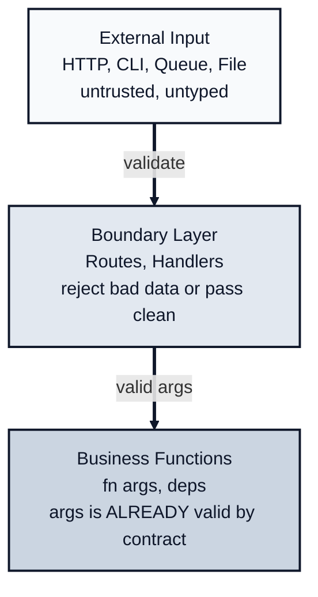
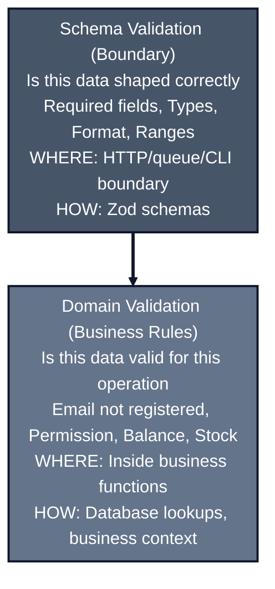

*Previously: [Functions Over Classes](/patterns/functions). We established `fn(args, deps)` as our core pattern.*

---

So you have clean functions with explicit deps. You've escaped the class constructor graveyard. Life is good.

But there's a lie hiding in your code.

```typescript
async function createUser(
  args: { name: string; email: string },
  deps: CreateUserDeps
): Promise<User> {
  const user = { id: crypto.randomUUID(), ...args };
  await deps.db.saveUser(user);
  return user;
}
```

That type signature says `name: string` and `email: string`. But what does that actually mean?

- Is an empty string a valid name?
- Is `"not-an-email"` a valid email?
- What about `"     "` (all spaces)?

The type `string` doesn't tell you any of this. TypeScript's type system will happily let you pass garbage. The signature *lies* about what the function actually accepts.

You ship to production. A user submits a form with `email: "yes"`. Your database accepts it. Your mailer tries to send to "yes". It fails silently because the SMTP library swallows the error. The user never gets their confirmation email. They contact support three days later. You check the database: `email: "yes"`. TypeScript promised this was a valid email.

This is fine when you control all the callers. But in a web application, data comes from the outside world. HTTP requests. Queue messages. CLI arguments. Users who type literally anything.

Where do you validate this?

---

## The Wrong Place

The instinct is to validate inside the business function:

```typescript
async function createUser(
  args: { name: string; email: string },
  deps: CreateUserDeps
): Promise<User> {
  // Validation mixed with business logic
  if (!args.name || args.name.length < 2) {
    throw new Error('Name must be at least 2 characters');
  }
  if (!args.email.includes('@')) {
    throw new Error('Invalid email');
  }

  // Now the actual work
  const user = { id: crypto.randomUUID(), ...args };
  await deps.db.saveUser(user);
  return user;
}
```

This works, but something's off.

Look at what happened:
- The function now handles two concerns: validation AND business logic
- The same validation will be duplicated in other functions that need similar input
- Tests have to cover both validation and business logic together
- The `args` type *still* lies. It claims to accept any string

And there's a deeper problem. Who is responsible for validation? Is it `createUser`? What about `updateUser`. Does it also validate emails? What if they validate slightly differently?

```typescript
// In createUser:
if (!args.email.includes('@')) throw new Error('Invalid email');

// In updateUser (different developer, different day):
if (!args.email.match(/^[^@]+@[^@]+$/)) throw new Error('Email must be valid');

// In inviteUser (yet another developer):
// They forgot to validate. Oops.
```

You've scattered validation across your business logic. That's a recipe for inconsistency.

---

## The Right Place

Validation is a **boundary concern**. It belongs at the edges where untrusted data enters your system.

Think of it like customs at the border. You don't check passports at every street corner. You check them once, at the border, and then everyone inside is trusted.



**The contract:** If a function receives `args`, those args are already valid. Validation happened before the call.

This means `createUser` can trust its input:

```typescript
async function createUser(
  args: CreateUserInput,  // Already validated!
  deps: CreateUserDeps
): Promise<User> {
  // No validation here. Trust the contract.
  const user = { id: crypto.randomUUID(), ...args };
  await deps.db.saveUser(user);
  return user;
}
```

But how do we enforce this? How do we make sure validation actually happened?

---

## Parse, Don't Validate

There's an important distinction: **validation** checks data and returns true/false. **Parsing** transforms data into a new, richer type.

The 2025 best practice is "parse, don't validate." Once data passes through a schema, it shouldn't just be "validated data"—it should be a *new type* that makes illegal states unrepresentable.

```typescript
// Validation mindset: "Is this email valid?"
function isValidEmail(s: string): boolean { ... }

// Parsing mindset: "Give me an Email, or fail"
function parseEmail(s: string): Email { ... }
```

The difference is subtle but crucial. With validation, you still have a `string` that you *know* is valid. With parsing, you have an `Email` type that *cannot* be invalid by construction.

## Enter Zod

[Zod](https://zod.dev) is the tool for this. It lets you define schemas that parse data AND narrow TypeScript types in one step.

```typescript
import { z } from 'zod';

const CreateUserSchema = z.object({
  name: z.string().min(2).max(100),
  email: z.string().email(),
});

// The type is inferred from the schema
type CreateUserInput = z.infer<typeof CreateUserSchema>;
// { name: string; email: string }
```

Now you have a single source of truth. The schema defines both:
- What the data should look like (runtime)
- What the TypeScript type is (compile time)

### Branded Types for Stronger Guarantees

For even stronger guarantees, use Zod's `.brand()` to create types that can *only* come from parsing:

```typescript
const EmailSchema = z.string().email().brand<'Email'>();
const UserIdSchema = z.string().uuid().brand<'UserId'>();

type Email = z.infer<typeof EmailSchema>;   // string & { __brand: 'Email' }
type UserId = z.infer<typeof UserIdSchema>; // string & { __brand: 'UserId' }

const CreateUserSchema = z.object({
  name: z.string().min(2).max(100),
  email: EmailSchema,
});
```

Now you can't accidentally pass a raw string where an `Email` is expected:

```typescript
function sendEmail(to: Email, subject: string) { ... }

// ❌ TypeScript error: string is not assignable to Email
sendEmail("alice@example.com", "Hello");

// ✅ Must parse first - proof of validation
const email = EmailSchema.parse("alice@example.com");
sendEmail(email, "Hello");
```

You're reviewing a PR. Someone added `sendEmail(user.email, "Welcome!")`. TypeScript complains: `string is not assignable to Email`. The reviewer doesn't need to ask "did you validate this?" The type system already answered: no, they didn't. Fix it or the build fails.

**The burden of proof is at the boundary.** Deep domain functions receive branded types and never need to check validity again. The type system guarantees it.

---

## Using Zod at the Boundary

In your HTTP handler:

```typescript
app.post('/users', async (req, res) => {
  // 1. Validate at the boundary
  const parsed = CreateUserSchema.safeParse(req.body);

  if (!parsed.success) {
    return res.status(400).json({
      message: 'Validation failed',
      errors: parsed.error.issues.map(i => ({
        path: i.path.join('.'),
        message: i.message,
      })),
    });
  }

  // 2. Call business function with valid, typed data
  const user = await userService.createUser(parsed.data);

  return res.status(201).json(user);
});
```

Look what happened:
- Invalid data is rejected with HTTP 400 (client error)
- The business function never sees invalid data
- `parsed.data` is typed as `CreateUserInput`. TypeScript knows it's valid

The business function stays clean:

```typescript
async function createUser(
  args: CreateUserInput,  // Already validated
  deps: CreateUserDeps
): Promise<User> {
  const user = { id: crypto.randomUUID(), ...args };
  await deps.db.saveUser(user);
  return user;
}
```

No validation logic. It trusts the contract.

---

## Standardizing Validation Error Responses

Validation errors should have a consistent shape across your API. Here's a pattern:

```typescript
// Standard validation error response
type ValidationErrorResponse = {
  error: 'VALIDATION_FAILED';
  message: string;
  issues: Array<{
    path: string;
    message: string;
    code: string;
  }>;
};

function formatZodError(error: z.ZodError): ValidationErrorResponse {
  return {
    error: 'VALIDATION_FAILED',
    message: 'Request validation failed',
    issues: error.issues.map(issue => ({
      path: issue.path.join('.'),
      message: issue.message,
      code: issue.code,
    })),
  };
}
```

Now handlers use it consistently:

```typescript
app.post('/users', async (req, res) => {
  const parsed = CreateUserSchema.safeParse(req.body);

  if (!parsed.success) {
    return res.status(400).json(formatZodError(parsed.error));
  }

  const user = await userService.createUser(parsed.data);
  return res.status(201).json(user);
});
```

Clients always receive the same structure:

```json
{
  "error": "VALIDATION_FAILED",
  "message": "Request validation failed",
  "issues": [
    { "path": "email", "message": "Invalid email", "code": "invalid_string" },
    { "path": "name", "message": "Required", "code": "too_small" }
  ]
}
```

For logging, include the raw issues for debugging:

```typescript
if (!parsed.success) {
  logger.warn('Validation failed', {
    endpoint: req.path,
    issues: parsed.error.issues,
  });
  return res.status(400).json(formatZodError(parsed.error));
}
```

This gives you consistent client responses and detailed server logs.

---

## Why This Separation Matters

### 1. Business Functions Stay Focused

They do one thing: business logic. Validation is someone else's job.

### 2. Error Types Are Honest

Validation errors are HTTP 400 (client error). They're not the same as database failures or business rule violations. Keeping them separate lets you respond appropriately.

### 3. Testing Is Cleaner

Test business logic without validation:

```typescript
it('creates user in database', async () => {
  const args: CreateUserInput = { name: 'Alice', email: 'alice@test.com' };
  const deps = { db: mockDb };

  const user = await createUser(args, deps);

  expect(mockDb.saveUser).toHaveBeenCalledWith(expect.objectContaining(args));
});
```

Test validation separately:

```typescript
it('rejects invalid email', () => {
  const result = CreateUserSchema.safeParse({
    name: 'Alice',
    email: 'not-an-email'
  });
  expect(result.success).toBe(false);
});
```

### 4. Schemas Are Reusable

The same schema works everywhere:

```typescript
// HTTP handler
const input = CreateUserSchema.parse(req.body);

// CLI
const input = CreateUserSchema.parse(cliArgs);

// Queue message
const input = CreateUserSchema.parse(message.body);

// Tests
const input = CreateUserSchema.parse(testFixture);
```

One schema, many entry points.

---

## Two Layers of Validation

Not all validation is equal. There are two kinds:



Example:

```typescript
// Schema validation: shape (at boundary)
const TransferSchema = z.object({
  fromAccount: z.string().uuid(),
  toAccount: z.string().uuid(),
  amount: z.number().positive(),
});

// Domain validation: business rules (in function)
async function validateTransfer(
  args: TransferInput,
  deps: TransferDeps
): Promise<ValidatedTransfer> {
  const account = await deps.db.getAccount(args.fromAccount);

  if (account.balance < args.amount) {
    throw new Error('Insufficient funds');
  }

  if (account.frozen) {
    throw new Error('Account frozen');
  }

  return { ...args, account };
}
```

---

## Practical Patterns

### Coercion (Query Parameters)

HTTP query params are always strings. Zod can coerce them:

```typescript
const PaginationSchema = z.object({
  page: z.coerce.number().int().positive().default(1),
  limit: z.coerce.number().int().min(1).max(100).default(20),
});

// "?page=2&limit=50" → { page: 2, limit: 50 }
const pagination = PaginationSchema.parse(req.query);
```

### Partial Updates (PATCH)

```typescript
const UpdateUserSchema = z.object({
  name: z.string().min(2).optional(),
  email: z.string().email().optional(),
});

// Only validate fields that are present
const updates = UpdateUserSchema.parse(req.body);
```

### Transforms

Clean data as you validate:

```typescript
const CreatePostSchema = z.object({
  title: z.string().transform(s => s.trim()),
  slug: z.string().transform(s => s.toLowerCase().replace(/\s+/g, '-')),
});
```

---

## Express Middleware Pattern

If you're using Express, you might want a reusable validator:

```typescript
function validateBody<T>(schema: z.ZodSchema<T>) {
  return (req: Request, res: Response, next: NextFunction) => {
    const result = schema.safeParse(req.body);

    if (!result.success) {
      return res.status(400).json({
        message: 'Validation failed',
        errors: result.error.issues,
      });
    }

    req.body = result.data;  // Replace with validated data
    next();
  };
}

// Usage
app.post('/users', validateBody(CreateUserSchema), async (req, res) => {
  // req.body is now typed and validated
  const user = await userService.createUser(req.body);
  res.status(201).json(user);
});
```

---

## The Rules

| Question | Answer |
|----------|--------|
| Where do I validate shape/format? | Boundary (Zod schema) |
| Where do I validate business rules? | Business function |
| Should fn(args, deps) validate args? | No. Trust the contract |
| What's the error for invalid input? | HTTP 400 (not a server error) |

**The pattern:**

```typescript
// Boundary: validate and reject
const parsed = Schema.safeParse(untrustedInput);
if (!parsed.success) return badRequest(parsed.error);

// Business: trust the contract
const result = await fn(parsed.data, deps);
```

---

## What's Next

We've solved validation. Clean functions receive clean data. Zod guards the boundary.

But look at that `validateTransfer` function again:

```typescript
async function validateTransfer(args, deps): Promise<ValidatedTransfer> {
  const account = await deps.db.getAccount(args.fromAccount);
  if (account.balance < args.amount) {
    throw new Error('Insufficient funds');
  }
  // ...
}
```

It throws an exception when something goes wrong. And our business functions? They probably throw too. When the database fails, when a user isn't found, when something unexpected happens.

But `throw` has problems:

1. **It's invisible.** Nothing in the function signature tells you what might fail.
2. **It's viral.** You need try/catch everywhere to handle it.
3. **It conflates different failures.** "User not found" and "database crashed" both become exceptions.

Our functions have clean signatures for deps. They have validated args. But their *error handling* is still implicit and invisible.

How do we make failure explicit? And as applications grow, how do we manage the explosion of error types without overwhelming our handlers?

That's what we'll figure out next.

---

*Next: [Never Throw](/patterns/errors). How to communicate failure without losing your mind.*

