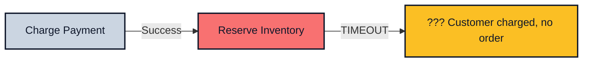

*Previously: [Typed Errors](/patterns/errors). We learned to make failure explicit. But what happens when a multi-step operation fails halfway through?*

---

You've shipped checkout to production. A customer buys an item. Payment succeeds. Then your inventory service times out. The customer was charged but never got their order. Your database shows the payment, but no order record. Your support team spends 45 minutes reconciling the mess manually.

Individual functions with Result types are great. But real operations span multiple services, databases, and external APIs. When one step fails in the middle, you have a consistency problem that error handling alone can't solve.

---

## The Sequential Trap

Developers naturally chain async calls sequentially, handling errors at the end:

```typescript
async function checkout(
  args: { userId: string; cartItems: CartItem[]; paymentMethod: string },
  deps: CheckoutDeps
): Promise<Result<Order, CheckoutError>> {
  try {
    // Step 1: Charge the customer
    const payment = await deps.payments.charge(args.paymentMethod, calculateTotal(args.cartItems));

    // Step 2: Reserve inventory
    const reservation = await deps.inventory.reserve(args.cartItems);

    // Step 3: Create the order
    const order = await deps.orders.create({
      userId: args.userId,
      items: args.cartItems,
      paymentId: payment.id,
      reservationId: reservation.id,
    });

    return ok(order);
  } catch (error) {
    return err({ type: 'CHECKOUT_FAILED', cause: error });
  }
}
```

What happens when step 2 fails after step 1 succeeds?

The customer is charged, but there's no order. The inventory was never reserved. You have money and no record of what it's for. The `catch` block doesn't help—it doesn't know which step succeeded before the failure.



This code is honest about *individual* failures but silent about *partial* failures. What do you do when step 2 of 5 fails?

The problem isn't exceptions—it's that the code doesn't record which side effects already happened. Without that, you can't reliably compensate, retry safely, or resume from a checkpoint.

---

## Your First Workflow

Let's start simple. `createWorkflow` gives you a structured way to compose Result-returning functions:

```typescript
import { createWorkflow, ok, err, type AsyncResult } from 'awaitly';

// Define operations that return Results
async function chargePayment(
  args: { amount: number; method: string },
  deps: { payments: PaymentService }
): AsyncResult<Payment, 'PAYMENT_DECLINED' | 'PAYMENT_ERROR'> {
  const result = await deps.payments.charge(args.amount, args.method);
  if (result.declined) return err('PAYMENT_DECLINED');
  if (result.error) return err('PAYMENT_ERROR');
  return ok({ id: result.id, amount: args.amount });
}

async function reserveInventory(
  args: { items: CartItem[] },
  deps: { inventory: InventoryService }
): AsyncResult<Reservation, 'OUT_OF_STOCK'> {
  const available = await deps.inventory.checkAll(args.items);
  if (!available) return err('OUT_OF_STOCK');
  return ok(await deps.inventory.reserve(args.items));
}

async function createOrder(
  args: { userId: string; payment: Payment; reservation: Reservation },
  deps: { orders: OrderService }
): AsyncResult<Order, 'ORDER_CREATION_FAILED'> {
  try {
    const order = await deps.orders.create(args);
    return ok(order);
  } catch {
    return err('ORDER_CREATION_FAILED');
  }
}
```

Now compose them with a workflow:

```typescript
// Pass operations to createWorkflow - they're used for error type inference
// and injected into the callback as the second parameter
const checkout = createWorkflow({ chargePayment, reserveInventory, createOrder });

const result = await checkout(async (step, deps) => {
  // deps contains { chargePayment, reserveInventory, createOrder }
  const payment = await step(() => deps.chargePayment({ amount: 99, method: 'card_xxx' }));
  const reservation = await step(() => deps.reserveInventory({ items: cartItems }));
  const order = await step(() => deps.createOrder({ userId, payment, reservation }));

  return order;
});
```

The `step()` function accepts an async function returning `AsyncResult` (or a prebuilt step like an approval step). It:

- Unwraps `ok` results and gives you the value
- Short-circuits on `err` and returns immediately
- Collects all possible error types automatically

```typescript
// result.error is automatically typed as:
// 'PAYMENT_DECLINED' | 'PAYMENT_ERROR' | 'OUT_OF_STOCK' | 'ORDER_CREATION_FAILED' | UnexpectedError
```

No manual `if (!result.ok)` checks. The type system documents what can go wrong.

We've eliminated boilerplate and made error types explicit across steps. But we still haven't solved the partial failure problem. If payment succeeds and inventory fails, the customer is still charged.

---

## When Failure Means Rollback: The Saga Pattern

It's 6pm. Your on-call phone rings. A customer placed an order, got charged twice, and the order never shipped. You check the logs: the first payment succeeded, inventory check failed, retry charged again, and somehow the order creation threw an exception. There's no compensation logic. You spend 2 hours manually refunding and reconciling.

**Sagas solve this.** Each step declares both what to do AND what to undo. If any step fails, previous steps are compensated in reverse order.

```typescript
import { createSagaWorkflow, isSagaCompensationError } from 'awaitly';

// Pass all operations (actions + compensations) to createSagaWorkflow
const sagaCheckout = createSagaWorkflow({
  chargePayment,
  refundPayment,
  reserveInventory,
  releaseInventory,
  createOrder,
  cancelOrder,
});

// Callback receives (saga, deps) - deps contains all the operations
const result = await sagaCheckout(async (saga, deps) => {
  // Step 1: Charge with compensation
  const payment = await saga.step(
    () => deps.chargePayment({ amount: 99, method: 'card_xxx' }),
    {
      name: 'charge-payment',
      compensate: (payment) => deps.refundPayment({ paymentId: payment.id }),
    }
  );

  // Step 2: Reserve inventory with compensation
  const reservation = await saga.step(
    () => deps.reserveInventory({ items: cartItems }),
    {
      name: 'reserve-inventory',
      compensate: (reservation) => deps.releaseInventory({ reservationId: reservation.id }),
    }
  );

  // Step 3: Create order with compensation
  const order = await saga.step(
    () => deps.createOrder({ userId, payment, reservation }),
    {
      name: 'create-order',
      compensate: (order) => deps.cancelOrder({ orderId: order.id }),
    }
  );

  return order;
});
```

If `createOrder` fails after payment and inventory succeed:

```text
Step 1: charge-payment ✓
Step 2: reserve-inventory ✓
Step 3: create-order ✗

Compensation order (LIFO):
1. releaseInventory(reservation.id)
2. refundPayment(payment.id)
```

The customer gets refunded. Inventory is released. No orphaned charges.

```mermaid
graph TD
    subgraph Happy["Happy Path"]
        H1[Charge Payment] --> H2[Reserve Inventory]
        H2 --> H3[Create Order]
        H3 --> H4[Success]
    end

    subgraph Rollback["Failure Path"]
        F1[Charge Payment ✓] --> F2[Reserve Inventory ✓]
        F2 --> F3[Create Order ✗]
        F3 --> F4[Release Inventory]
        F4 --> F5[Refund Payment]
        F5 --> F6[Error Returned]
    end

    style H1 fill:#cbd5e1,stroke:#0f172a,stroke-width:2px,color:#0f172a
    style H2 fill:#cbd5e1,stroke:#0f172a,stroke-width:2px,color:#0f172a
    style H3 fill:#cbd5e1,stroke:#0f172a,stroke-width:2px,color:#0f172a
    style H4 fill:#86efac,stroke:#0f172a,stroke-width:2px,color:#0f172a
    style F1 fill:#cbd5e1,stroke:#0f172a,stroke-width:2px,color:#0f172a
    style F2 fill:#cbd5e1,stroke:#0f172a,stroke-width:2px,color:#0f172a
    style F3 fill:#f87171,stroke:#0f172a,stroke-width:2px,color:#0f172a
    style F4 fill:#fbbf24,stroke:#0f172a,stroke-width:2px,color:#0f172a
    style F5 fill:#fbbf24,stroke:#0f172a,stroke-width:2px,color:#0f172a
    style F6 fill:#94a3b8,stroke:#0f172a,stroke-width:2px,color:#0f172a
```



### Handling Compensation Errors

What if compensation itself fails? The saga tracks it:

```typescript
if (!result.ok && isSagaCompensationError(result.error)) {
  console.log('Saga failed, compensations may have partially succeeded');
  console.log('Compensation errors:', result.error.compensationErrors);
  // Alert ops team for manual intervention
  await alertOps('Saga compensation had errors', result.error);
}
```

In awaitly, if a compensation fails, the saga still attempts remaining compensations (it doesn't stop early) and returns a structured error describing what succeeded and what didn't. This gives you the best chance of cleanup while providing enough information for manual intervention when needed.

### Idempotency and Retries

When combining sagas with retries (via `step.retry()` from [Resilience Patterns](/patterns/resilience)), ensure side-effecting steps are idempotent. Use idempotency keys so a retry can't double-apply:

```typescript
const payment = await saga.step(
  () => chargePayment({ amount, method, idempotencyKey: `order-${orderId}` }, deps),
  { compensate: (p) => refundPayment({ paymentId: p.id }, deps) }
);
```

Without an idempotency key, a retry after a timeout could charge the customer twice.

### Not Everything Needs Compensation

Read operations and truly idempotent operations don't need compensation:

```typescript
const orderSaga = createSagaWorkflow({
  fetchUser,
  chargePayment,
  refundPayment,
  recordEmailSent,  // Idempotent via upsert
});

const result = await orderSaga(async (saga, deps) => {
  // No compensation needed for reads
  const user = await saga.step(
    () => deps.fetchUser({ userId }),
    { name: 'fetch-user' }
  );

  // Needs compensation - creates state
  const payment = await saga.step(
    () => deps.chargePayment({ amount, method }),
    {
      name: 'charge-payment',
      compensate: (p) => deps.refundPayment({ paymentId: p.id }),
    }
  );

  // Idempotent via upsert (uses orderId as key) - no compensation needed
  await saga.step(
    () => deps.recordEmailSent({ email: user.email, orderId }),
    { name: 'record-email' }
  );

  return { payment };
});
```

---

## Multi-API Orchestration: Parallel Operations

Your dashboard loads user profile, recent orders, and recommendations. Sequential calls take 900ms (300ms each). But they're independent. Why wait?

```typescript
import { createWorkflow, allAsync } from 'awaitly';

const loadDashboard = createWorkflow({ fetchProfile, fetchOrders, fetchRecommendations });

const result = await loadDashboard(async (step, deps) => {
  // Run all three in parallel - fail fast if any fails
  const [profile, orders, recs] = await step(() =>
    allAsync([
      deps.fetchProfile({ userId }),
      deps.fetchOrders({ userId, limit: 5 }),
      deps.fetchRecommendations({ userId }),
    ])
  );

  return { profile, orders, recommendations: recs };
});
```

`allAsync` is like `Promise.all` but for Results. If any operation fails, it short-circuits immediately.

### Best-Effort with allSettledAsync

Sometimes you want to show what you can, even if some calls fail:

```typescript
import { allSettledAsync } from 'awaitly';

const result = await loadDashboard(async (step, deps) => {
  const results = await step(() =>
    allSettledAsync([
      deps.fetchProfile({ userId }),
      deps.fetchOrders({ userId, limit: 5 }),
      deps.fetchRecommendations({ userId }),
    ])
  );

  // Handle partial success
  const profile = results[0].status === 'ok' ? results[0].value : defaultProfile;
  const orders = results[1].status === 'ok' ? results[1].value : [];
  const recs = results[2].status === 'ok' ? results[2].value : [];

  return { profile, orders, recommendations: recs };
});
```

`allSettledAsync` doesn't short-circuit on failure—it returns an array with a Result for each operation, letting you handle partial success.

### Racing to First Success

Need failover between primary and backup endpoints?

```typescript
import { anyAsync } from 'awaitly';

// Use first endpoint that responds successfully
const result = await anyAsync([
  fetchFromPrimary(id),
  fetchFromBackup(id),
  fetchFromCache(id),
]);

if (result.ok) {
  // Got data from whichever responded first
  return result.value;
}
```

`anyAsync` returns the first successful result. Use it for failover patterns or racing equivalent endpoints.

### Parallel with Dependencies

Some operations depend on others:

```typescript
const userDashboard = createWorkflow({ fetchUser, fetchPosts, fetchFriends, fetchSettings });

const result = await userDashboard(async (step, deps) => {
  // Fetch user first
  const user = await step(() => deps.fetchUser({ userId }));

  // Then fetch user's data in parallel
  const [posts, friends, settings] = await step(() =>
    allAsync([
      deps.fetchPosts({ userId: user.id }),
      deps.fetchFriends({ userId: user.id }),
      deps.fetchSettings({ userId: user.id }),
    ])
  );

  return { user, posts, friends, settings };
});
```

Sequential when needed, parallel when possible.

---

## Batch Processing at Scale

Your migration script processes 50,000 user records. At record 47,000, your machine crashes. You restart. It starts from record 1. Another 47,000 API calls. Your rate limit budget for the day is gone.

```typescript
import { ok, err } from 'awaitly';
import { processInBatches, batchPresets } from 'awaitly/batch';

const result = await processInBatches(
  users,  // Array of 50,000 users
  async (user, index) => {
    // Callback returns AsyncResult, consistent with the rest of awaitly
    const migrated = await migrateUser(user, deps);
    if (!migrated) return err('MIGRATION_FAILED' as const);
    return ok(migrated);
  },
  {
    batchSize: 100,        // 100 users per batch
    concurrency: 10,       // 10 concurrent operations
    batchDelayMs: 50,      // 50ms between batches (rate limiting)
  },
  {
    onProgress: (progress) => {
      console.log(`${progress.percent}% complete (${progress.processed}/${progress.total})`);
    },
    afterBatch: async () => {
      // Checkpoint after each batch for resumability
      await db.checkpoint();
      return ok(undefined);
    },
  }
);
```

### Presets for Common Scenarios

```typescript
// Conservative: batchSize=20, concurrency=3, delay=50ms
// Good for memory-constrained environments or strict rate limits
await processInBatches(items, process, batchPresets.conservative);

// Balanced: batchSize=50, concurrency=5, delay=10ms
// Good for typical workloads
await processInBatches(items, process, batchPresets.balanced);

// Aggressive: batchSize=100, concurrency=10, no delay
// Good when memory isn't a concern and API allows high throughput
await processInBatches(items, process, batchPresets.aggressive);
```

### Error Handling

Processing stops on the first error, with context about where it failed:

```typescript
import { isBatchProcessingError } from 'awaitly/batch';

if (!result.ok) {
  if (isBatchProcessingError(result.error)) {
    console.log('Failed at item:', result.error.itemIndex);
    console.log('In batch:', result.error.batchNumber);
    console.log('Underlying error:', result.error.error);
    // Resume from result.error.itemIndex on next run
  }
}
```

---

## Human-in-the-Loop: Approval Workflows

Refunds over $1000 require manager approval. The customer clicks 'refund', and... then what? The request sits in a database table. Someone checks the table manually. Sometimes they forget. Sometimes the refund is approved but the code to process it isn't connected to the approval system.

With awaitly, approval is a first-class step:

```typescript
import {
  createWorkflow,
  createApprovalStep,
  isPendingApproval,
  stringifyState,
  createStepCollector,
} from 'awaitly';

// Define the approval step (parameterized by refundId at runtime)
const createRefundApprovalStep = (refundId: string) =>
  createApprovalStep({
    key: `refund-approval:${refundId}`,
    checkApproval: async () => {
      const record = await db.approvals.find(refundId);
      if (!record) return { status: 'pending' };
      return record.approved
        ? { status: 'approved', value: record }
        : { status: 'rejected', reason: record.reason };
    },
  });

// Workflow with approval
const refundWorkflow = createWorkflow({ calculateRefund, processRefund });

async function processRefundRequest(refundId: string, orderId: string) {
  const collector = createStepCollector();
  const approvalStep = createRefundApprovalStep(refundId);

  const result = await refundWorkflow(async (step, deps) => {
    const refund = await step(() => deps.calculateRefund({ orderId }));

    // Workflow pauses here until approved
    if (refund.amount > 1000) {
      const approval = await step(approvalStep);
      if (!approval.approved) {
        return err('REFUND_REJECTED');
      }
    }

    return await step(() => deps.processRefund({ refund }));
  }, { onEvent: collector.handleEvent });

  return { result, collector };
}
```

### Check for Pending Approval

```typescript
const { result, collector } = await processRefundRequest(refundId, orderId, deps);

if (!result.ok && isPendingApproval(result.error)) {
  // Save workflow state for later
  await db.pendingWorkflows.create({
    id: refundId,
    state: stringifyState(collector.getState()),
  });

  // Notify the approver
  await sendSlackMessage(`Refund ${refundId} needs manager approval`);
}
```

### Resume After Approval

When the manager approves:

```typescript
import { injectApproval, parseState } from 'awaitly';

// Load saved state
const saved = await db.pendingWorkflows.find(refundId);
const state = parseState(saved.state);

// Inject the approval
const updatedState = injectApproval(state, {
  stepKey: `refund-approval:${refundId}`,
  value: { approvedBy: 'manager@company.com', timestamp: Date.now() },
});

// Resume workflow from where it left off
const workflow = createWorkflow({ calculateRefund, processRefund }, { resumeState: updatedState });
const result = await workflow(async (step, deps) => {
  const refund = await step(() => deps.calculateRefund({ orderId }));
  // ... approval step is replayed from state ...
  return await step(() => deps.processRefund({ refund }));
});
// Workflow continues from the approval step
```

### Testing Approval Workflows

Don't wait for humans in tests—inject approvals:

```typescript
const approvalStep = createRefundApprovalStep('test-refund-123');

const result = await refundWorkflow(
  async (step, deps) => {
    const refund = await step(() => deps.calculateRefund({ orderId }));
    const approval = await step(approvalStep);
    return await step(() => deps.processRefund({ refund, approval }));
  },
  {
    approvals: {
      'refund-approval:test-refund-123': { approved: true, approvedBy: 'test@test.com' },
    },
  }
);
```

---

## Combining Patterns

These patterns compose naturally:

```typescript
const orderFulfillment = createSagaWorkflow({
  validateOrder,
  reserveInventory,
  releaseInventory,
  chargePayment,
  refundPayment,
  createShipment,
  cancelShipment,
  notifyCustomer,
});

const result = await orderFulfillment(async (saga, deps) => {
  // Validation (no compensation needed)
  const order = await saga.step(
    () => deps.validateOrder({ orderId }),
    { name: 'validate-order' }
  );

  // Reserve inventory with compensation
  const reservation = await saga.step(
    () => deps.reserveInventory({ items: order.items }),
    {
      name: 'reserve-inventory',
      compensate: (r) => deps.releaseInventory({ reservationId: r.id }),
    }
  );

  // Charge payment with compensation
  const payment = await saga.step(
    () => deps.chargePayment({ amount: order.total }),
    {
      name: 'charge-payment',
      compensate: (p) => deps.refundPayment({ paymentId: p.id }),
    }
  );

  // Create shipment with compensation
  const shipment = await saga.step(
    () => deps.createShipment({ order, reservation }),
    {
      name: 'create-shipment',
      compensate: (s) => deps.cancelShipment({ shipmentId: s.id }),
    }
  );

  // Notify customer (no compensation - can't un-send)
  await saga.step(
    () => deps.notifyCustomer({ email: order.customerEmail, shipment }),
    { name: 'notify-customer' }
  );

  return { order, shipment, payment };
});
```

---

## The Summary

| Scenario                   | Pattern              | APIs                                       |
| -------------------------- | -------------------- | ------------------------------------------ |
| Linear multi-step          | `createWorkflow`     | `step()`                                   |
| Multi-step with rollback   | `createSagaWorkflow` | `saga.step(action, { compensate })`        |
| Independent parallel calls | `createWorkflow`     | `allAsync()`, `allSettledAsync()`          |
| First success wins         | `createWorkflow`     | `anyAsync()`                               |
| High-volume processing     | `processInBatches`   | Rate limits, checkpoints                   |
| Human approval             | `createApprovalStep` | `isPendingApproval()`, `injectApproval()`  |

---

## The Rules

1. **Use `createWorkflow` for linear composition.** Errors propagate automatically; the union of possible errors is inferred from the steps you call.

2. **Use sagas when you need compensation.** Each step declares both action and undo. Compensations run in reverse order (LIFO).

3. **Use parallel operations for independent calls.** `allAsync` for mandatory data; `allSettledAsync` for best-effort. Add `step.retry()` and `step.withTimeout()` from [Resilience Patterns](/patterns/resilience) when needed.

4. **Respect rate limits with `processInBatches`.** Never overwhelm downstream systems. Checkpoint for resume capability.

5. **Make side-effecting steps idempotent.** Use idempotency keys when combining retries with operations like payment charging.

6. **Make approval workflows testable.** Inject approvals in tests instead of waiting for humans.

---

## What's Next

We've built complex workflows that handle failures gracefully. But when something goes wrong in production, how do we trace what happened across all these steps?

Workflows emit events as they execute:

```typescript
const checkout = createWorkflow(
  { chargePayment, reserveInventory, createOrder },
  {
    onEvent: (event) => {
      // { type: 'step_complete', stepKey: 'charge-payment', durationMs: 150 }
      // { type: 'step_error', stepKey: 'reserve-inventory', error: 'OUT_OF_STOCK' }
      // { type: 'compensation_start', stepName: 'refund-payment' }
    },
  }
);
```

But raw events aren't enough. We need distributed traces that show the full picture: which step took 5 seconds, which saga compensation ran, where the bottleneck is.

How do we connect these events to our observability stack?

---

*Next: [Functions + OpenTelemetry](/patterns/opentelemetry). Making our workflows observable.*
