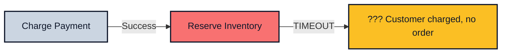

*Previously: [Typed Errors](./errors). We learned to make failure explicit. But what happens when a multi-step operation fails halfway through?*

---

You've shipped checkout to production. A customer buys an item. Payment succeeds. Then your inventory service times out. The customer was charged but never got their order. Your database shows the payment, but no order record. Your support team spends 45 minutes reconciling the mess manually.

Individual functions with Result types are great. But real operations span multiple services, databases, and external APIs. When one step fails in the middle, you have a consistency problem that error handling alone can't solve.

---

## The Sequential Trap

Developers naturally chain async calls in a straight line, handling errors at the end:

```typescript
async function checkout(
  args: { userId: string; cartItems: CartItem[]; paymentMethod: string },
  deps: CheckoutDeps
): Promise<Result<Order, CheckoutError>> {
  try {
    // Step 1: Charge the customer
    const payment = await deps.payments.charge(args.paymentMethod, calculateTotal(args.cartItems));

    // Step 2: Reserve inventory
    const reservation = await deps.inventory.reserve(args.cartItems);

    // Step 3: Create the order
    const order = await deps.orders.create({
      userId: args.userId,
      items: args.cartItems,
      paymentId: payment.id,
      reservationId: reservation.id,
    });

    return ok(order);
  } catch (error) {
    return err({ type: 'CHECKOUT_FAILED', cause: error });
  }
}
```

What happens when step 2 fails after step 1 succeeds?

The customer is charged, but there's no order. The inventory was never reserved. You have money and no record of what it's for. The `catch` block doesn't help -it doesn't know which step succeeded before the failure.



This code is honest about *individual* failures but silent about *partial* failures. What do you do when step 2 of 5 fails?

The problem isn't exceptions -it's that the code doesn't record which side effects already happened. Without that, you can't reliably compensate, retry safely, or resume from a checkpoint.

---

## Your First Workflow

Let's start simple. `createWorkflow` gives you a structured way to compose Result-returning functions:

```typescript
import { ok, err, type AsyncResult } from 'awaitly';
import { createWorkflow } from 'awaitly/workflow';

// Define operations that return Results
async function chargePayment(
  args: { amount: number; method: string },
  deps: { payments: PaymentService }
): AsyncResult<Payment, 'PAYMENT_DECLINED' | 'PAYMENT_ERROR'> {
  const result = await deps.payments.charge(args.amount, args.method);
  if (result.declined) return err('PAYMENT_DECLINED');
  if (result.error) return err('PAYMENT_ERROR');
  return ok({ id: result.id, amount: args.amount });
}

async function reserveInventory(
  args: { items: CartItem[] },
  deps: { inventory: InventoryService }
): AsyncResult<Reservation, 'OUT_OF_STOCK'> {
  const available = await deps.inventory.checkAll(args.items);
  if (!available) return err('OUT_OF_STOCK');
  return ok(await deps.inventory.reserve(args.items));
}

async function createOrder(
  args: { userId: string; payment: Payment; reservation: Reservation },
  deps: { orders: OrderService }
): AsyncResult<Order, 'ORDER_CREATION_FAILED'> {
  try {
    const order = await deps.orders.create(args);
    return ok(order);
  } catch {
    return err('ORDER_CREATION_FAILED');
  }
}
```

Now compose them with a workflow:

```typescript
// Pass operations to createWorkflow - they're used for error type inference
// and injected into the callback as the second parameter
const checkout = createWorkflow({ chargePayment, reserveInventory, createOrder });

const result = await checkout(async (step, deps) => {
  // deps contains { chargePayment, reserveInventory, createOrder }
  const payment = await step(() => deps.chargePayment({ amount: 99, method: 'card_xxx' }));
  const reservation = await step(() => deps.reserveInventory({ items: cartItems }));
  const order = await step(() => deps.createOrder({ userId, payment, reservation }));

  return order;
});
```

The `step()` function accepts an async function returning `AsyncResult` (or a prebuilt step like an approval step). It:

- Unwraps `ok` results and gives you the value
- Short-circuits on `err` and returns immediately
- Collects all possible error types automatically

```typescript
// result.error is automatically typed as:
// 'PAYMENT_DECLINED' | 'PAYMENT_ERROR' | 'OUT_OF_STOCK' | 'ORDER_CREATION_FAILED' | UnexpectedError
```

`UnexpectedError` captures failures that weren't returned as `err()` by your operations. This is usually a thrown exception (including those from libraries) or anything else that escapes your typed error model (unexpected states). It wraps the original error with context about which step failed.

If you want timeouts or network failures to be typed, catch them inside the operation and return a domain error (e.g., `err('PAYMENT_TIMEOUT')`):

```typescript
if (!result.ok && result.error.type === 'UNEXPECTED') {
  console.log('Step failed:', result.error.stepName);
  console.log('Original error:', result.error.cause);  // The thrown exception
}
```

No manual `if (!result.ok)` checks. The type system documents what can go wrong.

We've eliminated boilerplate and made error types explicit across steps. But we still haven't solved the partial failure problem. If payment succeeds and inventory fails, the customer is still charged.

---

## When Failure Means Rollback: The Saga Pattern

It's 6pm. Your on-call phone rings. A customer placed an order, got charged twice, and the order never shipped. You check the logs: the first payment succeeded, inventory check failed, retry charged again, and somehow the order creation threw an exception. There's no compensation logic. You spend 2 hours manually refunding and reconciling.

**Sagas solve this.** Each step declares both what to do AND what to undo. If any step fails, previous steps are compensated in reverse order.

```typescript
import { createSagaWorkflow, isSagaCompensationError } from 'awaitly/saga';

// Pass all operations (actions + compensations) to createSagaWorkflow
const sagaCheckout = createSagaWorkflow({
  chargePayment,
  refundPayment,
  reserveInventory,
  releaseInventory,
  createOrder,
  cancelOrder,
});

// Callback receives (saga, deps) - deps contains all the operations
const result = await sagaCheckout(async (saga, deps) => {
  // Step 1: Charge with compensation
  const payment = await saga.step(
    () => deps.chargePayment({ amount: 99, method: 'card_xxx' }),
    {
      name: 'charge-payment',
      compensate: (payment) => deps.refundPayment({ paymentId: payment.id }),
    }
  );

  // Step 2: Reserve inventory with compensation
  const reservation = await saga.step(
    () => deps.reserveInventory({ items: cartItems }),
    {
      name: 'reserve-inventory',
      compensate: (reservation) => deps.releaseInventory({ reservationId: reservation.id }),
    }
  );

  // Step 3: Create order with compensation
  const order = await saga.step(
    () => deps.createOrder({ userId, payment, reservation }),
    {
      name: 'create-order',
      compensate: (order) => deps.cancelOrder({ orderId: order.id }),
    }
  );

  return order;
});
```

If `createOrder` fails after payment and inventory succeed:

```text
Step 1: charge-payment ✓
Step 2: reserve-inventory ✓
Step 3: create-order ✗

Compensation order (LIFO):
1. releaseInventory(reservation.id)
2. refundPayment(payment.id)
```

The customer gets refunded. Inventory is released. No orphaned charges.

```mermaid
graph TD
    subgraph Happy["Happy Path"]
        H1[Charge Payment] --> H2[Reserve Inventory]
        H2 --> H3[Create Order]
        H3 --> H4[Success]
    end

    subgraph Rollback["Failure Path"]
        F1[Charge Payment ✓] --> F2[Reserve Inventory ✓]
        F2 --> F3[Create Order ✗]
        F3 --> F4[Release Inventory]
        F4 --> F5[Refund Payment]
        F5 --> F6[Error Returned]
    end

    style H1 fill:#cbd5e1,stroke:#0f172a,stroke-width:2px,color:#0f172a
    style H2 fill:#cbd5e1,stroke:#0f172a,stroke-width:2px,color:#0f172a
    style H3 fill:#cbd5e1,stroke:#0f172a,stroke-width:2px,color:#0f172a
    style H4 fill:#86efac,stroke:#0f172a,stroke-width:2px,color:#0f172a
    style F1 fill:#cbd5e1,stroke:#0f172a,stroke-width:2px,color:#0f172a
    style F2 fill:#cbd5e1,stroke:#0f172a,stroke-width:2px,color:#0f172a
    style F3 fill:#f87171,stroke:#0f172a,stroke-width:2px,color:#0f172a
    style F4 fill:#fbbf24,stroke:#0f172a,stroke-width:2px,color:#0f172a
    style F5 fill:#fbbf24,stroke:#0f172a,stroke-width:2px,color:#0f172a
    style F6 fill:#94a3b8,stroke:#0f172a,stroke-width:2px,color:#0f172a
```



### Handling Compensation Errors

What if compensation itself fails? The saga tracks it:

```typescript
if (!result.ok && isSagaCompensationError(result.error)) {
  console.log('Saga failed, compensations may have partially succeeded');
  console.log('Compensation errors:', result.error.compensationErrors);
  // Alert ops team for manual intervention
  await alertOps('Saga compensation had errors', result.error);
}
```

In awaitly, if a compensation fails, the saga still attempts remaining compensations (it doesn't stop early) and returns a structured error describing what succeeded and what didn't. This gives you the best chance of cleanup while providing enough information for manual intervention when needed.

### Compensation Limitations

Compensations are **best-effort, not transactional**. Some actions cannot be undone:

- **Sent emails** – You can't unsend an email. At best, send a correction.
- **Published events** – Downstream consumers may have already acted on them.
- **Time-sensitive reservations** – A hotel room for tonight can't be "unreserved" if the guest already checked in.
- **External API calls** – The third-party may not support reversal.

**Compensation Checklist:**

| Property | Why it matters |
|----------|----------------|
| **Safe** | Compensation must not cause additional harm (e.g., double-refunding) |
| **Idempotent** | Running twice produces the same result (compensation itself may fail and retry) |
| **Observable** | Log and emit metrics so you know when compensations run and whether they succeed |
| **Alerting** | Failed compensations need human attention -don't silently swallow errors |
| **Bounded** | Consider timeouts; a hanging compensation blocks the saga's error path |
| **Eventual** | Compensation success ≠ immediate effect (refunds may be "pending" for days) |

```typescript
// Good: Observable, idempotent compensation with timeout
{
  compensate: async (payment) => {
    const span = tracer.startSpan('refund-payment');
    try {
      // Idempotent: refund API checks if already refunded
      const result = await withTimeout(
        deps.refundPayment({ paymentId: payment.id, idempotencyKey: `refund-${payment.id}` }),
        { ms: 30_000 }
      );
      span.setStatus({ code: result.ok ? 'OK' : 'ERROR' });
      return result;
    } finally {
      span.end();
    }
  },
}
```

When compensation is impossible, document what *can* be done (e.g., "queue for manual review") rather than leaving a no-op.

### Idempotency and Retries

When combining sagas with retries (via `step.retry()` from [Resilience Patterns](./resilience)), ensure side-effecting steps are idempotent. Use idempotency keys so a retry can't double-apply:

```typescript
const payment = await saga.step(
  () => chargePayment({ amount, method, idempotencyKey: `order-${orderId}` }, deps),
  { compensate: (p) => refundPayment({ paymentId: p.id }, deps) }
);
```

Without an idempotency key, a retry after a timeout could charge the customer twice.

### Delivery Semantics: At-Least-Once Reality

Idempotency keys help, but understand what they *don't* guarantee:

**The timeout problem:**
```
Client → Payment API → [timeout] → Client retries
                    ↓
              Payment succeeded (unknown to client)
```

Your request succeeded, but the response was lost. With an idempotency key, the retry returns the original result instead of charging twice. **But only if the provider supports idempotency keys** and you use the same key.

**What this means:**

| Scenario | Without idempotency key | With idempotency key |
|----------|------------------------|---------------------|
| Request fails before processing | Safe to retry | Safe to retry |
| Request succeeds, response lost | **Double charge** | Returns original result |
| Request processed, then retry with *different* key | **Double charge** | **Double charge** |

**You get at-least-once, not exactly-once.** The saga may execute a step multiple times during retries. Design for this:

```typescript
// Bad: Non-idempotent - creates duplicate records on retry
await saga.step(
  () => deps.createOrder({ userId, items }),
  { name: 'create-order', compensate: (o) => deps.cancelOrder({ orderId: o.id }) }
);

// Good: Idempotent - uses external reference as natural key
await saga.step(
  () => deps.createOrder({ userId, items, orderReference: `cart-${cartId}` }),
  { name: 'create-order', compensate: (o) => deps.cancelOrder({ orderId: o.id }) }
);
```

**Where duplicates can still occur:**
1. **No idempotency support** – Some APIs don't support idempotency keys
2. **Key mismatch** – Using a different key on retry (e.g., regenerating a UUID)
3. **Key expiration** – Many providers expire idempotency keys after 24-48 hours
4. **Cross-system** – Your DB write is idempotent, but the downstream webhook isn't

When exact-once matters (financial transactions, inventory), combine idempotency keys with reconciliation jobs that detect and resolve duplicates.

### Saga + Retry Interaction

Combining `saga.step()` with retry logic (e.g., `step.retry()` from resilience patterns) introduces additional hazards:

**The crash window problem:**
```
saga.step(chargePayment) → payment succeeds → [CRASH before step recorded]
                                                    ↓
                              Saga resumes → retries chargePayment → double charge
```

Even with idempotency keys, your system only "knows" a step completed if you recorded it (via persisted workflow state, a database write, or the external system's idempotency guarantees). If your process crashes after the side effect but before the saga records completion, a retry will re-execute the action.

**Key constraints for safe saga retries:**

1. **Actions must be idempotent** – The action itself (not just the API call) must handle re-execution safely
2. **Compensation history isn't replayed** – Retrying a saga step re-runs the action, but if the saga later fails, compensation runs once (not once per retry)
3. **Persist state after side-effecting steps** – If your workflow supports persisted state, save it immediately after a side-effecting step succeeds (this is your responsibility, not automatic)

```typescript
// Dangerous: retry wrapper outside saga step tracking (multiple step events, confusing observability)
const payment = await retry(
  () => saga.step(() => deps.charge({ amount, idempotencyKey })),
  { maxAttempts: 3 }
);

// Better: retry inside the action (one logical step, one set of events)
const payment = await saga.step(
  () => retry(() => deps.charge({ amount, idempotencyKey }), { maxAttempts: 3 }),
  { compensate: (p) => deps.refund({ paymentId: p.id }) }
);
```

When in doubt, make your actions idempotent at the domain level (check-then-act with database constraints) rather than relying solely on idempotency keys.

### Not Everything Needs Compensation

Read operations and truly idempotent operations don't need compensation:

```typescript
const orderSaga = createSagaWorkflow({
  fetchUser,
  chargePayment,
  refundPayment,
  recordEmailSent,  // Idempotent via upsert
});

const result = await orderSaga(async (saga, deps) => {
  // No compensation needed for reads
  const user = await saga.step(
    () => deps.fetchUser({ userId }),
    { name: 'fetch-user' }
  );

  // Needs compensation - creates state
  const payment = await saga.step(
    () => deps.chargePayment({ amount, method }),
    {
      name: 'charge-payment',
      compensate: (p) => deps.refundPayment({ paymentId: p.id }),
    }
  );

  // Idempotent via upsert (uses orderId as key) - no compensation needed
  await saga.step(
    () => deps.recordEmailSent({ email: user.email, orderId }),
    { name: 'record-email' }
  );

  return { payment };
});
```

### Concurrency Hazards in Sagas

Inventory reservation is a classic race condition. Two concurrent checkouts for the last item:

```
Saga A: reserve(item) → success (1 left → 0 left)
Saga B: reserve(item) → success (0 left → -1 left) ← oversold!
```

**Or worse -the compensation race:**

```
Saga A: reserve → charge → [charge fails] → release
Saga B:              reserve (while A is releasing) → charge → ship
                              ↑
                     B reserved the item A is about to release
```

**Mitigation strategies:**

1. **Use leases with TTLs, not permanent reservations:**

```typescript
const reservation = await saga.step(
  () => deps.reserveInventory({
    items,
    leaseDurationMs: 5 * 60 * 1000,  // 5-minute hold
    leaseId: `checkout-${checkoutId}`
  }),
  {
    name: 'reserve-inventory',
    compensate: (r) => deps.releaseInventory({ leaseId: r.leaseId }),
  }
);
```

If the saga crashes without compensating, the lease expires automatically. No orphaned reservations.

2. **Make release idempotent and lease-aware:**

```typescript
async function releaseInventory({ leaseId }: { leaseId: string }): AsyncResult<void, 'ALREADY_RELEASED'> {
  const lease = await db.leases.find(leaseId);
  if (!lease || lease.expired || lease.released) {
    // Already released or expired - idempotent success
    return ok(undefined);
  }
  await db.leases.update(leaseId, { released: true });
  await db.inventory.increment(lease.itemId, lease.quantity);
  return ok(undefined);
}
```

3. **Consider compensation timing:**

```typescript
// Compensation should check if the reservation is still valid
compensate: async (reservation) => {
  const current = await deps.getReservation({ id: reservation.id });
  if (current.status === 'converted_to_order') {
    // Another saga completed the order - don't release!
    return ok(undefined);
  }
  return deps.releaseInventory({ reservationId: reservation.id });
}
```

**The general principle:** Compensations must handle the case where time has passed and state has changed. Check current state before compensating.

**Avoid check-then-reserve patterns.** The overselling example above happens when `checkAvailability` and `reserve` are separate calls. Prefer a single atomic `reserveIfAvailable` endpoint that uses database constraints:

```typescript
// Fragile: TOCTOU race between check and reserve
const available = await deps.inventory.checkAvailable(itemId, quantity);
if (!available) return err('OUT_OF_STOCK');
await deps.inventory.reserve(itemId, quantity);  // Another request may have reserved it

// Better: Atomic reserve with constraint
const result = await deps.inventory.reserveIfAvailable(itemId, quantity);
// Uses: UPDATE inventory SET reserved = reserved + ? WHERE id = ? AND (available - reserved) >= ?
```

---

## Multi-API Orchestration: Parallel Operations

Your dashboard loads user profile, recent orders, and recommendations. Sequential calls take 900ms (300ms each). But they're independent. Why wait?

```typescript
import { allAsync } from 'awaitly';
import { createWorkflow } from 'awaitly/workflow';

const loadDashboard = createWorkflow({ fetchProfile, fetchOrders, fetchRecommendations });

const result = await loadDashboard(async (step, deps) => {
  // Run all three in parallel - fail fast if any fails
  const [profile, orders, recs] = await step(() =>
    allAsync([
      deps.fetchProfile({ userId }),
      deps.fetchOrders({ userId, limit: 5 }),
      deps.fetchRecommendations({ userId }),
    ])
  );

  return { profile, orders, recommendations: recs };
});
```

`allAsync` is like `Promise.all` but for Results. If any operation fails, it short-circuits immediately.

**Cancellation caveat:** "Fail-fast" means the workflow returns early, but in-flight requests may continue running (standard JavaScript Promise behavior). For side-effecting calls or rate-limited APIs, pass an `AbortSignal` to cancel abandoned work:

```typescript
const controller = new AbortController();

const result = await step(async () => {
  const promise = allAsync([
    deps.fetchProfile({ userId, signal: controller.signal }),
    deps.fetchOrders({ userId, limit: 5, signal: controller.signal }),
    deps.fetchRecommendations({ userId, signal: controller.signal }),
  ]);

  // Abort when the group fails (if allAsync fails fast, this stops stragglers)
  promise.catch(() => controller.abort());

  return promise;
});
```

Note: Cancellation requires support at the fetch layer (e.g., `fetch` with `signal`, or your HTTP client's abort mechanism). Without it, requests complete even after abort is called. If `allAsync` doesn't fail fast, you'll need a helper that aborts when the first failure is observed.

### Collecting All Errors with allSettledAsync

When you need to know all failures (not just the first), use `allSettledAsync`:

```typescript
import { allSettledAsync } from 'awaitly';

// allSettledAsync waits for all operations and collects any errors
const result = await allSettledAsync([
  fetchProfile({ userId }),
  fetchOrders({ userId, limit: 5 }),
  fetchRecommendations({ userId }),
]);

if (result.ok) {
  // ALL succeeded - result.value is tuple of unwrapped values
  const [profile, orders, recs] = result.value;
  return { profile, orders, recommendations: recs };
} else {
  // ONE OR MORE failed - result.error is array of SettledError objects
  console.log('Failures:', result.error.map(e => e.error));
  // Handle gracefully or return error
}
```

**Note:** Unlike `Promise.allSettled()`, this returns a Result - `ok` if all succeed, `err` if any fail. This is consistent with awaitly's philosophy that all functions return Results.

Use it when you want to report all failures at once rather than stopping at the first error. For true "partial success" where you continue with whatever succeeded, check each result individually after using `Promise.allSettled()` directly.

### Racing to First Success

Need failover between primary and backup endpoints?

```typescript
import { anyAsync } from 'awaitly';

// Use first endpoint that responds successfully
const result = await anyAsync([
  fetchFromPrimary(id),
  fetchFromBackup(id),
  fetchFromCache(id),
]);

if (result.ok) {
  // Got data from whichever responded first
  return result.value;
}
```

`anyAsync` returns the first successful result. Use it for failover patterns or racing equivalent endpoints.

### Parallel with Dependencies

Some operations depend on others:

```typescript
const userDashboard = createWorkflow({ fetchUser, fetchPosts, fetchFriends, fetchSettings });

const result = await userDashboard(async (step, deps) => {
  // Fetch user first
  const user = await step(() => deps.fetchUser({ userId }));

  // Then fetch user's data in parallel
  const [posts, friends, settings] = await step(() =>
    allAsync([
      deps.fetchPosts({ userId: user.id }),
      deps.fetchFriends({ userId: user.id }),
      deps.fetchSettings({ userId: user.id }),
    ])
  );

  return { user, posts, friends, settings };
});
```

Sequential when needed, parallel when possible.

---

## Batch Processing at Scale

Your migration script processes 50,000 user records. At record 47,000, your machine crashes. You restart. It starts from record 1. Another 47,000 API calls. Your rate limit budget for the day is gone.

```typescript
import { ok, err } from 'awaitly';
import { processInBatches, batchPresets } from 'awaitly/batch';

const result = await processInBatches(
  users,  // Array of 50,000 users
  async (user, index) => {
    // Callback returns AsyncResult, consistent with the rest of awaitly
    const migrated = await migrateUser(user, deps);
    if (!migrated) return err('MIGRATION_FAILED' as const);
    return ok(migrated);
  },
  {
    batchSize: 100,        // 100 users per batch
    concurrency: 10,       // 10 concurrent operations
    batchDelayMs: 50,      // 50ms between batches (rate limiting)
  },
  {
    onProgress: (progress) => {
      console.log(`${progress.percent}% complete (${progress.processed}/${progress.total})`);
    },
    afterBatch: async () => {
      // Checkpoint after each batch for resumability
      await db.checkpoint();
      return ok(undefined);
    },
  }
);
```

### Presets for Common Scenarios

```typescript
// Conservative: batchSize=20, concurrency=3, delay=50ms
// Good for memory-constrained environments or strict rate limits
await processInBatches(items, process, batchPresets.conservative);

// Balanced: batchSize=50, concurrency=5, delay=10ms
// Good for typical workloads
await processInBatches(items, process, batchPresets.balanced);

// Aggressive: batchSize=100, concurrency=10, no delay
// Good when memory isn't a concern and API allows high throughput
await processInBatches(items, process, batchPresets.aggressive);
```

### Error Handling

Processing stops on the first error, with context about where it failed:

```typescript
import { isBatchProcessingError } from 'awaitly/batch';

if (!result.ok) {
  if (isBatchProcessingError(result.error)) {
    console.log('Failed at item:', result.error.itemIndex);
    console.log('In batch:', result.error.batchNumber);
    console.log('Underlying error:', result.error.error);
    // Resume from result.error.itemIndex on next run
  }
}
```

**Safe resumption patterns:**

Using `itemIndex` for resumption only works if your input array is stable between runs. In production, prefer cursor-based approaches:

```typescript
// Fragile: Array index changes if items are added/removed
await processInBatches(users.slice(lastFailedIndex), processUser, options);

// Better: Checkpoint the last processed ID
const checkpoint = await db.checkpoints.get('user-migration');
const unprocessed = await db.users.findMany({
  where: { id: { gt: checkpoint?.lastProcessedId ?? '' } },
  orderBy: { id: 'asc' },
});

await processInBatches(unprocessed, async (user) => {
  const result = await migrateUser(user);
  if (result.ok) {
    await db.checkpoints.upsert('user-migration', { lastProcessedId: user.id });
  }
  return result;
}, options);
```

For jobs where order may change (e.g., priority queues), checkpoint a *set* of processed IDs rather than a single cursor. **Caution:** tracking a set can grow unbounded; prefer cursor checkpoints with stable ordering, idempotent writes, or a "processed" marker column in your data store.

The most robust pattern is idempotent processing + a "processed" marker or unique constraint, so reprocessing after a crash is safe.

---

## Human-in-the-Loop: Approval Workflows

Refunds over $1000 require manager approval. The customer clicks 'refund', and... then what? The request sits in a database table. Someone checks the table manually. Sometimes they forget. Sometimes the refund is approved but the code to process it isn't connected to the approval system.

With awaitly, approval is a first-class step:

```typescript
import { createWorkflow, createResumeStateCollector } from 'awaitly/workflow';
import { createApprovalStep, isPendingApproval } from 'awaitly/hitl';
import { stringifyState } from 'awaitly/persistence';

// Define the approval step (parameterized by refundId at runtime)
const createRefundApprovalStep = (refundId: string) =>
  createApprovalStep({
    key: `refund-approval:${refundId}`,
    checkApproval: async () => {
      const record = await db.approvals.find(refundId);
      if (!record) return { status: 'pending' };
      return record.approved
        ? { status: 'approved', value: record }
        : { status: 'rejected', reason: record.reason };
    },
  });

// Workflow with approval
const refundWorkflow = createWorkflow({ calculateRefund, processRefund });

async function processRefundRequest(refundId: string, orderId: string) {
  const collector = createResumeStateCollector();
  const approvalStep = createRefundApprovalStep(refundId);

  const result = await refundWorkflow(async (step, deps) => {
    const refund = await step(() => deps.calculateRefund({ orderId }));

    // Workflow pauses here until approved
    if (refund.amount > 1000) {
      const approval = await step(approvalStep);
      if (!approval.approved) {
        return err('REFUND_REJECTED');
      }
    }

    return await step(() => deps.processRefund({ refund }));
  }, { onEvent: collector.handleEvent });

  return { result, collector };
}
```

### Check for Pending Approval

```typescript
const { result, collector } = await processRefundRequest(refundId, orderId, deps);

if (!result.ok && isPendingApproval(result.error)) {
  // Save workflow state for later
  await db.pendingWorkflows.create({
    id: refundId,
    state: stringifyState(collector.getResumeState()),
  });

  // Notify the approver
  await sendSlackMessage(`Refund ${refundId} needs manager approval`);
}
```

### Resume After Approval

When the manager approves:

```typescript
import { injectApproval } from 'awaitly/hitl';
import { parseState } from 'awaitly/persistence';

// Load saved state
const saved = await db.pendingWorkflows.find(refundId);
const state = parseState(saved.state);

// Inject the approval
const updatedState = injectApproval(state, {
  stepKey: `refund-approval:${refundId}`,
  value: { approvedBy: 'manager@company.com', timestamp: Date.now() },
});

// Resume workflow from where it left off
const workflow = createWorkflow({ calculateRefund, processRefund }, { resumeState: updatedState });
const result = await workflow(async (step, deps) => {
  const refund = await step(() => deps.calculateRefund({ orderId }));
  // ... approval step is replayed from state ...
  return await step(() => deps.processRefund({ refund }));
});
// Workflow continues from the approval step
```

**Security considerations:** `injectApproval` is powerful -it lets code bypass the normal approval check. In production:

1. **Verify approver identity** – Ensure the approver is authorized for this approval type
2. **Audit log all approvals** – Record who approved, when, and what workflow it affected
3. **Validate approval context** – Check that the approval matches the pending workflow (e.g., refund amount hasn't changed)

```typescript
// Before injecting approval, validate the approver
const approver = await auth.getCurrentUser();
if (!approver.permissions.includes('approve:refunds')) {
  throw new Error('Unauthorized approver');
}

await auditLog.record({
  action: 'workflow_approval',
  workflowId: refundId,
  approvedBy: approver.id,
  approvalKey: `refund-approval:${refundId}`,
  timestamp: Date.now(),
});

const updatedState = injectApproval(state, { /* ... */ });
```

**Source of truth:** Treat your approvals table as the system of record -`injectApproval` only mutates workflow state for resumption. When an approver acts: write the decision to your database first, then inject and resume using that recorded decision. If your system crashes between inject and resume, the DB record lets you retry safely.

### Testing Approval Workflows

Don't wait for humans in tests -inject approvals using `injectApproval()` with `resumeState`:

```typescript
import { injectApproval } from 'awaitly/hitl';
import { createWorkflow } from 'awaitly/workflow';

const approvalStep = createRefundApprovalStep('test-refund-123');

// Create resume state with pre-approved value
const emptyState = { steps: new Map() };
const resumeState = injectApproval(emptyState, {
  stepKey: 'refund-approval:test-refund-123',
  value: { approved: true, approvedBy: 'test@test.com' },
});

// Workflow uses cached approval from resumeState
const workflow = createWorkflow({ calculateRefund, processRefund }, { resumeState });

const result = await workflow(async (step, deps) => {
  const refund = await step(() => deps.calculateRefund({ orderId }));
  // Must use matching key for cache lookup
  const approval = await step(approvalStep, { key: 'refund-approval:test-refund-123' });
  return await step(() => deps.processRefund({ refund, approval }));
});
```

### Durability Boundaries

The `stringifyState` / `parseState` / `injectApproval` pattern saves **workflow execution state**, not your application's side effects. Understand what's persisted:

**What IS persisted (via `collector.getResumeState()`):**
- Which steps have completed
- Return values from completed steps (for replay)
- Which approval steps are pending/approved
- Step metadata (names, keys)

**What IS NOT persisted:**
- External side effects (payments charged, emails sent, inventory reserved)
- Database transactions
- In-flight HTTP requests
- Local variables outside of step returns

**This is not transactional replay.** When you resume a workflow:

```typescript
// Original run: steps 1-2 completed, step 3 pending approval
const result = await workflow(async (step, deps) => {
  const a = await step(() => deps.fetchA());     // Completed, value cached
  const b = await step(() => deps.chargeCard()); // Completed, value cached - PAYMENT ALREADY HAPPENED
  const c = await step(approvalStep);            // Pending - workflow paused here
  return await step(() => deps.ship());
}, { onEvent: collector.handleEvent });

// After approval, resumed with state:
const resumed = await workflow(async (step, deps) => {
  const a = await step(() => deps.fetchA());     // Replayed from state (no API call)
  const b = await step(() => deps.chargeCard()); // Replayed from state (no API call)
  const c = await step(approvalStep);            // Returns injected approval
  return await step(() => deps.ship());          // Actually executes now
}, { resumeState: updatedState });
```

**Key implications:**

1. **Steps are replayed, not re-executed** – On resume, completed steps return their cached values without calling the function again.

2. **Crashes between step completion and state persistence lose data** – If your process dies after `chargeCard()` completes but before you persist `collector.getResumeState()`, you'll retry the payment on resume (unless you use idempotency keys).

3. **External state may have changed** – The inventory you reserved 2 hours ago (before approval) might have expired or been sold. Design for this.

**Recommendation:** For critical workflows, persist state after every step:

```typescript
const result = await workflow(async (step, deps) => {
  const payment = await step(() => deps.charge());
  await persistWorkflowState(workflowId, collector.getResumeState());  // Checkpoint

  const approval = await step(approvalStep);
  await persistWorkflowState(workflowId, collector.getResumeState());  // Checkpoint

  return await step(() => deps.fulfill());
}, { onEvent: collector.handleEvent });
```

**Step Return Value Guidance:**

Since step return values are serialized and persisted, be intentional about what you return:

| Do | Don't |
|----|-------|
| Return IDs and minimal immutable data (`{ paymentId, reservationId }`) | Return full domain objects with nested data |
| Ensure values are JSON-serializable | Return functions, `Date` objects (use ISO strings), or circular references |
| Store references to secrets (`secretId`) | Store actual secrets, tokens, or PII in state |
| Version your workflow state schema | Assume old persisted states will deserialize correctly after deploys |

```typescript
// Good: Minimal, stable return value
const payment = await step(() => deps.charge({ amount }));
// payment = { id: 'pay_123', status: 'succeeded' }

// Bad: Large object with sensitive data and unstable shape
const payment = await step(() => deps.chargeAndReturnEverything({ amount }));
// payment = { id: '...', card: { last4: '4242', ... }, customer: { email: '...' }, ... }
```

For long-running workflows, consider adding a `workflowVersion` field to your persisted state and implementing a migration strategy when your step return shapes change between deploys.

---

## Combining Patterns

These patterns compose naturally:

```typescript
const orderFulfillment = createSagaWorkflow({
  validateOrder,
  reserveInventory,
  releaseInventory,
  chargePayment,
  refundPayment,
  createShipment,
  cancelShipment,
  notifyCustomer,
});

const result = await orderFulfillment(async (saga, deps) => {
  // Validation (no compensation needed)
  const order = await saga.step(
    () => deps.validateOrder({ orderId }),
    { name: 'validate-order' }
  );

  // Reserve inventory with compensation
  const reservation = await saga.step(
    () => deps.reserveInventory({ items: order.items }),
    {
      name: 'reserve-inventory',
      compensate: (r) => deps.releaseInventory({ reservationId: r.id }),
    }
  );

  // Charge payment with compensation
  const payment = await saga.step(
    () => deps.chargePayment({ amount: order.total }),
    {
      name: 'charge-payment',
      compensate: (p) => deps.refundPayment({ paymentId: p.id }),
    }
  );

  // Create shipment with compensation
  const shipment = await saga.step(
    () => deps.createShipment({ order, reservation }),
    {
      name: 'create-shipment',
      compensate: (s) => deps.cancelShipment({ shipmentId: s.id }),
    }
  );

  // Notify customer (no compensation - can't un-send)
  await saga.step(
    () => deps.notifyCustomer({ email: order.customerEmail, shipment }),
    { name: 'notify-customer' }
  );

  return { order, shipment, payment };
});
```

---

## The Summary

| Scenario                   | Pattern              | APIs                                       |
| -------------------------- | -------------------- | ------------------------------------------ |
| Linear multi-step          | `createWorkflow`     | `step()`                                   |
| Multi-step with rollback   | `createSagaWorkflow` | `saga.step(action, { compensate })`        |
| Independent parallel calls | `createWorkflow`     | `allAsync()`, `allSettledAsync()`          |
| First success wins         | `createWorkflow`     | `anyAsync()`                               |
| High-volume processing     | `processInBatches`   | Rate limits, checkpoints                   |
| Human approval             | `createApprovalStep` | `isPendingApproval()`, `injectApproval()`  |

---

## The Rules

1. **Use `createWorkflow` for linear composition.** Errors propagate automatically; the union of possible errors is inferred from the steps you call.

2. **Use sagas when you need compensation.** Each step declares both action and undo. Compensations run in reverse order (LIFO).

3. **Make side-effecting steps idempotent.** Use idempotency keys when combining retries with operations like payment charging. This is non-negotiable for financial operations.

4. **Persist state after each step for critical workflows.** Without checkpoints, a crash loses progress and may cause duplicate side effects on restart. For financial or long-running workflows, save `collector.getResumeState()` after every step completion.

5. **Return minimal, stable values from steps.** Step return values are serialized into workflow state. Return IDs and small immutable data -not full objects, secrets, or PII.

6. **Use parallel operations for independent calls.** `allAsync` for mandatory data; `allSettledAsync` when you need all errors reported. Add `step.retry()` and `step.withTimeout()` from [Resilience Patterns](./resilience) when needed.

7. **Respect rate limits with `processInBatches`.** Never overwhelm downstream systems. Use cursor-based checkpoints for resume capability.

8. **Make approval workflows testable.** Inject approvals in tests instead of waiting for humans.

---

## What's Next

We've built complex workflows that handle failures gracefully. But when something goes wrong in production, how do we trace what happened across all these steps?

Workflows emit events as they execute:

```typescript
const checkout = createWorkflow(
  { chargePayment, reserveInventory, createOrder },
  {
    onEvent: (event) => {
      // { type: 'step_complete', stepKey: 'charge-payment', durationMs: 150 }
      // { type: 'step_error', stepKey: 'reserve-inventory', error: 'OUT_OF_STOCK' }
      // { type: 'compensation_start', stepName: 'refund-payment' }
    },
  }
);
```

But raw events aren't enough. We need distributed traces that show the full picture: which step took 5 seconds, which saga compensation ran, where the bottleneck is.

How do we connect these events to our observability stack?

But first, let's zoom out. We've been composing functions into workflows. There's a broader principle at play here - one that explains *why* this architecture works.

---

*Next: [Composition Patterns](./composition). Building extensible systems from small pieces.*
